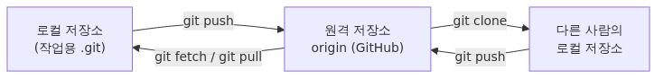

# GitHub repository 만들기 - remote, push, pull 한 번에 익히기

## 이 글에서 배울 것

- `remote`가 무엇이고 `origin`이라는 이름이 어디서 오는지
- 빈 GitHub 저장소를 만들어서 로컬 저장소와 연결하는 절차
- `git push -u origin main`이 한 번에 처리해 주는 두 가지 일
- `git fetch`와 `git pull`이 어떻게 다른지
- `git clone`이 내려받는 것이 정확히 무엇인지
- HTTPS와 SSH 중 어느 쪽을 골라야 하는지

5편까지는 한 컴퓨터 안에서만 작업했습니다. 이번 편부터는 로컬 저장소를 GitHub에 올려서 다른 사람도 볼 수 있고, 다른 컴퓨터에서도 이어서 작업할 수 있게 만듭니다.

## 이 글에서 답할 질문

- `remote`는 정확히 무엇이며, 첫 remote의 이름이 보통 `origin`인 이유는 무엇인가?
- 빈 GitHub 저장소를 로컬과 연결할 때 어떤 명령이 어떤 순서로 필요한가?
- `git push -u origin main`이 한 번에 처리해 주는 두 가지 일은 무엇인가?
- `git fetch`와 `git pull`은 동작 측면에서 어떻게 다른가?
- `git clone`이 내려받는 것은 작업 트리만이 아니라 또 무엇인가?
- HTTPS와 SSH 중 어느 쪽을 골라야 하는지 판단할 때의 기준은 무엇인가?

## 왜 중요한가

로컬에 commit만 쌓는 단계는 사실 "혼자 쓰는 노트"와 크게 다르지 않습니다. 다른 사람과 코드를 공유하거나, 노트북을 잃어버려도 작업 이력을 잃지 않으려면 어딘가에 사본을 두어야 합니다. GitHub는 그 "어딘가"의 가장 흔한 선택지입니다.

`remote`는 다른 위치에 있는 저장소를 가리키는 별칭(alias)입니다. 한 번 등록해 두면 긴 URL을 직접 치지 않고 짧은 이름으로 부를 수 있습니다. 관례적으로 첫 remote의 이름은 `origin`입니다. `origin`은 "이 프로젝트를 처음 가져온 곳"이라는 의미로 굳어진 단어이며, Git이 자동으로 붙여 주는 기본 이름이기도 합니다.

push, pull, fetch는 remote와 주고받는 세 가지 동사입니다.

- `push`: 로컬에서 만든 commit을 remote로 올립니다.
- `fetch`: remote에 새로 생긴 commit을 가져오기만 합니다(병합은 하지 않습니다).
- `pull`: `fetch` 다음에 자동으로 `merge`(또는 `rebase`)까지 수행합니다.

이 셋을 구분해서 이해하면 "다른 사람이 push한 변경을 어떻게 안전하게 가져오나"라는 질문에 흔들리지 않게 됩니다.

## Mental Model

> GitHub 저장소는 "네트워크 너머에 있는 또 하나의 Git 저장소"이고, `remote`는 그 원격 저장소를 부르는 별명입니다. push·pull은 두 저장소 사이에서 commit을 주고받는 동기화 동작입니다.
GitHub는 또 하나의 Git 저장소입니다. 차이는 그 저장소가 GitHub 서버에 있고, 누구든 권한이 있다면 접근할 수 있다는 점뿐입니다. 로컬과 remote는 서로의 거울처럼 동작하고, push/fetch/pull이 그 둘을 동기화합니다.


세 가지를 함께 기억하면 이 그림이 단단해집니다. 첫째, GitHub 저장소도 결국 `.git` 디렉터리 하나일 뿐입니다. 둘째, 협업자는 각자 자기 컴퓨터에 완전한 사본을 가집니다. 셋째, 동기화는 자동이 아니라 명령으로 일어납니다. push하지 않으면 GitHub는 모르고, pull하지 않으면 내 노트북은 모릅니다.

## 핵심 개념

| 용어 | 의미 |
| --- | --- |
| remote | 다른 위치(보통 GitHub 서버)에 있는 저장소를 가리키는 별칭 |
| origin | 첫 remote에 자동으로 붙는 기본 이름 |
| upstream | 로컬 branch가 추적(track)하는 remote branch |
| `git remote add` | 새 remote 별칭을 등록 |
| `git push` | 로컬 commit을 remote로 업로드 |
| `git fetch` | remote의 새 commit을 가져오되 병합하지 않음 |
| `git pull` | `fetch` + `merge`(또는 `rebase`) |
| `git clone` | remote 저장소 전체를 새 디렉터리로 복제 |
| HTTPS URL | `https://github.com/<user>/<repo>.git` 형태, 토큰으로 인증 |
| SSH URL | `git@github.com:<user>/<repo>.git` 형태, SSH key로 인증 |

`origin`은 강제 사항이 아닙니다. `git remote add backup ...`처럼 다른 이름을 쓸 수도 있습니다. 다만 도구와 문서가 대부분 `origin`을 가정하고 있어서, 특별한 이유가 없다면 그대로 두는 편이 협업에 유리합니다.

`upstream`이라는 단어는 두 가지 의미로 쓰입니다. 첫째는 "내 로컬 branch가 push/pull할 때 기본으로 바라보는 remote branch"입니다. `git push -u origin main`의 `-u`가 바로 이 upstream을 설정합니다. 둘째는 "fork한 원본 저장소"를 가리키는 관례적 이름입니다. 7편의 fork 흐름에서 다시 만나게 됩니다.

## Before-After

GitHub 없이 로컬에서만 작업하던 흐름과, remote가 연결된 뒤의 흐름을 나란히 두면 차이가 분명해집니다.

**Before — 로컬에만 있는 저장소**

```text
$ git log --oneline
1c2d3e4 Demote header to h3
b5d4c6e Merge branch 'feature/header'
...
$ git push
fatal: No configured push destination.
Either specify the URL from the command-line or configure a remote repository using
    git remote add <name> <url>
and then push using the remote name
    git push <name>
```

remote가 없으니 push할 곳이 없습니다. 작업 이력은 노트북 안에서만 살아 있습니다.

**After — origin이 연결된 저장소**

```text
$ git remote -v
origin  https://github.com/<your-id>/vacation-notes.git (fetch)
origin  https://github.com/<your-id>/vacation-notes.git (push)
$ git push -u origin main
Enumerating objects: 12, done.
...
To https://github.com/<your-id>/vacation-notes.git
 * [new branch]      main -> main
```

remote와 upstream이 한 번 설정되고 나면 push 한 번으로 GitHub에 같은 commit이 쌓입니다. 다른 컴퓨터에서 `git clone`하면 그 사본을 그대로 받아올 수 있습니다. `-u origin main`이 어떤 일을 하는지는 단계별 실습 3번에서 자세히 다룹니다.

## 단계별 실습

5편에서 만든 `vacation-notes` 저장소를 그대로 사용합니다. 마지막 상태는 `main`이 `1c2d3e4 Demote header to h3`를 가리키고 working tree가 깨끗한 상태입니다.

### 1. GitHub에서 빈 저장소 만들기

브라우저에서 `https://github.com/new`로 갑니다. 다음 항목만 채우고 나머지는 기본값으로 둡니다.

- Repository name: `vacation-notes`
- Description: 비워 두어도 됩니다
- Public / Private: 학습용이라면 Public이 무난합니다
- "Add a README file", "Add .gitignore", "Choose a license"는 모두 **체크 해제**합니다

세 항목을 체크 해제하는 이유는 GitHub가 자동으로 commit을 만들어 두면 로컬 저장소와 history가 갈라져서 첫 push가 까다로워지기 때문입니다. 빈 저장소로 만들면 로컬의 history를 그대로 올릴 수 있습니다.

`Create repository`를 누르면 GitHub는 "다음 명령으로 기존 저장소를 연결하세요"라는 안내 화면을 보여 줍니다. 우리가 다음 단계에서 하려는 것이 정확히 그 명령들입니다.

### 2. remote 등록하기

로컬 저장소로 돌아와 remote를 등록합니다. `<your-id>`는 본인의 GitHub 아이디로 바꿔 주세요.

```text
$ git remote add origin https://github.com/<your-id>/vacation-notes.git
$ git remote -v
origin  https://github.com/<your-id>/vacation-notes.git (fetch)
origin  https://github.com/<your-id>/vacation-notes.git (push)
```

`git remote add`는 별다른 출력이 없습니다. `git remote -v`로 fetch URL과 push URL이 같은 곳을 가리키는지 확인합니다. 두 줄이 모두 보이면 등록이 끝난 것입니다.

URL을 잘못 입력했다면 `git remote set-url origin <올바른-URL>`로 고치거나, `git remote remove origin`으로 지우고 다시 추가하면 됩니다.

### 3. 첫 push와 upstream 설정

이제 `main` branch를 GitHub로 올립니다.

```text
$ git push -u origin main
Enumerating objects: 24, done.
Counting objects: 100% (24/24), done.
Delta compression using up to 8 threads
Compressing objects: 100% (16/16), done.
Writing objects: 100% (24/24), 2.31 KiB | 1.16 MiB/s, done.
Total 24 (delta 5), reused 0 (delta 0)
remote: Resolving deltas: 100% (5/5), completed with 0 local objects.
To https://github.com/<your-id>/vacation-notes.git
 * [new branch]      main -> main
Branch 'main' set up to track remote branch 'main' from 'origin'.
```

`-u`(또는 `--set-upstream`)는 두 가지를 동시에 설정합니다.

1. 로컬 `main`이 `origin/main`을 추적(track)하도록 만듭니다.
2. 다음 push/pull부터는 `git push`만 쳐도 자동으로 `origin main`으로 보냅니다.

마지막 줄 `Branch 'main' set up to track remote branch 'main' from 'origin'.`이 그 설정이 완료되었다는 신호입니다. 이후로는 `git push`만으로 충분합니다.

### 4. 두 번째 commit과 짧아진 push

GitHub에 올라간 뒤로 어떻게 흘러가는지 확인하기 위해 작은 commit을 하나 더 만듭니다.

```text
$ printf "## Quickstart\n\n1. Clone the repo.\n2. Open notes.md.\n" > quickstart.md
$ git add quickstart.md
$ git commit -m "Add quickstart section"
[main 2b3c4d5] Add quickstart section
 1 file changed, 4 insertions(+)
$ git push
Enumerating objects: 4, done.
Counting objects: 100% (4/4), done.
Delta compression using up to 8 threads
Compressing objects: 100% (2/2), done.
Writing objects: 100% (3/3), 351 bytes | 351.00 KiB/s, done.
Total 3 (delta 0), reused 0 (delta 0)
To https://github.com/<your-id>/vacation-notes.git
   1c2d3e4..2b3c4d5  main -> main
```

upstream이 설정되어 있으니 `-u origin main`을 다시 적을 필요가 없습니다. 마지막 줄 `1c2d3e4..2b3c4d5 main -> main`은 GitHub의 `main`이 어떤 hash 구간을 새로 받았는지를 알려 줍니다.

브라우저에서 GitHub 저장소를 새로 고치면 `Add quickstart section` commit이 가장 위에 보입니다. 같은 history가 두 곳에 동기화된 것입니다.

### 5. 다른 위치에 clone하기

다른 컴퓨터(혹은 다른 디렉터리)로 옮겨 갔다고 가정하고 clone을 해 봅니다.

```text
$ cd /tmp
$ git clone https://github.com/<your-id>/vacation-notes.git
Cloning into 'vacation-notes'...
remote: Enumerating objects: 27, done.
remote: Counting objects: 100% (27/27), done.
remote: Compressing objects: 100% (18/18), done.
remote: Total 27 (delta 5), reused 27 (delta 5), pack-reused 0
Receiving objects: 100% (27/27), 2.66 KiB | 2.66 MiB/s, done.
Resolving deltas: 100% (5/5), done.
$ cd vacation-notes
$ git log --oneline -3
2b3c4d5 Add quickstart section
1c2d3e4 Demote header to h3
b5d4c6e Merge branch 'feature/header'
$ git remote -v
origin  https://github.com/<your-id>/vacation-notes.git (fetch)
origin  https://github.com/<your-id>/vacation-notes.git (push)
```

`git clone`이 한 일은 세 가지입니다. 첫째, `vacation-notes`라는 디렉터리를 만들고 그 안에 `.git`을 채워 넣었습니다. 둘째, `origin`이라는 remote를 자동으로 등록했습니다(우리가 따로 `git remote add`를 하지 않았는데도 두 줄이 보이는 이유입니다). 셋째, 기본 branch(`main`)를 자동으로 체크아웃했습니다.

clone한 저장소도 완전한 history를 가집니다. 인터넷 연결이 끊겨도 `git log`, `git diff`, `git checkout`은 모두 동작합니다.

### 6. 다른 쪽에서 push, 내 쪽에서 fetch와 pull

clone한 디렉터리(`/tmp/vacation-notes`)에서 commit을 하나 더 만들어 push합니다.

```text
$ printf "## Deployment\n\nDeploy by pushing to main.\n" > deployment.md
$ git add deployment.md
$ git commit -m "Add deployment notes"
[main 7e8f9a0] Add deployment notes
 1 file changed, 3 insertions(+)
$ git push
...
To https://github.com/<your-id>/vacation-notes.git
   2b3c4d5..7e8f9a0  main -> main
```

이제 원래 작업하던 디렉터리로 돌아옵니다. GitHub의 `main`은 `7e8f9a0`까지 올라갔지만, 내 로컬 `main`은 아직 `2b3c4d5`에 머물러 있습니다. 먼저 `git fetch`로 변경 사항만 가져옵니다.

```text
$ git fetch
remote: Enumerating objects: 4, done.
remote: Counting objects: 100% (4/4), done.
remote: Compressing objects: 100% (2/2), done.
remote: Total 3 (delta 0), reused 3 (delta 0), pack-reused 0
Unpacking objects: 100% (3/3), 358 bytes | 358.00 KiB/s, done.
From https://github.com/<your-id>/vacation-notes
   2b3c4d5..7e8f9a0  main       -> origin/main
$ git status
On branch main
Your branch is behind 'origin/main' by 1 commit, and can be fast-forwarded.
  (use "git pull" to update your local branch)

nothing to commit, working tree clean
```

`fetch`는 `origin/main`이라는 remote-tracking branch만 갱신합니다. 내 로컬 `main`은 아직 그대로입니다. 그래서 `git status`가 "1 commit 뒤처져 있다"고 알려 주고, working tree에는 변화가 없습니다. `git log --oneline --decorate --all`을 찍어 보면 `origin/main`이 한 발 앞서 있는 모습이 보입니다.

이제 `git pull`로 따라잡습니다.

```text
$ git pull
Updating 2b3c4d5..7e8f9a0
Fast-forward
 deployment.md | 3 +++
 1 file changed, 3 insertions(+)
$ git log --oneline -2
7e8f9a0 Add deployment notes
2b3c4d5 Add quickstart section
```

`pull`은 내부적으로 `fetch + merge`입니다. 이번 경우는 로컬에 새 commit이 없어서 fast-forward로 끝납니다. 양쪽 모두 commit이 쌓여 있었다면 5편에서 본 three-way merge가 일어났을 것입니다.

## 자주 하는 실수

- **GitHub에서 README/.gitignore/license를 체크한 채로 만들고 첫 push가 거절됨** — GitHub가 만든 commit과 로컬 commit이 갈라져 있어서 `! [rejected] main -> main (fetch first)`가 나옵니다. 해결은 `git pull --rebase origin main` 후 다시 push하거나, 처음부터 빈 저장소로 만드는 것입니다.
- **HTTPS URL인데 비밀번호로 인증하려 함** — 2021년 8월 이후로 GitHub는 HTTPS push에 비밀번호를 받지 않습니다. Personal Access Token(PAT) 또는 SSH key가 필요합니다.
- **`git pull`을 무조건 첫 명령으로 사용** — 로컬에 commit하지 않은 변경이 있는데 pull하면 충돌이 working tree에서 발생할 수 있습니다. push/pull 전에 `git status`로 working tree가 깨끗한지 먼저 확인하는 습관이 안전합니다.
- **`git fetch`만 하고 다 했다고 생각** — fetch는 정보만 가져옵니다. 로컬 branch를 따라잡으려면 `merge`나 `pull`이 추가로 필요합니다.
- **remote URL을 바꾼 뒤 push가 엉뚱한 곳으로 감** — `git remote -v`로 fetch와 push URL이 의도한 곳을 가리키는지 commit 전에 한 번 더 확인합니다.
- **`origin` 외의 remote가 있는지 모르고 push** — 한 저장소에 `origin`과 `upstream`(fork 원본) 두 remote가 있는 경우, `git push`가 어디로 가는지 확인하지 않으면 의도와 다른 곳에 commit이 올라갈 수 있습니다.

## 실무에서는 어떻게 쓰나

세 가지 선택이 처음 협업에 영향을 줍니다.

**HTTPS와 SSH** — 사내 방화벽이 SSH 포트를 막은 환경에서는 HTTPS가 무난합니다. 그렇지 않다면 SSH key 한 번 등록으로 이후 인증 입력을 피할 수 있어서 편리합니다. GitHub 계정 설정의 `SSH and GPG keys`에서 공개 키를 등록한 뒤, `git@github.com:<user>/<repo>.git` 형태의 URL로 clone합니다.

**기본 branch 이름** — GitHub는 2020년부터 새 저장소의 기본 branch를 `main`으로 만듭니다. 오래된 저장소나 일부 도구가 `master`를 가정할 수 있어서, 사내 표준이 어느 쪽인지 처음에 한 번 확인하면 혼란이 줄어듭니다.

**branch 보호 규칙(Branch protection rules)** — 실무 저장소의 `main`은 직접 push가 막혀 있는 경우가 많습니다. 그래서 7편에서 다룰 Pull Request가 등장합니다. 이번 편에서 익힌 push/pull은 자기 작업 branch와 GitHub의 같은 이름 branch 사이를 오갈 때 쓰는 도구로 자리를 옮기게 됩니다.

GitHub Desktop이나 IDE의 Git 패널은 이 명령들을 버튼 하나로 묶어서 보여 줍니다. 무엇을 묶었는지 알고 쓰는 것과 모르고 쓰는 것은 문제 상황에서 큰 차이를 만듭니다. 한 번씩은 명령줄로 직접 실행해 보길 권합니다.

## 체크리스트

다음 항목을 모두 체크할 수 있다면 이 글의 목표는 달성된 것입니다.

- [ ] `remote`라는 단어를 한 문장으로 설명할 수 있습니다
- [ ] `origin`이 어디서 오는 이름인지 설명할 수 있습니다
- [ ] 빈 GitHub 저장소를 만들고 로컬 저장소와 연결할 수 있습니다
- [ ] `git push -u origin main`이 두 가지 일을 동시에 한다는 것을 압니다
- [ ] `git fetch`와 `git pull`의 차이를 한 문장으로 말할 수 있습니다
- [ ] `git clone`이 자동으로 등록해 주는 것이 무엇인지 압니다
- [ ] `git remote -v`로 현재 등록된 remote를 확인할 수 있습니다
- [ ] HTTPS와 SSH URL의 형태 차이를 알아볼 수 있습니다

## 연습 문제

1. GitHub에 또 다른 빈 저장소(`practice-remote`)를 만들고, 빈 로컬 디렉터리에서 `git init` → 파일 한 개 commit → `git remote add origin ...` → `git push -u origin main` 순서로 직접 첫 push를 완성해 보세요.
2. 위 1번에서 만든 저장소를 다른 디렉터리(예: `/tmp/practice-clone`)에 `git clone`한 뒤, 양쪽 디렉터리에서 번갈아 commit과 push/pull을 반복해 보세요. 한쪽에서 commit하지 않은 채 pull하면 어떤 메시지가 나오는지도 확인해 보세요.
3. `git fetch`를 한 다음 `git status`가 어떻게 달라지는지 직접 확인해 보세요. 그 후 `git log --oneline --decorate --all`이 보여 주는 그래프에서 `origin/main`과 로컬 `main`의 위치를 짚어 보세요.

## 정리, 그리고 다음 글

이번 편에서는 로컬 저장소가 GitHub와 어떻게 연결되는지를 끝까지 따라가 보았습니다. 핵심은 다음과 같습니다.

- `remote`는 다른 위치에 있는 저장소의 별칭이고, 첫 remote는 보통 `origin`이라는 이름으로 등록합니다
- `git push`는 로컬 commit을 remote로 올리고, `git fetch`는 가져오기만 하고, `git pull`은 가져온 뒤 합칩니다
- `git push -u origin main`의 `-u`는 upstream을 설정해서 다음 push/pull부터 인자를 생략할 수 있게 해 줍니다
- `git clone`은 새 디렉터리에 사본을 만들고 `origin`도 자동으로 등록합니다

다음 편에서는 이렇게 올려 둔 GitHub 저장소에서 가장 많이 쓰는 협업 단위인 Pull Request를 만들어 봅니다. branch에 commit하고 push한 뒤, 변경 사항을 어떻게 검토받고 어떻게 `main`으로 합치는지를 끝까지 따라갑니다.

<!-- toc:begin -->
## 시리즈 목차

- [Git이란 무엇인가? 버전 관리의 시작](./01-what-is-git.md)
- [첫 commit 만들기: init, add, commit](./02-first-commit.md)
- [변경 사항 확인하기: status, diff, log](./03-status-diff-log.md)
- [branch 이해하기: 분기와 전환](./04-branch-basics.md)
- [merge와 conflict 해결하기](./05-merge-and-conflict.md)
- **GitHub repository 만들기와 remote, push, pull (현재 글)**
- [Pull Request로 협업하기](./07-pull-request.md)
- Issue와 Project로 일감 관리 (예정)
- 좋은 commit message 쓰기 (예정)
- 실무 워크플로 한눈에 보기 (예정)
<!-- toc:end -->

## 참고 자료

- Git 공식 문서, `git remote`: <https://git-scm.com/docs/git-remote>
- Git 공식 문서, `git push`: <https://git-scm.com/docs/git-push>
- Git 공식 문서, `git fetch`: <https://git-scm.com/docs/git-fetch>
- Git 공식 문서, `git pull`: <https://git-scm.com/docs/git-pull>
- Git 공식 문서, `git clone`: <https://git-scm.com/docs/git-clone>
- GitHub Docs, "About remote repositories": <https://docs.github.com/en/get-started/getting-started-with-git/about-remote-repositories>
- GitHub Docs, "Connecting to GitHub with SSH": <https://docs.github.com/en/authentication/connecting-to-github-with-ssh>

Tags: github-remote, git-push, git-pull, git-clone, git-fetch, origin
