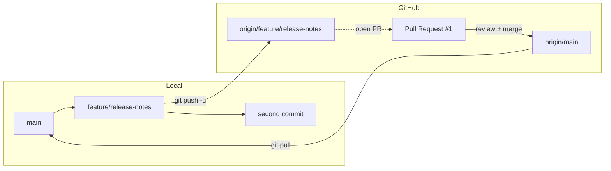

# Pull Request로 협업하기 - branch에서 review를 거쳐 main까지

## 이 글에서 배울 것

- Pull Request(이하 PR)가 정확히 무엇이고 단순한 `git merge`와 어떻게 다른지
- feature branch에서 commit을 만들고 GitHub에 push해 PR을 여는 순서
- 동료가 남긴 review comment에 추가 commit으로 답하는 방법
- PR을 merge한 뒤 로컬 `main`을 업데이트하고 정리하는 과정
- "PR이 너무 크다"라는 말을 듣지 않으려면 어떻게 잘라야 하는지

이 글이 끝나면 `feature/release-notes` 같은 branch에서 시작해 GitHub PR을 열고 review와 merge를 마친 뒤 로컬을 정돈하는 한 사이클을 혼자 돌릴 수 있습니다.

## 왜 중요한가

혼자 작업하면 `git merge feature/x`로 끝나는 일이, 둘 이상이 모이면 갑자기 어려워집니다. 누가 무엇을 바꿨는지, 그 변경이 왜 필요한지, 누가 동의했는지를 기록할 자리가 사라지기 때문입니다.

Pull Request는 그 빈자리를 메꾸기 위해 GitHub가 제공하는 화면입니다. 단순히 branch를 합쳐 주는 도구가 아니라, "이 변경에 대해 이야기하고 합의한 뒤 합치자"라는 절차를 만들어 줍니다.

PR이 익숙해지면 다음 세 가지가 자연스럽게 따라옵니다.

1. 각 변경에 사람이 한 번 이상 본 흔적이 남습니다(자기 자신이라도 review 단계를 거칩니다).
2. 잘못 들어간 commit을 찾을 때 PR 번호와 설명이 검색 단서가 됩니다.
3. 큰 변경을 작은 PR로 쪼개는 습관이 생기면서, 한 번에 review 가능한 단위로 일을 자르게 됩니다.

## Mental Model

PR은 "branch라는 제안서를 main에 받아 달라고 요청하는 신청서"입니다. 신청서에는 제목, 설명, 변경된 파일, 그리고 동료의 의견이 함께 붙습니다.



다이어그램의 흐름은 다음과 같습니다.

1. 로컬에서 `main` 위에 `feature/release-notes` branch를 만들고 commit을 쌓습니다.
2. branch를 GitHub에 push하면 `origin/feature/release-notes`가 생깁니다.
3. 그 branch를 base인 `main`에 합쳐 달라고 요청하는 화면이 PR입니다.
4. review와 추가 commit이 모두 PR 안에서 이뤄지고, merge 버튼을 누르면 GitHub의 `main`이 갱신됩니다.
5. 마지막으로 로컬에서 `git pull`을 해서 그 결과를 가져옵니다.

핵심은 PR이 "branch를 합쳐 주는 명령"이 아니라 "branch를 합치자는 대화"라는 점입니다.

## 핵심 개념

| 용어 | 뜻 |
| --- | --- |
| base branch | PR이 합쳐지는 대상 branch입니다. 보통 `main`입니다. |
| compare branch | 변경 사항이 들어 있는 branch입니다. 보통 `feature/...` 형태입니다. |
| draft PR | "아직 review를 받을 준비는 안 됐지만 진행 중임을 알리고 싶다"라는 상태의 PR입니다. |
| review | 다른 사람이 변경을 읽고 남기는 의견입니다. Approve / Request changes / Comment 세 가지 결론이 있습니다. |
| merge commit | PR을 합칠 때 GitHub이 만들어 주는, 두 부모를 가진 commit입니다. `Merge pull request #1 ...` 같은 메시지가 붙습니다. |
| squash merge | PR의 commit들을 하나로 합쳐서 base에 올리는 방식입니다. branch 안의 잡다한 commit을 정리할 때 씁니다. |
| rebase merge | PR commit들을 base 위에 다시 쌓는 방식입니다. merge commit이 생기지 않습니다. |

세 가지 merge 방식 중 무엇을 쓰는지는 팀이 정합니다. 이 글에서는 가장 기본인 일반 merge commit 방식으로 진행합니다.

## Before-After

**Before - branch만 만들고 끝낸 경우**

```text
$ git switch -c feature/release-notes
$ git commit -am "Draft release notes"
$ # 며칠 뒤
$ git log --oneline main..feature/release-notes
3c4d5e6 Draft release notes
$ # 그 사이 누구도 이 변경을 보지 못함
```

이 상태에서 갑자기 `git merge feature/release-notes`를 하면 동료들은 변경을 합치고 나서야 결과를 알게 됩니다. "왜 이 줄이 들어갔지?"라는 질문에 답할 자리가 없습니다.

**After - 같은 branch를 PR로 올린 경우**

```text
$ git push -u origin feature/release-notes
$ # GitHub에서 PR을 열고 동료가 한 줄 review 남김
$ git commit -am "Tweak release checklist heading"
$ git push
$ # GitHub에서 Merge pull request 버튼 클릭
$ git switch main
$ git pull
```

같은 branch지만 이번에는 변경의 의도(PR 본문), 동료의 의견(review comment), 합의의 흔적(merge commit)이 모두 GitHub에 남습니다. 한 달 뒤 누군가 `git log`에서 그 commit을 발견했을 때 PR 번호 하나로 맥락을 다시 끌어올릴 수 있습니다.

## 단계별 실습

Episode 6에서 만든 `vacation-notes` 저장소를 그대로 사용합니다. `main`은 `7e8f9a0 Add deployment notes from cloned dir`를 가리키고 있고, `origin`은 GitHub에 연결돼 있습니다.

### 1. main을 최신 상태로 맞추기

```text
$ git switch main
Already on 'main'
Your branch is up to date with 'origin/main'.
$ git pull
Already up to date.
```

새 작업을 시작할 때는 먼저 `main`이 `origin/main`과 같은 위치에 있는지부터 확인합니다.

### 2. feature branch 만들기

```text
$ git switch -c feature/release-notes
Switched to a new branch 'feature/release-notes'
$ git status
On branch feature/release-notes
nothing to commit, working tree clean
```

`-c`는 새 branch를 만들면서 그쪽으로 옮겨 가는 옵션입니다. branch 이름은 보통 `feature/`, `fix/`, `chore/` 같은 접두사로 분류합니다.

### 3. 변경 사항 commit하기

```text
$ printf '\n## Release checklist\n\n- [ ] Tag version\n- [ ] Update CHANGELOG\n' >> notes.md
$ git add notes.md
$ git commit -m "Add release checklist"
[feature/release-notes 3c4d5e6] Add release checklist
 1 file changed, 4 insertions(+)
```

PR로 올라갈 첫 commit을 만듭니다. 한 commit 안에 너무 많은 주제를 담지 않는 편이 review를 받기 쉽습니다.

### 4. branch를 GitHub에 push하기

```text
$ git push -u origin feature/release-notes
Enumerating objects: 5, done.
...
remote: Create a pull request for 'feature/release-notes' on GitHub by visiting:
remote:      https://github.com/<your-id>/vacation-notes/pull/new/feature/release-notes
To https://github.com/<your-id>/vacation-notes.git
 * [new branch]      feature/release-notes -> feature/release-notes
Branch 'feature/release-notes' set up to track remote branch 'feature/release-notes' from 'origin'.
```

처음 push할 때만 `-u origin feature/release-notes`로 upstream을 잡아 두면, 다음부터는 그냥 `git push`만 해도 됩니다. `remote:` 줄에 PR을 바로 만들 수 있는 링크가 나오는 점을 눈여겨봐 두세요.

### 5. GitHub에서 PR 열기

브라우저에서 위 링크로 들어가거나, 저장소 메인에서 "Compare & pull request" 버튼을 누릅니다. 다음 항목을 채웁니다.

- Title: `Add release checklist to notes`
- Description: 변경의 동기, 어떻게 검증했는지, 영향 범위를 짧게 적습니다.
- Reviewers: 동료를 한 명 지정합니다(혼자 연습 중이라면 비워 둬도 됩니다).

"Create pull request"를 누르면 PR 번호가 부여됩니다. 이 글에서는 `#1`이라고 부르겠습니다.

### 6. review comment에 추가 commit으로 답하기

동료가 "checklist 제목을 더 명확하게 해 달라"라는 코멘트를 남겼다고 가정합니다.

```text
$ git switch feature/release-notes
$ sed -i 's/## Release checklist/## Release checklist (per version)/' notes.md
$ git add notes.md
$ git commit -m "Tweak release checklist heading"
[feature/release-notes 4d5e6f7] Tweak release checklist heading
 1 file changed, 1 insertion(+), 1 deletion(-)
$ git push
Enumerating objects: 5, done.
...
To https://github.com/<your-id>/vacation-notes.git
   3c4d5e6..4d5e6f7  feature/release-notes -> feature/release-notes
```

추가 commit이 PR에 자동으로 합류합니다. 별도의 명령은 필요 없고, push 한 번이면 PR 화면이 갱신됩니다.

### 7. PR을 merge하기

review가 통과되면 GitHub PR 화면 아래쪽의 "Merge pull request" 버튼을 누릅니다. 기본은 일반 merge commit 방식이고, 다음과 같은 commit이 `main`에 추가됩니다.

```text
Merge pull request #1 from <your-id>/feature/release-notes

Add release checklist to notes
```

merge가 끝나면 GitHub은 `Delete branch` 버튼도 함께 제공합니다. 더 손볼 것이 없으면 그 자리에서 원격 branch를 지웁니다.

### 8. 로컬을 정리하기

```text
$ git switch main
Switched to branch 'main'
Your branch is up to date with 'origin/main'.
$ git pull
remote: Enumerating objects: 1, done.
...
Updating 7e8f9a0..5e6f7a8
Fast-forward
 notes.md | 5 +++++
 1 file changed, 5 insertions(+)
$ git branch -d feature/release-notes
Deleted branch feature/release-notes (was 4d5e6f7).
```

`git pull`로 merge 결과를 받아오면 로컬 `main`도 PR이 반영된 상태가 됩니다. 그 다음에야 로컬 feature branch를 지워도 안전합니다. branch는 일종의 작업 공간일 뿐이므로, 끝난 작업의 흔적은 가볍게 비우는 것이 좋습니다.

## 자주 하는 실수

- main에 직접 commit하고 그것을 push하려다가 보호 규칙(branch protection)에 거절당합니다. 새 branch에서 작업하는 습관이 안전합니다.
- PR을 너무 크게 만들어 review가 멈춥니다. 한 PR이 200~400줄을 넘어가면 둘로 나누는 편이 빠릅니다.
- review comment를 받고 새 branch를 또 만들어 버립니다. 같은 branch에 추가 commit하고 push하면 PR이 자동으로 갱신됩니다.
- merge한 뒤에 로컬 `main`을 `git pull`하지 않은 채 다음 작업을 시작합니다. 곧바로 충돌의 원인이 됩니다.
- merge commit message를 그대로 두지 않고 손으로 바꾸려 합니다. GitHub이 만들어 주는 형식 그대로 두는 편이 검색에 유리합니다.

## 실무에서의 활용

PR은 merge 도구라기보다 의사결정 기록 도구입니다. 실무에서는 다음과 같이 씁니다.

- **변경 이유를 PR 본문에 적어 두기**. commit message가 짧다면, PR 본문이 그 commit의 긴 설명이 됩니다.
- **CI 결과를 PR에서 확인하기**. PR 화면 아래에 자동 테스트 결과가 표시되도록 GitHub Actions를 붙입니다. 빨간불이면 merge 버튼을 누르지 않습니다.
- **draft PR로 진행 상황 공유하기**. 작업이 끝나기 전에라도 draft 상태로 올려 두면, 동료가 일찍 방향을 잡아 줄 수 있습니다.
- **연관 issue 링크하기**. 본문에 `Closes #42`라고 적으면 merge 시 issue가 자동으로 닫힙니다(다음 글의 주제입니다).
- **revert가 필요할 때 PR 단위로 되돌리기**. GitHub은 PR 화면에서 "Revert" 버튼을 제공합니다. commit 하나하나를 따로 되돌리는 것보다 안전합니다.

## 체크리스트

- [ ] `main`을 `git pull`로 최신화한 뒤에 새 branch를 만들었습니다
- [ ] branch 이름이 `feature/`, `fix/`, `chore/` 같은 접두사를 갖고 있습니다
- [ ] 첫 push에 `-u origin <branch>`로 upstream을 잡았습니다
- [ ] PR 본문에 변경 동기와 검증 방법을 적었습니다
- [ ] review 의견은 새 branch가 아니라 같은 branch에 추가 commit으로 답했습니다
- [ ] merge 후 로컬 `main`을 `git pull`하고 끝난 branch를 지웠습니다

## 연습 문제

1. 같은 `vacation-notes`에서 `feature/contact-section`이라는 branch를 만들고, `notes.md` 끝에 연락처 한 줄을 추가한 뒤 PR을 열어 보세요. 이번에는 본인 스스로에게 review를 부탁한다고 가정하고 한 번 읽어 본 뒤 merge합니다.
2. PR을 만들고 일부러 본문을 비워 두세요. GitHub이 어떤 안내를 보여 주는지 확인하고, 본문을 채운 PR과 비교해 보세요. 6개월 뒤의 본인이 어느 쪽을 더 좋아할지 생각해 보면 PR 본문을 적는 습관의 가치가 보입니다.

## 정리와 다음 글

이 글에서는 PR을 한 사이클 끝까지 돌려 봤습니다. 핵심을 다시 정리합니다.

- PR은 branch를 합치자는 "요청"입니다. merge 자체는 GitHub이 마지막에 한 번 해 줍니다
- 첫 push는 `git push -u origin <branch>`, 이후 push는 그냥 `git push`입니다
- review comment에는 같은 branch에 commit을 추가해서 답합니다
- merge 후에는 로컬 `main`을 `git pull`로 맞추고 다 쓴 branch를 지웁니다

다음 글에서는 PR 본문에서 자주 보는 `Closes #42` 같은 표시의 정체, 즉 GitHub Issue와 Project를 다룹니다. 변경의 흔적뿐 아니라 "무엇을 할지"의 흔적도 GitHub에 남기는 방법을 익힙니다.

<!-- toc:begin -->
## 시리즈 목차

- [Git이란 무엇인가? 버전 관리의 시작](./01-what-is-git.md)
- [첫 commit 만들기: init, add, commit](./02-first-commit.md)
- [변경 사항 확인하기: status, diff, log](./03-status-diff-log.md)
- [branch 이해하기: 분기와 전환](./04-branch-basics.md)
- [merge와 conflict 해결하기](./05-merge-and-conflict.md)
- [GitHub repository 만들기와 remote, push, pull](./06-github-repository.md)
- **Pull Request로 협업하기 (현재 글)**
- Issue와 Project로 일감 관리 (예정)
- 좋은 commit message 쓰기 (예정)
- 실무 워크플로 한눈에 보기 (예정)
<!-- toc:end -->

## 참고 자료

- GitHub Docs, "About pull requests": <https://docs.github.com/en/pull-requests/collaborating-with-pull-requests/proposing-changes-to-your-work-with-pull-requests/about-pull-requests>
- GitHub Docs, "Creating a pull request": <https://docs.github.com/en/pull-requests/collaborating-with-pull-requests/proposing-changes-to-your-work-with-pull-requests/creating-a-pull-request>
- GitHub Docs, "Reviewing changes in pull requests": <https://docs.github.com/en/pull-requests/collaborating-with-pull-requests/reviewing-changes-in-pull-requests>
- GitHub Docs, "About protected branches": <https://docs.github.com/en/repositories/configuring-branches-and-merges-in-your-repository/managing-protected-branches/about-protected-branches>
- Git docs, `git switch`: <https://git-scm.com/docs/git-switch>

Tags: github-pull-request, code-review, feature-branch, merge-commit, github-collaboration, pr-workflow
