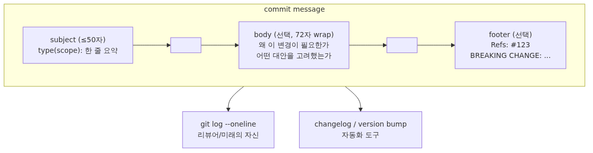

# 좋은 commit message 쓰기: Conventional Commits와 좋은 본문

## 이 글에서 배울 것

- 좋은 commit message가 왜 코드만큼 중요한 자산인지 이해합니다.
- subject, body, footer 세 부분으로 commit message를 구성하는 법을 익힙니다.
- Conventional Commits 규칙(`feat`, `fix`, `docs` 등)을 사용해 변경 종류를 한눈에 드러내는 법을 익힙니다.
- 이미 쓴 message를 `git commit --amend`와 `git rebase`로 다듬는 방법을 배웁니다.

<!-- a-grade-intro:begin -->
## 핵심 질문

좋은 commit message는 어떤 구조를 가져야 하고, 왜 그것이 미래의 비용을 줄일까요?

이 글은 그 질문에 답하기 위해 commit message의 핵심 결정과 운영 함정을 살펴봅니다.

<!-- a-grade-intro:end -->

## 이 글에서 답할 질문

- 좋은 commit message가 왜 코드만큼 자산으로 작동하는가?
- subject, body, footer 세 부분은 각각 어떤 정보를 담아야 하는가?
- Conventional Commits의 `feat`, `fix`, `docs` 같은 type은 변경 종류를 어떻게 한 줄로 드러내 주는가?
- `git commit --amend`는 어떤 상황에서만 안전하게 쓸 수 있는가?
- `git rebase -i`로 이미 쓴 message를 다듬을 때의 절차는 어떻게 되는가?

## 왜 중요한가

`git log`는 미래의 자신과 동료에게 보내는 편지입니다. 6개월 뒤에 `git blame`으로 어떤 줄을 살펴봤을 때, "왜 이 줄을 이렇게 바꿨는지"가 한 줄에 적혀 있으면 5초 만에 맥락이 살아납니다. 반대로 message가 `fix bug`, `update`, `wip`로만 채워져 있으면 그 시점의 PR을 다시 열어 commit 전체 diff를 읽어야 합니다.

좋은 message는 또한 자동화의 입력이 됩니다. Conventional Commits를 따르면 `feat`로 시작한 commit만 모아 changelog를 만들고, `BREAKING CHANGE` 표시가 있는 commit이 있으면 major 버전을 자동으로 올리는 흐름이 가능합니다. message 자체가 release note의 초안이 됩니다.

Code review에서도 차이가 납니다. PR 제목·본문이 비어 있어도 commit message가 잘 적혀 있으면 reviewer는 commit 단위로 차근차근 변경 의도를 따라갈 수 있습니다. message는 코드의 "한 단계 위 추상화"라고 생각하면 됩니다.

## Mental Model

> 좋은 commit message는 "이 변경을 6개월 뒤의 자신과 동료가 다시 읽었을 때 무엇을 왜 바꿨는지 한 번에 알게 해 주는 문서"이며, subject·body·footer 세 부분이 각각 그 역할의 한 면을 맡습니다.
좋은 commit message는 정해진 골격을 가집니다.



*Mental Model*
핵심은 세 가지입니다. 첫째, subject는 짧고 명령형(imperative)으로 씁니다. 둘째, body가 필요하면 빈 줄 한 칸을 띄우고 "왜"를 적습니다. 셋째, footer로 issue 번호나 breaking change를 명시합니다.

## 핵심 개념

| 개념 | 설명 |
| --- | --- |
| Subject | 첫 줄, 50자 이하, 마침표 없이, 명령형으로 씁니다. `Add login button` ○ / `Added login button` × |
| Body | 빈 줄 한 칸 뒤 본문. 72자에서 줄바꿈합니다. "무엇을"이 아니라 "왜"와 "어떻게"를 적습니다. |
| Footer | `Refs: #42`, `Closes #42`, `BREAKING CHANGE: ...` 같은 metadata를 담습니다. |
| Type | Conventional Commits의 분류. `feat`, `fix`, `docs`, `refactor`, `test`, `chore`, `perf`, `build`, `ci`, `style`. |
| Scope | 변경된 영역을 괄호로 표시합니다. `feat(auth): support OAuth login`. 선택 사항입니다. |
| Imperative mood | "이 commit을 적용하면 ___이 된다"의 빈칸을 채우는 동사. `Add`, `Fix`, `Refactor`. |
| Atomic commit | 하나의 논리적 변경만 담는 commit입니다. 리뷰와 revert가 쉬워집니다. |

## Before-After

같은 작업을 message만 다르게 적은 두 commit log를 비교해 봅니다.

**Before** (저자만 알아볼 수 있는 message)

```text
$ git log --oneline -5
9f8e7d6 fix
8e7d6c5 update
7d6c5b4 wip
6c5b4a3 stuff
5b4a3f2 final
```

여섯 달 뒤 이 log를 보면 어디서 어떤 일이 있었는지 알 길이 없습니다. `git blame`으로 한 줄에 도달해도 message가 의미를 주지 못합니다.

**After** (Conventional Commits + 짧은 body)

```text
$ git log --oneline -5
9f8e7d6 fix(auth): handle expired refresh tokens
8e7d6c5 feat(auth): add OAuth login button
7d6c5b4 refactor(auth): extract token validation helper
6c5b4a3 test(auth): cover login redirect cases
5b4a3f2 docs(auth): document OAuth setup steps
```

5개 commit만 봐도 "auth 모듈을 정비했고, OAuth 기능을 추가했고, 토큰 만료 버그를 잡았다"가 그대로 읽힙니다. type 덕분에 release note에 `feat`만 추리는 일도 한 줄짜리 명령으로 가능합니다.

## 단계별 실습

Episode 8까지 사용한 `vacation-notes` 저장소에서 message를 직접 다듬어 봅니다. `main`은 Episode 8의 `Merge pull request #2 from feature/packing-list-2` commit이 적용된 상태입니다.

### 1. 다듬기 좋은 commit 하나 만들기

작은 변경을 하나 만들고, 일부러 짧은 message로 commit합니다.

```bash
$ git switch -c chore/readme-typo
Switched to a new branch 'chore/readme-typo'
$ printf '\nThanks for reading.\n' >> README.md
$ git add README.md
$ git commit -m "fix"
[chore/readme-typo c4d5e6f] fix
 1 file changed, 2 insertions(+)
```

`git log -1`로 보면 message가 `fix` 한 단어뿐입니다. 이 정도로는 무엇을 고쳤는지 보이지 않습니다.

### 2. `git commit --amend`로 message 다시 쓰기

방금 만든 commit이 아직 push되지 않았다면 `--amend`로 수정합니다.

```bash
$ git commit --amend -m "docs(readme): add closing thank-you note"
[chore/readme-typo a8b7c6d] docs(readme): add closing thank-you note
 Date: Mon May 4 10:21:40 2026 +0900
 1 file changed, 2 insertions(+)
$ git log -1 --pretty=full
commit a8b7c6d4e3f2a1b0c9d8e7f6a5b4c3d2e1f0a9b8
Author: You <you@example.com>
Commit: You <you@example.com>

    docs(readme): add closing thank-you note
```

hash가 `c4d5e6f` → `a8b7c6d`로 바뀌었습니다. `--amend`는 새로운 commit을 만드는 작업이라는 뜻입니다. 그래서 이미 push한 commit에는 사용하지 않는 편이 안전합니다.

### 3. 본문이 필요한 경우 editor로 message 쓰기

`-m`은 한 줄짜리 message에만 어울립니다. 본문이 필요하면 `-m`을 빼고 editor를 엽니다.

```bash
$ git commit
```

editor에 다음과 같이 적습니다.

```text
feat(packing): add weather-aware section

요약: 출발일의 일기 예보에 따라 추천 짐 항목이 달라지도록 packing
list 섹션을 확장한다.

이전에는 항목이 정적이었기 때문에 우기에 출발하는 사용자도 동일한
목록을 받았다. 외부 weather API 호출은 cache 계층으로 감싸 응답
지연을 50ms 이하로 유지한다.

Refs: #2
```

`:wq`로 저장하면 첫 줄이 subject, 빈 줄 다음이 body, 마지막 줄이 footer로 자리잡습니다.

### 4. 이미 합쳐진 여러 commit message를 `rebase -i`로 손보기

직전에 만든 작은 commit 3개의 message를 한꺼번에 정리하려면 interactive rebase를 사용합니다. 아직 push되지 않은 구간에 한해서만 사용합니다.

```bash
$ git rebase -i HEAD~3
```

editor가 다음과 같은 화면을 띄웁니다.

```text
pick a8b7c6d docs(readme): add closing thank-you note
pick b9c8d7e fix
pick c0d1e2f wip

# Rebase ...
# Commands:
# p, pick   = use commit
# r, reword = use commit, but edit the commit message
# ...
```

두 번째와 세 번째 줄의 `pick`을 `reword`로 바꾸고 저장하면, Git이 commit 단위로 message editor를 차례로 띄웁니다. 한 줄짜리 `fix`, `wip`을 의미 있는 message로 바꿔 저장합니다. rebase가 끝나면 `git log --oneline`이 깔끔해집니다.

### 5. commit-msg hook으로 형식 강제하기

마지막 단계는 자동화입니다. 저장소 안에 다음 파일을 만들면 형식에 맞지 않는 message를 거부할 수 있습니다.

```bash
$ cat .git/hooks/commit-msg
#!/bin/sh
pattern='^(feat|fix|docs|refactor|test|chore|perf|build|ci|style)(\([a-z0-9-]+\))?: .{1,50}$'
head -n1 "$1" | grep -Eq "$pattern" || {
  echo "commit message subject가 Conventional Commits 형식이 아닙니다." >&2
  exit 1
}
$ chmod +x .git/hooks/commit-msg
```

이제 `git commit -m "fix"`처럼 형식에서 벗어난 message는 commit이 만들어지기 전에 거부됩니다. 더 정교한 규칙은 `commitlint` 같은 도구로 옮길 수 있습니다.

## 자주 하는 실수

- 한 commit에 서로 다른 변경 두 개를 같이 담습니다. 리뷰가 어렵고, revert도 어려워집니다. `git add -p`로 hunk 단위로 나눠 커밋합니다.
- subject 끝에 마침표를 찍고 50자를 넘깁니다. `git log --oneline`에서 잘려서 한 줄에 다 보이지 않습니다.
- "무엇을 바꿨는가"만 적습니다. diff가 이미 그 정보를 보여 주므로 message는 "왜"에 집중해야 합니다.
- 이미 push된 commit을 `--amend`로 고친 뒤 그대로 다시 push합니다. force push가 필요해지고, 다른 사람의 history와 어긋납니다.
- 회사 메일이나 이슈 번호 같은 metadata를 subject에 섞습니다. 이런 정보는 footer로 옮겨야 한 줄 요약이 깔끔해집니다.

## 실무

실무에서는 commit message 규칙을 팀 단위로 명문화합니다. 보통 다음 다섯 가지를 README 또는 CONTRIBUTING.md에 적습니다.

1. subject는 50자 이하, 명령형, 마침표 없음.
2. type은 Conventional Commits 10종 안에서만 고른다.
3. body는 72자에서 줄바꿈하고 "왜"를 적는다.
4. footer에 issue 번호와 breaking change를 명시한다.
5. force push는 자기 feature branch에서만 허용한다.

규칙은 commit-msg hook과 CI 단계의 commitlint 두 군데에서 강제합니다. CI에서 reject되면 PR이 merge되지 않습니다. 사람의 기억에만 의존하지 않도록 자동화된 두 번째 그물이 있어야 안정적으로 굴러갑니다.

PR 제목 자체도 Conventional Commits 형식으로 적는 팀이 많습니다. squash merge 옵션을 쓰면 PR 제목이 그대로 default branch의 commit message가 되기 때문에, PR 제목을 잘 적으면 자동으로 좋은 commit log가 쌓입니다.

## 시니어 엔지니어는 이렇게 생각합니다

- **Conventional Commits가 표준의 출발점** — 기계 읽기와 사람 읽기를 동시에 만족합니다.
- **제목은 무엇을, 본문은 왜** — 코드만 봐서 알 수 없는 맥락을 본문이 채웁니다.
- **imperative mood가 관습** — 'Add'·'Fix'로 커밋의 행위를 표현합니다.
- **이슈·PR을 본문에서 참조** — 이력 추적의 그래프가 자동으로 만들어집니다.
- **breaking change는 명시적으로** — release note 자동화가 의존하는 신호입니다.

## 체크리스트

- [ ] subject가 50자 이하, 명령형, 마침표 없이 적혀 있나요?
- [ ] type이 Conventional Commits 분류 중 하나인가요?
- [ ] body가 필요한 경우 빈 줄 한 칸 뒤에 72자 wrap으로 적었나요?
- [ ] body가 "무엇을"이 아니라 "왜"를 설명하나요?
- [ ] footer에 issue 번호 또는 breaking change를 적었나요?
- [ ] commit-msg hook 또는 CI lint로 형식 검증을 강제하고 있나요?
- [ ] push 전에 message를 한 번 읽고 `--amend`로 다듬었나요?

## 연습 문제

1. 자신의 최근 저장소에서 `git log --oneline -20`을 출력해 봅니다. subject 50자 규칙을 어긴 commit을 세 개 찾아 적절히 바꿀 message를 종이에 적어 봅니다.
2. `git commit --amend -m "..."`로 직전 commit message를 한 번 바꿔 봅니다. `git log -1`로 hash가 바뀌는지 확인합니다.
3. 새 branch에서 짧은 commit을 세 개 만든 뒤 `git rebase -i HEAD~3`으로 두 번째 commit을 `reword`해 봅니다.
4. `commit-msg` hook을 위 예시 그대로 추가하고 일부러 형식에 어긋난 message로 commit해 reject되는지 확인합니다.
5. 자신의 팀 또는 개인 저장소에 4~6줄짜리 commit 규칙을 README에 추가해 봅니다.

## 정리, 다음 글

좋은 commit message는 코드를 다시 읽지 않고도 변경 의도를 이해하게 해 주는 가장 값싼 문서입니다. subject 50자 명령형 규칙, body의 "왜", footer의 metadata, 그리고 Conventional Commits의 type 분류를 익히면 `git log`가 그 자체로 변경 이력 문서가 됩니다. push되지 않은 commit은 `--amend`와 `rebase -i`로 자유롭게 다듬고, 형식은 hook과 CI lint로 자동으로 강제하는 편이 안전합니다.

다음 글에서는 지금까지 배운 도구들을 한 번의 실무 워크플로로 묶어 봅니다. 새 작업을 시작하는 issue부터 PR merge와 release까지를 한 흐름으로 살펴보고, 실수가 쟦은 지점에서 어떤 명령으로 회복하는지를 정리합니다.

<!-- toc:begin -->
## 시리즈 목차

- [Git이란 무엇인가? 버전 관리의 시작](./01-what-is-git.md)
- [첫 commit 만들기: init, add, commit](./02-first-commit.md)
- [변경 사항 확인하기: status, diff, log](./03-status-diff-log.md)
- [branch 이해하기: 분기와 전환](./04-branch-basics.md)
- [merge와 conflict 해결하기](./05-merge-and-conflict.md)
- [GitHub repository 만들기와 remote, push, pull](./06-github-repository.md)
- [Pull Request로 협업하기](./07-pull-request.md)
- [Issue와 Project로 일감 관리하기](./08-issue-and-project.md)
- **좋은 commit message 쓰기 (현재 글)**
- [실전 Git workflow 만들기](./10-real-world-workflow.md)
<!-- toc:end -->

## 참고 자료

- Conventional Commits, "Conventional Commits 1.0.0": <https://www.conventionalcommits.org/en/v1.0.0/>
- Tim Pope, "A Note About Git Commit Messages": <https://tbaggery.com/2008/04/19/a-note-about-git-commit-messages.html>
- Git docs, `git commit --amend`: <https://git-scm.com/docs/git-commit>
- Git docs, `git rebase -i`: <https://git-scm.com/docs/git-rebase>
- Git docs, "githooks - commit-msg": <https://git-scm.com/docs/githooks#_commit_msg>

Tags: git-commit-message, conventional-commits, commit-style, imperative-mood, git-amend, code-blame
