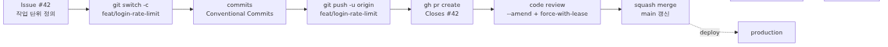
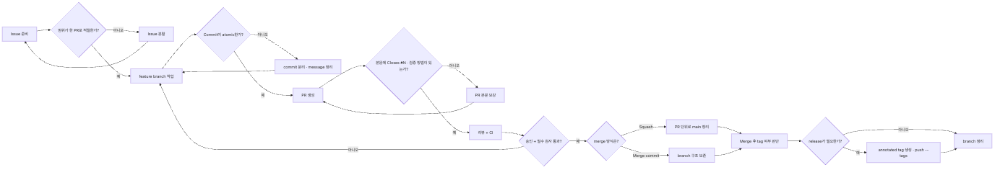

# 실전 Git workflow 만들기: issue부터 release까지 한 흐름으로

명령을 따로따로 아는 것과 팀이 실제로 어떻게 출고하는지 아는 것은 다릅니다. 마지막으로 필요한 것은 지금까지의 명령을 하나의 반복 가능한 사이클로 묶는 일입니다.

이 글은 Git/GitHub 101 시리즈의 마지막 글입니다. 여기서는 앞선 1~9편의 도구를 issue, branch, PR, merge, tag 흐름으로 묶어 실전 워크플로를 정리합니다.

## 이 글에서 다룰 문제

> 실무 흐름은 issue로 작업을 정의하고, branch에서 변경을 만들고, PR로 검토를 받고, merge로 공유 상태에 반영한 뒤, tag로 시점을 표시하고 issue를 닫는 한 사이클의 반복입니다.

- GitHub Flow는 왜 작은 팀에서 특히 잘 맞을까요?
- issue, branch, commit, PR, merge, tag는 어떤 순서로 연결될까요?
- 흐름 중간에 잘못된 branch에 commit하거나, 잘못 push했을 때 어떤 명령으로 회복할까요?
- `--force-with-lease`는 왜 plain `--force`보다 안전할까요?
- branch protection, PR template, CI는 어떤 식으로 이 흐름을 자동 강제할까요?

## 왜 중요한가

같은 `git commit`도 어디에 찍느냐에 따라 의미가 달라집니다. feature branch의 중간 commit인지, squash merge 후 `main`에 남을 대표 기록인지, release 직전 태그와 함께 묶일 변경인지에 따라 읽는 방법이 달라집니다. workflow는 결국 팀의 약속입니다.

GitHub Flow는 그 약속을 가장 단순한 형태로 보여 줍니다. `main`은 항상 배포 가능하게 유지하고, 새 작업은 짧은 branch에서 처리하고, PR로 review를 받고, merge 후 필요하면 release tag를 붙입니다. 이 흐름이 몸에 붙으면 잘못된 branch commit, 동료 commit을 덮는 force push, 정리되지 않은 release 같은 사고가 크게 줄어듭니다.

## 핵심 그림



*Mental Model*

issue가 입구이고, tag와 issue close가 출구입니다. 그 사이의 단계는 모두 앞선 글에서 따로 배운 명령입니다. 이번 글의 목표는 이들을 하나의 문장처럼 이어서 읽게 만드는 것입니다.

## 핵심 개념

| 개념 | 설명 |
| --- | --- |
| GitHub Flow | `main`은 항상 배포 가능, 모든 변경은 짧은 feature branch, merge는 PR 경유 |
| Squash merge | feature branch의 commit을 하나로 묶어 `main`에 올리는 방식 |
| Semantic versioning | `MAJOR.MINOR.PATCH` 버전 규칙 |
| Release tag | 특정 commit에 붙이는 버전 이름표 |
| `--force-with-lease` | remote에 새 작업이 생겼다면 force push를 거부하는 안전 장치 |
| Branch protection | `main` 직접 push 금지, PR/리뷰/CI 강제 설정 |

## 단계별 실습

### 1. issue로 작업 정의하기

```bash
$ gh issue create \
    --title "Add rate limit to login endpoint" \
    --body "Block password-guessing attempts by capping logins from a single IP at 5 per minute."

Creating issue in yeongseon/vacation-notes

https://github.com/yeongseon/vacation-notes/issues/42
```

issue 번호는 `#42`라고 가정합니다.

### 2. feature branch에서 작업 시작하기

```bash
$ git switch main
Switched to branch 'main'
Your branch is up to date with 'origin/main'.
$ git pull
Already up to date.
$ git switch -c feat/login-rate-limit
Switched to a new branch 'feat/login-rate-limit'
```

### 3. 작은 commit 두 개 쌓기

```bash
$ git add app/auth/rate_limit.py
$ git commit -m "feat(auth): add per-IP rate limiter"
[feat/login-rate-limit a1b2c3d] feat(auth): add per-IP rate limiter
 1 file changed, 28 insertions(+)
$ git add tests/auth/test_rate_limit.py
$ git commit -m "test(auth): cover rate-limit boundary cases"
[feat/login-rate-limit b2c3d4e] test(auth): cover rate-limit boundary cases
 1 file changed, 34 insertions(+)
```

### 4. origin에 push하기

```bash
$ git push -u origin feat/login-rate-limit
Enumerating objects: 12, done.
Counting objects: 100% (12/12), done.
Writing objects: 100% (8/8), 1.42 KiB | 1.42 MiB/s, done.
Total 8 (delta 4), reused 0 (delta 0)
remote:
remote: Create a pull request for 'feat/login-rate-limit' on GitHub by visiting:
remote:      https://github.com/yeongseon/vacation-notes/pull/new/feat/login-rate-limit
remote:
To github.com:yeongseon/vacation-notes.git
 * [new branch]      feat/login-rate-limit -> feat/login-rate-limit
Branch 'feat/login-rate-limit' set up to track 'origin/feat/login-rate-limit'.
```

### 5. PR 만들고 issue 연결하기

```bash
$ gh pr create \
    --base main \
    --title "feat(auth): add login rate limit" \
    --body "Closes #42

Returns 429 once the per-minute cap is hit. The limiter starts as an
in-memory dict and moves to a Redis backend in the next PR."

Creating pull request for feat/login-rate-limit into main in yeongseon/vacation-notes

https://github.com/yeongseon/vacation-notes/pull/17
```

### 6. 리뷰 피드백을 amend와 safe force push로 반영하기

```bash
$ # rename the test variable, then
$ git add tests/auth/test_rate_limit.py
$ git commit --amend --no-edit
[feat/login-rate-limit c3d4e5f] test(auth): cover rate-limit boundary cases
 Date: Tue May 5 14:08:11 2026 +0900
 1 file changed, 2 insertions(+), 2 deletions(-)
$ git push --force-with-lease
To github.com:yeongseon/vacation-notes.git
 + b2c3d4e...c3d4e5f feat/login-rate-limit -> feat/login-rate-limit (forced update)
```

### 7. squash merge로 `main`에 반영하기

```bash
$ gh pr merge 17 --squash --delete-branch
✓ Squashed and merged pull request #17 (feat(auth): add login rate limit)
✓ Deleted branch feat/login-rate-limit and switched to branch main
$ git pull
Updating 9c8b7a6..d5e6f7a
Fast-forward
 app/auth/rate_limit.py        | 28 ++++++++++++++++
 tests/auth/test_rate_limit.py | 34 +++++++++++++++++++
 2 files changed, 62 insertions(+)
```

### 8. release tag 찍기

```bash
$ git tag -a v0.3.0 -m "Add per-IP login rate limit (#17)"
$ git push --tags
Enumerating objects: 1, done.
To github.com:yeongseon/vacation-notes.git
 * [new tag]         v0.3.0 -> v0.3.0
```

### 9. issue가 닫혔는지 확인하기

```bash
$ gh issue view 42
Add rate limit to login endpoint
Closed • yeongseon opened about 1 hour ago

  Block password-guessing attempts by capping logins from a single IP at 5 per minute.

  ...

  Closed by pull request #17 (Squashed and merged)
```

## merge 직전 의사결정 흐름

실전에서는 "PR을 열었다"와 "이제 merge해도 된다" 사이에 생각보다 많은 판단이 들어갑니다. 아래 흐름은 작은 팀이 GitHub Flow를 운영할 때 최소한으로 확인할 질문을 정리한 것입니다.



*Issue 범위 점검부터 merge 방식과 release tag 판단까지 이어지는 GitHub Flow 의사결정 흐름*

이 흐름을 팀이 공유하면 merge 버튼이 단순히 "눌러도 되는 버튼"이 아니라, 사전 조건이 충족됐을 때만 쓰는 마지막 단계라는 감각이 생깁니다.

## merge 직전에 보는 검증 루틴

issue부터 tag까지 한 번에 가르친 글일수록 마지막 검증 순서가 있어야 실제 운영에서 덜 흔들립니다. 최소한 아래 순서는 고정해 두는 편이 좋습니다.

1. `git status`로 working tree가 깨끗한지 확인합니다.
2. `git log --oneline origin/main..HEAD`로 PR에 들어갈 commit 목록을 읽습니다.
3. `git diff --stat origin/main...HEAD`로 범위가 예상보다 커지지 않았는지 봅니다.
4. PR 본문에 `Closes #N`, 검증 방법, release tag 필요 여부가 있는지 확인합니다.
5. CI 결과와 required review가 모두 통과했는지 확인합니다.
6. merge 후 `main`을 pull하고, 필요하면 annotated tag를 만들고, 사용한 branch를 삭제합니다.

이 루틴은 화려한 자동화보다 먼저 팀의 실수를 줄여 줍니다. 특히 3번과 4번은 PR이 비대해지거나 issue 연결이 빠지는 문제를 초기에 잡아냅니다.

## squash, merge commit, rebase merge를 어떻게 고를까

입문 단계에서는 "팀 기본값을 하나 정하고 대부분은 그걸 따른다"고 이해하는 편이 좋습니다. 그래도 판단 기준은 알아 두는 편이 좋습니다.

| 방식 | 잘 맞는 상황 | 주의할 점 |
| --- | --- | --- |
| Squash merge | PR 단위로 `main` log를 짧고 읽기 좋게 유지하고 싶을 때 | branch 안 commit 세부 이력은 `main`에서 사라집니다 |
| Merge commit | feature branch 구조와 병합 시점을 history에 그대로 남기고 싶을 때 | `main` 그래프가 더 빨리 복잡해집니다 |
| Rebase merge | merge bubble 없이 개별 commit을 선형으로 유지하고 싶을 때 | commit hash가 바뀌므로 추적 문맥을 함께 읽어야 합니다 |

작은 팀이나 입문 저장소에서는 squash merge가 가장 설명하기 쉽습니다. 반대로 여러 commit 자체가 중요한 학습 자료거나, branch 구조를 history에서 보존해야 한다면 merge commit이 더 낫습니다.

## 회복 흐름 표

| 상황 | 회복 명령 | 메모 |
| --- | --- | --- |
| 잘못된 branch에 commit함, 아직 push 전 | `git log -1 --format=%H` → `git switch <correct-branch>` → `git cherry-pick <hash>` → 원래 branch에서 `git reset --hard HEAD~1` | push 전일 때만 안전 |
| 직전 message만 고치고 싶음 | `git commit --amend -m "..."` | hash 변경 |
| 이미 push한 commit을 취소하고 싶음 | `git revert <hash>` → `git push` | 새 commit으로 되돌림 |
| squash merge된 PR을 되돌리고 싶음 | `git revert <squash-commit-hash>` → `git push` | `main`에는 보통 하나의 squash commit만 남음 |
| 로컬 작업을 잃어버림 | `git reflog` → 이전 HEAD hash 확인 → `git switch -c rescue <hash>` | reflog는 일정 기간 유지 |
| secret을 push함 | secret 회수 → `git filter-repo`로 history 정리 → 협업자 재clone 안내 | 회수가 먼저 |
| force push로 동료 commit을 덮음 | reflog에서 잃은 hash 찾기 → 해당 hash로 branch 생성 → `--force-with-lease`로 복구 | 그래서 plain `--force`를 피함 |

## 자주 하는 실수

- `main`에 직접 commit해 흐름 전체를 무너뜨립니다.
- PR을 너무 크게 만들어 리뷰가 멈춥니다.
- plain `--force`를 습관처럼 사용합니다.
- merge 직후 tag를 잊어 release 시점을 나중에 찾기 어렵게 만듭니다.
- issue 없이 PR부터 열어 작업 의도가 흩어집니다.

## 실무에서는 이렇게 본다

팀 단위에서는 사람의 기억보다 자동 장치가 더 중요합니다. `main`에 branch protection을 걸고, PR template을 두고, CODEOWNERS로 리뷰어를 자동 지정하고, required CI로 lint/test/build를 강제합니다. 여기에 commit message lint까지 붙이면 흐름이 스스로 유지됩니다.

또한 squash merge를 기본으로 두면 `main`의 log가 PR 단위로 정리되어 읽기 쉬워집니다. feature branch 안에서는 작은 atomic commit을 자유롭게 쌓되, 공유 이력에서는 한 PR이 한 줄로 보이게 만드는 방식입니다.

그리고 회복 명령은 문제를 만든 뒤 찾기보다, 팀 문서에 표로 미리 넣어 두는 편이 훨씬 낫습니다. 잘못된 branch commit, revert, safe force push, secret 회수 같은 항목을 runbook처럼 옆에 두면 실수한 뒤에도 더 침착하게 대응할 수 있습니다.

## 체크리스트

- [ ] issue가 먼저 있고 PR 본문에 `Closes #N`이 들어갔습니까?
- [ ] feature branch 이름이 `<type>/<slug>` 규칙을 따릅니까?
- [ ] commit이 atomic하고 Conventional Commits 형식입니까?
- [ ] PR 제목도 같은 형식을 따르고 본문에 왜가 적혀 있습니까?
- [ ] force push가 필요할 때 `--force-with-lease`를 사용했습니까?
- [ ] squash merge 후 branch를 정리했습니까?
- [ ] release 시 annotated tag를 만들고 `--tags`로 push했습니까?

## 연습 문제

1. 개인 저장소에서 `feat/<slug>` branch를 만들고 두 개의 작은 commit으로 작업한 뒤 PR을 열어 보세요.
2. `git config --global alias.fpush "push --force-with-lease"`를 등록하고 이후 safe force push만 사용해 보세요.
3. 작은 PR을 squash merge한 뒤 `git tag -a v0.0.1 -m "first tagged release"`를 찍고 GitHub에 보이는지 확인해 보세요.
4. `.github/pull_request_template.md`를 만들고 요약, 관련 issue, 테스트 방법, release tag 여부 섹션을 넣어 보세요.

## 정리

issue로 작업을 정의하고, 짧은 feature branch에서 atomic commit을 쌓고, PR로 review를 받고, squash merge로 `main`에 반영하고, 필요하면 tag를 찍는 것까지가 하나의 실전 사이클입니다. 사고가 나면 회복 표를 다시 펼치고, 팀 차원에서는 branch protection, PR template, CODEOWNERS, CI로 흐름을 자동 강제하는 편이 가장 안정적입니다.

이번 글로 Git/GitHub 101 시리즈를 마칩니다. 다음 단계는 이 흐름에 GitHub Actions 같은 자동화를 더해 PR마다 검사하고 tag마다 release note를 만드는 일입니다.

<!-- toc:begin -->
## 시리즈 목차

- [Git이란 무엇인가? 버전 관리의 시작](./01-what-is-git.md)
- [첫 commit 만들기 - init, status, add, commit](./02-first-commit.md)
- [변경 사항 확인하기 - status, diff, log로 읽기](./03-status-diff-log.md)
- [branch 기초 - 만들고 옮기고 비교하기](./04-branch-basics.md)
- [merge와 conflict 해결하기 - 두 줄기를 다시 합치기](./05-merge-and-conflict.md)
- [GitHub repository 만들기 - remote, push, pull 한 번에 익히기](./06-github-repository.md)
- [Pull Request로 협업하기 - branch에서 review를 거쳐 main까지](./07-pull-request.md)
- [Issue와 Project로 일감 관리하기 - GitHub에서 할 일을 추적하는 법](./08-issue-and-project.md)
- [좋은 commit message 쓰기: Conventional Commits와 좋은 본문](./09-good-commit-message.md)
- **실전 Git workflow 만들기: issue부터 release까지 한 흐름으로 (현재 글)**
<!-- toc:end -->

## 참고 자료

- GitHub Docs, "GitHub flow": <https://docs.github.com/en/get-started/using-github/github-flow>
- Semantic Versioning 2.0.0: <https://semver.org/spec/v2.0.0.html>
- Git docs, `git tag`: <https://git-scm.com/docs/git-tag>
- Git docs, `git push --force-with-lease`: <https://git-scm.com/docs/git-push#Documentation/git-push.txt---force-with-lease>
- Git docs, `git revert -m`: <https://git-scm.com/docs/git-revert>
- GitHub Docs, "About protected branches": <https://docs.github.com/en/repositories/configuring-branches-and-merges-in-your-repository/defining-the-mergeability-of-pull-requests/about-protected-branches>
- GitHub Docs, "About code owners": <https://docs.github.com/en/repositories/managing-your-repositorys-settings-and-security/customizing-your-repository/about-code-owners>
- GitHub Docs, "About merge methods on GitHub": <https://docs.github.com/en/repositories/configuring-branches-and-merges-in-your-repository/configuring-pull-request-merges/about-merge-methods-on-github>
- GitHub Docs, "About required status checks": <https://docs.github.com/en/repositories/configuring-branches-and-merges-in-your-repository/managing-protected-branches/about-protected-branches#require-status-checks-before-merging>

Tags: github-flow, git-workflow, conventional-commits, semantic-versioning, code-review, release-tag
