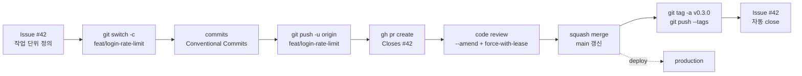

# 실전 Git workflow 만들기: issue부터 release까지 한 흐름으로

## 이 글에서 배울 것

- Episode 1~9에서 익힌 명령을 한 번의 실무 흐름으로 묶는 법을 익힙니다.
- issue → branch → commit → PR → review → merge → tag → close까지 한 사이클을 직접 따라가 봅니다.
- 흐름 중간에서 실수했을 때 어떤 명령으로 회복하는지 표로 정리합니다.
- 팀 단위로 같은 흐름을 안정적으로 돌리려면 어떤 장치(branch protection, PR template, CI)를 둬야 하는지 살펴봅니다.

## 이 글에서 답할 질문

- issue → branch → commit → PR → review → merge → tag → close 한 사이클은 어떤 명령들로 묶이는가?
- 흐름 중간에서 실수했을 때 어떤 명령으로 회복하는 것이 표준인가?
- branch protection, PR template, CI는 팀 단위 흐름의 어느 약한 고리를 보강하는가?
- tag는 commit 흐름에서 어떤 시점에 어떤 의도로 찍는가?
- 한 사이클이 평균보다 길어진다면 어느 단계의 신호로 의심해야 하는가?

## 왜 중요한가

지금까지 Episode 1~9에서 명령을 하나씩 익혔습니다. 명령을 아는 것과 흐름을 아는 것은 다릅니다. 같은 `git commit` 명령이라도 어떤 branch에서, 어떤 PR을 위해, 어떤 release를 향해 찍느냐에 따라 의미가 달라집니다. workflow는 사람과 사람 사이의 약속입니다. 같은 흐름을 따르면 새로 합류한 동료도 어디서 변경이 시작되고 어디서 끝나는지 첫 주에 파악합니다.

GitHub Flow는 가장 단순한 약속입니다. `main`은 항상 배포 가능한 상태로 둡니다. 새 작업은 짧은 feature branch에서 진행하고, PR로 review를 받아 squash merge합니다. 필요하면 tag를 찍어 release합니다. 이 한 문장이 이 글의 전부입니다. 나머지는 한 사이클을 끝까지 돌려 보면서 기억이 몸에 붙도록 하는 일입니다.

흐름이 몸에 붙으면 사고가 줄어듭니다. force push로 동료의 commit을 덮어쓰는 사고, 잘못된 branch에 commit한 사고, 이미 push된 secret을 history에서 못 지우는 사고는 모두 흐름의 어느 지점에서 한 단계를 건너뛰었기 때문에 일어납니다. 마지막 절에서는 그런 지점에서 어떤 명령으로 되돌아오는지를 표로 정리합니다.

## Mental Model

> 실무 흐름은 "issue로 작업을 정의하고, branch에서 변경을 만들고, PR로 검토를 받고, merge로 공유 상태에 반영한 뒤, tag로 시점을 표시하고 issue를 닫는다"는 한 사이클의 반복입니다.
GitHub Flow 한 사이클은 다음과 같은 모양입니다.



Issue가 흐름의 입구, tag와 issue close가 출구입니다. 가운데 단계는 모두 Episode 1~9에서 따로 배운 명령들입니다. 이번 글의 일은 이 다이어그램을 머릿속에서 한 줄로 따라갈 수 있게 만드는 것입니다.

## 핵심 개념

| 개념 | 설명 |
| --- | --- |
| GitHub Flow | `main`은 항상 배포 가능, 모든 변경은 짧은 feature branch에서 진행, PR로 merge. 단순해서 작은 팀에 적합합니다. |
| Squash merge | feature branch의 commit들을 하나로 합쳐 `main`에 올리는 merge 방식. PR 제목이 그대로 commit message가 됩니다. |
| Semantic versioning | `MAJOR.MINOR.PATCH` 형식. 호환이 깨지면 MAJOR, 기능 추가는 MINOR, 버그 수정은 PATCH를 올립니다. |
| Release tag | 특정 commit에 붙이는 이름표. `git tag -a v0.3.0`으로 만들고 `git push --tags`로 공유합니다. |
| `--force-with-lease` | force push이지만, 내가 마지막으로 본 remote 상태에서 다른 사람의 commit이 추가됐다면 거부합니다. 안전한 force push입니다. |
| Branch protection | `main` branch에 직접 push를 막고, PR + review + CI 통과를 강제하는 GitHub 설정입니다. |

## 단계별 실습

Episode 9까지 사용한 `vacation-notes` 저장소에서 한 사이클을 끝까지 돌려 봅니다. 이번 작업의 주제는 "로그인 시도에 rate limit을 추가한다"입니다.

### 1. Issue로 작업 단위 만들기

작업이 시작되는 곳은 issue입니다. 무엇을 왜 하는지 두 사람이 같은 문장으로 읽을 수 있도록 짧게 적습니다.

```bash
$ gh issue create \
    --title "Add rate limit to login endpoint" \
    --body "비밀번호 추측 공격을 막기 위해 동일 IP에서 분당 5회로 로그인 요청을 제한한다."

Creating issue in yeongseon/vacation-notes

https://github.com/yeongseon/vacation-notes/issues/42
```

새 issue 번호가 `#42`라고 가정합니다. 본문은 "왜"에 집중합니다. "어떻게"는 PR에 적습니다.

### 2. feature branch에서 작업하기

`main`을 최신으로 맞춘 뒤 feature branch를 만듭니다.

```bash
$ git switch main
Switched to branch 'main'
Your branch is up to date with 'origin/main'.
$ git pull
Already up to date.
$ git switch -c feat/login-rate-limit
Switched to a new branch 'feat/login-rate-limit'
```

branch 이름은 `<type>/<short-slug>` 규칙을 따릅니다. type은 Conventional Commits 분류와 같이 갑니다. 한 사람이 한 issue를 한 branch에서 처리하는 것이 흐름의 핵심입니다.

### 3. 작은 commit 두 개로 변경 쌓기

Episode 9의 규칙대로, 한 commit에 한 가지 변경만 담습니다.

```bash
$ git add app/auth/rate_limit.py
$ git commit -m "feat(auth): add per-IP rate limiter"
[feat/login-rate-limit a1b2c3d] feat(auth): add per-IP rate limiter
 1 file changed, 28 insertions(+)
$ git add tests/auth/test_rate_limit.py
$ git commit -m "test(auth): cover rate-limit boundary cases"
[feat/login-rate-limit b2c3d4e] test(auth): cover rate-limit boundary cases
 1 file changed, 34 insertions(+)
```

production 코드와 test를 별도 commit으로 나누면, 리뷰어가 "기능이 어떻게 동작하는지"와 "어떤 경계를 테스트했는지"를 분리해 읽을 수 있습니다.

### 4. push로 origin에 올리기

처음 push할 때는 `-u`로 upstream을 지정합니다. 이후로는 `git push`만 입력해도 같은 곳으로 갑니다.

```bash
$ git push -u origin feat/login-rate-limit
Enumerating objects: 12, done.
Counting objects: 100% (12/12), done.
Writing objects: 100% (8/8), 1.42 KiB | 1.42 MiB/s, done.
Total 8 (delta 4), reused 0 (delta 0)
remote:
remote: Create a pull request for 'feat/login-rate-limit' on GitHub by visiting:
remote:      https://github.com/yeongseon/vacation-notes/pull/new/feat/login-rate-limit
remote:
To github.com:yeongseon/vacation-notes.git
 * [new branch]      feat/login-rate-limit -> feat/login-rate-limit
Branch 'feat/login-rate-limit' set up to track 'origin/feat/login-rate-limit'.
```

remote 출력에 PR 생성 링크가 같이 나옵니다. 다음 단계의 입구가 됩니다.

### 5. PR 만들기와 issue 연결

`gh pr create`로 PR을 만들면서 본문에 `Closes #42`를 적습니다. 이 키워드는 PR이 default branch인 `main`에 merge되는 순간 issue를 자동으로 닫습니다.

```bash
$ gh pr create \
    --base main \
    --title "feat(auth): add login rate limit" \
    --body "Closes #42

분당 5회를 넘으면 429를 반환한다. limiter는 in-memory dict로 시작하고,
다음 PR에서 Redis 백엔드로 옮긴다."

Creating pull request for feat/login-rate-limit into main in yeongseon/vacation-notes

https://github.com/yeongseon/vacation-notes/pull/17
```

PR 제목 자체도 Conventional Commits 형식입니다. 마지막에 squash merge하면 이 제목이 그대로 `main`의 commit message가 됩니다.

### 6. 리뷰 피드백을 `--amend`와 `--force-with-lease`로 반영하기

리뷰어가 테스트 변수명 하나를 지적했다고 가정합니다. 이미 push해 PR을 올린 뒤라도, 직전 commit에만 걸린 작은 수정이라면 새 commit을 쌓는 대신 `--amend`로 다듬고 `--force-with-lease`로 다시 올릴 수 있습니다.

```bash
$ # 테스트 변수명 수정 후
$ git add tests/auth/test_rate_limit.py
$ git commit --amend --no-edit
[feat/login-rate-limit c3d4e5f] test(auth): cover rate-limit boundary cases
 Date: Tue May 5 14:08:11 2026 +0900
 1 file changed, 2 insertions(+), 2 deletions(-)
$ git push --force-with-lease
To github.com:yeongseon/vacation-notes.git
 + b2c3d4e...c3d4e5f feat/login-rate-limit -> feat/login-rate-limit (forced update)
```

`--force-with-lease`는 내가 마지막으로 fetch한 시점의 remote 상태를 기억합니다. 그 사이 다른 사람이 같은 branch에 commit을 올렸다면 push가 거부됩니다. 그냥 `--force`보다 안전합니다. 자기 feature branch에서만 사용합니다.

### 7. Squash merge로 main에 올리기

리뷰가 끝나면 GitHub의 "Squash and merge" 버튼을 누르거나 `gh`로 처리합니다.

```bash
$ gh pr merge 17 --squash --delete-branch
✓ Squashed and merged pull request #17 (feat(auth): add login rate limit)
✓ Deleted branch feat/login-rate-limit and switched to branch main
$ git pull
Updating 9c8b7a6..d5e6f7a
Fast-forward
 app/auth/rate_limit.py        | 28 ++++++++++++++++
 tests/auth/test_rate_limit.py | 34 +++++++++++++++++++
 2 files changed, 62 insertions(+)
```

`--delete-branch`로 origin의 feature branch까지 함께 정리합니다. 로컬에서도 자동으로 `main`으로 돌아갑니다.

### 8. Release tag로 버전 찍기

이 변경을 release에 묶기로 했다면 tag를 만듭니다. 직전 release가 `v0.2.0`이고 이번에 기능이 추가됐으니 MINOR를 올려 `v0.3.0`으로 갑니다.

```bash
$ git tag -a v0.3.0 -m "Add per-IP login rate limit (#17)"
$ git push --tags
Enumerating objects: 1, done.
To github.com:yeongseon/vacation-notes.git
 * [new tag]         v0.3.0 -> v0.3.0
```

`-a`는 annotated tag를 만듭니다. tagger 정보와 message가 같이 저장됩니다. release note 자동화 도구가 이 message를 그대로 가져갑니다. lightweight tag(`git tag v0.3.0`)는 hash만 가리키므로, release용으로는 `-a`가 기본입니다.

### 9. issue가 자동으로 닫혔는지 확인

PR 본문의 `Closes #42` 덕분에, 이 PR이 default branch인 `main`에 squash merge되면서 `#42`가 닫혔습니다. 마지막으로 한 번 확인합니다.

```bash
$ gh issue view 42
Add rate limit to login endpoint
Closed • yeongseon opened about 1 hour ago

  비밀번호 추측 공격을 막기 위해 동일 IP에서 분당 5회로 로그인 요청을 제한한다.

  ...

  Closed by pull request #17 (Squashed and merged)
```

여기까지가 한 사이클입니다. 다음 작업은 새 issue에서 다시 시작합니다.

## 실수 회복 흐름

흐름 중간에서 자주 만나는 사고와, 그때 가장 먼저 입력하면 되는 명령을 정리합니다.

| 상황 | 회복 명령 | 메모 |
| --- | --- | --- |
| 잘못된 branch에 commit했다 (아직 push 전) | `git log -1 --format=%H` → `git switch <올바른-branch>` → `git cherry-pick <hash>` → 원래 branch에서 `git reset --hard HEAD~1` | reset은 push 전에만 안전합니다. |
| 직전 commit message만 고치고 싶다 (push 전) | `git commit --amend -m "..."` | hash가 바뀝니다. push 후라면 사용을 피합니다. |
| 이미 push한 commit을 되돌리고 싶다 | `git revert <hash>` → `git push` | 새 commit으로 되돌리므로 history가 어긋나지 않습니다. |
| 잘못 squash merge된 PR을 되돌리고 싶다 | `git revert <squash-commit-hash>` → `git push` | 이 글의 기본 merge 방식은 squash merge이므로, 보통 squash된 commit 하나를 되돌리면 됩니다. |
| 로컬 변경을 실수로 지웠다 | `git reflog` → 직전 HEAD hash 찾기 → `git switch -c rescue <hash>` | reflog는 약 90일간 유지됩니다. |
| 비밀번호/토큰을 commit해 push해 버렸다 | 우선 토큰을 즉시 회수(rotate) → 별도 설치 도구인 `git filter-repo`로 history 삭제 → 모든 협업자에게 재clone 요청 | history 재작성보다 토큰 회수가 먼저입니다. |
| force push로 동료 commit을 덮었다 | `git reflog` 또는 동료의 reflog로 hash 확인 → 해당 hash로 새 branch 만들기 → `--force-with-lease`로 복구 push | 이래서 평소에 `--force-with-lease`만 사용합니다. |

표가 외울 분량은 아닙니다. 사고가 났을 때 이 표를 다시 펴 보는 것이 목표입니다.

## 자주 하는 실수

- `main`에 직접 commit합니다. branch protection 설정으로 막아 둡니다. 막혀 있으면 흐름이 무너지지 않습니다.
- PR을 너무 크게 올립니다. 한 PR이 500줄을 넘으면 리뷰어가 정독을 포기합니다. issue를 쪼개 PR을 쪼갭니다.
- `--force`를 무심코 씁니다. 항상 `--force-with-lease`를 사용합니다. alias로 등록해 두는 편이 안전합니다.
- merge 직후 tag를 잊습니다. release 시점의 commit을 나중에 다시 찾기 어려워집니다. PR template에 "release tag 필요 여부"를 체크박스로 넣습니다.
- issue 없이 PR부터 만듭니다. 작업 의도를 PR 본문에서만 설명하면, 같은 주제로 다음 PR을 만들 때 맥락을 다시 설명해야 합니다.

## 실무

팀에서 같은 흐름을 안정적으로 돌리려면 사람의 기억 외에 자동 장치 네 가지를 준비합니다.

1. **Branch protection**: GitHub의 Settings → Branches에서 `main`에 다음을 강제합니다. PR 없이 push 금지, 1명 이상 review 승인 필요, CI 통과 필요, force push 금지.
2. **PR template**: `.github/pull_request_template.md`에 "변경 요약 / 관련 issue / 테스트 방법 / release tag 여부" 항목을 둡니다. PR을 만들면 자동으로 이 양식이 채워집니다.
3. **CODEOWNERS**: `.github/CODEOWNERS`에 디렉터리별 담당자를 적어 두면, 해당 영역이 바뀐 PR에 자동으로 reviewer가 지정됩니다.
4. **Required CI**: lint, type check, test, build을 PR마다 자동 실행하고, 하나라도 실패하면 merge 버튼이 비활성화되도록 설정합니다.

여기에 commit-msg hook과 commitlint(Episode 9)까지 더하면, 흐름의 어느 단계에서도 형식이 무너지지 않습니다.

squash merge를 기본으로 두면 history도 깔끔하게 유지됩니다. feature branch 내부의 작은 commit들은 PR 단위로 묶이므로, `main`에서 `git log --oneline`을 보면 한 줄당 한 PR이 보입니다.

## 체크리스트

- [ ] issue가 먼저 있고, 그 issue 번호가 PR 본문의 `Closes #N`에 들어가 있나요?
- [ ] feature branch 이름이 `<type>/<slug>` 규칙을 따르고 있나요?
- [ ] commit이 atomic하게 나뉘어 있고, 각 message가 Conventional Commits 형식인가요?
- [ ] PR 제목이 Conventional Commits 형식이고, 본문에 "왜"가 적혀 있나요?
- [ ] force push가 필요할 때 `--force-with-lease`를 사용했나요?
- [ ] merge 방식이 squash merge로 통일돼 있고, merge 후 feature branch가 삭제됐나요?
- [ ] release 시점이라면 annotated tag(`-a`)를 만들고 `--tags`로 push했나요?

## 연습 문제

1. 자신의 저장소에서 `feat/<slug>` 형식 branch를 하나 만들고 commit 두 개로 나눠 PR을 올려 봅니다. PR 본문에 `Closes #N`을 넣어 squash merge 후 issue가 닫히는지 확인합니다.
2. `git push --force` 대신 `git push --force-with-lease`를 git config alias로 등록합니다. `git config --global alias.fpush "push --force-with-lease"`로 시작해 봅니다.
3. 작은 PR 하나를 squash merge한 뒤 `git tag -a v0.0.1 -m "first tagged release"`로 tag를 만들고 `git push --tags`로 올려 GitHub의 Releases 탭에서 보이는지 확인합니다.
4. 자신의 저장소에 `.github/pull_request_template.md`를 추가해 봅니다. "변경 요약 / 관련 issue / 테스트 방법 / release tag 여부" 네 항목으로 시작합니다.
5. `main`에 실수로 commit이 들어갔다고 가정하고 `git revert <hash>`로 되돌리는 흐름을 따라가 봅니다. `git log --oneline`에 revert commit이 새로 쌓이는지 확인합니다.

## 정리

지금까지 Episode 1~9에서 익힌 명령은 모두 이 한 사이클의 단계들이었습니다. issue로 작업을 정의하고, 짧은 feature branch에서 atomic commit을 쌓고, PR로 review를 받고, squash merge로 `main`을 갱신하고, 필요하면 tag를 찍어 release합니다. 사고가 나면 회복 명령 표를 다시 펴 봅니다. 팀 단위에서는 branch protection, PR template, CODEOWNERS, required CI 네 가지로 흐름을 자동 강제합니다.

이번 글로 Git & GitHub 101 시리즈를 마칩니다. 다음 단계는 흐름을 자동화하는 일입니다. 같은 저장소에 GitHub Actions를 붙여 PR마다 lint와 test를 자동 실행하고, tag를 push하면 release note가 자동으로 만들어지도록 만드는 흐름은 다음 시리즈에서 다룹니다. 그 전까지 자신의 프로젝트에서 이 한 사이클을 직접 한 번 돌려 보시길 권합니다. 명령은 손끝에서 외워질 때 비로소 자기 도구가 됩니다.

<!-- toc:begin -->
## 시리즈 목차

- [Git이란 무엇인가? 버전 관리의 시작](./01-what-is-git.md)
- [첫 commit 만들기: init, add, commit](./02-first-commit.md)
- [변경 사항 확인하기: status, diff, log](./03-status-diff-log.md)
- [branch 이해하기: 분기와 전환](./04-branch-basics.md)
- [merge와 conflict 해결하기](./05-merge-and-conflict.md)
- [GitHub repository 만들기와 remote, push, pull](./06-github-repository.md)
- [Pull Request로 협업하기](./07-pull-request.md)
- [Issue와 Project로 일감 관리하기](./08-issue-and-project.md)
- [좋은 commit message 쓰기](./09-good-commit-message.md)
- **실전 Git workflow 만들기 (현재 글)**
<!-- toc:end -->

## 참고 자료

- GitHub Docs, "GitHub flow": <https://docs.github.com/en/get-started/using-github/github-flow>
- Semantic Versioning 2.0.0: <https://semver.org/spec/v2.0.0.html>
- Git docs, `git tag`: <https://git-scm.com/docs/git-tag>
- Git docs, `git push --force-with-lease`: <https://git-scm.com/docs/git-push#Documentation/git-push.txt---force-with-lease>
- Git docs, `git revert -m`: <https://git-scm.com/docs/git-revert>
- GitHub Docs, "About protected branches": <https://docs.github.com/en/repositories/configuring-branches-and-merges-in-your-repository/defining-the-mergeability-of-pull-requests/about-protected-branches>
- GitHub Docs, "About code owners": <https://docs.github.com/en/repositories/managing-your-repositorys-settings-and-security/customizing-your-repository/about-code-owners>

Tags: github-flow, git-workflow, conventional-commits, semantic-versioning, code-review, release-tag
