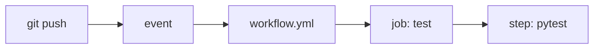

# What Is GitHub Actions?

> GitHub Actions 101 series (1/10)

<!-- a-grade-intro:begin -->

**Core question**: Where do you start so that *one push* triggers *test, lint, and deploy* automatically?

> Automation belongs in *code, not in hands*.

<!-- a-grade-intro:end -->

This is the first post in the GitHub Actions 101 series.

## What You Will Learn

- The definition and place of *GitHub Actions*
- The relationship between *Workflow / Job / Step*
- How to author your first workflow
- *Why GitHub Actions* (vs. Jenkins/CircleCI)
- Five common misconceptions

## Why It Matters

CI/CD determines *team speed and quality*. *GitHub Actions* runs *next to your code* as a default automation engine, with no servers to operate.

> Real CI starts at the moment a *PR is merged*, not when a human remembers.

## Concept at a Glance



## Key Terms

- **Workflow**: a complete *automation unit* in `.github/workflows/*.yml`.
- **Event**: what *starts* a workflow (push, PR, etc.).
- **Job**: a unit of execution; jobs run *in parallel* by default.
- **Step**: a single *command* or an *Action call* inside a Job.
- **Runner**: the *machine* that runs a Job (e.g., ubuntu-latest).
- **Action**: a reusable *Step* (e.g., `actions/checkout`).

## Before/After

**Before**: every PR you run tests *locally* and *paste results into Slack*.

**After**: opening a PR runs tests *automatically* and a *check mark* appears on the PR.

## Hands-on: Your First Workflow in 5 Steps

### Step 1 — Create the directory

```bash
mkdir -p .github/workflows
```

### Step 2 — Write the workflow file

```yaml
# .github/workflows/ci.yml
name: ci
on:
  push:
    branches: [main]
  pull_request:

jobs:
  test:
    runs-on: ubuntu-latest
    steps:
      - uses: actions/checkout@v4
      - uses: actions/setup-python@v5
        with:
          python-version: "3.11"
      - run: pip install -r requirements.txt
      - run: pytest -q
```

### Step 3 — Trigger via push

```bash
git add .github/workflows/ci.yml
git commit -m "ci: add first workflow"
git push
```

### Step 4 — Check results in the Actions tab

```text
Repo > Actions tab
- The workflow run log appears.
- Each step prints its output and time.
```

### Step 5 — Use it as a PR check

```text
In branch protection, enable "Require status checks to pass."
A failed test now blocks merge.
```

## What to Notice in This Code

- A *single YAML file* defines the *whole automation*.
- *checkout* is the first step in *almost every* workflow.
- *runs-on* selects the *execution environment*.

## Five Common Mistakes

1. **Wrong workflow location.** It must be exactly `.github/workflows/`.
2. **Missing `on:`.** A workflow with *no trigger* never runs.
3. **Skipping `actions/checkout`.** Without code, every later step fails.
4. **Running heavy steps on every PR.** Wastes time and money.
5. **Hardcoding secrets in YAML.** Use `${{ secrets.* }}` only.

## How This Shows Up in Production

Mature teams split *test / lint / typecheck / build / deploy* into *separate workflows* and share *organization-wide standards* through *reusable workflows*.

## How a Senior Engineer Thinks

- *No CI, no new feature*.
- *YAML is code* — review it.
- *Run time* equals *cost plus feedback latency*.
- *Secrets never mix with code*.
- *Workflows* are *decomposed*, just like services.

## Checklist

- [ ] A `.github/workflows/` directory exists.
- [ ] Triggers fire on both *push and PR*.
- [ ] Results appear as *PR checks*.
- [ ] *Secrets* use only `secrets.*`.

## Practice Problems

1. Create a workflow that prints *Hello World* only.
2. Add a *matrix* that runs on *Ubuntu and macOS*.
3. Intentionally *break* the test and see the *PR check* fail.

## Wrap-up and Next Steps

GitHub Actions is *automation that lives next to your code*. The next post explores *Workflow and Job* structure in depth.

<!-- toc:begin -->
- **What Is GitHub Actions? (current)**
- Workflows and Jobs (upcoming)
- Understanding Triggers (upcoming)
- Python Test Automation (upcoming)
- Lint and Type Check (upcoming)
- Build Artifacts (upcoming)
- Docker Build (upcoming)
- Deployment Automation (upcoming)
- Secret Management (upcoming)
- A Real-World CI/CD Pipeline (upcoming)
<!-- toc:end -->

## References

- [GitHub Actions Documentation](https://docs.github.com/actions)
- [Workflow syntax](https://docs.github.com/actions/using-workflows/workflow-syntax-for-github-actions)
- [Awesome Actions](https://github.com/sdras/awesome-actions)
- [Actions Marketplace](https://github.com/marketplace?type=actions)

Tags: GitHubActions, CICD, Automation, DevOps, Workflow
