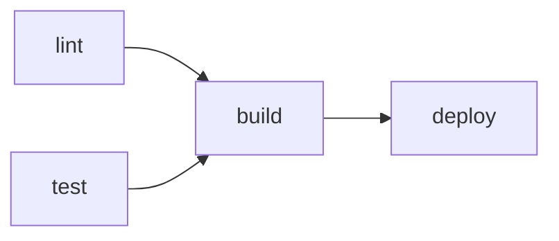

# Workflows and Jobs

> GitHub Actions 101 series (2/10)

<!-- a-grade-intro:begin -->

**Core question**: How do you say "*deploy* runs only after *test* passes"?

> The *graph of jobs* is your *pipeline*.

<!-- a-grade-intro:end -->

## What You Will Learn

- The exact relationship between *Workflow / Job / Step*
- Expressing dependencies with *jobs.<id>.needs*
- Running *many environments* with *matrix*
- Passing values between jobs with *outputs*
- Five common mistakes

## Why It Matters

A fully *serial* CI is slow; a fully *parallel* one *breaks ordering*. Drawing the *job graph* correctly is what makes a pipeline *fast and safe*.

> *Parallel for speed, dependencies for safety*.

## Concept at a Glance



## Key Terms

- **Workflow**: one *YAML file* equals one workflow.
- **Job**: a *unit of execution* in a workflow; jobs run *in parallel* by default.
- **Step**: a *command* or *Action call* inside a Job.
- **needs**: declares *dependencies* between Jobs.
- **matrix**: *replicates* a Job across *combinations of variables*.
- **outputs**: values a Job *passes* to the next Job.

## Before/After

**Before**: every step crammed into *one Job* — a *six-minute serial* pipeline.

**After**: split into *three parallel jobs* (lint / test / build) with *deploy needs build* — a *two-minute graph* pipeline.

## Hands-on: Job Graph in 5 Steps

### Step 1 — Split into jobs

```yaml
jobs:
  lint:
    runs-on: ubuntu-latest
    steps:
      - uses: actions/checkout@v4
      - run: ruff check .

  test:
    runs-on: ubuntu-latest
    steps:
      - uses: actions/checkout@v4
      - run: pytest -q
```

### Step 2 — Order with needs

```yaml
  build:
    runs-on: ubuntu-latest
    needs: [lint, test]
    steps:
      - uses: actions/checkout@v4
      - run: python -m build
```

### Step 3 — Multiple environments via matrix

```yaml
  test:
    strategy:
      matrix:
        python: ["3.10", "3.11", "3.12"]
    runs-on: ubuntu-latest
    steps:
      - uses: actions/checkout@v4
      - uses: actions/setup-python@v5
        with:
          python-version: ${{ matrix.python }}
      - run: pytest -q
```

### Step 4 — Pass values via outputs

```yaml
  build:
    runs-on: ubuntu-latest
    outputs:
      version: ${{ steps.v.outputs.version }}
    steps:
      - id: v
        run: echo "version=1.2.3" >> "$GITHUB_OUTPUT"

  deploy:
    needs: build
    runs-on: ubuntu-latest
    steps:
      - run: echo "deploy ${{ needs.build.outputs.version }}"
```

### Step 5 — Failure policy: continue-on-error

```yaml
  flaky:
    continue-on-error: true
    runs-on: ubuntu-latest
    steps:
      - run: pytest tests/flaky.py
```

## What to Notice in This Code

- *needs* is a *DAG*.
- *matrix* watch for *combinatorial explosion*.
- *outputs* carries *strings only*.

## Five Common Mistakes

1. **All steps in *one Job*.** Lost parallelism.
2. **Missing `needs`.** Dependencies become *implicit*.
3. **A *huge matrix*.** Build cost explodes.
4. **Complex *objects in outputs*.** Serialization breaks.
5. **No `if:` conditions.** Unnecessary jobs run *every time*.

## How This Shows Up in Production

Mature teams run *fast lint+test only* on *PRs* and a *full matrix + build* on *main push* — a *two-tier graph*.

## How a Senior Engineer Thinks

- *Job decomposition* drives *feedback time*.
- Add *matrix only when needed*.
- *needs* expresses *business intent*.
- *outputs* is for *simple values* only.
- Use *if* to remove *unnecessary runs*.

## Checklist

- [ ] *lint / test / build* are separated.
- [ ] *needs* makes dependencies explicit.
- [ ] *matrix* is sized for cost.
- [ ] *outputs* carry only *strings*.

## Practice Problems

1. Build a *3-job graph* (lint, test, build).
2. Add a *Python 3.11/3.12* matrix to test.
3. Have *deploy* consume the *version output* from build.

## Wrap-up and Next Steps

The job graph is the *spine of your pipeline*. The next post covers *when it runs (Trigger)*.

<!-- toc:begin -->
- [What Is GitHub Actions?](./01-what-is-github-actions.md)
- **Workflows and Jobs (current)**
- Understanding Triggers (upcoming)
- Python Test Automation (upcoming)
- Lint and Type Check (upcoming)
- Build Artifacts (upcoming)
- Docker Build (upcoming)
- Deployment Automation (upcoming)
- Secret Management (upcoming)
- A Real-World CI/CD Pipeline (upcoming)
<!-- toc:end -->

## References

- [Workflow syntax](https://docs.github.com/actions/using-workflows/workflow-syntax-for-github-actions)
- [Using jobs in a workflow](https://docs.github.com/actions/using-jobs/using-jobs-in-a-workflow)
- [Using a matrix for jobs](https://docs.github.com/actions/using-jobs/using-a-matrix-for-your-jobs)
- [Defining outputs for jobs](https://docs.github.com/actions/using-jobs/defining-outputs-for-jobs)

Tags: GitHubActions, Workflow, Job, Matrix, CICD
