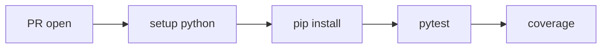

# Python Test Automation

> GitHub Actions 101 series (4/10)

<!-- a-grade-intro:begin -->

**Core question**: How do you make *pytest run automatically and reliably* on every PR?

> A test only becomes a *real test* once it *runs automatically*.

<!-- a-grade-intro:end -->

This is post 4 in the GitHub Actions 101 series.

## What You Will Learn

- Fast setup with *setup-python* + *pip cache*
- Surfacing *pytest results* as PR checks
- Measuring *coverage* and uploading to *Codecov*
- Multiple *Python versions* via *matrix*
- Five common pitfalls

## Why It Matters

Manual tests get *forgotten*. Only automation guarantees *the same trust* on every PR.

> *Slow CI* becomes *skipped CI*.

## Concept at a Glance



## Key Terms

- **setup-python**: installs *Python on the runner*.
- **pip cache**: caches *dependencies* for speed.
- **pytest**: the Python *test runner*.
- **coverage**: measures *test coverage*.
- **Codecov**: a coverage *reporting service*.

## Before/After

**Before**: `pytest` runs *only locally* and breakage shows up *after merge*.

**After**: a *Tests passed* check appears on every PR and *3.10/3.11/3.12* must all pass before merge.

## Hands-on: Test Automation in 5 Steps

### Step 1 — Python + cache

```yaml
- uses: actions/setup-python@v6
  with:
    python-version: "3.11"
    cache: "pip"
- run: pip install -r requirements.txt
```

### Step 2 — Run pytest and report

```yaml
- run: pytest -q --junitxml=report.xml
- uses: actions/upload-artifact@v7
  if: always()
  with:
    name: pytest-report
    path: report.xml
```

### Step 3 — Measure coverage

```yaml
- run: pytest --cov=src --cov-report=xml
- uses: codecov/codecov-action@v4
  with:
    files: coverage.xml
```

### Step 4 — Multi-version matrix

```yaml
strategy:
  matrix:
    python: ["3.10", "3.11", "3.12"]
steps:
  - uses: actions/setup-python@v6
    with:
      python-version: ${{ matrix.python }}
```

### Step 5 — Capture on failure

```yaml
- name: dump logs on failure
  if: failure()
  run: |
    cat pytest.log || true
```

## What to Notice in This Code

- One line of *cache: "pip"* trims *tens of seconds* of install time.
- *junit XML* integrates with *Test Reporter* tools.
- *if: always()* uploads artifacts even when steps fail.

## Five Common Mistakes

1. **`pip install` reinstalls everything every time.** Cache is missing.
2. **Using `pytest -v` in *production CI*.** Log output explodes.
3. **Tests depending on the *external network*.** Source of *flakiness*.
4. **No `junitxml`.** PR can't show *detailed* results.
5. **Coverage measured *with no goal*.** Numbers grow but quality doesn't.

## How This Shows Up in Production

Mature teams *parallelize with pytest-xdist*, manage *flaky tests* with *re-run* policy, and gate PRs on a *coverage threshold*.

## How a Senior Engineer Thinks

- *Slow tests* block *new code*.
- *Flaky tests* must be *quarantined*.
- *Coverage* is a *signal*, not a goal.
- *Matrix* must justify its *cost*.
- *Artifacts* preserve *debugging trails*.

## Checklist

- [ ] *pip cache* is enabled.
- [ ] *junit XML* is uploaded.
- [ ] *Coverage* is measured.
- [ ] *Matrix* is sized to need.

## Practice Problems

1. Add a *pytest workflow* to your project.
2. Enable a *3.11/3.12* matrix.
3. Fail PRs when *coverage drops below 80%*.

## Wrap-up and Next Steps

Test automation is the *heart of CI*. The next post covers *Lint and Type Check*.

<!-- toc:begin -->
- [What Is GitHub Actions?](./01-what-is-github-actions.md)
- [Workflows and Jobs](./02-workflow-and-job.md)
- [Understanding Triggers](./03-triggers.md)
- **Python Test Automation (current)**
- Lint and Type Check (upcoming)
- Build Artifacts (upcoming)
- Docker Build (upcoming)
- Deployment Automation (upcoming)
- Secret Management (upcoming)
- A Real-World CI/CD Pipeline (upcoming)
<!-- toc:end -->

## References

- [actions/setup-python](https://github.com/actions/setup-python)
- [pytest documentation](https://docs.pytest.org/)
- [coverage.py](https://coverage.readthedocs.io/)
- [Codecov GitHub Action](https://github.com/codecov/codecov-action)

Tags: GitHubActions, Python, Pytest, Testing, CICD
