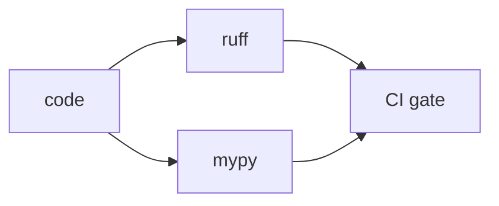

# Lint and Type Check

> GitHub Actions 101 series (5/10)

<!-- a-grade-intro:begin -->

**Core question**: How do you *stop spending review time* on style and type nits?

> *Let machines catch* what *machines should catch*.

<!-- a-grade-intro:end -->

This is post 5 in the GitHub Actions 101 series.

## What You Will Learn

- Combined *style + lint* with *Ruff*
- *Static type checks* with *Mypy*
- *Local + CI* parity via *pre-commit*
- Linting *PR diffs* only
- Five common pitfalls

## Why It Matters

*Lint and types* are the *first things reviewers catch*. Automating them frees *review* to focus on *design*.

> *Format gating* cuts *review time* in half.

## Concept at a Glance



## Key Terms

- **Linter**: catches *style/pattern violations* (ruff).
- **Formatter**: an *auto formatter* (ruff format).
- **Type checker**: a *static type* checker (mypy).
- **pre-commit**: a *commit-time* check hook.
- **Quality gate**: blocks merge on *failed quality*.

## Before/After

**Before**: reviewers nit *semicolons, line length, types* line by line.

**After**: PRs show *Lint passed* and *Type-check passed* automatically; review focuses on *logic*.

## Hands-on: Quality Gate in 5 Steps

### Step 1 — Ruff workflow

```yaml
- uses: actions/checkout@v4
- uses: actions/setup-python@v5
  with:
    python-version: "3.11"
- run: pip install ruff
- run: ruff check .
- run: ruff format --check .
```

### Step 2 — Add Mypy

```yaml
- run: pip install mypy
- run: mypy src/
```

### Step 3 — Centralize config (pyproject.toml)

```toml
[tool.ruff]
line-length = 100
[tool.ruff.lint]
select = ["E", "F", "I", "N", "UP"]

[tool.mypy]
strict = true
```

### Step 4 — Integrate pre-commit

```yaml
# .pre-commit-config.yaml
repos:
  - repo: https://github.com/astral-sh/ruff-pre-commit
    rev: v0.6.0
    hooks: [{id: ruff}, {id: ruff-format}]
```

### Step 5 — Lint diffs only (optional)

```yaml
- run: |
    git fetch origin ${{ github.base_ref }}
    ruff check $(git diff --name-only origin/${{ github.base_ref }} | grep '\.py$') || true
```

## What to Notice in This Code

- *ruff* alone replaces *flake8 + isort + black*.
- Enable *strict* mypy *from day one* — the migration cost only grows.
- *pre-commit* catches issues *before CI does*.

## Five Common Mistakes

1. **Only running CI; not installing locally.** Every PR breaks at CI.
2. **Loosening rules until they're meaningless.**
3. **Applying `mypy` *partially*.** *any* leaks across boundaries.
4. **Auto-committing `ruff format` per PR.** Merge conflicts.
5. **Scattering `pyproject.toml` config.** No source of truth.

## How This Shows Up in Production

Mature teams standardize *ruff + mypy + pre-commit* via a *template repo* and run identical checks in *pre-commit.ci* or *GitHub Actions*.

## How a Senior Engineer Thinks

- *Lint reduces debate*.
- *Types are documentation*.
- *Strict* by default; document any exception.
- *Local and CI* run *the same command*.
- *Auto-fix* is *feedback*, not *commits*.

## Checklist

- [ ] *ruff check + format* run in CI.
- [ ] *mypy strict* is on.
- [ ] The team has *pre-commit installed*.
- [ ] All config lives in *pyproject.toml*.

## Practice Problems

1. Add a *ruff + mypy* workflow.
2. Start *pre-commit* with *three hooks*.
3. Categorize the errors that appear once you enable *strict mypy*.

## Wrap-up and Next Steps

Quality gates *lighten the review load*. Next: *Build artifacts*.

<!-- toc:begin -->
- [What Is GitHub Actions?](./01-what-is-github-actions.md)
- [Workflows and Jobs](./02-workflow-and-job.md)
- [Understanding Triggers](./03-triggers.md)
- [Python Test Automation](./04-python-test-automation.md)
- **Lint and Type Check (current)**
- Build Artifacts (upcoming)
- Docker Build (upcoming)
- Deployment Automation (upcoming)
- Secret Management (upcoming)
- A Real-World CI/CD Pipeline (upcoming)
<!-- toc:end -->

## References

- [Ruff documentation](https://docs.astral.sh/ruff/)
- [Mypy documentation](https://mypy.readthedocs.io/)
- [pre-commit](https://pre-commit.com/)
- [astral-sh/ruff-pre-commit](https://github.com/astral-sh/ruff-pre-commit)

Tags: GitHubActions, Lint, Ruff, Mypy, QualityGate
