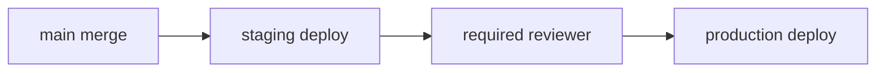

# Deployment Automation

> GitHub Actions 101 series (8/10)

<!-- a-grade-intro:begin -->

**Core question**: How do you express the policy "*staging is automatic, production needs approval*" in code?

> *Deploy frequently and small*; gate the *risky parts*.

<!-- a-grade-intro:end -->

This is post 8 in the GitHub Actions 101 series.

## What You Will Learn

- *GitHub Environments* and *required reviewers*
- *OIDC* for short-lived *AWS/GCP* credentials
- The *staging -> production* promotion pattern
- A *rollback* workflow
- Five common pitfalls

## Why It Matters

*Manual deploys* are the cause of *weekend pages*. Automation gives you *reproducibility*, not just speed.

> If the *deployment runbook* lives only in someone's head, an *incident is coming*.

## Concept at a Glance



## Key Terms

- **Environment**: GitHub's *deployment environment* (staging, production).
- **Required reviewers**: per-environment *approvers*.
- **OIDC**: a *short-lived token* trust with the cloud.
- **Promotion**: moving *staging to production*.
- **Rollback**: returning to the *previous deployment*.

## Before/After

**Before**: someone runs `kubectl apply` *locally*. No record of what was deployed.

**After**: PR merge -> *automatic staging deploy* -> *approval* -> *production*. Everything traceable in *Actions logs*.

## Hands-on: Deploy Automation in 5 Steps

### Step 1 — Define environments (UI)

```text
Repo > Settings > Environments
- staging: no protection rules
- production: 1 required reviewer, 5-min wait timer
```

### Step 2 — Auto-deploy to staging

```yaml
deploy-staging:
  needs: build
  environment: staging
  runs-on: ubuntu-latest
  steps:
    - run: kubectl apply -f k8s/staging/
```

### Step 3 — Production approval gate

```yaml
deploy-production:
  needs: deploy-staging
  environment:
    name: production
    url: https://app.example.com
  runs-on: ubuntu-latest
  steps:
    - run: kubectl apply -f k8s/production/
```

### Step 4 — OIDC for AWS short-lived credentials

```yaml
permissions:
  id-token: write
  contents: read
steps:
  - uses: aws-actions/configure-aws-credentials@v4
    with:
      role-to-assume: arn:aws:iam::123456789012:role/gha-deploy
      aws-region: us-west-2
  - run: aws s3 sync ./build s3://my-bucket
```

### Step 5 — Rollback workflow

```yaml
on:
  workflow_dispatch:
    inputs:
      sha:
        description: "git sha to roll back to"
        required: true
jobs:
  rollback:
    environment: production
    runs-on: ubuntu-latest
    steps:
      - run: ./deploy.sh ${{ inputs.sha }}
```

## What to Notice in This Code

- A single *environment* line attaches an *approval gate*.
- *OIDC* eliminates *long-lived keys*.
- *Rollback* is also *codified as a workflow*.

## Five Common Mistakes

1. **No *required reviewers* on `production`.** Anyone can deploy.
2. **Storing long-lived *AWS keys* in secrets.** Leak risk.
3. **Rollback procedure *only in docs*.** Unfindable at 3 AM.
4. **Different manifests for staging and production.** Drift creeps in.
5. **No deploy notifications to *Slack/Issues*.** History is lost.

## How This Shows Up in Production

Mature teams chain *PR merge -> canary -> blue/green -> full rollout* in *one workflow*, with *automated metric checks* against Datadog/Grafana.

## How a Senior Engineer Thinks

- *Deploys are code*; *manual commands leave no trace*.
- *Production* always has *gates*.
- *Short-lived credentials* are the standard.
- *Rollback is a workflow*, too.
- *staging == production* — same manifest.

## Checklist

- [ ] *Environments* are defined.
- [ ] *production* has *required reviewers*.
- [ ] *OIDC* authenticates to the cloud.
- [ ] A *rollback* workflow exists.

## Practice Problems

1. Define a *staging* environment that auto-deploys on *main push*.
2. Add an *approval gate* to *production*.
3. Build a *workflow_dispatch* rollback workflow.

## Wrap-up and Next Steps

Deployment automation defines your *cost of change*. Next: *Secret management*.

<!-- toc:begin -->
- [What Is GitHub Actions?](./01-what-is-github-actions.md)
- [Workflows and Jobs](./02-workflow-and-job.md)
- [Understanding Triggers](./03-triggers.md)
- [Python Test Automation](./04-python-test-automation.md)
- [Lint and Type Check](./05-lint-and-typecheck.md)
- [Build Artifacts](./06-build-artifact.md)
- [Docker Build](./07-docker-build.md)
- **Deployment Automation (current)**
- Secret Management (upcoming)
- A Real-World CI/CD Pipeline (upcoming)
<!-- toc:end -->

## References

- [Using environments for deployment](https://docs.github.com/actions/deployment/targeting-different-environments/using-environments-for-deployment)
- [Configuring OpenID Connect in AWS](https://docs.github.com/actions/deployment/security-hardening-your-deployments/configuring-openid-connect-in-amazon-web-services)
- [aws-actions/configure-aws-credentials](https://github.com/aws-actions/configure-aws-credentials)
- [google-github-actions/auth](https://github.com/google-github-actions/auth)

Tags: GitHubActions, Deploy, Environments, OIDC, CICD
