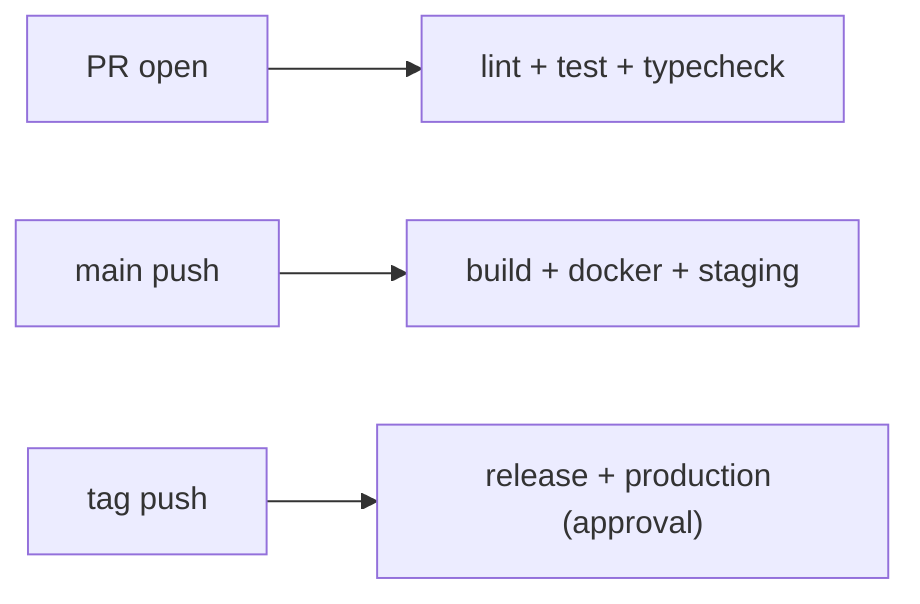

# A Real-World CI/CD Pipeline

> GitHub Actions 101 series (10/10)

<!-- a-grade-intro:begin -->

**Core question**: How do you weave *triggers, tests, lint, artifacts, Docker, deploy, and secrets* into *one pipeline*?

> *A good pipeline is a *sum of small steps*. Each step stays simple; the composition is explicit.*

<!-- a-grade-intro:end -->

This is the final post in the GitHub Actions 101 series.

## What You Will Learn

- *Responsibility split* across *PR, main, and tag*
- *Reusable workflows* (`workflow_call`) to *eliminate duplication*
- *Composite actions* for grouping steps
- The *team-template repo* pattern
- Five common pitfalls

## Why It Matters

The parts you have learned only improve *DORA* (deploy frequency, lead time, change-failure rate, MTTR) when they sit *together* in one place.

> *The pieces make you *fast*. The composition keeps you *fast*.*

## Concept at a Glance



## Key Terms

- **Reusable workflow**: a *shared workflow* invoked via `workflow_call`.
- **Composite action**: several steps wrapped as one *reusable step*.
- **Template repo**: a repository teams use as a *starting point*.
- **DORA metrics**: the four delivery performance metrics.
- **Promotion**: moving from staging to production.

## Before/After

**Before**: every repo has a *similar but slightly different* workflow. Fix one and the *others drift*.

**After**: a single *shared reusable workflow*. Each repo holds only a *thin caller*. *One change rolls out org-wide*.

## Hands-on: A Real Pipeline in 5 Steps

### Step 1 — Define a reusable workflow

```yaml
# .github/workflows/_ci.yml in org/template-repo
on:
  workflow_call:
    inputs:
      python-version:
        type: string
        default: "3.12"
jobs:
  ci:
    runs-on: ubuntu-latest
    steps:
      - uses: actions/checkout@v4
      - uses: actions/setup-python@v5
        with:
          python-version: ${{ inputs.python-version }}
      - run: pip install -e ".[dev]"
      - run: ruff check . && mypy . && pytest -q
```

### Step 2 — PR stage (lint + test)

```yaml
# .github/workflows/pr.yml
on:
  pull_request:
jobs:
  ci:
    uses: org/template-repo/.github/workflows/_ci.yml@v1
    with:
      python-version: "3.12"
```

### Step 3 — main stage (build + docker + staging)

```yaml
on:
  push:
    branches: [main]
jobs:
  ci:
    uses: org/template-repo/.github/workflows/_ci.yml@v1
  docker:
    needs: ci
    uses: org/template-repo/.github/workflows/_docker.yml@v1
  deploy-staging:
    needs: docker
    environment: staging
    runs-on: ubuntu-latest
    steps:
      - run: kubectl apply -f k8s/staging/
```

### Step 4 — tag stage (release + production)

```yaml
on:
  push:
    tags: ["v*"]
jobs:
  release:
    runs-on: ubuntu-latest
    steps:
      - uses: softprops/action-gh-release@v2
  deploy-prod:
    needs: release
    environment: production  # required reviewers ON
    runs-on: ubuntu-latest
    steps:
      - run: kubectl apply -f k8s/production/
```

### Step 5 — Wrap steps with a composite action

```yaml
# .github/actions/setup-app/action.yml
runs:
  using: composite
  steps:
    - uses: actions/setup-python@v5
      with: { python-version: "3.12" }
    - run: pip install -e ".[dev]"
      shell: bash
```

## What to Notice in This Code

- *PR* is for *feedback*, *main* is for *deployment*, *tag* is for *release*.
- *Reusable workflows* are *version-pinned* (`@v1`) so upstream changes do not break you.
- The *production environment* is the *final gate*.

## Five Common Mistakes

1. **Running *full e2e* on every PR.** Feedback now takes 30 minutes.
2. **Deploying *straight to production* from main.** Skipping canary and staging.
3. **Calling reusable workflows with `@main`.** One day it *breaks silently*.
4. **Deploying to *production* without a tag.** No way to trace what shipped.
5. **Composite actions with *no input validation*.** Bad values pass through quietly.

## How This Shows Up in Production

A platform team owns an *org-wide template repo* so every service shares the same *CI/CD skeleton*, while *DORA metrics* are collected automatically by *Sleuth/LinearB*.

## How a Senior Engineer Thinks

- *The trigger decides the responsibility*.
- *Common goes into reusable; differences stay in the caller*.
- *Never give up the production gate*.
- *Templates are code, not wiki pages*.
- *Optimize for what makes DORA improve*.

## Checklist

- [ ] *PR, main, and tag* stages are separated.
- [ ] Common steps are extracted into *reusable workflows*.
- [ ] *production* has *required reviewers*.
- [ ] Reusable workflows are called with a *pinned version*.

## Practice Problems

1. Write a *PR-stage* workflow that runs only *lint, test, typecheck*.
2. Create a *reusable workflow* and call it from two repos with the same CI.
3. Build a workflow where a *tag push* triggers *production deploy* behind an *approval gate*.

## Wrap-up and Next Steps

If you followed along, you can handle *95% of real-world CI/CD*. From here, deepen *runtime* and *operations* with *Docker 101*, *Kubernetes 101*, and *SRE 101*.

<!-- toc:begin -->
- [What Is GitHub Actions?](./01-what-is-github-actions.md)
- [Workflows and Jobs](./02-workflow-and-job.md)
- [Understanding Triggers](./03-triggers.md)
- [Python Test Automation](./04-python-test-automation.md)
- [Lint and Type Check](./05-lint-and-typecheck.md)
- [Build Artifacts](./06-build-artifact.md)
- [Docker Build](./07-docker-build.md)
- [Deployment Automation](./08-deploy-automation.md)
- [Secret Management](./09-secret-management.md)
- **A Real-World CI/CD Pipeline (current)**
<!-- toc:end -->

## References

- [Reusing workflows](https://docs.github.com/actions/using-workflows/reusing-workflows)
- [Creating a composite action](https://docs.github.com/actions/creating-actions/creating-a-composite-action)
- [DORA - Accelerate State of DevOps](https://dora.dev/)
- [Creating a template repository](https://docs.github.com/repositories/creating-and-managing-repositories/creating-a-template-repository)

Tags: GitHubActions, Pipeline, CICD, Capstone, ReusableWorkflow
