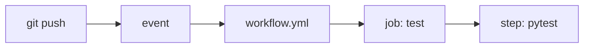

# GitHub Actions란 무엇인가?

처음 GitHub Actions를 보면 “GitHub 안에 CI가 하나 들어 있구나” 정도로 이해하기 쉽습니다. 출발점으로는 맞는 말입니다. 하지만 이 정도 설명만으로는 왜 어떤 팀은 배포 속도가 빨라지고, 어떤 팀은 YAML만 늘어나는데도 여전히 수동 작업에서 벗어나지 못하는지 설명되지 않습니다.

이 글은 GitHub Actions 101 시리즈의 첫 번째 글입니다. 여기서는 GitHub Actions를 단순한 자동화 버튼이 아니라, 코드 저장소 바로 옆에서 반복 작업을 실행하는 실행 플랫폼으로 이해해 보겠습니다.

## 이 글에서 다룰 문제

> GitHub Actions의 핵심은 “사람이 기억해서 실행하던 절차를 저장소 안의 코드로 옮기는 것”입니다. 한 번의 push가 테스트, 검사, 배포의 출발점이 되면 팀의 속도와 품질 기준이 함께 올라갑니다.

- GitHub Actions는 정확히 무엇이고 CI/CD에서 어디에 놓일까요?
- Workflow, Job, Step은 어떤 계층 구조로 이해해야 할까요?
- 첫 워크플로우는 어떤 최소 구성으로 시작하는 편이 좋을까요?
- Jenkins나 CircleCI 같은 도구와 비교할 때 어떤 장점이 있을까요?
- 입문 단계에서 가장 자주 하는 실수는 무엇일까요?

## 왜 중요한가

CI/CD는 팀의 속도만이 아니라 신뢰의 기준을 만듭니다. 로컬에서만 테스트를 돌리는 팀은 “나는 통과했는데요”라는 문장에 자주 의존하게 됩니다. 반대로 저장소가 직접 테스트와 검증을 실행하는 팀은 “이 커밋은 같은 절차를 통과했다”는 공통 기반을 갖게 됩니다.

GitHub Actions가 강한 이유는 별도 서버를 운영하지 않아도 이 기준을 바로 만들 수 있기 때문입니다. 저장소에 `.github/workflows/*.yml` 파일을 추가하는 순간 자동화가 코드의 일부가 됩니다. 서버를 따로 붙들고 있지 않아도 되고, 작업 이력도 PR과 커밋 옆에 그대로 남습니다.

## 한눈에 보는 실행 흐름



이 그림에서 먼저 잡아야 할 감각은 단순합니다. 이벤트가 워크플로우를 깨우고, 워크플로우 안에서 잡이 돌고, 각 잡 안에서 스텝이 순서대로 실행됩니다. 실무에서 “어디를 고쳐야 하지?”라는 질문이 나올 때도 결국 이 계층을 따라가면 됩니다.

## 핵심 용어를 먼저 정리하겠습니다

| 용어 | 뜻 | 운영에서 중요한 이유 |
| --- | --- | --- |
| 워크플로 | `.github/workflows/*.yml`에 있는 자동화 단위 | 자동화의 진입점과 범위를 결정합니다 |
| 이벤트 | 워크플로를 시작시키는 계기 | push, PR, schedule처럼 실행 시점을 정합니다 |
| 잡 | 워크플로 안의 실행 단위 | 기본적으로 병렬 실행되므로 속도와 구조를 좌우합니다 |
| 스텝 | 잡 안의 개별 명령 또는 액션 호출 | 실제 설치, 테스트, 빌드 작업이 여기서 일어납니다 |
| 러너 | 잡이 실행되는 머신 | ubuntu-latest 같은 실행 환경을 정합니다 |
| 액션 | 재사용 가능한 스텝 | `actions/checkout`처럼 반복되는 작업을 표준화합니다 |

입문자가 가장 많이 헷갈리는 부분은 워크플로와 잡을 같은 것으로 보는 것입니다. 워크플로는 상위 컨테이너이고, 잡은 그 안에서 돌아가는 작업 단위입니다. 이 구분을 잡고 시작하면 뒤에서 병렬 처리나 의존성 설정을 배울 때 훨씬 덜 흔들립니다.

## 자동화 전과 후를 비교해 보겠습니다

자동화가 없을 때는 PR마다 개발자가 로컬에서 테스트를 돌리고, 결과를 말로 공유하고, 누군가가 배포 여부를 수동으로 판단합니다. 이 구조는 작은 저장소에서는 버틸 수 있어 보여도 팀이 커지면 금방 불안정해집니다. 같은 테스트를 누군가는 돌리고, 누군가는 건너뛰며, 누군가는 오래된 가상환경에서 실행하기 때문입니다.

자동화가 붙으면 기준이 바뀝니다. PR을 열면 저장소가 동일한 환경에서 테스트를 실행하고, 결과가 체크로 남습니다. 사람이 기억해서 수행하던 절차가 저장소의 기본 동작으로 바뀌는 것입니다. 저는 GitHub Actions의 가치를 바로 이 전환에서 봅니다.

## 첫 워크플로우를 5단계로 만들어 보겠습니다

### 1단계 — 디렉터리 만들기

```bash
mkdir -p .github/workflows
```

GitHub Actions는 워크플로 파일의 위치가 정확해야만 인식합니다. 첫 단계가 단순해 보여도, 실제로는 “자동화 파일도 저장소 규약 안에 둔다”는 규칙을 배우는 지점입니다.

### 2단계 — 워크플로우 파일 작성

```yaml
# .github/workflows/ci.yml
name: ci
on:
  push:
    branches: [main]
  pull_request:

jobs:
  test:
    runs-on: ubuntu-latest
    steps:
      - uses: actions/checkout@v4
      - uses: actions/setup-python@v5
        with:
          python-version: "3.11"
      - run: pip install -r requirements.txt
      - run: pytest -q
```

이 예제는 작지만 GitHub Actions의 최소 골격을 모두 보여 줍니다. `on:`은 언제 실행할지, `jobs:`는 무엇을 실행할지, `runs-on:`은 어디서 실행할지, `steps:`는 어떤 순서로 실행할지를 정의합니다.

### 3단계 — push로 실행시키기

```bash
git add .github/workflows/ci.yml
git commit -m "ci: add first workflow"
git push
```

자동화는 파일만 써 두고 끝나는 기능이 아닙니다. 저장소에 반영되어 실제 이벤트가 발생해야 비로소 살아납니다. 그래서 첫 워크플로우를 배울 때는 반드시 한 번 직접 push해서 실행 로그를 보는 편이 좋습니다.

### 4단계 — Actions 탭에서 결과 확인

```text
Repo > Actions tab
- The workflow run log appears.
- Each step prints its output and time.
```

여기서 중요한 점은 “성공했다”보다 “무슨 순서로 무슨 로그가 나왔는지 읽을 수 있다”입니다. 앞으로 CI가 깨질 때는 대부분 이 실행 로그에서 원인을 찾게 됩니다.

### 5단계 — PR 체크로 연결하기

```text
In branch protection, enable "Require status checks to pass."
A failed test now blocks merge.
```

이 단계까지 와야 GitHub Actions가 단순한 실행기가 아니라 팀 규칙의 일부가 됩니다. 실패한 테스트가 머지를 막기 시작하면, 자동화는 권고가 아니라 품질 게이트로 작동합니다.

## 이 코드에서 먼저 봐야 할 점

- YAML 파일 하나가 자동화 전체를 정의합니다.
- `actions/checkout`은 거의 모든 워크플로우의 첫 단계입니다.
- `runs-on`은 실행 환경 선택이므로 속도, 호환성, 비용과 연결됩니다.

특히 `checkout`을 빼먹는 실수는 아주 흔합니다. 러너에는 기본적으로 여러분 저장소 코드가 없기 때문에, 코드를 먼저 가져오지 않으면 뒤의 설치나 테스트 단계가 모두 실패합니다.

## 자주 하는 실수 다섯 가지

1. 워크플로 파일을 `.github/workflows/` 밖에 둡니다.
2. `on:`을 빼먹어서 아무 이벤트에도 반응하지 않게 만듭니다.
3. `actions/checkout` 없이 바로 명령을 실행합니다.
4. 무거운 빌드나 배포까지 모든 PR에서 한꺼번에 실행합니다.
5. 비밀값을 YAML에 직접 적습니다.

입문 단계에서는 “어차피 작은 프로젝트인데”라는 이유로 모든 것을 한 파일에 몰아넣기 쉽습니다. 하지만 처음부터 테스트 자동화와 배포 자동화를 같은 무게로 다루기 시작하면, 나중에 분리할 때 훨씬 고생합니다.

## 실무에서는 이렇게 생각합니다

성숙한 팀은 test, lint, typecheck, build, deploy를 서로 다른 책임으로 분리합니다. 그리고 워크플로우 파일도 애플리케이션 코드와 똑같이 리뷰합니다. 저는 이 지점이 중요하다고 봅니다. YAML도 결국 운영 동작을 바꾸는 코드이기 때문입니다.

또 하나 기억할 점은 실행 시간입니다. 워크플로우가 길어질수록 개발자는 피드백을 덜 신뢰하게 됩니다. 자동화의 목적은 많이 돌리는 것이 아니라, 필요한 검사를 빠르고 일관되게 돌리는 것입니다.

## 체크리스트

- [ ] `.github/workflows/` 디렉터리가 있다.
- [ ] push와 PR 모두에서 트리거된다.
- [ ] 결과가 PR 체크로 보인다.
- [ ] 비밀값은 `secrets.*`로만 참조한다.

## 연습 문제

1. `Hello World`만 출력하는 가장 작은 워크플로우를 만들어 보세요.
2. Ubuntu와 macOS에서 모두 실행되는 매트릭스를 추가해 보세요.
3. 테스트를 일부러 깨뜨린 뒤 PR 체크가 어떻게 실패하는지 확인해 보세요.

## 정리

GitHub Actions는 코드 옆에 붙어 있는 자동화 실행기입니다. 저장소 이벤트를 받아 워크플로우를 깨우고, 워크플로우 안의 잡과 스텝이 실제 검증과 배포 절차를 수행합니다. 이 구조를 한 번 이해해 두면 뒤의 모든 주제는 결국 더 정교한 워크플로우 설계 문제로 연결됩니다.

다음 글에서는 워크플로우 안쪽 구조를 더 자세히 보겠습니다. 특히 잡을 어떻게 나누고, 어떤 작업을 병렬로 돌리며, 어떤 작업에는 순서를 강제해야 하는지를 다룹니다.

<!-- toc:begin -->
- **GitHub Actions란 무엇인가? (현재 글)**
- Workflow와 Job (예정)
- Trigger 이해하기 (예정)
- Python 테스트 자동화 (예정)
- Lint와 Type Check (예정)
- 빌드 아티팩트 (예정)
- Docker 빌드 (예정)
- 배포 자동화 (예정)
- Secret 관리 (예정)
- 실전 CI/CD 파이프라인 (예정)
<!-- toc:end -->

## 참고 자료

- [GitHub Actions Documentation](https://docs.github.com/actions)
- [Workflow syntax](https://docs.github.com/actions/using-workflows/workflow-syntax-for-github-actions)
- [Awesome Actions](https://github.com/sdras/awesome-actions)
- [Actions Marketplace](https://github.com/marketplace?type=actions)

Tags: GitHubActions, CICD, Automation, DevOps, Workflow
