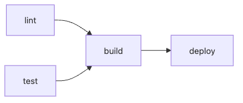

# Workflow와 Job

GitHub Actions를 조금만 써 보면 금방 이런 고민이 생깁니다. “테스트와 린트를 같이 돌려도 될까?”, “배포는 테스트가 끝난 뒤에만 돌게 하려면 어떻게 써야 하지?”, “한 파일 안에 다 넣으면 되나, 잡을 나눠야 하나?” 이 질문들은 문법보다 구조 설계와 더 가깝습니다.

이 글은 GitHub Actions 101 시리즈의 2번째 글입니다. 여기서는 워크플로, 잡, 스텝이 어떻게 계층을 이루는지부터 시작해, 병렬성과 의존성을 어떤 기준으로 설계해야 하는지 정리해 보겠습니다.

## 이 글에서 다룰 문제

> 워크플로우는 자동화의 껍데기이고, 잡 그래프가 실제 파이프라인입니다. 빠르게 돌릴 일은 병렬로 풀고, 순서가 필요한 일만 `needs`로 묶어야 속도와 안전을 함께 잡을 수 있습니다.

- Workflow, Job, Step은 각각 무엇을 담당할까요?
- `needs`는 왜 단순한 옵션이 아니라 파이프라인 설계 도구일까요?
- `matrix`는 언제 유용하고 언제 비용 폭탄이 될까요?
- 잡 사이에 값을 전달할 때 `outputs`는 어디까지 써야 할까요?
- 잡을 잘못 나누면 어떤 운영 문제가 생길까요?

## 왜 중요한가

모든 작업을 한 잡에 넣으면 이해는 쉬워 보여도 피드백이 느려집니다. 반대로 아무 기준 없이 잘게 쪼개면 의존성이 흐려지고, 어떤 순서로 무엇이 실행되는지 읽기 어려워집니다. 결국 좋은 CI는 “적당히 병렬적이고, 필요한 곳만 순차적인 구조”를 만들어야 합니다.

실무에서는 이 설계가 곧 개발자 경험으로 이어집니다. 린트 결과는 30초 안에 받고, 테스트는 2분 안에 받고, 배포는 그 이후에만 시작되게 만들 수 있다면 팀의 리듬이 달라집니다. 저는 Job 그래프를 잘 그리는 능력이 GitHub Actions 실력을 크게 갈라놓는다고 봅니다.

## 한눈에 보는 잡 그래프



*lint와 test가 병렬로 실행되고 build와 deploy로 이어지는 잡 그래프*

이 그림은 단순하지만 핵심을 잘 보여 줍니다. lint와 test는 서로 독립이므로 병렬로 돌릴 수 있고, build는 그 둘이 성공한 뒤에만 시작하면 됩니다. deploy는 build가 끝난 뒤에만 허용해야 하므로 마지막에 놓입니다.

## 먼저 용어를 정확히 구분하겠습니다

| 용어 | 의미 | 설계 포인트 |
| --- | --- | --- |
| 워크플로 | YAML 파일 하나에 담긴 자동화 단위 | 어떤 이벤트에서 어떤 파이프라인이 시작되는지 정합니다 |
| 잡 | 워크플로 안의 실행 단위 | 기본값이 병렬 실행이라는 점이 중요합니다 |
| 스텝 | 잡 안의 명령 또는 액션 호출 | 같은 잡 안에서는 순서대로 실행됩니다 |
| `needs` | 잡 간 의존성 선언 | 실행 순서를 명시해 그래프를 만듭니다 |
| `matrix` | 변수 조합으로 잡을 복제하는 기능 | 환경 조합을 넓히되 비용을 통제해야 합니다 |
| `outputs` | 앞선 잡이 다음 잡으로 넘기는 값 | 문자열 위주로 단순하게 유지하는 편이 좋습니다 |

여기서 먼저 잡아야 할 감각은 이 구분입니다. 스텝은 한 잡 안에서 직렬 실행되고, 잡은 기본적으로 병렬 실행됩니다. 따라서 “같이 돌릴 수 있는가?”는 잡 경계를 묻는 질문이고, “반드시 이 다음에 돌아야 하는가?”는 `needs`를 묻는 질문입니다.

## 자동화 전과 후를 비교해 보겠습니다

모든 일을 한 잡에 넣은 파이프라인은 시작은 편합니다. 파일 수도 적고, 흐름도 한눈에 들어옵니다. 하지만 린트 한 줄 때문에 테스트와 빌드가 끝날 때까지 기다려야 하고, 중간 어느 지점에서 실패했는지 읽기도 불편합니다.

반대로 lint, test, build를 나누고, build에만 `needs: [lint, test]`를 걸면 피드백 시간이 달라집니다. 실패도 더 빨리 드러나고, 성공했을 때만 다음 단계로 넘어가는 구조가 자연스럽게 잡힙니다. 잡 분해는 단순한 YAML 꾸미기가 아니라 피드백 시간을 설계하는 일입니다.

## 잡 그래프를 5단계로 만들어 보겠습니다

### 1단계 — 잡을 나누기

```yaml
jobs:
  lint:
    runs-on: ubuntu-latest
    steps:
      - uses: actions/checkout@v6
      - run: ruff check .

  test:
    runs-on: ubuntu-latest
    steps:
      - uses: actions/checkout@v6
      - run: pytest -q
```

먼저 독립적으로 돌릴 수 있는 일을 나눕니다. 린트와 테스트는 대부분 서로 결과를 공유하지 않으므로 좋은 병렬 후보입니다.

### 2단계 — `needs`로 순서 만들기

```yaml
  build:
    runs-on: ubuntu-latest
    needs: [lint, test]
    steps:
      - uses: actions/checkout@v6
      - run: python -m build
```

`needs`는 “이 잡이 어떤 성공을 전제로 시작되는가”를 드러냅니다. 문법은 짧지만, 사실상 파이프라인의 안전장치입니다.

### 3단계 — `matrix`로 환경을 늘리기

```yaml
  test:
    strategy:
      matrix:
        python: ["3.10", "3.11", "3.12"]
    runs-on: ubuntu-latest
    steps:
      - uses: actions/checkout@v6
      - uses: actions/setup-python@v6
        with:
          python-version: ${{ matrix.python }}
      - run: pytest -q
```

매트릭스는 같은 잡을 여러 환경에 복제합니다. 다만 Python 버전 세 개에 운영체제 두 개를 곱하는 순간 여섯 개 실행으로 늘어나므로, 필요 이상으로 크게 잡으면 곧 비용과 대기 시간이 커집니다.

### 4단계 — `outputs`로 값 넘기기

```yaml
  build:
    runs-on: ubuntu-latest
    outputs:
      version: ${{ steps.v.outputs.version }}
    steps:
      - id: v
        run: echo "version=1.2.3" >> "$GITHUB_OUTPUT"

  deploy:
    needs: build
    runs-on: ubuntu-latest
    steps:
      - run: echo "deploy ${{ needs.build.outputs.version }}"
```

잡 사이 값 전달은 꼭 필요할 때만 작게 쓰는 편이 좋습니다. 문자열 한두 개는 깔끔하지만, 복잡한 객체를 억지로 넘기기 시작하면 파이프라인이 빠르게 지저분해집니다.

### 5단계 — 실패 정책 정하기

```yaml
  flaky:
    continue-on-error: true
    runs-on: ubuntu-latest
    steps:
      - run: pytest tests/flaky.py
```

이 옵션은 실패를 무시하는 도구가 아니라, 어떤 실패를 경고 수준으로 다룰지 결정하는 정책입니다. 저는 이 값을 남용하기보다, 꼭 필요한 경우에만 이유를 문서화해서 쓰는 편을 권합니다.

## 이 코드에서 먼저 봐야 할 점

- `needs`는 잡 사이에 방향을 가진 그래프를 만듭니다.
- `matrix`는 편리하지만 조합이 커질수록 비용이 기하급수적으로 늘어납니다.
- `outputs`는 단순한 문자열 전달에 가장 잘 맞습니다.

즉, 잡 설계는 “얼마나 많이 나눌까”보다 “무엇을 독립 실행 가능한 단위로 볼까”를 묻는 작업입니다. 이 기준이 흔들리면 YAML만 길어지고 읽기는 더 어려워집니다.

## 자주 하는 실수 다섯 가지

1. 모든 스텝을 한 잡에 몰아넣어 병렬성을 잃습니다.
2. `needs`를 생략해 의존성을 암묵적으로 만듭니다.
3. 매트릭스를 지나치게 크게 잡아 실행 비용을 키웁니다.
4. `outputs`에 복잡한 구조를 넣어 직렬화 문제를 만듭니다.
5. `if:` 조건 없이 불필요한 잡을 매번 실행합니다.

특히 세 번째와 다섯 번째는 비용과 직접 연결됩니다. 잡 그래프를 잘못 그리면 느리기만 한 것이 아니라, 러너 사용량도 빠르게 불어납니다.

## 실무에서는 이렇게 생각합니다

성숙한 팀은 PR에서 빠른 lint와 test만 돌리고, main push에서 더 넓은 matrix와 build를 실행하는 식으로 두 층 구조를 만듭니다. 이는 GitHub Actions 문법만 아는 수준을 넘어, 피드백과 비용을 구분해서 설계한다는 이야기입니다.

또한 `needs`는 기술적 의존성만이 아니라 비즈니스 의도를 표현하는 도구이기도 합니다. 예를 들어 “보안 검사 통과 전에는 배포 금지”라는 규칙도 결국 잡 그래프에 녹여 내야 지속됩니다.

## 체크리스트

- [ ] lint, test, build가 분리돼 있다.
- [ ] `needs`로 의존성이 명시돼 있다.
- [ ] `matrix` 크기가 비용을 고려해 정해졌다.
- [ ] `outputs`는 단순한 문자열 위주로 쓴다.

## 연습 문제

1. lint, test, build로 이루어진 3개 잡 그래프를 직접 만들어 보세요.
2. Python 3.11과 3.12를 테스트하는 매트릭스를 추가해 보세요.
3. build 잡이 만든 버전 문자열을 deploy 잡에서 읽어 보세요.

## 정리

워크플로는 자동화의 바깥 틀이고, 잡 그래프가 파이프라인의 실제 뼈대입니다. 무엇을 병렬로 돌릴지, 무엇에 순서를 걸지, 어떤 값만 다음 단계로 넘길지 정하는 일이 곧 좋은 CI 설계입니다.

다음 글에서는 이 그래프가 언제 실행돼야 하는지, 즉 트리거 설계를 다룹니다. 좋은 잡 구조도 적절한 시점에만 실행될 때 비로소 가치가 있습니다.

<!-- toc:begin -->
- [GitHub Actions란 무엇인가?](./01-what-is-github-actions.md)
- **Workflow와 Job (현재 글)**
- Trigger 이해하기 (예정)
- Python 테스트 자동화 (예정)
- Lint와 Type Check (예정)
- 빌드 아티팩트 (예정)
- Docker 빌드 (예정)
- 배포 자동화 (예정)
- Secret 관리 (예정)
- 실전 CI/CD 파이프라인 (예정)
<!-- toc:end -->

## 참고 자료

- [Workflow syntax](https://docs.github.com/actions/using-workflows/workflow-syntax-for-github-actions)
- [Using jobs in a workflow](https://docs.github.com/actions/using-jobs/using-jobs-in-a-workflow)
- [Using a matrix for jobs](https://docs.github.com/actions/using-jobs/using-a-matrix-for-your-jobs)
- [Defining outputs for jobs](https://docs.github.com/actions/using-jobs/defining-outputs-for-jobs)

Tags: GitHubActions, Workflow, Job, Matrix, CICD
