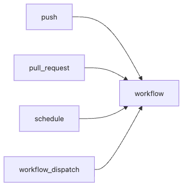

# Trigger 이해하기

자동화가 늘어나면 곧 새로운 문제가 생깁니다. “왜 문서 한 줄 바꿨는데 전체 빌드가 도는 거지?”, “왜 같은 PR에 push를 여러 번 하니까 대기열이 꽉 차지?”, “야간 검사는 한국 시간 새벽 2시에 돌고 싶은데 왜 엉뚱한 시각에 실행되지?” GitHub Actions에서 트리거 설계는 비용과 소음을 함께 다루는 문제입니다.

이 글은 GitHub Actions 101 시리즈의 3번째 글입니다. 여기서는 push, pull_request, schedule, workflow_dispatch를 어떻게 나눠 써야 하는지, 그리고 paths 필터와 concurrency로 불필요한 실행을 어떻게 줄이는지 살펴보겠습니다.

## 이 글에서 다룰 문제

> 좋은 워크플로우는 “많이” 도는 워크플로우가 아니라 “맞는 순간에만” 도는 워크플로우입니다. 트리거를 잘 설계해야 비용이 줄고, 결과에 대한 신뢰는 오히려 올라갑니다.

- push와 pull_request는 어떤 차이로 써야 할까요?
- schedule은 왜 로컬 시간이 아니라 UTC로 이해해야 할까요?
- workflow_dispatch는 언제 유용하고 무엇을 문서화해야 할까요?
- paths, branches 필터는 어떤 비용을 줄여 줄까요?
- concurrency가 없으면 어떤 중복 실행 문제가 생길까요?

## 왜 중요한가

트리거 설계는 실행 시점을 고르는 일이지만, 실제로는 팀의 비용 정책과도 연결됩니다. 모든 커밋마다 전체 테스트, 전체 빌드, 전체 배포 검증이 한꺼번에 돌면 처음에는 든든해 보여도 곧 러너 사용량과 대기 시간이 급격히 늘어납니다. 그 결과 개발자는 체크 결과를 기다리지 않고 머지하려는 유혹을 받게 됩니다.

반대로 PR에서는 빠른 검증만 돌리고, main push에서는 더 무거운 빌드와 배포 단계를 붙이고, 야간에는 오래 걸리는 e2e만 돌리면 같은 저장소도 훨씬 건강하게 운영할 수 있습니다. 트리거는 문법이 아니라 실행 정책입니다.

## 한눈에 보는 트리거 구조



*push, pull_request, schedule, workflow_dispatch가 하나의 워크플로우로 연결되는 트리거 구조*

이 그림은 GitHub Actions가 단일 입력만 받는 도구가 아니라는 점을 보여 줍니다. 같은 워크플로우라도 어떤 이벤트에서 시작되느냐에 따라 역할이 완전히 달라질 수 있습니다.

## 핵심 용어를 정리하겠습니다

| 용어 | 뜻 | 실무 포인트 |
| --- | --- | --- |
| `push` | 브랜치에 커밋이 들어왔을 때 | main에 반영된 코드 기준 검증에 자주 씁니다 |
| `pull_request` | PR이 열리거나 갱신될 때 | 코드 리뷰 전 빠른 피드백용으로 적합합니다 |
| `schedule` | cron 기반 주기 실행 | UTC 기준이라 시간 변환이 중요합니다 |
| `workflow_dispatch` | 수동 실행 버튼 | 배포, 롤백, 점검 작업에 자주 씁니다 |
| `paths` / `branches` | 경로나 브랜치 기준 필터 | 불필요한 실행을 줄이는 가장 쉬운 수단입니다 |
| `concurrency` | 동시 실행 제어 | 중복 실행과 대기열 낭비를 줄입니다 |

트리거를 설계할 때는 “무엇을 실행할까”보다 먼저 “언제 실행하지 않는 것이 맞을까”를 생각하는 편이 좋습니다. 대개 비용 절감은 여기서 시작합니다.

## 자동화 전과 후를 비교해 보겠습니다

문서만 수정했는데도 전체 빌드와 테스트가 도는 저장소는 흔합니다. 관리자는 “어차피 안전하니까”라고 생각할 수 있지만, 개발자 입장에서는 매번 긴 대기 시간을 감수해야 합니다. 알림도 늘어나고, 진짜 중요한 실패가 묻히기도 쉽습니다.

반대로 `paths` 필터로 `src/**`, `tests/**`, `pyproject.toml` 같은 경로에만 반응하게 만들면, 문서 편집과 코드 변경이 다른 비용 구조를 갖게 됩니다. 즉, 트리거 설계만 바꿔도 같은 워크플로우가 훨씬 실용적으로 바뀝니다.

## 트리거를 5단계로 설계해 보겠습니다

### 1단계 — push와 PR을 구분하기

```yaml
on:
  push:
    branches: [main]
  pull_request:
    branches: [main]
```

PR과 main push는 같은 검증이라도 역할이 다릅니다. PR은 머지 전에 위험을 빠르게 드러내는 용도이고, main push는 실제 기준 브랜치에 반영된 결과를 확인하는 용도입니다.

### 2단계 — 경로 필터로 비용 줄이기

```yaml
on:
  pull_request:
    paths:
      - "src/**"
      - "tests/**"
      - "pyproject.toml"
```

`paths-ignore`보다 `paths`가 더 읽기 쉬운 경우가 많습니다. 어떤 파일이 바뀌었을 때 실행하는지가 명시적으로 드러나기 때문입니다.

### 3단계 — 주기 실행 만들기

```yaml
on:
  schedule:
    - cron: "0 17 * * 0-4"  # UTC 17:00 = KST 02:00, Sun-Thu
```

여기서 꼭 기억할 점은 cron이 UTC 기준이라는 사실입니다. 한국 시간 새벽 2시를 원한다면 그대로 `2`를 넣는 것이 아니라 UTC로 변환해서 써야 합니다.

### 4단계 — 수동 실행 입력 만들기

```yaml
on:
  workflow_dispatch:
    inputs:
      env:
        description: "deploy target"
        required: true
        default: staging
        type: choice
        options: [staging, production]
```

수동 실행은 단순히 버튼 하나 추가하는 기능이 아닙니다. 운영자가 어떤 값을 넣을 수 있고, 어떤 환경이 허용되는지를 코드로 드러내는 도구입니다.

### 5단계 — 중복 실행 막기

```yaml
concurrency:
  group: ci-${{ github.ref }}
  cancel-in-progress: true
```

같은 PR에 짧은 시간 안에 여러 번 push가 들어오면, 앞선 실행은 이미 의미가 없어진 경우가 많습니다. `cancel-in-progress: true`는 이런 낭비를 줄여 줍니다.

## 이 코드에서 먼저 봐야 할 점

- `paths`는 무엇을 실행할지보다 무엇을 건너뛸지 명확하게 만듭니다.
- cron은 UTC이므로 로컬 시간으로 착각하면 안 됩니다.
- `cancel-in-progress`는 PR 푸시가 잦은 팀에서 특히 효과가 큽니다.

저는 트리거 설계에서 “정확한 시점”이라는 표현을 자주 씁니다. 빠른 실행만큼 중요한 것이 쓸데없는 실행을 줄이는 일이기 때문입니다.

## 자주 하는 실수 다섯 가지

1. 모든 트리거에서 같은 무거운 워크플로우를 실행합니다.
2. `schedule`을 로컬 시간 기준으로 적습니다.
3. `pull_request_target`을 가볍게 사용해 비밀값 노출 위험을 만듭니다.
4. `concurrency`를 빼서 중복 빌드가 대기열을 채웁니다.
5. `workflow_dispatch`를 만들어 놓고 누가 언제 어떻게 쓰는지 문서화하지 않습니다.

특히 세 번째는 보안 이슈와 직결되므로, “PR에서 secret도 써야 하니까” 같은 단순한 이유로 선택하면 위험합니다.

## 실무에서는 이렇게 생각합니다

성숙한 팀은 트리거를 역할별로 분리합니다. PR은 빠른 체크, main push는 전체 테스트와 빌드, nightly cron은 오래 걸리는 통합 검증, workflow_dispatch는 배포와 롤백 같은 운영 절차에 연결합니다. 그러면 워크플로우 이름은 늘어나도 시스템은 오히려 더 읽기 쉬워집니다.

또 하나는 시간대 감각입니다. 글로벌 팀이거나 여러 리전에서 일한다면 cron은 항상 UTC 기준으로 사고하는 편이 낫습니다. 사람이 지역 시간을 암산하는 구조는 오래 못 갑니다.

## 체크리스트

- [ ] 경로 필터로 불필요한 실행을 줄였다.
- [ ] cron은 UTC 기준으로 적었다.
- [ ] `concurrency`를 설정했다.
- [ ] `workflow_dispatch` 입력과 사용 방법을 문서화했다.

## 연습 문제

1. `docs/`만 바뀌면 워크플로우가 실행되지 않도록 바꿔 보세요.
2. 한국 시간 오전 3시에 매일 실행되는 cron 표현식을 작성해 보세요.
3. `workflow_dispatch`에 배포 환경 선택 입력을 추가해 보세요.

## 정리

트리거는 워크플로우의 시작 시점을 정하는 기능이지만, 실제로는 비용과 신뢰를 함께 설계하는 장치입니다. 언제 실행할지뿐 아니라 언제 실행하지 않을지까지 분명히 정해야 좋은 자동화가 됩니다.

다음 글에서는 Python 테스트 자동화를 다룹니다. 적절한 시점에 워크플로우를 깨우는 법을 이해했다면, 이제 그 안에서 어떤 테스트를 어떻게 돌릴지 구체화할 차례입니다.

<!-- toc:begin -->
- [GitHub Actions란 무엇인가?](./01-what-is-github-actions.md)
- [Workflow와 Job](./02-workflow-and-job.md)
- **Trigger 이해하기 (현재 글)**
- Python 테스트 자동화 (예정)
- Lint와 Type Check (예정)
- 빌드 아티팩트 (예정)
- Docker 빌드 (예정)
- 배포 자동화 (예정)
- Secret 관리 (예정)
- 실전 CI/CD 파이프라인 (예정)
<!-- toc:end -->

## 참고 자료

- [Events that trigger workflows](https://docs.github.com/actions/using-workflows/events-that-trigger-workflows)
- [Schedule events](https://docs.github.com/actions/using-workflows/events-that-trigger-workflows#schedule)
- [workflow_dispatch](https://docs.github.com/actions/using-workflows/manually-running-a-workflow)
- [Concurrency](https://docs.github.com/actions/using-jobs/using-concurrency)

Tags: GitHubActions, Trigger, Event, Schedule, CICD
