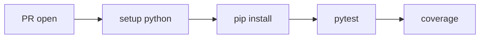

# Python 테스트 자동화

> GitHub Actions 101 시리즈 (4/10)


## 이 글에서 다룰 문제

테스트는 *수동* 일 때 *반드시 잊습니다*. *자동화* 만이 *모든 PR* 에서 동일한 신뢰를 보장합니다.

> *느린 CI* 는 *건너뛰는 CI* 가 됩니다.

## 전체 흐름


## Before/After

**Before**: 로컬에서 `pytest` 만 돌고 *PR 머지 후* 에야 깨진 걸 안다.

**After**: PR 에 *Tests passed* 체크가 붙고 *3.10/3.11/3.12* 모두 통과해야 머지 가능.

## 테스트 자동화 5단계

### 1단계 — Python + 캐시 설정

```yaml
- uses: actions/setup-python@v5
  with:
    python-version: "3.11"
    cache: "pip"
- run: pip install -r requirements.txt
```

### 2단계 — pytest 실행과 리포트

```yaml
- run: pytest -q --junitxml=report.xml
- uses: actions/upload-artifact@v4
  if: always()
  with:
    name: pytest-report
    path: report.xml
```

### 3단계 — 커버리지 측정

```yaml
- run: pytest --cov=src --cov-report=xml
- uses: codecov/codecov-action@v4
  with:
    files: coverage.xml
```

### 4단계 — 다중 Python 버전 matrix

```yaml
strategy:
  matrix:
    python: ["3.10", "3.11", "3.12"]
steps:
  - uses: actions/setup-python@v5
    with:
      python-version: ${{ matrix.python }}
```

### 5단계 — 실패 시 *캡처*

```yaml
- name: dump logs on failure
  if: failure()
  run: |
    cat pytest.log || true
```

## 이 코드에서 주목할 점

- *cache: "pip"* 한 줄이 *설치 시간* 을 *수십 초* 줄입니다.
- *junit XML* 은 *Test Reporter* 와 연동됩니다.
- *if: always()* 는 *실패해도 아티팩트 업로드*.

## 자주 하는 실수 5가지

1. **`pip install` 마다 *전체 재설치*.** 캐시 누락.
2. **`pytest -v` 를 *프로덕션 CI에서* 사용.** 로그 폭발.
3. ***외부 네트워크 의존* 테스트.** *Flaky* 의 원인.
4. **`junitxml` 없음.** PR 에 결과 *세부* 가 안 보임.
5. **커버리지를 *목표 없이* 측정.** 숫자만 늘림.

## 실무에서는 이렇게 쓰입니다

성숙한 팀은 *pytest-xdist* 로 *병렬화*, *flaky test* 는 *re-run* 정책으로 처리하고 *coverage 임계치* 를 PR 차단 조건으로 둡니다.

## 체크리스트

- [ ] *pip cache* 가 켜져 있다.
- [ ] *junit XML* 이 업로드된다.
- [ ] *coverage* 가 측정된다.
- [ ] *matrix* 가 *필요한 만큼만* 있다.

## 정리 및 다음 단계

테스트 자동화는 *CI 의 심장* 입니다. 다음 글에서는 *Lint와 Type Check* 를 다룹니다.

<!-- toc:begin -->
- [GitHub Actions란 무엇인가?](./01-what-is-github-actions.md)
- [Workflow와 Job](./02-workflow-and-job.md)
- [Trigger 이해하기](./03-triggers.md)
- **Python 테스트 자동화 (현재 글)**
- Lint와 Type Check (예정)
- 빌드 아티팩트 (예정)
- Docker 빌드 (예정)
- 배포 자동화 (예정)
- Secret 관리 (예정)
- 실전 CI/CD 파이프라인 (예정)
<!-- toc:end -->

## 참고 자료

- [actions/setup-python](https://github.com/actions/setup-python)
- [pytest documentation](https://docs.pytest.org/)
- [coverage.py](https://coverage.readthedocs.io/)
- [Codecov GitHub Action](https://github.com/codecov/codecov-action)

Tags: GitHubActions, Python, Pytest, Testing, CICD
