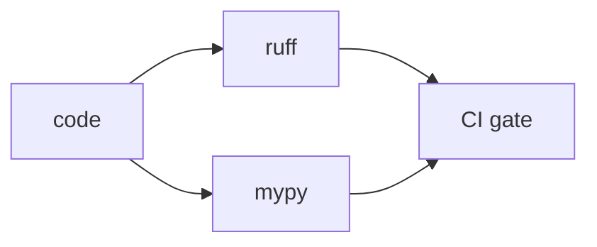

# Lint와 Type Check

코드 리뷰가 늘 비슷한 지적에서 시작된다면 팀의 시간이 아깝게 쓰이고 있다는 뜻입니다. import 정렬, 줄 길이, 포매팅, 명백한 타입 오류까지 사람이 반복해서 잡고 있다면 리뷰어는 더 중요한 설계와 위험 신호에 집중하기 어렵습니다. 이런 일은 가능한 한 기계에게 넘기는 편이 맞습니다.

이 글은 GitHub Actions 101 시리즈의 5번째 글입니다. 여기서는 Ruff와 Mypy, pre-commit을 이용해 코드 품질 게이트를 만들고, PR 리뷰가 스타일 교정이 아니라 로직 검토에 집중되도록 하는 방법을 설명하겠습니다.

## 이 글에서 다룰 문제

> 좋은 품질 게이트는 개발자를 느리게 만드는 장치가 아니라, 사람이 볼 필요 없는 오류를 먼저 걷어 내는 장치입니다. 리뷰 시간은 줄이고 기준은 더 선명하게 만드는 것이 목표입니다.

- Ruff는 왜 여러 도구를 하나로 줄이는 데 유용할까요?
- Mypy는 어느 시점부터 엄격 모드로 가져가는 편이 좋을까요?
- pre-commit은 왜 CI와 짝을 이뤄야 할까요?
- 변경 파일만 검사하는 전략은 언제 도움이 될까요?
- 규칙을 너무 느슨하게 만들면 어떤 문제가 생길까요?

## 왜 중요한가

린트와 타입 검사는 리뷰어가 가장 먼저 발견하는 항목입니다. 그런데 이 검사는 대부분 기계가 훨씬 더 빠르고 일관되게 할 수 있습니다. 품질 게이트를 자동화하면 리뷰어는 아키텍처, 예외 흐름, 성능, 운영 영향처럼 더 비싼 판단에 시간을 쓸 수 있습니다.

또 하나 중요한 점은 팀 기준의 통일입니다. 로컬에서는 통과했는데 CI에서는 실패하는 상황이 반복되면 개발자는 자동화를 귀찮은 장벽으로 느낍니다. 같은 명령을 로컬과 CI에서 똑같이 실행하게 만드는 것이 오래 가는 구조입니다.

## 한눈에 보는 품질 게이트



이 구조에서 핵심은 분명합니다. 코드가 들어오면 먼저 기계가 스타일과 정적 타입을 확인하고, 그 결과가 CI 게이트로 이어집니다. 사람의 리뷰는 그 다음입니다.

## 핵심 용어를 먼저 정리하겠습니다

| 용어 | 뜻 | 실무 포인트 |
| --- | --- | --- |
| 린터 | 스타일과 패턴 위반을 잡는 도구 | 반복적인 리뷰 지적을 줄여 줍니다 |
| 포매터 | 코드를 자동으로 정렬하고 맞추는 도구 | 팀 내 스타일 논쟁을 줄입니다 |
| 타입 체커 | 정적 타입 오류를 미리 찾는 도구 | 실행 전 경계 오류를 줄이는 데 유용합니다 |
| pre-commit | 커밋 전에 실행하는 훅 | CI에 가기 전 빠른 피드백을 줍니다 |
| 품질 게이트 | 실패 시 머지를 막는 규칙 | 기준을 문서가 아니라 동작으로 만듭니다 |

Ruff가 특히 매력적인 이유는 여러 도구를 단순화해 준다는 점입니다. flake8, isort, black을 따로 관리하던 복잡도를 줄여 주면 팀 전체 유지비가 확실히 낮아집니다.

## 자동화 전과 후를 비교해 보겠습니다

품질 게이트가 없으면 리뷰어는 같은 피드백을 반복합니다. import 순서, 사용하지 않는 변수, 줄 길이, 타입 누락 같은 항목이 매 PR마다 다시 등장합니다. 이 과정은 지치기 쉽고, 팀이 커질수록 기준이 사람마다 흔들립니다.

반대로 PR에 `Lint passed`, `Type-check passed`가 자동으로 붙으면 리뷰 대화의 초점이 달라집니다. 이제 관심사는 “형식이 맞는가”보다 “이 설계가 맞는가”, “이 예외 처리가 충분한가”로 옮겨 갑니다. 저는 품질 게이트의 진짜 가치를 여기에 둡니다.

## 품질 게이트를 5단계로 구성해 보겠습니다

### 1단계 — Ruff로 기본 규칙 만들기

```yaml
      - uses: actions/checkout@v6
      - uses: actions/setup-python@v6
  with:
    python-version: "3.11"
- run: pip install ruff
- run: ruff check .
- run: ruff format --check .
```

이 구성만으로도 상당수 스타일 문제를 자동으로 걸러낼 수 있습니다. 포매팅까지 검사하면 “이건 취향 아닌가요?”라는 논쟁도 크게 줄어듭니다.

### 2단계 — Mypy 추가하기

```yaml
- run: pip install mypy
- run: mypy src/
```

정적 타입 검사는 실행 전에 드러낼 수 있는 오류를 앞당겨 보여 줍니다. 특히 함수 경계와 데이터 구조가 많아질수록 효과가 커집니다.

### 3단계 — 설정을 한곳에 모으기

```toml
[tool.ruff]
line-length = 100
[tool.ruff.lint]
select = ["E", "F", "I", "N", "UP"]

[tool.mypy]
strict = true
```

설정 파일이 여러 곳에 흩어지면 어느 값이 기준인지 불분명해집니다. 저는 `pyproject.toml` 한곳을 중심으로 맞추는 방식을 선호합니다.

### 4단계 — pre-commit으로 로컬과 CI를 맞추기

```yaml
# .pre-commit-config.yaml
repos:
  - repo: https://github.com/astral-sh/ruff-pre-commit
    rev: v0.6.0
    hooks: [{id: ruff}, {id: ruff-format}]
```

로컬에서 먼저 잡히는 오류는 CI 시간도 아껴 줍니다. 팀원이 커밋 전에 같은 규칙을 돌리면 PR에서 보는 실패 수도 자연스럽게 줄어듭니다.

### 5단계 — 변경분만 검사하기

```yaml
- run: |
    git fetch origin ${{ github.base_ref }}
    ruff check $(git diff --name-only origin/${{ github.base_ref }} | grep '\.py$') || true
```

전체 저장소를 한 번에 엄격하게 바꾸기 어려운 레거시 프로젝트에서는 이 방식이 유용할 수 있습니다. 다만 임시 전략인지 장기 전략인지 팀 안에서 분명히 정하는 편이 좋습니다.

## 이 코드에서 먼저 봐야 할 점

- Ruff 하나로 여러 품질 도구를 단순화할 수 있습니다.
- Mypy는 가능하면 초기에 엄격하게 가져가는 편이 전환 비용이 낮습니다.
- pre-commit은 CI 전에 문제를 줄여 주는 빠른 방파제 역할을 합니다.

도구 수를 늘리는 일은 본질이 아닙니다. 기준을 선명하게 만드는 편이 훨씬 중요합니다. 기준이 선명하면 실패도 덜 억울하고 수정도 더 빨라집니다.

## 자주 하는 실수 다섯 가지

1. CI에서만 돌리고 로컬에는 같은 도구를 설치하지 않습니다.
2. 규칙을 자꾸 완화하다가 사실상 의미 없는 수준으로 만듭니다.
3. Mypy를 일부 모듈에만 어정쩡하게 적용합니다.
4. `ruff format` 결과를 PR마다 자동 커밋하게 만들어 충돌을 늘립니다.
5. 설정 파일을 여러 곳에 흩어 놓습니다.

특히 두 번째 실수는 흔합니다. 경고를 줄이는 대신 기준을 낮추면 단기적으로는 편하지만, 장기적으로는 품질 게이트 자체를 신뢰하지 않게 됩니다.

## 실무에서는 이렇게 생각합니다

성숙한 팀은 Ruff, Mypy, pre-commit 조합을 표준 템플릿으로 묶습니다. 저장소마다 제각각 다른 규칙을 두기보다, 템플릿 저장소나 공통 설정으로 팀의 기준을 일관되게 만드는 편이 유지보수에 유리합니다.

또한 자동 수정과 자동 커밋을 구분해서 봐야 합니다. 자동 수정 자체는 좋지만, CI가 PR마다 코드를 다시 커밋하기 시작하면 리뷰와 충돌 관리가 오히려 복잡해질 수 있습니다. 저는 보통 로컬 자동 수정, CI 검증 분리를 선호합니다.

## 체크리스트

- [ ] `ruff check`와 `ruff format --check`가 CI에서 돈다.
- [ ] `mypy strict` 기준이 켜져 있다.
- [ ] 팀이 pre-commit을 설치해 사용한다.
- [ ] 설정이 `pyproject.toml`에 모여 있다.

## 연습 문제

1. Ruff와 Mypy를 함께 실행하는 워크플로우를 추가해 보세요.
2. 세 개 이상의 훅으로 pre-commit 구성을 만들어 보세요.
3. strict mypy를 켠 뒤 나타나는 오류를 범주별로 분류해 보세요.

## 정리

린트와 타입 검사는 사람이 반복해서 볼 가치가 낮은 오류를 미리 걷어 내는 게이트입니다. Ruff로 스타일과 포맷을 통일하고, Mypy로 타입 경계를 점검하고, pre-commit으로 로컬과 CI의 기준을 맞추면 리뷰의 밀도가 높아집니다.

다음 글에서는 빌드 아티팩트를 다룹니다. 코드 품질을 검증했다면, 이제 그 결과물인 빌드 산출물을 어떻게 저장하고 다음 단계로 넘길지 살펴볼 차례입니다.

<!-- toc:begin -->
- [GitHub Actions란 무엇인가?](./01-what-is-github-actions.md)
- [Workflow와 Job](./02-workflow-and-job.md)
- [Trigger 이해하기](./03-triggers.md)
- [Python 테스트 자동화](./04-python-test-automation.md)
- **Lint와 Type Check (현재 글)**
- 빌드 아티팩트 (예정)
- Docker 빌드 (예정)
- 배포 자동화 (예정)
- Secret 관리 (예정)
- 실전 CI/CD 파이프라인 (예정)
<!-- toc:end -->

## 참고 자료

- [Ruff documentation](https://docs.astral.sh/ruff/)
- [Mypy documentation](https://mypy.readthedocs.io/)
- [pre-commit](https://pre-commit.com/)
- [astral-sh/ruff-pre-commit](https://github.com/astral-sh/ruff-pre-commit)

Tags: GitHubActions, Lint, Ruff, Mypy, QualityGate
