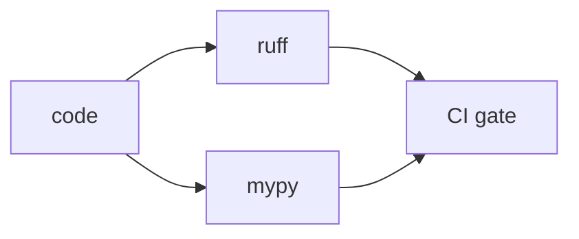

# Lint와 Type Check

> GitHub Actions 101 시리즈 (5/10)

<!-- a-grade-intro:begin -->

**핵심 질문**: *PR 리뷰* 에서 *스타일과 타입 잡기* 에 시간을 *그만 쓰려면* 어떻게 합니까?

> *기계가 잡을 것* 은 *기계에게* 맡깁니다.

<!-- a-grade-intro:end -->

## 이 글에서 배울 것

- *Ruff* 로 *스타일 + 린트* 통합
- *Mypy* 로 *정적 타입 체크*
- *pre-commit* 으로 *로컬 + CI* 동시 검사
- *PR diff* 만 *검사하는* 패턴
- 흔한 함정 5가지

## 왜 중요한가

*린트와 타입* 은 *리뷰어가 가장 먼저 잡는 것* 입니다. 자동화하면 *리뷰* 가 *설계 토론* 에 집중할 수 있습니다.

> *형식 검사 자동화* 는 *리뷰 시간* 을 절반으로 줄입니다.

## 개념 한눈에 보기



## 핵심 용어 정리

- **Linter**: *스타일/패턴 위반* 검사기 (ruff).
- **Formatter**: *자동 포맷터* (ruff format).
- **Type checker**: *정적 타입* 검사기 (mypy).
- **pre-commit**: *commit 전* 자동 검사 훅.
- **Quality gate**: 품질 미달 시 *머지 차단*.

## Before/After

**Before**: 리뷰어가 *세미콜론, 줄 길이, 타입* 을 *한 줄 한 줄* 지적한다.

**After**: PR 에 *Lint passed*, *Type-check passed* 가 자동으로 붙고 *리뷰* 는 *로직* 만 본다.

## 실습: 품질 게이트 5단계

### 1단계 — Ruff 워크플로우

```yaml
- uses: actions/checkout@v4
- uses: actions/setup-python@v5
  with:
    python-version: "3.11"
- run: pip install ruff
- run: ruff check .
- run: ruff format --check .
```

### 2단계 — Mypy 추가

```yaml
- run: pip install mypy
- run: mypy src/
```

### 3단계 — 설정 파일 통일 (pyproject.toml)

```toml
[tool.ruff]
line-length = 100
[tool.ruff.lint]
select = ["E", "F", "I", "N", "UP"]

[tool.mypy]
strict = true
```

### 4단계 — pre-commit 통합

```yaml
# .pre-commit-config.yaml
repos:
  - repo: https://github.com/astral-sh/ruff-pre-commit
    rev: v0.6.0
    hooks: [{id: ruff}, {id: ruff-format}]
```

### 5단계 — diff 만 검사 (선택)

```yaml
- run: |
    git fetch origin ${{ github.base_ref }}
    ruff check $(git diff --name-only origin/${{ github.base_ref }} | grep '\.py$') || true
```

## 이 코드에서 주목할 점

- *ruff* 한 도구가 *flake8 + isort + black* 을 대체합니다.
- *strict* mypy 는 *처음부터* 켜는 게 *전환 비용* 이 작습니다.
- *pre-commit* 으로 *CI 가 잡기 전* 에 잡습니다.

## 자주 하는 실수 5가지

1. **CI 만 두고 *로컬에 안 깖*.** 매번 *PR 에서* 깨짐.
2. **rule 을 *너무 풀어서* 켬.** 의미가 없어짐.
3. **`mypy` 를 *부분만* 적용.** 경계에서 *any* 가 흘러다님.
4. **`ruff format` 을 *PR 마다 자동 commit* 시킴.** 머지 충돌.
5. **`pyproject.toml` 설정 *분산*.** 어느 게 진짜인지 모름.

## 실무에서는 이렇게 쓰입니다

성숙한 팀은 *ruff + mypy + pre-commit* 을 *템플릿 저장소* 로 표준화하고, *pre-commit.ci* 또는 *GitHub Actions* 에서 동일하게 검증합니다.

## 시니어 엔지니어는 이렇게 생각합니다

- *린트는 토론을 줄인다*.
- *타입은 문서다*.
- *strict* 가 기본, 예외만 *문서화*.
- *로컬 + CI* 가 *같은 명령* 을 돌린다.
- *자동 수정* 은 *commit* 이 아니라 *피드백*.

## 체크리스트

- [ ] *ruff check + format* 이 CI 에 있다.
- [ ] *mypy strict* 가 켜져 있다.
- [ ] *pre-commit* 이 *팀에 깔려* 있다.
- [ ] 설정이 *pyproject.toml* 한곳에 있다.

## 연습 문제

1. *ruff + mypy* 워크플로우를 추가하세요.
2. *pre-commit* 을 *3개 훅* 으로 시작해 보세요.
3. *strict mypy* 적용 시 발생한 오류를 *유형별로* 분류해 보세요.

## 정리 및 다음 단계

품질 게이트는 *리뷰의 짐을 덜어 주는* 도구입니다. 다음 글에서는 *빌드 아티팩트* 를 다룹니다.

<!-- toc:begin -->
- [GitHub Actions란 무엇인가?](./01-what-is-github-actions.md)
- [Workflow와 Job](./02-workflow-and-job.md)
- [Trigger 이해하기](./03-triggers.md)
- [Python 테스트 자동화](./04-python-test-automation.md)
- **Lint와 Type Check (현재 글)**
- 빌드 아티팩트 (예정)
- Docker 빌드 (예정)
- 배포 자동화 (예정)
- Secret 관리 (예정)
- 실전 CI/CD 파이프라인 (예정)
<!-- toc:end -->

## 참고 자료

- [Ruff documentation](https://docs.astral.sh/ruff/)
- [Mypy documentation](https://mypy.readthedocs.io/)
- [pre-commit](https://pre-commit.com/)
- [astral-sh/ruff-pre-commit](https://github.com/astral-sh/ruff-pre-commit)

Tags: GitHubActions, Lint, Ruff, Mypy, QualityGate
