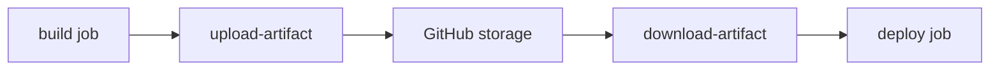

# 빌드 아티팩트

> GitHub Actions 101 시리즈 (6/10)

<!-- a-grade-intro:begin -->

**핵심 질문**: *빌드 결과물* 을 *다음 Job* 또는 *외부 사용자* 에게 *어떻게 전달* 합니까?

> *아티팩트* 는 *빌드와 배포 사이의 다리* 입니다.

<!-- a-grade-intro:end -->

## 이 글에서 배울 것

- *upload-artifact / download-artifact* 의 사용
- *Job 간 산출물* 전달 패턴
- *retention-days* 로 *비용* 관리
- *softprops/action-gh-release* 로 *Release* 발행
- 흔한 함정 5가지

## 왜 중요한가

*빌드한 결과를 그 자리에서 버리는* 워크플로우는 *재사용도 추적도* 안 됩니다. 아티팩트는 *증거이자 자산* 입니다.

> *모든 머지* 는 *추적 가능한 빌드* 를 남겨야 합니다.

## 개념 한눈에 보기



## 핵심 용어 정리

- **Artifact**: 워크플로우가 *생성한 파일* 묶음.
- **upload-artifact**: 아티팩트 *업로드* 액션.
- **download-artifact**: 다른 Job 에서 *다운로드*.
- **retention-days**: 보관 *기간*.
- **Release**: GitHub 의 *공식 산출물 페이지*.

## Before/After

**Before**: build job 끝에 *런너가 사라지면* `dist/*.whl` 도 *함께 사라진다*.

**After**: `dist/*.whl` 이 *아티팩트로 보관* 되고 *deploy job* 이 다운로드해 사용한다.

## 실습: 아티팩트 5단계

### 1단계 — 업로드

```yaml
- run: python -m build
- uses: actions/upload-artifact@v4
  with:
    name: dist
    path: dist/*
    retention-days: 14
```

### 2단계 — 다운로드

```yaml
deploy:
  needs: build
  runs-on: ubuntu-latest
  steps:
    - uses: actions/download-artifact@v4
      with:
        name: dist
        path: dist/
    - run: ls dist/
```

### 3단계 — 패턴으로 묶기

```yaml
- uses: actions/upload-artifact@v4
  with:
    name: reports
    path: |
      coverage.xml
      report.xml
      logs/*.log
```

### 4단계 — Release 자동 발행

```yaml
- uses: softprops/action-gh-release@v2
  if: startsWith(github.ref, 'refs/tags/')
  with:
    files: dist/*
    generate_release_notes: true
```

### 5단계 — retention 정책

```yaml
- uses: actions/upload-artifact@v4
  with:
    name: nightly-build
    path: dist/
    retention-days: 7
```

## 이 코드에서 주목할 점

- *retention-days* 로 *스토리지 비용* 을 통제합니다.
- *generate_release_notes* 가 *changelog* 를 자동 생성합니다.
- *download-artifact* 는 *동일 워크플로우 안* 에서만 가능 (외부는 API).

## 자주 하는 실수 5가지

1. **`upload-artifact@v3` 가 *deprecated*.** v4 로 업그레이드.
2. ***모든 파일* 을 업로드.** *비용 폭발*.
3. **`retention-days` 미설정.** *기본 90일* 로 누적.
4. ***아티팩트 이름* 을 *덮어씀*.** 같은 이름 두 번이면 *오류*.
5. ***Release* 에 *체크섬 없음*.** 변조 검증 불가.

## 실무에서는 이렇게 쓰입니다

성숙한 팀은 *모든 빌드* 가 *checksum + SBOM* 을 함께 만들고, *Release* 시 *서명 (sigstore)* 을 붙입니다.

## 시니어 엔지니어는 이렇게 생각합니다

- *추적 가능 빌드* 가 *공급망 보안* 의 시작.
- *retention* 은 *비용 + 컴플라이언스*.
- *Release* 는 *공식 외부 인터페이스*.
- *아티팩트 이름* 은 *고유* 하게.
- *체크섬/서명* 은 *문화*.

## 체크리스트

- [ ] *upload-artifact@v4* 를 사용한다.
- [ ] *retention-days* 가 명시됐다.
- [ ] *Release* 가 *tag push* 로 자동 발행된다.
- [ ] *체크섬* 또는 *서명* 이 첨부된다.

## 연습 문제

1. *pytest report + coverage* 를 *하나의 아티팩트* 로 업로드하세요.
2. *deploy job* 이 *build job* 의 산출물을 다운로드하게 하세요.
3. *tag push* 시 *Release* 가 자동 생성되도록 만드세요.

## 정리 및 다음 단계

아티팩트는 *빌드의 영수증* 입니다. 다음 글에서는 *Docker 빌드* 를 다룹니다.

<!-- toc:begin -->
- [GitHub Actions란 무엇인가?](./01-what-is-github-actions.md)
- [Workflow와 Job](./02-workflow-and-job.md)
- [Trigger 이해하기](./03-triggers.md)
- [Python 테스트 자동화](./04-python-test-automation.md)
- [Lint와 Type Check](./05-lint-and-typecheck.md)
- **빌드 아티팩트 (현재 글)**
- Docker 빌드 (예정)
- 배포 자동화 (예정)
- Secret 관리 (예정)
- 실전 CI/CD 파이프라인 (예정)
<!-- toc:end -->

## 참고 자료

- [actions/upload-artifact](https://github.com/actions/upload-artifact)
- [actions/download-artifact](https://github.com/actions/download-artifact)
- [softprops/action-gh-release](https://github.com/softprops/action-gh-release)
- [About artifacts](https://docs.github.com/actions/using-workflows/storing-workflow-data-as-artifacts)

Tags: GitHubActions, Artifact, Build, Release, CICD
