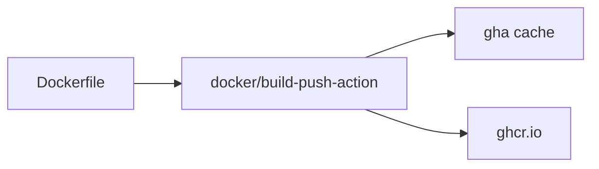

# Docker 빌드

GitHub Actions에서 시간이 가장 오래 걸리는 단계는 대개 Docker 빌드입니다. 캐시가 없으면 PR 하나 열 때마다 레이어를 처음부터 다시 만들고, 태그 전략이 없으면 어떤 이미지가 배포됐는지도 흐려지고, 권한 설정이 어긋나면 푸시 단계에서 401이 터집니다. 컨테이너 빌드는 단순히 `docker build`를 CI에 옮기는 작업이 아닙니다.

이 글은 GitHub Actions 101 시리즈의 7번째 글입니다. 여기서는 Buildx 기반의 Docker 빌드 흐름을 정리하고, 캐시, GHCR 푸시, 멀티 플랫폼 빌드, 권한 설정을 어떤 기준으로 가져가야 하는지 설명하겠습니다.

## 이 글에서 다룰 문제

> Docker 빌드 성능은 캐시 설계가 좌우합니다. 같은 Dockerfile이라도 Buildx와 캐시 전략을 어떻게 두느냐에 따라 PR 피드백 시간은 몇 분에서 몇십 초까지 달라질 수 있습니다.

- Buildx는 왜 일반 빌더보다 더 자주 쓰일까요?
- GitHub Actions 캐시는 Docker 레이어 시간에 어떤 영향을 줄까요?
- GHCR에 푸시할 때 어떤 권한이 필요할까요?
- 멀티 플랫폼 이미지는 언제 붙이고 언제 미뤄야 할까요?
- `latest`만 푸시하면 왜 위험할까요?

## 왜 중요한가

컨테이너 이미지는 배포의 경계선입니다. 애플리케이션 코드가 어떻든, 결국 배포는 이미지 단위로 일어나는 경우가 많습니다. 따라서 빌드가 느리거나 재현이 어렵다면 배포도 불안정해집니다.

또한 Docker 빌드는 CI 비용에 직접 영향을 줍니다. 매번 모든 레이어를 다시 만드는 파이프라인은 금방 느려지고, 개발자는 체크 결과를 기다리기 싫어집니다. 저는 Docker 빌드 자동화의 핵심을 “빠르게”보다 “예측 가능하게”에 둡니다. 캐시와 태그 전략이 있으면 그 예측 가능성이 생깁니다.

## 한눈에 보는 Docker 빌드 흐름



이 구조의 중심에는 `docker/build-push-action`이 있습니다. Dockerfile을 입력으로 받아 빌드하고, 캐시를 활용하고, 결과를 레지스트리에 올리는 역할을 한 번에 맡습니다.

## 핵심 용어를 먼저 정리하겠습니다

| 용어 | 뜻 | 실무 포인트 |
| --- | --- | --- |
| Buildx | Docker의 확장 빌더 | 캐시, 멀티 플랫폼, 고급 빌드 기능의 중심입니다 |
| gha cache | GitHub Actions 캐시 백엔드 | 레이어 재사용으로 빌드 시간을 줄입니다 |
| GHCR | GitHub Container Registry | GitHub 생태계 안에서 이미지 배포가 자연스럽습니다 |
| 멀티 플랫폼 | 여러 CPU 아키텍처용 이미지를 함께 만드는 방식 | 호환성을 넓히지만 비용이 늘어납니다 |
| OCI 이미지 | 표준 컨테이너 이미지 형식 | 다양한 런타임과 레지스트리에서 호환됩니다 |

## 자동화 전과 후를 비교해 보겠습니다

캐시 없는 빌드는 PR마다 모든 레이어를 다시 만듭니다. 의존성 설치, 시스템 패키지 설치, 애플리케이션 복사까지 전부 처음부터 반복되면 4분, 5분은 금방 지나갑니다. 이런 파이프라인은 조금만 저장소가 커져도 팀 전체의 대기 시간을 키웁니다.

반대로 Buildx와 `type=gha` 캐시를 붙이면, 바뀌지 않은 레이어는 그대로 재사용합니다. Dockerfile 구조까지 멀티 스테이지로 정리돼 있다면 빌드 시간은 크게 줄고, 이미지 크기도 함께 줄일 수 있습니다. 저는 Docker 빌드 자동화에서 이 두 가지를 항상 함께 봅니다.

## Docker 빌드를 5단계로 구성해 보겠습니다

### 1단계 — Buildx 준비하기

```yaml
- uses: docker/setup-qemu-action@v3
- uses: docker/setup-buildx-action@v3
```

이 단계는 고급 빌드 기능의 기반을 깝니다. 특히 멀티 플랫폼을 고려한다면 QEMU와 Buildx 준비가 사실상 시작점입니다.

### 2단계 — GHCR에 로그인하기

```yaml
- uses: docker/login-action@v3
  with:
    registry: ghcr.io
    username: ${{ github.actor }}
    password: ${{ secrets.GITHUB_TOKEN }}
```

이미지를 푸시하려면 인증이 필요합니다. GitHub 저장소와 레지스트리를 함께 쓸 때는 `GITHUB_TOKEN` 조합이 기본 출발점이 됩니다.

### 3단계 — 캐시를 포함해 빌드하고 푸시하기

```yaml
- uses: docker/build-push-action@v6
  with:
    context: .
    push: true
    tags: ghcr.io/${{ github.repository }}:${{ github.sha }}
    cache-from: type=gha
    cache-to: type=gha,mode=max
```

여기서 중요한 점은 태그와 캐시를 함께 설계하는 것입니다. `github.sha` 태그는 추적성을 주고, `cache-from`과 `cache-to`는 빌드 시간을 줄여 줍니다.

### 4단계 — 멀티 플랫폼 이미지 만들기

```yaml
- uses: docker/build-push-action@v6
  with:
    platforms: linux/amd64,linux/arm64
    push: true
    tags: ghcr.io/${{ github.repository }}:latest
```

멀티 플랫폼은 편리하지만 공짜가 아닙니다. PR마다 항상 돌리기보다는 main push나 Release 시점처럼 꼭 필요한 순간에만 붙이는 편이 일반적입니다.

### 5단계 — 권한을 명시하기

```yaml
permissions:
  contents: read
  packages: write
```

이미지 푸시는 패키지 쓰기 권한이 필요합니다. 이 설정이 빠지면 빌드는 잘 됐는데 마지막 푸시에서 401로 실패하는 상황을 자주 보게 됩니다.

## 이 코드에서 먼저 봐야 할 점

- `cache-to: type=gha,mode=max`는 레이어 재사용을 극대화합니다.
- 멀티 플랫폼 빌드는 편의만큼 비용도 늘립니다.
- `GITHUB_TOKEN`으로 푸시하려면 `packages: write` 권한이 필요합니다.

즉, Docker 빌드 자동화는 Dockerfile만의 문제가 아니라 권한, 캐시, 태그 정책이 함께 얽힌 설계 문제입니다.

## 자주 하는 실수 다섯 가지

1. Buildx 없이 기본 빌드만 사용합니다.
2. `permissions: packages: write`를 빼먹습니다.
3. `latest` 태그만 푸시해 롤백 기준을 잃습니다.
4. 모든 PR에서 멀티 플랫폼 빌드를 수행합니다.
5. 단일 스테이지 Dockerfile로 이미지 크기를 불필요하게 키웁니다.

특히 세 번째는 사고 후 추적성을 크게 떨어뜨립니다. 어떤 커밋의 이미지인지 분명한 고정 태그가 항상 함께 있어야 합니다.

## 실무에서는 이렇게 생각합니다

성숙한 팀은 PR에서는 amd64와 캐시 중심의 빠른 검증만 하고, main push나 태그 푸시에서는 멀티 플랫폼 이미지와 서명까지 붙입니다. 즉, 모든 상황에서 같은 무게의 컨테이너 빌드를 돌리지 않습니다.

또한 `latest`는 편의 태그일 뿐 진실의 원천이 아니라는 감각이 중요합니다. 실제 배포 추적과 롤백은 보통 SHA나 버전 태그 같은 고정 식별자를 기준으로 해야 합니다.

## 체크리스트

- [ ] Buildx와 gha 캐시를 활성화했다.
- [ ] 고정 태그와 `latest`를 함께 관리한다.
- [ ] `packages: write` 권한을 명시했다.
- [ ] 멀티 플랫폼 빌드는 필요한 트리거에서만 실행한다.

## 연습 문제

1. PR에서는 amd64만 빌드하게 구성해 보세요.
2. main push에서는 멀티 플랫폼과 `latest` 태그를 함께 푸시해 보세요.
3. Dockerfile을 멀티 스테이지로 바꿔 이미지 크기를 줄여 보세요.

## 정리

Docker 빌드 자동화의 핵심은 Buildx, 캐시, 태그 전략, 권한 설정을 함께 설계하는 것입니다. 이 조합이 맞아야 빌드는 빨라지고, 어떤 이미지가 배포됐는지도 선명해집니다.

다음 글에서는 배포 자동화를 다룹니다. 이미지를 안정적으로 만들 수 있게 됐다면, 이제 그 결과를 staging과 production까지 어떻게 안전하게 올릴지 고민해야 합니다.

<!-- toc:begin -->
- [GitHub Actions란 무엇인가?](./01-what-is-github-actions.md)
- [Workflow와 Job](./02-workflow-and-job.md)
- [Trigger 이해하기](./03-triggers.md)
- [Python 테스트 자동화](./04-python-test-automation.md)
- [Lint와 Type Check](./05-lint-and-typecheck.md)
- [빌드 아티팩트](./06-build-artifact.md)
- **Docker 빌드 (현재 글)**
- 배포 자동화 (예정)
- Secret 관리 (예정)
- 실전 CI/CD 파이프라인 (예정)
<!-- toc:end -->

## 참고 자료

- [docker/build-push-action](https://github.com/docker/build-push-action)
- [docker/setup-buildx-action](https://github.com/docker/setup-buildx-action)
- [GHCR documentation](https://docs.github.com/packages/working-with-a-github-packages-registry/working-with-the-container-registry)
- [Buildx GitHub Actions cache](https://docs.docker.com/build/ci/github-actions/cache/)

Tags: GitHubActions, Docker, Buildx, GHCR, CICD
