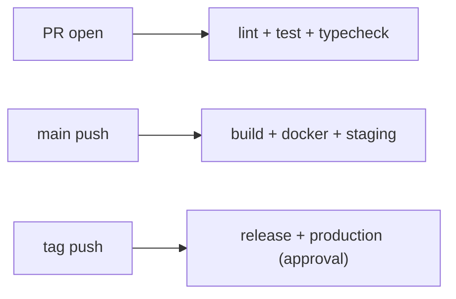

# 실전 CI/CD 파이프라인

지금까지 한 편씩 나눠서 본 요소들은 각각 유용합니다. 하지만 실무에서는 trigger만 따로 존재하지 않고, 테스트만 따로 돌지 않으며, Docker 빌드와 배포와 secret 관리가 결국 하나의 흐름으로 엮입니다. 파이프라인이란 부품의 개수가 아니라, 그 부품들이 어떤 책임으로 연결돼 있는가를 설명하는 구조입니다.

이 글은 GitHub Actions 101 시리즈의 마지막 글입니다. 여기서는 앞선 아홉 편의 내용을 하나의 실전 파이프라인으로 묶고, PR, main, tag를 서로 다른 단계로 분리하는 방법과 reusable workflow, composite action을 어떻게 활용할지 정리하겠습니다.

## 이 글에서 다룰 문제

> 좋은 파이프라인은 거대한 한 파일이 아니라, 작은 책임을 분명히 나눈 조합입니다. PR은 피드백, main은 통합, tag는 릴리스라는 기준만 분명해도 전체 구조가 훨씬 읽기 쉬워집니다.

- PR, main, tag를 왜 서로 다른 책임으로 나눠야 할까요?
- reusable workflow는 어떤 중복을 줄여 줄까요?
- composite action은 어디까지 묶는 편이 좋을까요?
- 공통 템플릿 저장소 패턴은 왜 팀 규모가 커질수록 중요할까요?
- 실전 파이프라인에서 가장 자주 무너지는 지점은 어디일까요?

## 왜 중요한가

테스트 자동화, 린트, Docker 빌드, 배포 자동화, secret 관리가 각각 있어도 연결이 나쁘면 팀 속도는 기대만큼 올라가지 않습니다. PR마다 너무 무거운 검증이 돌아서 피드백이 늦고, main push에도 production과 같은 수준의 배포가 붙고, 저장소마다 비슷하지만 다른 YAML이 흩어져 있다면 유지비가 계속 올라갑니다.

저는 실전 CI/CD 파이프라인의 목적을 “한 번 잘 만든 구조를 여러 저장소에서 오래 재사용하는 것”으로 봅니다. 부품을 많이 쌓는 것보다 책임을 잘 나누고 공통 부분을 재사용 가능하게 만드는 편이 훨씬 큰 효과를 냅니다.

## 한눈에 보는 전체 파이프라인



이 구조에서 중요한 것은 세 단계가 동일한 무게를 갖지 않는다는 점입니다. PR은 빠른 피드백이 중요하고, main은 통합과 staging 반영이 중요하며, tag는 공식 릴리스와 production 승격이 중요합니다.

## 핵심 용어를 먼저 정리하겠습니다

| 용어 | 뜻 | 실무 포인트 |
| --- | --- | --- |
| reusable workflow | `workflow_call`로 호출하는 공통 워크플로 | 저장소 간 중복을 크게 줄여 줍니다 |
| composite action | 여러 스텝을 하나의 재사용 단위로 묶은 액션 | 반복되는 준비 작업 정리에 유리합니다 |
| template repo | 팀이 공통 시작점으로 쓰는 저장소 | 표준 CI/CD 골격을 배포하기 좋습니다 |
| DORA 지표 | 배포 성과를 보는 네 가지 핵심 지표 | 파이프라인 설계 품질과 직접 연결됩니다 |
| 승격 | staging에서 production으로 넘기는 과정 | 같은 산출물을 다음 환경으로 올리는 감각이 중요합니다 |

## 자동화 전과 후를 비교해 보겠습니다

저장소마다 비슷하지만 조금씩 다른 워크플로우를 갖고 있으면, 한곳에서 개선한 내용을 다른 저장소에 다시 반영하는 비용이 큽니다. 어떤 저장소는 lint 규칙이 다르고, 어떤 저장소는 Docker 빌드 캐시가 빠지고, 어떤 저장소는 production 배포 게이트가 없습니다. 이런 상태는 시간이 갈수록 표류를 만듭니다.

반대로 공통 reusable workflow를 만들고 각 저장소는 얇은 호출자만 두면 구조가 단순해집니다. 공통 규칙은 한곳에서 관리하고, 저장소별 차이만 입력값으로 남기면 됩니다. 플랫폼 팀이 이 패턴을 좋아하는 이유가 분명합니다.

## 실전 파이프라인을 5단계로 구성해 보겠습니다

### 1단계 — reusable workflow 정의하기

```yaml
# .github/workflows/_ci.yml in org/template-repo
on:
  workflow_call:
    inputs:
      python-version:
        type: string
        default: "3.12"
jobs:
  ci:
    runs-on: ubuntu-latest
    steps:
      - uses: actions/checkout@v6
      - uses: actions/setup-python@v6
        with:
          python-version: ${{ inputs.python-version }}
      - run: pip install -e ".[dev]"
      - run: ruff check . && mypy . && pytest -q
```

공통 규칙이 반복된다면 복사보다 호출이 낫습니다. reusable workflow는 이런 중복 제거에 가장 직접적인 도구입니다.

### 2단계 — PR 단계는 빠른 피드백에 집중하기

```yaml
# .github/workflows/pr.yml
on:
  pull_request:
jobs:
  ci:
    uses: org/template-repo/.github/workflows/_ci.yml@v1
    with:
      python-version: "3.12"
```

PR에서는 lint, test, typecheck처럼 빠른 피드백 위주의 검증이 핵심입니다. 여기서 배포까지 한꺼번에 붙이면 리뷰 리듬이 무거워집니다.

### 3단계 — main 단계는 통합과 staging으로 이어지게 하기

```yaml
on:
  push:
    branches: [main]
jobs:
  ci:
    uses: org/template-repo/.github/workflows/_ci.yml@v1
  docker:
    needs: ci
    uses: org/template-repo/.github/workflows/_docker.yml@v1
  deploy-staging:
    needs: docker
    environment: staging
    runs-on: ubuntu-latest
    steps:
      - run: kubectl apply -f k8s/staging/
```

main push는 이미 머지된 코드 기준이므로, 여기서는 빌드와 Docker 이미지 생성, staging 배포까지 자연스럽게 이어질 수 있습니다.

### 4단계 — tag 단계는 공식 릴리스와 production으로 묶기

```yaml
on:
  push:
    tags: ["v*"]
jobs:
  release:
    runs-on: ubuntu-latest
    steps:
      - uses: softprops/action-gh-release@v2
  deploy-prod:
    needs: release
    environment: production  # required reviewers ON
    runs-on: ubuntu-latest
    steps:
      - run: kubectl apply -f k8s/production/
```

tag를 production 승격의 기준으로 삼으면 어떤 버전이 나갔는지 추적이 쉬워집니다. production은 가능한 한 태그나 명확한 버전과 연결하는 편이 좋습니다.

### 5단계 — 반복 준비 작업은 composite action으로 묶기

```yaml
# .github/actions/setup-app/action.yml
runs:
  using: composite
  steps:
    - uses: actions/setup-python@v6
      with: { python-version: "3.12" }
    - run: pip install -e ".[dev]"
      shell: bash
```

reusable workflow가 잡 단위 재사용이라면, composite action은 스텝 단위 재사용에 가깝습니다. 둘의 역할을 구분해 쓰면 구조가 더 깔끔해집니다.

## 이 코드에서 먼저 봐야 할 점

- PR은 피드백, main은 통합, tag는 릴리스라는 책임 분리가 선명합니다.
- reusable workflow는 버전 핀으로 호출해야 상위 변경이 갑자기 깨지지 않습니다.
- production environment는 최종 게이트 역할을 합니다.

이 세 가지가 명확하면 파이프라인이 커져도 읽는 기준이 흔들리지 않습니다.

## 자주 하는 실수 다섯 가지

1. 모든 PR에서 전체 e2e와 배포 직전 검증까지 돌립니다.
2. main에서 바로 production으로 직행합니다.
3. reusable workflow를 `@main`으로 호출합니다.
4. 태그 없이 production 배포를 진행합니다.
5. composite action 입력 검증 없이 값을 그대로 흘려보냅니다.

특히 세 번째 실수는 조용히 큰 문제를 만듭니다. 상위 저장소의 변경이 아무 예고 없이 모든 하위 저장소를 흔들 수 있기 때문입니다.

## 실무에서는 이렇게 생각합니다

플랫폼 팀은 공통 템플릿 저장소를 통해 조직 전체의 CI/CD 골격을 배포합니다. 서비스 팀은 그 위에서 필요한 입력만 바꾸고, 공통 정책은 중앙에서 관리합니다. 이 방식은 YAML 복붙보다 초기 비용이 커 보여도 장기 유지비를 크게 줄여 줍니다.

또한 DORA 지표를 개선하려면 무조건 더 많은 단계를 넣는 것이 아니라, 어떤 트리거에 어떤 책임을 둘지 명확히 나누는 편이 더 중요합니다. 빠른 PR 피드백, 안정적인 main 통합, 추적 가능한 production 배포가 그 핵심입니다.

## 체크리스트

- [ ] PR, main, tag 단계가 분리돼 있다.
- [ ] 공통 검증을 reusable workflow로 추출했다.
- [ ] production에는 승인 게이트가 있다.
- [ ] reusable workflow 호출 버전을 고정했다.

## 연습 문제

1. lint, test, typecheck만 도는 PR 전용 워크플로우를 작성해 보세요.
2. 두 저장소에서 공통으로 호출하는 reusable workflow를 만들어 보세요.
3. tag push 후 승인 게이트를 거쳐 production에 배포되는 흐름을 구성해 보세요.

## 정리

실전 CI/CD 파이프라인은 부품을 많이 붙이는 작업이 아니라, 책임을 분명히 나눈 작은 흐름들을 조합하는 작업입니다. PR, main, tag를 서로 다른 단계로 보고, 공통 부분은 reusable workflow와 composite action으로 묶으면 파이프라인은 더 단순해지고 조직 전체 표준화도 쉬워집니다.

이 시리즈를 끝까지 따라왔다면 대부분의 실무 GitHub Actions 구조를 읽고 직접 설계할 수 있는 기반을 갖춘 셈입니다. 다음 단계에서는 Docker, Kubernetes, 운영 자동화처럼 런타임과 배포 이후의 영역으로 시야를 넓혀 가면 좋습니다.

<!-- toc:begin -->
- [GitHub Actions란 무엇인가?](./01-what-is-github-actions.md)
- [Workflow와 Job](./02-workflow-and-job.md)
- [Trigger 이해하기](./03-triggers.md)
- [Python 테스트 자동화](./04-python-test-automation.md)
- [Lint와 Type Check](./05-lint-and-typecheck.md)
- [빌드 아티팩트](./06-build-artifact.md)
- [Docker 빌드](./07-docker-build.md)
- [배포 자동화](./08-deploy-automation.md)
- [Secret 관리](./09-secret-management.md)
- **실전 CI/CD 파이프라인 (현재 글)**
<!-- toc:end -->

## 참고 자료

- [Reusing workflows](https://docs.github.com/actions/using-workflows/reusing-workflows)
- [Creating a composite action](https://docs.github.com/actions/creating-actions/creating-a-composite-action)
- [DORA - Accelerate State of DevOps](https://dora.dev/)
- [Creating a template repository](https://docs.github.com/repositories/creating-and-managing-repositories/creating-a-template-repository)

Tags: GitHubActions, Pipeline, CICD, Capstone, ReusableWorkflow
