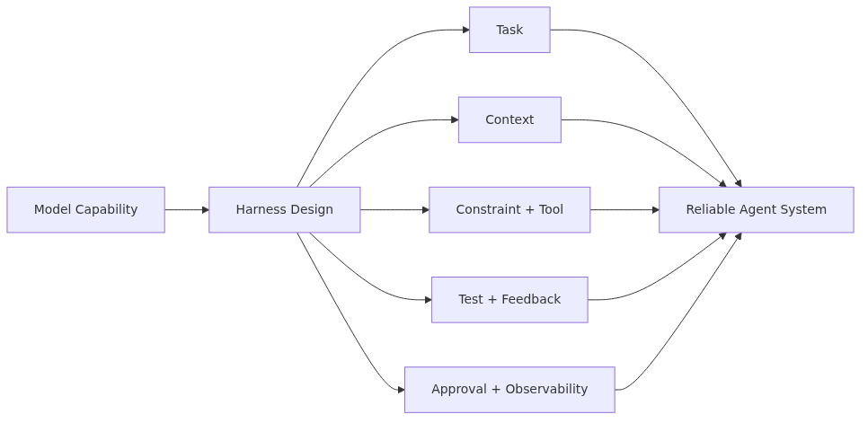
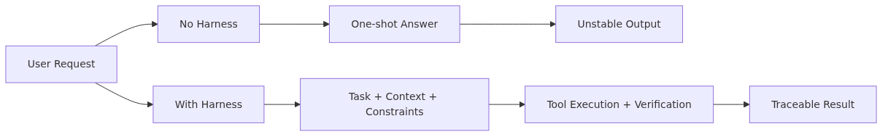
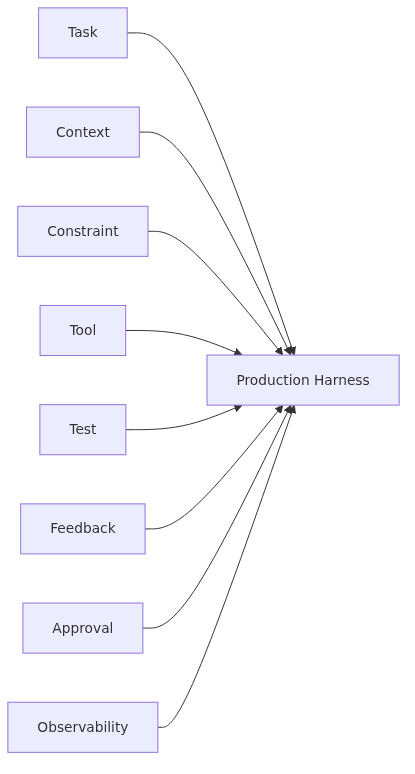
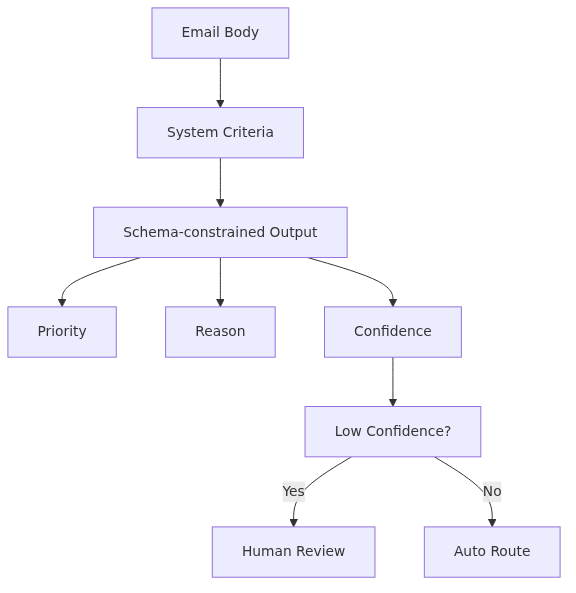

# What Is Harness Engineering?

> Harness Engineering 101 Series (1/10)

Good agents are not made by good models alone. You must design the environment, constraints, tools, and verification loops the model works inside. Harness Engineering is the discipline of designing that environment so the agent can work reliably.

---


## A Good Model Alone Is Not Enough

Every time a new frontier model lands — GPT-4, Claude 3.5, Gemini 1.5 — the same hope follows: "now real agents are finally possible." But with the same model, one team builds a reliable automation system and another team gets different results on every run. The difference is rarely the model. It is **the environment around the model**.

Even a skilled person produces poor work at a messy desk with broken tools. Agents work the same way. Without a clear task definition, clean context, safe tools, explicit completion criteria, a loop that recovers from failure, an approval flow for risky actions, and observability into what was done, even a capable model looks incompetent.

Harness Engineering is the practice of designing that environment. Building a good agent is not about picking a good model. It is about constructing a system the model can work inside.

---

## What Is a Harness?

The English word "harness" originally describes the equipment fitted onto a horse or working animal. It is not a restraint. It is the device that channels the animal's strength in a useful direction. Without a harness, a horse's power scatters and stays uncontrolled. With a harness, the same horse pulls a carriage, plows a field, or carries a rider safely.

The harness in Harness Engineering means the same thing. It is the device that channels an AI model's capability in the direction you want. You do not change the model itself. You design the environment, inputs, constraints, tools, and verification around the model so that it works reliably.

The word is already familiar in software engineering. A test harness provides the environment a function runs inside (setup, teardown, fixtures). A cable harness in embedded systems connects multiple parts in a fixed pattern. An AI agent harness follows the same idea. You set up the environment in advance, and the model works within it.

---

## Agents Without and With a Harness


Without a harness, an agent often looks like this:

```python
from openai import OpenAI

client = OpenAI()

def run_agent(user_message: str) -> str:
    response = client.chat.completions.create(
        model="gpt-4o",
        messages=[{"role": "user", "content": user_message}],
    )
    return response.choices[0].message.content or ""

# Usage
answer = run_agent("Build a sales report for our company")
print(answer)
```

This agent answers once and stops. There are no tools, no memory, and no verification. There is no way to judge whether the result is good, and the same question yields different answers on different runs. It cannot ship to production.

With a harness applied, the same task becomes:

```python
from typing import Any
from pydantic import BaseModel

class TaskSpec(BaseModel):
    """Task Harness: clear inputs and completion criteria."""
    goal: str
    inputs: dict[str, Any]
    completion_criteria: list[str]

class AgentContext(BaseModel):
    """Context Harness: what to show and what to hide."""
    system_prompt: str
    allowed_data_sources: list[str]
    forbidden_topics: list[str]

class ToolPolicy(BaseModel):
    """Constraint + Tool Harness: allowed and forbidden actions."""
    allowed_tools: list[str]
    require_approval: list[str]
    max_iterations: int = 5

def run_agent_with_harness(task: TaskSpec, ctx: AgentContext, policy: ToolPolicy) -> dict[str, Any]:
    """Agent execution with harnesses applied."""
    trace = []  # Observability Harness: record every step

    for iteration in range(policy.max_iterations):
        decision = think_with_context(task, ctx, trace)
        trace.append({"iteration": iteration, "decision": decision})

        if decision["action"] in policy.require_approval:
            if not request_human_approval(decision):
                trace.append({"approval": "denied"})
                break

        result = execute_tool(decision, policy.allowed_tools)
        trace.append({"result": result})

        if check_completion(result, task.completion_criteria):
            return {"status": "success", "trace": trace, "result": result}

    return {"status": "incomplete", "trace": trace}
```

The code is longer, but the agent now guarantees:

- The task is well defined (Task Harness).
- The information it sees is scoped (Context Harness).
- Allowed tools and approval-required actions are explicit (Constraint Harness).
- Loops cannot run forever (Tool Harness).
- Every decision is recorded (Observability).

Same model, completely different system.

---

## The Eight Harnesses


This series covers eight harnesses. Each one designs a different aspect of the agent.

| Harness | Question it answers | Episode |
| --- | --- | --- |
| Task | "What should the agent do?" | 2 |
| Context | "What should the agent see?" | 3 |
| Constraint | "What must the agent not do?" | 4 |
| Tool | "What can the agent use?" | 5 |
| Test | "How do we know it is done?" | 6 |
| Feedback | "How does it recover from failure?" | 7 |
| Approval | "Where must a human stop it?" | 8 |
| Observability | "How do we trace what it did?" | 9 |

Episode 10 integrates all of them into a Production Harness.

These harnesses are not independent. The Tool Harness is defined inside the Constraint Harness. The Approval Gate intercepts specific actions inside the Tool Harness. Observability records the state of every other harness. They have to be designed together to form a coherent system.

---

## Harness vs Framework

People often ask how Harness Engineering relates to frameworks like LangChain, LangGraph, or CrewAI. They live at different layers.

| Aspect | Framework | Harness Engineering |
| --- | --- | --- |
| What it is | A code library | A set of design principles and patterns |
| What it provides | APIs, abstractions, utilities | Decisions about what environment to build |
| Example | A LangGraph node and edge | A Task Harness definition |
| When you choose it | Picked once | Designed for every agent |

Frameworks are tools. Harness Engineering is how you think about what to build with those tools. You can build an agent without a harness using LangGraph, and you can build a well-harnessed agent using only the standard library.

In practice the two combine. Use Harness Engineering first to decide what task, context, constraint, tool, test, feedback, approval, and observability your agent needs. Then use a framework like LangGraph or CrewAI to express that design in code. Design first, framework second.

---

## When You Need Harness Engineering

Not every LLM use needs a full harness. Look for these signals.

**1. The same input produces different results.**
Non-deterministic behavior signals weak Task and Context Harnesses. Your inputs and the scope of context are not pinned down.

**2. You cannot explain what the agent did.**
When a user asks "why did it answer that way?" and you cannot answer, you have no Observability Harness. Every decision and tool call must be recorded.

**3. The agent performs risky actions automatically.**
If the agent deletes data, sends emails, or makes payments without human confirmation, you need an Approval Gate.

**4. Tool call costs explode.**
If the agent repeats the same search 100 times or loops forever, your Constraint and Tool Harnesses are missing.

**5. You cannot tell when the agent is done.**
Without a Test Harness, "I am done" from the agent means nothing.

If you see any one of these, switching models will not save you. You need to design harnesses.

---

## A Small Example: Email Classification Agent


Enough abstraction. Consider a small task: "classify incoming emails by priority." Without a harness:

```python
def classify_email(email_body: str) -> str:
    response = client.chat.completions.create(
        model="gpt-4o-mini",
        messages=[
            {"role": "system", "content": "Classify the email as high, medium, or low."},
            {"role": "user", "content": email_body},
        ],
    )
    return response.choices[0].message.content or ""
```

There are many problems. Output format is not guaranteed. The same email yields different labels. Classification criteria are vague. There is no way to detect a wrong label.

With a harness applied:

```python
from enum import Enum
from pydantic import BaseModel, Field

class Priority(str, Enum):
    HIGH = "high"
    MEDIUM = "medium"
    LOW = "low"

class ClassificationResult(BaseModel):
    """Test Harness: schema pins down completion criteria."""
    priority: Priority
    reason: str = Field(..., min_length=10)
    confidence: float = Field(..., ge=0.0, le=1.0)

SYSTEM_PROMPT = """You are an email priority classifier.

Classification criteria (Context Harness):
- high: response required within 24 hours. Customer complaints, payment failures, security issues.
- medium: response required within 3 business days. General inquiries, feature requests.
- low: response optional. Marketing, notifications, automated emails.

Rules (Constraint Harness):
- Use only one of the three categories above.
- Reason must be a single sentence explaining the basis for the label.
- Confidence must be a number between 0.0 and 1.0.
- Do not infer information not present in the email body."""

def classify_email_with_harness(email_body: str) -> ClassificationResult:
    response = client.chat.completions.create(
        model="gpt-4o-mini",
        messages=[
            {"role": "system", "content": SYSTEM_PROMPT},
            {"role": "user", "content": email_body},
        ],
        response_format=ClassificationResult,  # Test Harness
    )
    return ClassificationResult.model_validate_json(response.choices[0].message.content)
```

The function now guarantees:

- Output always follows `ClassificationResult` schema (Test Harness).
- Classification criteria are spelled out in the system prompt (Context Harness).
- Disallowed categories cannot appear (Constraint Harness).
- Low `confidence` can be detected and routed for human review (Approval link).

Same model, same task, but the harnessed version is something you can actually run in production.

---

## Common Mistakes

**1. Believing a model swap will fix everything.**
Teams expect that switching to GPT-4o makes things accurate, or to Claude 3.5 makes them smarter. Models do differ, but without a harness no model becomes a reliable system.

**2. Trying to build all eight harnesses at once.**
Attempting to design every harness up front blocks you from starting. Begin with Task and Context Harnesses, then add the others where pain appears.

**3. Confusing harnesses with frameworks.**
Adopting LangGraph does not give you harnesses for free. Frameworks are tools. Harnesses are designs. You can have one without the other.

**4. Adding observability last.**
"First make it work, then add logs" is a common postponement. Without observability you cannot debug, so you end up rewriting from scratch. Record every decision and tool call from day one.

**5. Automating risky actions without an Approval Gate.**
"It is just a test environment" leads to automated deletes, sends, and payments that eventually hit production data. Risky actions must pass an Approval Gate from the start, regardless of environment.

---

## Key Takeaways

- A good agent is not built from a good model alone. The environment (the harness) the model works inside must be designed too.
- A harness channels model capability in the direction you want. You design the surroundings, not the model itself.
- This series covers eight harnesses: Task, Context, Constraint, Tool, Test, Feedback, Approval, and Observability.
- Harness Engineering is a design discipline, not a framework. Use frameworks like LangGraph as tools to implement your harness design.
- Non-deterministic behavior, undebuggable runs, automated risky actions, runaway costs, and "is it done?" ambiguity are signals that you need to start designing harnesses.

<!-- toc:begin -->
## In this series

- **What Is Harness Engineering? (current)**
- Task Harness — Turning Vague Work into Executable Tasks (upcoming)
- Context Harness — Designing What the Agent Should Know and Not Know (upcoming)
- Constraint Harness — Defining Rules, Boundaries, and Forbidden Actions (upcoming)
- Tool Harness — Designing Safe Tools for Agents (upcoming)
- Test Harness — Turning Completion Criteria into Tests (upcoming)
- Feedback Loops — Building Structures That Let Agents Recover from Failure (upcoming)
- Approval Gates — Designing Where Humans Must Approve (upcoming)
- Observability — Tracing and Replaying Agent Work (upcoming)
- Production Harness — Building Operational Environments for Agents (upcoming)

<!-- toc:end -->

---

## References

- [Building Effective Agents — Anthropic](https://www.anthropic.com/research/building-effective-agents)
- [LLM Powered Autonomous Agents — Lilian Weng](https://lilianweng.github.io/posts/2023-06-23-agent/)
- [The Rise of Agent Engineering](https://www.langchain.com/blog)
- [OpenAI Function Calling Guide](https://platform.openai.com/docs/guides/function-calling)

Tags: AI Agent, Harness, Production, Reliability
