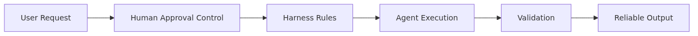

# Approval Gates — Designing Where Humans Must Approve

This is post 8 in the Harness Engineering 101 series.

> Harness Engineering 101 Series (8/10)

Some actions must never run automatically. Payments, deploys, deletes, and outbound messages need human approval. An Approval Gate makes the place where a human must stop and review explicit.

---



*Approval gates - designing where humans must approve*
## What Is an Approval Gate?


*What is an approval Gate*
An Approval Gate is a point where the agent must request human approval before executing a specific action. Automated flow pauses, decision authority hands off to a human, and the agent resumes only after receiving the response.

```python
from dataclasses import dataclass
from typing import Literal

@dataclass
class ApprovalRequest:
    action_id: str
    action_type: str
    summary: str
    risk_level: Literal["low", "medium", "high"]
    payload: dict

@dataclass
class ApprovalDecision:
    action_id: str
    decision: Literal["approve", "reject"]
    approver: str
    reason: str
```

`ApprovalRequest` carries the minimum information a human needs to decide. It must show what the agent intends to do, why it is risky, and what input the action runs against — at a glance.

## Where Should an Approval Gate Sit?

If you put a human in front of every action, automation loses its value; if you skip the gate everywhere, you get incidents. Consider an Approval Gate when any of the following apply:

1. **Irreversible actions**: payments, deploys, deletes, outbound messages
2. **Actions above an amount or scope threshold**: refunds over $1,000, bulk emails to more than 1,000 recipients
3. **Actions with legal or contractual liability**: signing contracts, sending personal data outside the org
4. **Actions where model confidence is low**: self-evaluation score below threshold, first-time use of a new tool

```python
def needs_approval(action_type: str, payload: dict, confidence: float) -> bool:
    if action_type in {"payment", "deploy", "delete", "send_email"}:
        return True
    if action_type == "refund" and payload.get("amount", 0) >= 1000:
        return True
    if confidence < 0.7:
        return True
    return False
```

This function is a checkpoint the agent must pass before invoking a tool. Plug it into the ToolRegistry from the Tool Harness (Ep5), right before the call site.

## Designing the Approval Workflow


*Designing the approval workflow*
The workflow has four stages.

```python
import uuid
from datetime import datetime, timezone

class ApprovalWorkflow:
    def __init__(self, store, notifier):
        self.store = store
        self.notifier = notifier

    def request(self, action_type: str, summary: str, payload: dict, risk: str) -> str:
        action_id = str(uuid.uuid4())
        req = ApprovalRequest(
            action_id=action_id,
            action_type=action_type,
            summary=summary,
            risk_level=risk,
            payload=payload,
        )
        self.store.save_request(req, created_at=datetime.now(timezone.utc))
        self.notifier.notify(req)
        return action_id

    def wait(self, action_id: str, timeout_sec: int = 600) -> ApprovalDecision | None:
        return self.store.wait_for_decision(action_id, timeout_sec)

    def execute_if_approved(self, action_id: str, executor):
        decision = self.store.get_decision(action_id)
        if decision is None:
            return {"status": "pending"}
        if decision.decision == "reject":
            return {"status": "rejected", "reason": decision.reason}
        result = executor()
        self.store.mark_executed(action_id, result)
        return {"status": "executed", "result": result}
```

1. **request**: the agent creates the approval request and notifies a human.
2. **wait**: the system waits for a decision. No response within the window counts as a timeout.
3. **execute_if_approved**: the action runs only if approved.
4. **log**: every step gets recorded (Observability — covered in Ep9).

## Separating Dry-run from Commit


*Separating Dry-run from commit*
If you include a preview of "what would actually happen" in the approval request, the human can decide far more accurately. A dry-run computes the result without producing side effects.

```python
class RefundTool:
    def dry_run(self, payload: dict) -> dict:
        return {
            "would_refund": payload["amount"],
            "to_account": payload["account_id"],
            "remaining_balance": self._balance(payload["account_id"]) - payload["amount"],
            "affects_records": ["transactions", "ledger", "audit_log"],
        }

    def commit(self, payload: dict) -> dict:
        return self._execute_refund(payload)
```

The Approval Gate must include the `dry_run` result inside `ApprovalRequest.summary`. Only then can the human see "approving this refund will leave the balance at -$500" up front and reject it.

## Decision Logging — Who, When, and Why

The record of an approval matters more than the approval itself. When an incident hits, if you cannot trace "why this decision was made," the same incident will repeat.

```python
@dataclass
class ApprovalLog:
    action_id: str
    action_type: str
    payload: dict
    dry_run_preview: dict
    requested_at: datetime
    decided_at: datetime
    approver: str
    decision: str
    reason: str
    executed_at: datetime | None
    result: dict | None
```

The log must answer five questions:

1. **What was the agent trying to do?** action_type, payload
2. **What information was available at decision time?** dry_run_preview
3. **Who decided?** approver
4. **Why this decision?** reason (required field)
5. **What actually executed?** result

## Five Common Mistakes

1. **Requiring approval for everything.** You lose the value of automation, and humans stop reading the requests carefully. Set explicit risk thresholds.
2. **Approval requests without enough context.** "Approve this refund?" forces the human to reject by default. Always include a dry-run preview.
3. **No timeout policy.** If no one responds, the agent stalls forever. Auto-rejecting on timeout is the safer default.
4. **Not requiring a rejection reason.** A bare reject without a reason invites the same request again. Treat rejection reasons as a learning signal.
5. **No delegation of approval authority.** If only one person can approve, the system halts when they go on vacation. Design an authority matrix.

## Key Takeaways

- An Approval Gate is the point where a human decides before an irreversible or liability-bearing action runs.
- Use explicit rules like `needs_approval` to decide where gates belong.
- The workflow is four stages: request, wait, execute, log.
- Include a dry-run preview in the request so humans see consequences before deciding.
- An ApprovalLog must answer the 5W1H so post-incident review can succeed.

The next post covers Observability — how to record, trace, and replay agent runs.

<!-- toc:begin -->
## In this series

- [What Is Harness Engineering?](./01-what-is-harness-engineering.md)
- [Task Harness — Turning Vague Work into Executable Tasks](./02-task-harness.md)
- [Context Harness — Designing What the Agent Should Know and Not Know](./03-context-harness.md)
- [Constraint Harness — Defining Rules, Boundaries, and Forbidden Actions](./04-constraint-harness.md)
- [Tool Harness — Designing Safe Tools for Agents](./05-tool-harness.md)
- [Test Harness — Turning Completion Criteria into Tests](./06-test-harness.md)
- [Feedback Loops — Building Structures That Let Agents Recover from Failure](./07-feedback-loop.md)
- **Approval Gates — Designing Where Humans Must Approve (current)**
- Observability — Tracing and Replaying Agent Work (upcoming)
- Production Harness — Building Operational Environments for Agents (upcoming)

<!-- toc:end -->

---

## References

- [Anthropic — Building Effective Agents](https://www.anthropic.com/research/building-effective-agents)
- [OpenAI — Best practices for safety in agent systems](https://platform.openai.com/docs/guides/safety-best-practices)
- [Google SRE — Postmortem culture](https://sre.google/sre-book/postmortem-culture/)
- [LangChain — Human-in-the-loop](https://python.langchain.com/docs/concepts/human_in_the_loop/)

Tags: AI Agent, Harness, Production, Reliability
