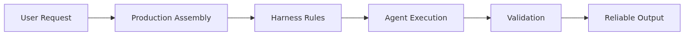
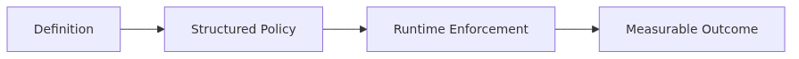
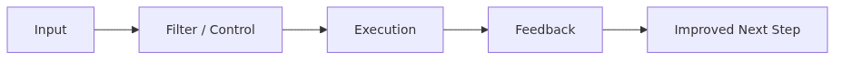
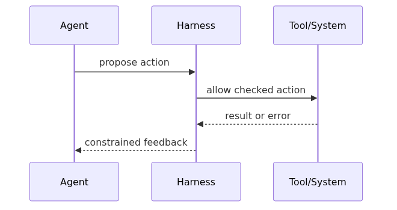

# Production Harness — Building Operational Environments for Agents

> Harness Engineering 101 Series (10/10)

This episode integrates every harness covered so far into a production-ready agent environment. The Production Harness assembles task, context, constraint, tool, test, feedback, approval, and observability into a single working system.

---



*Production harness - building operational environments for agents*
## What Is the Production Harness?

The Production Harness is the final layer that binds the nine harnesses we have covered into one operable system. No matter how well each individual harness is built, without deployment, rollback, and on-call flow it cannot reach real users safely.

```python
from dataclasses import dataclass

@dataclass
class HarnessStack:
    task: object          # Ep2 — TaskSpec
    context: object       # Ep3 — ContextBudget
    constraint: object    # Ep4 — ConstraintPolicy
    tools: object         # Ep5 — ToolRegistry
    tests: object         # Ep6 — eval suite
    feedback: object      # Ep7 — FeedbackLoop
    approval: object      # Ep8 — ApprovalWorkflow
    observability: object # Ep9 — Tracer
```

The Production Harness takes this stack and packages it into "something deployable."

## How the Nine Harnesses Fit Together



*How the nine harnesses fit together*
When a request arrives, it flows in this order:

```python
def handle_request(stack: HarnessStack, user_input: str) -> dict:
    with stack.observability.trace("agent.run") as trace:
        spec = stack.task.parse(user_input)
        ctx = stack.context.assemble(spec)
        plan = stack.feedback.run_until_done(
            spec=spec,
            context=ctx,
            execute_step=lambda step: _execute_step(stack, step, trace),
        )
        return plan.result

def _execute_step(stack: HarnessStack, step, trace):
    stack.constraint.check(step)
    if stack.approval.needs_approval(step):
        decision = stack.approval.request_and_wait(step)
        if decision.decision == "reject":
            return {"status": "rejected"}
    with trace.child(f"tool.{step.tool}"):
        return stack.tools.invoke(step.tool, step.input)
```

Each harness owns exactly one responsibility, and the interface to the next harness must be clear. When responsibilities blur, you stop knowing where to fix things.

## Deployment Pattern — Gradual Rollout



*Deployment pattern - gradual rollout*
A new prompt or tool never goes to 100% of users in one shot.

```python
class CanaryDeployer:
    def __init__(self, baseline, candidate):
        self.baseline = baseline
        self.candidate = candidate

    def route(self, request, traffic_percent: int) -> str:
        bucket = hash(request.user_id) % 100
        return "candidate" if bucket < traffic_percent else "baseline"

    def should_promote(self, baseline_metrics, candidate_metrics) -> bool:
        if candidate_metrics.error_rate > baseline_metrics.error_rate * 1.1:
            return False
        if candidate_metrics.p95_latency_ms > baseline_metrics.p95_latency_ms * 1.2:
            return False
        if candidate_metrics.avg_cost_usd > baseline_metrics.avg_cost_usd * 1.5:
            return False
        return True
```

The standard ramp is 1% → 10% → 50% → 100%, comparing candidate against baseline for at least one hour at each step. If `should_promote` returns False at any step, you roll back to 0% immediately.

## Rollback — A Deploy Is Only a Deploy if You Can Undo It



*Rollback - A deploy is only a deploy if you can undo it*
If you cannot return to the previous version within 30 seconds of a deploy, that is not a deploy — it is an incident.

```python
class HarnessVersion:
    def __init__(self, version_id: str, stack: HarnessStack):
        self.version_id = version_id
        self.stack = stack

class HarnessRouter:
    def __init__(self):
        self.versions: dict[str, HarnessVersion] = {}
        self.active_id: str | None = None
        self.previous_id: str | None = None

    def deploy(self, version: HarnessVersion):
        self.versions[version.version_id] = version
        self.previous_id = self.active_id
        self.active_id = version.version_id

    def rollback(self) -> str:
        if self.previous_id is None:
            raise RuntimeError("no previous version to roll back to")
        self.active_id, self.previous_id = self.previous_id, self.active_id
        return self.active_id
```

Prompt, tool definition, and eval dataset all share a version_id and roll back together. If you roll back the prompt but leave the tools, you end up with an unknown combination.

## On-call Runbook — Woken Up at 3 AM

When an alert fires, the on-call engineer needs the runbook to spell out what to look at and what to decide.

```text
ALERT: agent.error_rate > 10% for 5 min

1. Check traces
   - Open the most recent 50 traces in the observability dashboard
   - Find what the failing spans have in common (model? tool? step?)

2. First-pass decision (within 5 min)
   - External dependency outage? → disable that tool + check status page
   - Right after a deploy? → run rollback() immediately
   - Specific user/input pattern? → quarantine that pattern

3. Second-pass action (within 30 min)
   - Open a postmortem ticket (include trace_id)
   - Add the failing case to the eval suite
   - Verify the same pattern is auto-blocked next time
```

The runbook lives next to the code, is version-controlled, and gets exercised every quarter with a fire drill.

## Capstone Example — Refund-Processing Agent

The minimal example with all nine harnesses applied:

```python
def build_refund_agent() -> HarnessStack:
    return HarnessStack(
        task=TaskParser(allowed_intents={"refund", "status"}),
        context=ContextBudget(max_tokens=4000, retrieval=OrderHistoryRAG()),
        constraint=ConstraintPolicy(
            max_amount_usd=10000,
            max_calls_per_run=5,
            allowed_tools={"lookup_order", "calc_refund", "issue_refund"},
        ),
        tools=ToolRegistry([LookupOrderTool(), CalcRefundTool(), IssueRefundTool()]),
        tests=EvalSuite.load("evals/refund/v3.jsonl"),
        feedback=FeedbackLoop(max_retries=2, max_reflects=1),
        approval=ApprovalWorkflow(
            store=PostgresApprovalStore(),
            notifier=SlackNotifier(channel="#refunds-approval"),
            rule=lambda step: step.tool == "issue_refund" and step.input["amount"] >= 100,
        ),
        observability=Tracer(exporter=OtelExporter(endpoint="https://otel.internal")),
    )
```

Register this stack with `HarnessRouter`, deploy it 1% → 100% through `CanaryDeployer`, and you have a production-ready agent.

## Five Common Mistakes

1. **Adopting all harnesses at once.** The operational burden lands all at once and no harness gets used properly. Start with Approval and Observability.
2. **Not testing rollback.** You only learn rollback is broken when you need it during an incident. Run an actual rollback fire drill every quarter.
3. **Deploying to 100% without canary.** Ten thousand users get broken responses simultaneously. Always start at 1%.
4. **Keeping the on-call runbook outside the code.** A wiki-only runbook goes stale fast. Keep it in the repo and update it via PR.
5. **Versioning eval suite separately from the prompt.** A new prompt passes the old eval, ships, and breaks for real users. Bind them to the same version_id.

## Key Takeaways

- The Production Harness is the final layer that wraps the nine harnesses into a deployable unit.
- Each harness owns one responsibility with a clear interface to the next.
- Canary deploy (1% → 10% → 50% → 100%) and 30-second rollback are the minimum production bar.
- The on-call runbook lives in the repo and is exercised quarterly via fire drill.
- Prompts, tools, and eval datasets share the same version_id and roll back together.

This is the final post in the series. Combining the nine harnesses from Harness Engineering 101 with this production layer is what turns "a demo that looks good but breaks in production" into "an agent users trust."

<!-- toc:begin -->
## In this series

- [What Is Harness Engineering?](./01-what-is-harness-engineering.md)
- [Task Harness — Turning Vague Work into Executable Tasks](./02-task-harness.md)
- [Context Harness — Designing What the Agent Should Know and Not Know](./03-context-harness.md)
- [Constraint Harness — Defining Rules, Boundaries, and Forbidden Actions](./04-constraint-harness.md)
- [Tool Harness — Designing Safe Tools for Agents](./05-tool-harness.md)
- [Test Harness — Turning Completion Criteria into Tests](./06-test-harness.md)
- [Feedback Loops — Building Structures That Let Agents Recover from Failure](./07-feedback-loop.md)
- [Approval Gates — Designing Where Humans Must Approve](./08-approval-gate.md)
- [Observability — Tracing and Replaying Agent Work](./09-observability.md)
- **Production Harness — Building Operational Environments for Agents (current)**

<!-- toc:end -->

---

## References

- [Google SRE — Release engineering](https://sre.google/sre-book/release-engineering/)
- [Martin Fowler — CanaryRelease](https://martinfowler.com/bliki/CanaryRelease.html)
- [Anthropic — Building Effective Agents](https://www.anthropic.com/research/building-effective-agents)
- [PagerDuty — Incident response documentation](https://response.pagerduty.com/)

Tags: AI Agent, Harness, Production, Reliability
