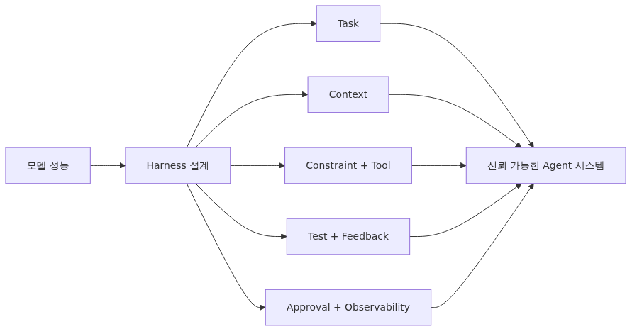
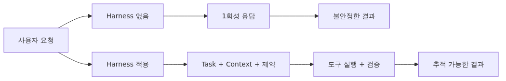
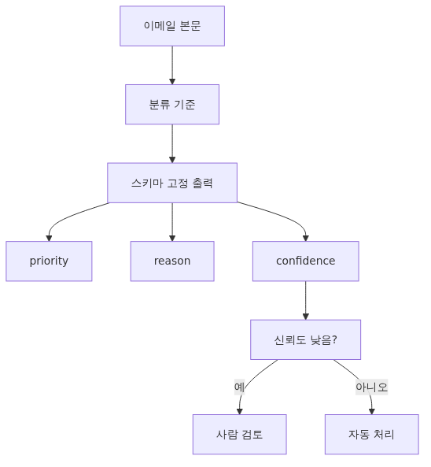

# Harness Engineering이란 무엇인가?

> Harness Engineering 101 시리즈 (1/10)

좋은 Agent는 좋은 모델만으로 만들어지지 않습니다. 모델이 일할 수 있는 환경, 제약, 도구, 검증 루프를 함께 설계해야 합니다. Harness Engineering은 Agent가 안정적으로 일하도록 환경을 설계하는 일입니다.

---


## 좋은 모델만으로는 부족합니다

GPT-4, Claude 3.5, Gemini 1.5 같은 최신 모델이 등장할 때마다 "이제는 진짜 Agent가 가능하다"는 기대가 따라옵니다. 하지만 같은 모델로 누군가는 안정적인 자동화 시스템을 만들고, 누군가는 매번 다른 결과를 받으며 좌절합니다. 차이는 모델이 아니라 **모델 주변의 환경**에 있습니다.

같은 사람이라도 책상이 어지럽고 도구가 망가져 있으면 좋은 결과를 내기 어렵습니다. Agent도 마찬가지입니다. 모델에게 적절한 작업 정의, 깨끗한 컨텍스트, 안전한 도구, 명확한 완료 조건, 실패를 회복할 루프, 위험한 행동에 대한 승인 흐름, 그리고 무엇을 했는지 추적할 관측 가능성이 없으면 능력 있는 모델도 무능해 보입니다.

Harness Engineering은 이 환경을 설계하는 일입니다. 좋은 Agent를 만드는 일은 좋은 모델을 고르는 일이 아니라, 모델이 잘 일할 수 있는 시스템을 짓는 일입니다.

---

## Harness란 무엇인가

영어 "harness"는 말이나 동물에 채우는 마구를 뜻합니다. 단순히 묶는 도구가 아니라 동물의 힘을 원하는 방향으로 전달하기 위한 장치입니다. 마구가 없으면 말의 힘은 분산되고 통제가 안 됩니다. 마구가 있으면 같은 말이 마차를 끌고 밭을 갈고 사람을 태웁니다.

Harness Engineering의 harness도 같은 의미입니다. AI 모델의 능력을 원하는 방향으로 전달하기 위한 장치입니다. 모델 자체를 바꾸지 않고 모델이 일하는 환경, 입력, 제약, 도구, 검증을 설계함으로써 모델이 안정적으로 일하게 만듭니다.

소프트웨어 엔지니어링에서 harness라는 단어는 이미 쓰입니다. 테스트 harness는 함수가 동작하는 환경(setup, teardown, fixture)을 제공합니다. 임베디드 시스템의 cable harness는 여러 부품을 정해진 방식으로 연결합니다. AI Agent harness도 같은 발상입니다. 모델이 동작할 환경을 미리 짜 놓고, 모델은 그 안에서 일합니다.

---

## Harness가 없는 Agent와 있는 Agent


Harness 없이 Agent를 만들면 다음 같은 코드가 됩니다.

```python
from openai import OpenAI

client = OpenAI()

def run_agent(user_message: str) -> str:
    response = client.chat.completions.create(
        model="gpt-4o",
        messages=[{"role": "user", "content": user_message}],
    )
    return response.choices[0].message.content or ""

# 사용
answer = run_agent("우리 회사 매출 보고서를 만들어 줘")
print(answer)
```

이 Agent는 한 번 답하고 끝납니다. 도구가 없고, 메모리가 없고, 검증도 없습니다. 결과가 좋은지 나쁜지 판단할 방법이 없고, 같은 질문에 매번 다른 답이 옵니다. 프로덕션에서는 쓸 수 없습니다.

같은 작업을 harness가 있는 Agent로 만들면 다음과 같이 변합니다.

```python
from typing import Any
from pydantic import BaseModel

class TaskSpec(BaseModel):
    """Task Harness: 명확한 입력과 완료 조건."""
    goal: str
    inputs: dict[str, Any]
    completion_criteria: list[str]

class AgentContext(BaseModel):
    """Context Harness: Agent에게 줄 정보와 숨길 정보."""
    system_prompt: str
    allowed_data_sources: list[str]
    forbidden_topics: list[str]

class ToolPolicy(BaseModel):
    """Constraint + Tool Harness: 허용/금지 행동."""
    allowed_tools: list[str]
    require_approval: list[str]
    max_iterations: int = 5

def run_agent_with_harness(task: TaskSpec, ctx: AgentContext, policy: ToolPolicy) -> dict[str, Any]:
    """Harness가 적용된 Agent 실행."""
    trace = []  # Observability Harness: 모든 단계 기록

    for iteration in range(policy.max_iterations):
        decision = think_with_context(task, ctx, trace)
        trace.append({"iteration": iteration, "decision": decision})

        if decision["action"] in policy.require_approval:
            if not request_human_approval(decision):
                trace.append({"approval": "denied"})
                break

        result = execute_tool(decision, policy.allowed_tools)
        trace.append({"result": result})

        if check_completion(result, task.completion_criteria):
            return {"status": "success", "trace": trace, "result": result}

    return {"status": "incomplete", "trace": trace}
```

코드량은 늘어났지만 이제 이 Agent는 다음을 보장합니다.

- 무엇을 해야 하는지 명확합니다 (Task Harness).
- 어떤 정보를 보고 어떤 정보를 숨길지 정해져 있습니다 (Context Harness).
- 어떤 도구를 쓰고 어떤 행동에 사람 승인이 필요한지 명시되어 있습니다 (Constraint Harness).
- 무한 루프를 막는 한계가 있습니다 (Tool Harness).
- 무엇을 했는지 모두 기록됩니다 (Observability).

같은 모델이지만 결과는 완전히 다릅니다.

---

## 8가지 Harness 개요


이 시리즈는 다음 여덟 가지 harness를 다룹니다. 각각은 Agent의 한 측면을 설계합니다.

| Harness | 다루는 질문 | 회 차 |
| --- | --- | --- |
| Task | "Agent가 무엇을 해야 하는가" | 2 |
| Context | "Agent에게 무엇을 보여줄 것인가" | 3 |
| Constraint | "Agent가 무엇을 하면 안 되는가" | 4 |
| Tool | "Agent가 무엇을 사용할 수 있는가" | 5 |
| Test | "끝났는지 어떻게 확인하는가" | 6 |
| Feedback | "실패하면 어떻게 회복하는가" | 7 |
| Approval | "사람이 어디서 멈춰야 하는가" | 8 |
| Observability | "무엇을 했는지 어떻게 추적하는가" | 9 |

10편에서는 이 모든 harness를 한 시스템으로 통합한 Production Harness를 만듭니다.

각 harness는 독립적이지 않습니다. Tool Harness는 Constraint Harness 안에서 정의되고, Approval Gate는 Tool Harness의 특정 행동을 가로챕니다. Observability는 모든 harness의 상태를 기록합니다. 8가지를 함께 설계해야 일관된 시스템이 됩니다.

---

## Harness vs Framework

LangChain, LangGraph, CrewAI 같은 프레임워크와 Harness Engineering의 관계를 자주 묻습니다. 둘은 다른 층위입니다.

| 항목 | 프레임워크 | Harness Engineering |
| --- | --- | --- |
| 무엇 | 코드 라이브러리 | 설계 원칙과 패턴 |
| 제공 | API, 추상화, 유틸리티 | 어떤 환경을 만들지에 대한 의사결정 |
| 예시 | LangGraph 노드/엣지 | Task Harness 정의 |
| 선택 | 한 번 결정 | 매 Agent마다 설계 |

프레임워크는 도구이고 Harness Engineering은 그 도구로 무엇을 짤지에 대한 사고법입니다. LangGraph로도 harness가 없는 Agent를 만들 수 있고, 표준 라이브러리만으로도 harness가 잘 갖춰진 Agent를 만들 수 있습니다.

실제로는 이렇게 결합합니다. Harness Engineering으로 "이 Agent는 어떤 task, context, constraint, tool, test, feedback, approval, observability를 가져야 하는가"를 먼저 설계합니다. 그다음 그 설계를 코드로 옮길 때 LangGraph나 CrewAI 같은 프레임워크의 추상화를 사용합니다. 설계가 먼저고 프레임워크는 그다음입니다.

---

## Harness Engineering이 필요한 시점

모든 LLM 사용에 harness가 필요하지는 않습니다. 다음 신호가 보이면 harness 설계를 시작할 때입니다.

**1. 같은 입력에 다른 결과가 나옵니다.**
Agent가 비결정적으로 동작한다면 Task와 Context Harness가 부족하다는 뜻입니다. 입력 정의와 컨텍스트 범위가 명확하지 않습니다.

**2. Agent가 무엇을 했는지 설명할 수 없습니다.**
사용자가 "왜 이렇게 답했냐"고 물었을 때 답할 수 없다면 Observability Harness가 없습니다. 모든 결정과 도구 호출이 기록되어야 합니다.

**3. Agent가 위험한 행동을 자동으로 합니다.**
DB 삭제, 메일 발송, 결제 같은 행동을 사람 확인 없이 한다면 Approval Gate가 필요합니다.

**4. 도구 호출 비용이 폭발합니다.**
Agent가 같은 검색을 100번 반복하거나 무한 루프에 빠진다면 Constraint와 Tool Harness가 부족합니다.

**5. "이 Agent는 끝났는가"를 판단할 수 없습니다.**
Test Harness가 없으면 Agent가 "완료했습니다"라고 말해도 진짜 완료인지 알 수 없습니다.

이 중 하나라도 해당하면 모델 교체로는 해결되지 않습니다. Harness 설계가 필요합니다.

---

## 작은 예: 이메일 분류 Agent


추상적인 설명을 끝내고 작은 사례를 봅니다. "들어오는 이메일을 우선순위별로 분류한다"는 작업을 harness 없이 짜면 다음과 같습니다.

```python
def classify_email(email_body: str) -> str:
    response = client.chat.completions.create(
        model="gpt-4o-mini",
        messages=[
            {"role": "system", "content": "이메일을 high, medium, low로 분류해."},
            {"role": "user", "content": email_body},
        ],
    )
    return response.choices[0].message.content or ""
```

문제가 많습니다. 출력 형식이 보장되지 않습니다. 같은 메일에 다른 결과가 나옵니다. 분류 기준이 모호합니다. 잘못된 분류를 감지할 방법이 없습니다.

Harness를 적용하면 다음과 같이 바뀝니다.

```python
from enum import Enum
from pydantic import BaseModel, Field

class Priority(str, Enum):
    HIGH = "high"
    MEDIUM = "medium"
    LOW = "low"

class ClassificationResult(BaseModel):
    """Test Harness: 출력 스키마로 완료 조건 고정."""
    priority: Priority
    reason: str = Field(..., min_length=10)
    confidence: float = Field(..., ge=0.0, le=1.0)

SYSTEM_PROMPT = """당신은 이메일 우선순위 분류기입니다.

분류 기준 (Context Harness):
- high: 24시간 내 응답 필요. 고객 항의, 결제 실패, 보안 이슈.
- medium: 3영업일 내 응답. 일반 문의, 기능 요청.
- low: 응답 선택. 마케팅, 알림, 자동화 메일.

규칙 (Constraint Harness):
- 반드시 위 세 카테고리 중 하나만 사용한다.
- reason은 분류 근거를 한 문장으로 적는다.
- confidence는 0.0과 1.0 사이의 숫자로 적는다.
- 메일 본문 외부의 정보는 추측하지 않는다."""

def classify_email_with_harness(email_body: str) -> ClassificationResult:
    response = client.chat.completions.create(
        model="gpt-4o-mini",
        messages=[
            {"role": "system", "content": SYSTEM_PROMPT},
            {"role": "user", "content": email_body},
        ],
        response_format=ClassificationResult,  # Test Harness
    )
    return ClassificationResult.model_validate_json(response.choices[0].message.content)
```

이제 이 함수는 다음을 보장합니다.

- 출력은 항상 `ClassificationResult` 스키마를 따릅니다 (Test Harness).
- 분류 기준이 시스템 프롬프트에 명시되어 있습니다 (Context Harness).
- 허용되지 않은 카테고리는 나오지 않습니다 (Constraint Harness).
- `confidence`로 낮은 확신도를 감지하고 사람 검토로 보낼 수 있습니다 (Approval 연계).

같은 모델, 같은 작업이지만 harness가 있는 버전은 프로덕션에서 쓸 수 있는 시스템입니다.

---

## 흔한 실수

**1. 모델만 바꾸면 좋아질 거라고 생각합니다.**
GPT-4o로 바꾸면 정확해지고, Claude 3.5로 바꾸면 똑똑해질 거라고 기대합니다. 모델 차이는 분명히 있지만, harness가 없으면 어떤 모델도 안정적인 시스템이 되지 않습니다.

**2. Harness를 한 번에 다 만들려고 합니다.**
8가지 harness를 처음부터 다 갖추려 하면 시작도 못 합니다. Task와 Context Harness부터 시작하고, 문제가 생기는 지점에 다른 harness를 추가합니다.

**3. Harness를 프레임워크로 착각합니다.**
LangGraph를 도입하면 harness가 자동으로 생긴다고 생각하지 않습니다. 프레임워크는 도구이고 harness는 설계입니다. 프레임워크 없이도 harness를 잘 만들 수 있고, 프레임워크가 있어도 harness가 없을 수 있습니다.

**4. Observability를 마지막에 추가합니다.**
"먼저 동작하게 만들고 나중에 로그를 넣자"고 미루는 사례가 많습니다. Observability가 없으면 디버깅이 불가능해 결국 처음부터 다시 짜야 합니다. 처음부터 모든 결정과 도구 호출을 기록합니다.

**5. Approval Gate 없이 위험한 행동을 자동화합니다.**
"테스트 환경이니까 괜찮다"며 삭제, 발송, 결제 같은 행동을 자동화하다가 운영 데이터에 사고가 납니다. 위험한 행동은 환경과 무관하게 처음부터 Approval Gate를 거치게 합니다.

---

## 핵심 요약

- 좋은 Agent는 좋은 모델만으로 만들어지지 않습니다. 모델이 일할 환경(harness)을 함께 설계해야 합니다.
- Harness는 Agent의 능력을 원하는 방향으로 전달하는 장치입니다. 모델 자체가 아니라 모델 주변을 설계합니다.
- 이 시리즈는 Task, Context, Constraint, Tool, Test, Feedback, Approval, Observability의 8가지 harness를 다룹니다.
- Harness Engineering은 프레임워크가 아니라 설계 원칙입니다. LangGraph 같은 프레임워크는 harness를 구현하는 도구로 사용합니다.
- 비결정적 동작, 디버깅 불가, 위험한 자동화, 비용 폭발, 완료 판단 불가 중 하나라도 보이면 harness 설계를 시작할 신호입니다.

<!-- toc:begin -->
## 시리즈 목차

- **Harness Engineering이란 무엇인가? (현재 글)**
- Task Harness — 모호한 일을 실행 가능한 작업으로 바꾸기 (예정)
- Context Harness — Agent에게 줄 정보와 숨길 정보 설계하기 (예정)
- Constraint Harness — 규칙, 경계, 금지 행동 정의하기 (예정)
- Tool Harness — Agent가 사용할 도구를 안전하게 설계하기 (예정)
- Test Harness — 완료 조건을 테스트로 고정하기 (예정)
- Feedback Loop — 실패를 고치게 만드는 반복 구조 (예정)
- Approval Gate — 사람 승인이 필요한 지점 설계하기 (예정)
- Observability — Agent 작업을 추적하고 재현하기 (예정)
- Production Harness — 운영 가능한 Agent 작업 환경 만들기 (예정)

<!-- toc:end -->

---

## 참고 자료

- [Building Effective Agents — Anthropic](https://www.anthropic.com/research/building-effective-agents)
- [LLM Powered Autonomous Agents — Lilian Weng](https://lilianweng.github.io/posts/2023-06-23-agent/)
- [The Rise of Agent Engineering](https://www.langchain.com/blog)
- [OpenAI Function Calling Guide](https://platform.openai.com/docs/guides/function-calling)

Tags: AI Agent, Harness, Production, Reliability
