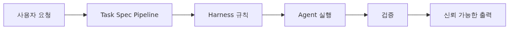
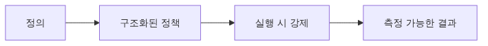

# Task Harness — 모호한 일을 실행 가능한 작업으로 바꾸기

> Harness Engineering 101 시리즈 (2/10)

Agent에게 모호한 지시를 던지면 모호한 결과가 돌아옵니다. Task Harness는 모호한 일을 명확한 입력, 출력, 완료 조건이 있는 실행 가능한 작업으로 변환합니다.

---


## 모호한 일은 실행할 수 없습니다

"우리 팀 보고서를 정리해 줘"라는 지시를 Agent에게 던지면 결과는 보장되지 않습니다. 어떤 보고서를 말하는지, 어디서 가져와야 하는지, 정리한다는 것이 요약인지 재구성인지 형식 변환인지 모호합니다. 사람도 이런 지시를 받으면 다시 묻습니다. Agent는 묻지 않고 추측합니다. 그리고 잘못 추측합니다.

Task Harness는 모호한 일을 명확한 입력, 출력, 완료 조건이 있는 실행 가능한 작업으로 변환하는 설계입니다. 이 변환이 없으면 다른 모든 harness가 의미를 잃습니다. Context도 Constraint도 Test도 모두 "어떤 task를 위한 것인가"에서 시작합니다.

이번 글에서는 Task의 구성 요소, Task Spec 작성법, 그리고 모호한 요구를 실행 가능한 task로 분해하는 방법을 다룹니다.

---

## Task의 4가지 구성 요소


실행 가능한 task는 네 가지를 가집니다.

1. **Goal**: 무엇을 달성해야 하는가. 한 문장으로 적습니다.
2. **Inputs**: Agent가 사용할 수 있는 정보와 자원. 데이터 소스, 파라미터, 사전 조건.
3. **Outputs**: Agent가 만들어야 하는 결과물의 형식과 위치.
4. **Completion criteria**: 끝났는지 판단하는 기준. 자동으로 검증 가능해야 합니다.

이 네 가지가 모두 명시되어 있으면 task는 실행 가능합니다. 하나라도 빠지면 Agent는 추측합니다.

```python
from pydantic import BaseModel, Field
from typing import Any

class TaskSpec(BaseModel):
    """실행 가능한 작업의 명세."""
    goal: str = Field(..., description="달성할 목표 (한 문장)")
    inputs: dict[str, Any] = Field(..., description="입력 데이터와 자원")
    output_schema: dict[str, Any] = Field(..., description="결과물 스키마")
    completion_criteria: list[str] = Field(..., min_length=1, description="자동 검증 가능한 완료 조건")
```

`completion_criteria`가 자동 검증 가능해야 한다는 점이 중요합니다. "보고서가 좋아야 한다"는 검증할 수 없습니다. "출력이 ReportSchema를 만족하고, 모든 항목이 비어 있지 않아야 한다"는 검증할 수 있습니다.

---

## 모호한 요구를 분해하기


처음에는 사용자나 시스템 요구가 모호한 자연어로 옵니다. Task Harness의 첫 단계는 이를 명확한 TaskSpec으로 변환하는 일입니다.

예시: "지난 분기 매출 보고서를 만들어 줘"

분해 과정:

| 항목 | 모호한 표현 | 명확한 정의 |
| --- | --- | --- |
| Goal | 매출 보고서 만들기 | "2026 Q1 매출을 부서별로 집계한 PDF 보고서 생성" |
| Inputs | (불명) | "sales_db의 2026-01-01 ~ 2026-03-31 transactions 테이블, departments 마스터 테이블" |
| Outputs | (불명) | "ReportSchema(quarter, total_revenue, by_department[], generated_at)" |
| Criteria | "잘 만들어야" | "스키마 검증 통과, 부서 합계 = 전체 합계, generated_at은 현재 시각 ±5분" |

이렇게 분해한 결과를 코드로 옮기면 다음과 같습니다.

```python
quarterly_report_task = TaskSpec(
    goal="2026 Q1 매출을 부서별로 집계한 PDF 보고서 생성",
    inputs={
        "data_sources": ["sales_db.transactions", "sales_db.departments"],
        "date_range": {"start": "2026-01-01", "end": "2026-03-31"},
        "output_format": "pdf",
    },
    output_schema={
        "quarter": "string",
        "total_revenue": "number",
        "by_department": "array",
        "generated_at": "datetime",
    },
    completion_criteria=[
        "output matches ReportSchema",
        "sum(by_department.revenue) == total_revenue",
        "abs(generated_at - now()) < 5 minutes",
    ],
)
```

원래 한 문장이 네 가지 항목으로 분해되었습니다. 이제 Agent는 무엇을 해야 하는지 명확히 알고, 시스템은 결과가 끝났는지 판단할 수 있습니다.

---

## 작은 task로 쪼개기

큰 task는 보통 실행 가능하지 않습니다. "신규 회원 가입 기능을 구현해 줘"는 너무 큽니다. 한 번의 LLM 호출로 처리할 수 없고, 도구 호출 횟수도 예측 불가능합니다. 작은 task로 쪼개야 합니다.

좋은 task 크기의 신호는 다음과 같습니다.

- 한 가지 결과물을 만듭니다.
- 5번 이내의 도구 호출로 끝납니다.
- 완료 조건이 1~3개입니다.
- 사람이 읽으면 무엇을 해야 하는지 즉시 이해됩니다.

위 예시를 쪼개면 다음과 같습니다.

```python
subtasks = [
    TaskSpec(
        goal="회원 가입 API 엔드포인트 스펙 작성",
        inputs={"requirements": "이메일, 비밀번호, 이름 필수"},
        output_schema={"endpoint": "string", "request_schema": "object", "response_schema": "object"},
        completion_criteria=["스키마 유효성 검사 통과", "에러 응답 정의 포함"],
    ),
    TaskSpec(
        goal="User 모델과 마이그레이션 작성",
        inputs={"db": "postgres", "orm": "sqlalchemy"},
        output_schema={"model_file": "string", "migration_file": "string"},
        completion_criteria=["모델 import 가능", "alembic upgrade 성공"],
    ),
    TaskSpec(
        goal="가입 핸들러 구현",
        inputs={"endpoint_spec": "...", "user_model": "..."},
        output_schema={"handler_file": "string"},
        completion_criteria=["pytest tests/test_signup.py 통과", "타입 체크 통과"],
    ),
]
```

각 task는 독립적으로 실행 가능하고 검증할 수 있습니다. 큰 작업이 작은 task의 시퀀스로 변환되었습니다. 이를 직접 작성하기 어렵다면 plan 단계를 별도 Agent에게 맡기는 패턴(planner-executor)도 있습니다. 4편에서 다시 다룹니다.

---

## Task와 Goal의 차이

자주 혼동되는 두 용어를 구분합니다.

| 항목 | Goal | Task |
| --- | --- | --- |
| 추상도 | 높음 | 낮음 |
| 실행 가능성 | 직접 실행 어려움 | 한 번에 실행 가능 |
| 예시 | "고객 만족도를 높인다" | "지난주 NPS 응답을 카테고리별로 분류한다" |
| 완료 판단 | 어려움 | 자동 검증 가능 |

Goal은 비즈니스 목표이고 Task는 실행 단위입니다. Agent에게 Goal을 직접 주면 동작이 모호해집니다. Goal을 여러 Task로 분해해서 주어야 합니다. Task Harness의 본질이 이 분해입니다.

---

## Completion Criteria 작성법

좋은 completion criteria는 다음 세 가지 조건을 만족합니다.

**1. 객관적입니다.** 사람의 주관 없이 판정 가능해야 합니다.
- 나쁜 예: "보고서가 잘 정리되어 있어야 함"
- 좋은 예: "보고서에 4개 섹션(요약, 매출, 비용, 결론)이 모두 존재함"

**2. 자동 검증 가능합니다.** 코드로 확인할 수 있어야 합니다.
- 나쁜 예: "관련 자료가 충분히 인용되어 있어야 함"
- 좋은 예: "본문에 최소 3개의 footnote가 존재하고, 각 footnote는 유효한 URL을 가짐"

**3. 측정 가능합니다.** 통과/실패가 명확해야 합니다.
- 나쁜 예: "응답이 빨라야 함"
- 좋은 예: "전체 작업이 60초 이내에 완료됨"

코드로 표현하면 다음과 같습니다.

```python
from typing import Callable

CriterionFn = Callable[[Any], tuple[bool, str]]

def criterion_schema_match(schema: type[BaseModel]) -> CriterionFn:
    def check(output: Any) -> tuple[bool, str]:
        try:
            schema.model_validate(output)
            return True, "schema match"
        except Exception as exc:
            return False, str(exc)
    return check

def criterion_runtime_under(seconds: float) -> CriterionFn:
    def check(output: dict[str, Any]) -> tuple[bool, str]:
        elapsed = output.get("elapsed_seconds", float("inf"))
        return elapsed < seconds, f"elapsed={elapsed}, limit={seconds}"
    return check

def evaluate(output: Any, criteria: list[CriterionFn]) -> dict[str, Any]:
    results = [c(output) for c in criteria]
    passed = all(r[0] for r in results)
    return {
        "passed": passed,
        "details": [{"passed": r[0], "message": r[1]} for r in results],
    }
```

이렇게 정의된 criteria는 6편의 Test Harness와 직접 연결됩니다. 완료 조건이 곧 테스트 케이스가 됩니다.

---

## Task Spec을 시스템 프롬프트로 변환하기


TaskSpec을 정의했다면 Agent에게 전달할 시스템 프롬프트를 자동으로 생성할 수 있습니다.

```python
def task_to_system_prompt(task: TaskSpec) -> str:
    """TaskSpec을 LLM 시스템 프롬프트로 변환."""
    lines = [
        f"# Task",
        f"{task.goal}",
        "",
        "# Inputs Available",
    ]
    for key, value in task.inputs.items():
        lines.append(f"- {key}: {value}")
    lines.extend([
        "",
        "# Required Output Schema",
        str(task.output_schema),
        "",
        "# Completion Criteria",
    ])
    for c in task.completion_criteria:
        lines.append(f"- {c}")
    lines.extend([
        "",
        "# Rules",
        "- Use only the inputs listed above.",
        "- Output must match the schema exactly.",
        "- All completion criteria must be satisfied.",
    ])
    return "\n".join(lines)
```

이 변환이 있으면 TaskSpec 하나에서 시스템 프롬프트, 검증 함수, 평가 데이터셋이 모두 파생됩니다. Task가 단일 진실 공급원이 됩니다.

---

## 흔한 실수

**1. Goal을 Task로 직접 사용합니다.**
"고객 응대를 잘해 줘" 같은 Goal을 그대로 Agent에게 던집니다. 분해하지 않은 Goal은 실행 가능하지 않습니다. 먼저 명확한 TaskSpec으로 변환합니다.

**2. Completion criteria를 자연어로만 적습니다.**
"보고서가 정확해야 함" 같은 자연어 criteria는 자동 검증이 안 됩니다. 코드로 표현 가능한 형태로 다시 씁니다.

**3. Task를 너무 크게 잡습니다.**
"전체 시스템을 마이그레이션해 줘" 같은 task는 한 번의 Agent 실행으로 처리할 수 없습니다. 5~10개의 작은 task로 쪼갭니다.

**4. Inputs를 명시하지 않고 Agent가 알아서 찾게 합니다.**
"필요한 데이터를 가져와서 작업해" 같은 지시는 Agent에게 자유로운 검색을 허용합니다. 이는 비용 폭발과 잘못된 출처 사용으로 이어집니다. 사용 가능한 입력을 명시합니다.

**5. Output schema 없이 결과 형식을 자연어로만 설명합니다.**
"JSON으로 출력해 줘"라고만 적으면 매번 다른 구조가 나옵니다. Pydantic 같은 스키마로 형식을 고정합니다.

---

## 핵심 요약

- Task Harness는 모호한 일을 Goal, Inputs, Outputs, Completion Criteria가 명확한 실행 가능한 task로 변환합니다.
- 좋은 task는 한 가지 결과물을 만들고, 5번 이내의 도구 호출로 끝나며, 완료 조건이 자동 검증 가능합니다.
- Goal과 Task는 다릅니다. Goal은 비즈니스 목표, Task는 실행 단위입니다. Agent에게는 Task를 줍니다.
- Completion criteria는 객관적이고 자동 검증 가능하며 측정 가능해야 합니다. 자연어 표현은 코드 표현으로 다시 씁니다.
- TaskSpec 하나에서 시스템 프롬프트, 검증 함수, 평가 데이터셋이 모두 파생됩니다. Task가 단일 진실 공급원입니다.

<!-- toc:begin -->
## 시리즈 목차

- [Harness Engineering이란 무엇인가?](./01-what-is-harness-engineering.md)
- **Task Harness — 모호한 일을 실행 가능한 작업으로 바꾸기 (현재 글)**
- Context Harness — Agent에게 줄 정보와 숨길 정보 설계하기 (예정)
- Constraint Harness — 규칙, 경계, 금지 행동 정의하기 (예정)
- Tool Harness — Agent가 사용할 도구를 안전하게 설계하기 (예정)
- Test Harness — 완료 조건을 테스트로 고정하기 (예정)
- Feedback Loop — 실패를 고치게 만드는 반복 구조 (예정)
- Approval Gate — 사람 승인이 필요한 지점 설계하기 (예정)
- Observability — Agent 작업을 추적하고 재현하기 (예정)
- Production Harness — 운영 가능한 Agent 작업 환경 만들기 (예정)

<!-- toc:end -->

---

## 참고 자료

- [Anthropic — Building Effective Agents](https://www.anthropic.com/research/building-effective-agents)
- [OpenAI — A Practical Guide to Building Agents](https://cdn.openai.com/business-guides-and-resources/a-practical-guide-to-building-agents.pdf)
- [Pydantic Documentation — Models](https://docs.pydantic.dev/latest/concepts/models/)
- [Google — Agent Design Patterns](https://cloud.google.com/architecture/ai-agent-patterns)

Tags: AI Agent, Harness, Production, Reliability
