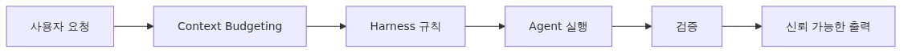
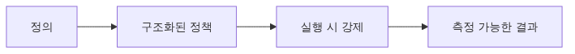
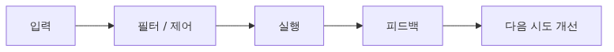

# Context Harness — Agent에게 줄 정보와 숨길 정보 설계하기

> Harness Engineering 101 시리즈 (3/10)

Agent가 받는 컨텍스트는 결과를 결정합니다. 너무 적으면 추측하고, 너무 많으면 길을 잃습니다. Context Harness는 Agent에게 줄 정보와 숨길 정보를 설계하는 일입니다.

---


## Context는 자원입니다

Agent의 context window는 무한하지 않습니다. GPT-4o는 128k tokens, Claude Sonnet 4는 200k tokens, Gemini 2.5 Pro는 1M tokens. 숫자가 커 보이지만 실제로는 항상 부족합니다. 시스템 프롬프트, 대화 이력, 검색된 문서, 도구 스키마, 직전 도구 출력이 모두 같은 공간을 두고 경쟁합니다.

게다가 context가 클수록 모델은 느려지고 비싸지고 정확도가 떨어집니다. "lost in the middle" 현상으로 중간에 있는 정보는 무시되기 쉽고, 관련 없는 정보는 추론을 흔듭니다. context는 자원입니다. 무한정 부어 넣는 것이 아니라 설계해야 하는 자원입니다.

Context Harness는 Agent가 어떤 정보를 어느 시점에 받고, 어떤 정보를 받지 않는지를 명시적으로 설계합니다. 이번 글에서는 context의 구성 요소, 선택 전략, 그리고 의도적으로 숨겨야 할 정보를 다룹니다.

---

## Context의 5가지 구성 요소


Agent가 한 번의 추론에서 보는 context는 다섯 가지로 나뉩니다.

1. **System prompt**: Agent의 역할, 규칙, 목표. 거의 변하지 않습니다.
2. **Task spec**: 이번 task의 Goal, Inputs, Completion criteria. Task마다 바뀝니다.
3. **Conversation history**: 이전 turn의 메시지. 시간이 지날수록 길어집니다.
4. **Retrieved context**: RAG, 메모리, 외부 데이터 소스에서 가져온 정보. Task와 관련된 것만 가져와야 합니다.
5. **Tool schemas and outputs**: 사용 가능한 도구의 명세와 직전 호출 결과.

각 요소는 토큰 예산을 가집니다. 200k window라면 system prompt 2k, task spec 1k, history 5k, retrieved 10k, tool schemas 3k 같은 식으로 미리 분배합니다. 분배하지 않으면 history나 retrieved가 무한정 자라서 다른 요소를 잠식합니다.

```python
from dataclasses import dataclass, field

@dataclass
class ContextBudget:
    """Context window의 토큰 예산 분배."""
    total_tokens: int = 200_000
    system_prompt: int = 2_000
    task_spec: int = 1_000
    conversation_history: int = 5_000
    retrieved_context: int = 10_000
    tool_schemas: int = 3_000
    response_buffer: int = 4_000  # 응답을 위해 비워둘 공간

    def remaining(self) -> int:
        used = (
            self.system_prompt
            + self.task_spec
            + self.conversation_history
            + self.retrieved_context
            + self.tool_schemas
            + self.response_buffer
        )
        return self.total_tokens - used

budget = ContextBudget()
assert budget.remaining() > 0, "예산 합계가 window를 초과했습니다"
```

예산이 정해지면 각 요소를 그 안으로 압축하는 것이 Context Harness의 역할입니다.

---

## Conversation History 관리 전략

대화 이력은 가장 빨리 자라는 요소입니다. 세 가지 전략을 조합합니다.

**1. Sliding window**: 최근 N개의 turn만 유지합니다. 가장 단순합니다. 오래된 정보는 사라집니다.

**2. Summarization**: 오래된 turn을 요약본으로 대체합니다. 정보는 유지되지만 디테일은 사라집니다.

**3. Selective recall**: 필요할 때만 과거 turn을 재검색해서 가져옵니다. RAG와 결합합니다.

```python
from typing import Literal

@dataclass
class Message:
    role: Literal["user", "assistant", "tool"]
    content: str
    tokens: int

class HistoryManager:
    """대화 이력을 토큰 예산 안에서 관리합니다."""

    def __init__(self, max_tokens: int, strategy: str = "summarize"):
        self.max_tokens = max_tokens
        self.strategy = strategy
        self.messages: list[Message] = []
        self.summary: str = ""

    def add(self, msg: Message) -> None:
        self.messages.append(msg)
        self._compact()

    def _compact(self) -> None:
        total = sum(m.tokens for m in self.messages)
        if total <= self.max_tokens:
            return

        if self.strategy == "sliding":
            # 최근 메시지만 남깁니다
            while sum(m.tokens for m in self.messages) > self.max_tokens:
                self.messages.pop(0)
        elif self.strategy == "summarize":
            # 오래된 절반을 요약으로 대체합니다
            old = self.messages[: len(self.messages) // 2]
            self.summary = self._summarize(old)
            self.messages = self.messages[len(self.messages) // 2 :]

    def _summarize(self, messages: list[Message]) -> str:
        # 실제로는 LLM으로 요약합니다
        return f"[요약: {len(messages)}개 turn]"

    def to_context(self) -> list[dict]:
        result = []
        if self.summary:
            result.append({"role": "system", "content": self.summary})
        result.extend({"role": m.role, "content": m.content} for m in self.messages)
        return result
```

전략 선택 기준은 task의 성격입니다. 짧은 대화는 sliding이면 충분합니다. 긴 협업 task는 summarization이 필요합니다. 과거 결정을 정확히 참조해야 하는 task는 selective recall을 씁니다.

---

## Retrieved Context의 정밀도


RAG로 가져온 문서는 context의 큰 부분을 차지합니다. 가져오는 양보다 가져오는 정밀도가 중요합니다.

문서 10개를 통째로 넣으면 90%는 task와 무관합니다. 무관한 정보는 단순한 낭비가 아니라 추론을 방해합니다. 모델은 모든 입력을 "관련 있다"고 가정하고 추론하기 때문에, 관련 없는 텍스트가 잘못된 결론으로 끌고 갑니다.

세 단계로 정밀도를 높입니다.

**1. Retrieval**: 후보 20~50개를 가져옵니다. recall 우선.
**2. Reranking**: cross-encoder로 task와의 관련도를 다시 점수화해서 상위 5~10개만 남깁니다. precision 우선.
**3. Compression**: 각 문서에서 task와 관련된 문장만 추출합니다. LLM 또는 extractive summarizer로.

```python
from typing import Protocol

class Retriever(Protocol):
    def search(self, query: str, top_k: int) -> list[dict]: ...

class Reranker(Protocol):
    def rerank(self, query: str, docs: list[dict]) -> list[dict]: ...

class Compressor(Protocol):
    def compress(self, query: str, doc: dict) -> str: ...

def build_retrieved_context(
    query: str,
    retriever: Retriever,
    reranker: Reranker,
    compressor: Compressor,
    final_k: int = 5,
) -> list[str]:
    """3단계 정밀도 향상 파이프라인."""
    # 1. recall 우선 검색
    candidates = retriever.search(query, top_k=30)

    # 2. precision 우선 재정렬
    reranked = reranker.rerank(query, candidates)[:final_k]

    # 3. 문서별 압축
    compressed = [compressor.compress(query, doc) for doc in reranked]

    return compressed
```

Retrieval만으로 끝내는 시스템은 context를 낭비합니다. Reranking과 Compression이 Context Harness의 핵심입니다.

---

## 의도적으로 숨겨야 할 정보

context에 넣으면 안 되는 정보가 있습니다. Context Harness는 무엇을 보여줄지 못지않게 무엇을 숨길지를 설계합니다.

**1. 비밀 정보**: API 키, 사용자 비밀번호, PII (개인 식별 정보), 의료 기록. Agent의 출력이나 로그로 새어 나갈 수 있습니다. context에 들어가지 않게 마스킹하거나 토큰화합니다.

**2. 무관한 도구 스키마**: 이번 task에 필요 없는 도구의 schema는 빼야 합니다. 도구가 많으면 모델은 "다 써야 한다"고 추측합니다.

**3. 모순되는 지시**: 시스템 프롬프트와 사용자 메시지가 모순되면 모델은 어느 쪽을 따를지 결정하지 못합니다. 명확한 우선순위를 정하거나 모순을 제거합니다.

**4. 오래된 도구 출력**: 5번 전 도구 호출의 결과는 보통 현재 task와 무관합니다. 가장 최근 N개의 도구 출력만 유지합니다.

**5. 실패한 시도의 상세**: Agent가 한 번 실패한 접근을 다시 시도하지 않게 "이 방법은 실패했음"이라는 사실만 남기고 디테일은 압축합니다.

```python
import re

def mask_secrets(text: str) -> str:
    """API 키와 PII를 마스킹합니다."""
    # API key 패턴
    text = re.sub(r"sk-[a-zA-Z0-9]{20,}", "[REDACTED_API_KEY]", text)
    # 이메일
    text = re.sub(r"[\w.+-]+@[\w-]+\.[\w.-]+", "[REDACTED_EMAIL]", text)
    # 신용카드
    text = re.sub(r"\b\d{4}[\s-]?\d{4}[\s-]?\d{4}[\s-]?\d{4}\b", "[REDACTED_CARD]", text)
    # 한국 주민등록번호
    text = re.sub(r"\b\d{6}[-]?\d{7}\b", "[REDACTED_RRN]", text)
    return text

def filter_tools_for_task(all_tools: list[dict], task_tags: set[str]) -> list[dict]:
    """task 태그에 매칭되는 도구만 노출합니다."""
    return [t for t in all_tools if set(t.get("tags", [])) & task_tags]

def trim_tool_history(history: list[dict], keep_last: int = 3) -> list[dict]:
    """가장 최근 N개의 도구 출력만 유지합니다."""
    tool_msgs = [i for i, m in enumerate(history) if m.get("role") == "tool"]
    if len(tool_msgs) <= keep_last:
        return history
    keep_indices = set(tool_msgs[-keep_last:])
    return [m for i, m in enumerate(history) if m.get("role") != "tool" or i in keep_indices]
```

숨기는 설계는 보여주는 설계만큼 중요합니다.

---

## Context Snapshot으로 재현성 확보


Production agent는 같은 입력에 같은 출력을 내야 합니다. 그런데 context는 여러 단계를 거쳐 조립되기 때문에 재현이 어렵습니다. Context Snapshot으로 해결합니다.

각 추론 직전의 최종 context를 그대로 저장합니다. 나중에 같은 context를 모델에 주면 (temperature 0이라면) 같은 출력이 나옵니다. 디버깅과 재현 테스트의 기반입니다.

```python
import hashlib
import json
from datetime import datetime

@dataclass
class ContextSnapshot:
    """추론 직전 context의 완전한 스냅샷."""
    timestamp: str
    task_id: str
    messages: list[dict]
    tools: list[dict]
    model: str
    temperature: float
    snapshot_hash: str = ""

    def __post_init__(self) -> None:
        payload = json.dumps(
            {"messages": self.messages, "tools": self.tools, "model": self.model},
            sort_keys=True,
        )
        self.snapshot_hash = hashlib.sha256(payload.encode()).hexdigest()[:16]

def capture_snapshot(task_id: str, messages: list[dict], tools: list[dict], model: str) -> ContextSnapshot:
    return ContextSnapshot(
        timestamp=datetime.utcnow().isoformat(),
        task_id=task_id,
        messages=messages,
        tools=tools,
        model=model,
        temperature=0.0,
    )
```

Snapshot이 있으면 "왜 이런 출력이 나왔는가?"를 사후에 분석할 수 있습니다. 없으면 "그때는 그랬다"로 끝납니다.

---

## Common Mistakes

**1. Context window 전체를 다 채웁니다.**
"window가 200k니까 다 넣자"는 잘못된 직관입니다. 모델은 모든 입력을 동등하게 처리하지 않습니다. 토큰 예산을 정하고 그 안에서 압축합니다.

**2. Conversation history를 무한정 누적합니다.**
sliding window나 summarization 없이 모든 메시지를 보관하면 100 turn 후 context는 무너집니다. history 관리 전략을 처음부터 정합니다.

**3. RAG 결과를 그대로 넣습니다.**
top-20 문서를 가공 없이 context에 붙이면 90%가 노이즈입니다. Reranking과 Compression을 거칩니다.

**4. 모든 도구 schema를 항상 노출합니다.**
도구가 30개인데 매번 다 보여주면 모델은 잘못된 도구를 선택할 확률이 높아집니다. task별로 필터링합니다.

**5. 비밀 정보를 마스킹하지 않습니다.**
API 키, PII, 의료 정보가 context에 그대로 들어가면 로그와 출력으로 새어 나갑니다. 입력 단계에서 마스킹합니다.

---

## 핵심 요약

- Context는 자원입니다. window가 커도 모든 요소가 같은 공간을 두고 경쟁하므로 토큰 예산을 미리 분배합니다.
- Conversation history는 sliding window, summarization, selective recall 중 task에 맞는 전략을 선택합니다.
- RAG는 retrieval만으로 끝내지 않습니다. Reranking과 Compression으로 정밀도를 높입니다.
- Context Harness는 보여줄 정보만큼 숨길 정보를 설계합니다. 비밀, 무관한 도구, 오래된 출력을 의도적으로 제거합니다.
- Context Snapshot은 production agent의 재현성과 디버깅의 기반입니다.

<!-- toc:begin -->
## 시리즈 목차

- [Harness Engineering이란 무엇인가?](./01-what-is-harness-engineering.md)
- [Task Harness — 모호한 일을 실행 가능한 작업으로 바꾸기](./02-task-harness.md)
- **Context Harness — Agent에게 줄 정보와 숨길 정보 설계하기 (현재 글)**
- Constraint Harness — 규칙, 경계, 금지 행동 정의하기 (예정)
- Tool Harness — Agent가 사용할 도구를 안전하게 설계하기 (예정)
- Test Harness — 완료 조건을 테스트로 고정하기 (예정)
- Feedback Loop — 실패를 고치게 만드는 반복 구조 (예정)
- Approval Gate — 사람 승인이 필요한 지점 설계하기 (예정)
- Observability — Agent 작업을 추적하고 재현하기 (예정)
- Production Harness — 운영 가능한 Agent 작업 환경 만들기 (예정)

<!-- toc:end -->

---

## 참고 자료

- [Anthropic — Building Effective Agents](https://www.anthropic.com/research/building-effective-agents)
- [Liu et al. — Lost in the Middle: How Language Models Use Long Contexts](https://arxiv.org/abs/2307.03172)
- [LangChain — Contextual Compression Retriever](https://python.langchain.com/docs/how_to/contextual_compression/)
- [OpenAI — Retrieval-Augmented Generation Best Practices](https://cookbook.openai.com/examples/question_answering_using_embeddings)

Tags: AI Agent, Harness, Production, Reliability
