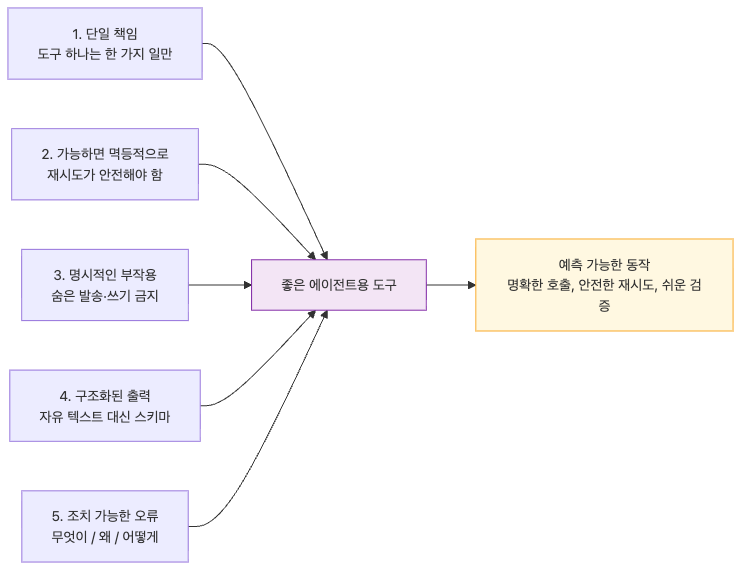

# Tool Harness — Agent가 사용할 도구를 안전하게 설계하기
에이전트가 실제 일을 하려면 결국 도구를 써야 합니다. 데이터베이스를 읽고, 파일을 쓰고, API를 호출하고, 코드를 실행하는 순간부터 모델은 텍스트 생성기가 아니라 작업 수행기가 됩니다.
문제는 바로 이 지점에서 대부분의 사고가 시작된다는 점입니다. 잘못 설계된 도구 하나가 모델 품질보다 더 큰 장애 원인이 되기 쉽습니다. 인터페이스가 모호하면 틀린 인자를 만들고, 부수효과가 숨어 있으면 초안 작성 요청이 실제 발송으로 이어집니다.
Tool Harness는 단순히 함수 목록을 나열하는 작업이 아닙니다. 에이전트가 올바르게 호출하기 쉬운 인터페이스, 잘못 호출해도 사고가 적은 실행 방식, 실패했을 때 다음 행동을 결정할 수 있는 에러 모델을 설계하는 일입니다.
이 글은 Harness Engineering 101 시리즈의 5번째 글입니다.
강한 기능보다 좁고 정직한 인터페이스가 더 중요하다는 점이 이 글의 중심입니다.
## 이 글에서 다룰 문제
- 좋은 도구와 나쁜 도구를 가르는 실무적 기준은 무엇일까요?
- 도구 스키마에는 타입 말고 어떤 의미 정보가 반드시 들어가야 할까요?
- 에이전트 재시도 환경에서 idempotency가 왜 필수일까요?
- 도구 에러는 왜 사람이 아니라 에이전트가 바로 행동할 수 있는 형태여야 할까요?
- 코드 실행, 파일 접근, 셸 호출 같은 위험 도구는 어떤 격리 장치가 필요할까요?
## 왜 이 글이 중요한가
에이전트의 행동 범위는 결국 도구의 행동 범위입니다. 좋은 프롬프트와 제약을 갖춘 시스템도 도구가 모호하거나 과도한 권한을 갖고 있으면 한 번의 호출로 쉽게 무너집니다.
두 번째로 중요한 이유는 재시도입니다. 네트워크 오류와 타임아웃이 잦은 환경에서는 같은 도구가 반복 호출되기 쉽고, idempotency가 없으면 곧바로 중복 실행 사고로 이어집니다.
세 번째 이유는 디버깅 비용입니다. 사람이 읽기에도 모호한 에러 메시지는 에이전트에게는 거의 무의미합니다. 무엇이 실패했고 왜 실패했고 다음에 무엇을 해야 하는지가 드러나야 feedback loop가 제대로 돕니다.
## Tool Harness를 이해하는 가장 좋은 방법: 에이전트가 올바르게 쓰기 쉬운 작업 표면을 만드는 일로 보는 것입니다
사람용 API도 그렇지만, 에이전트용 도구는 더더욱 좋은 기본값과 좁은 책임이 중요합니다. 에이전트는 도구 이름, 설명, 스키마, 에러 메시지에서 거의 모든 판단을 끌어옵니다.
좋은 Tool Harness는 두 가지를 동시에 달성해야 합니다. 정상 경로에서는 쉽게 쓰이고, 오류 경로에서는 덜 위험해야 합니다. single responsibility, structured output, idempotency, sandboxing이 모두 여기에 연결됩니다.
도구는 많을수록 좋은 것이 아니라 좁고 정직할수록 좋습니다. 하나의 범용 도구에 옵션을 다 몰아넣는 순간 schema는 약해지고 승인과 검증 경계도 흐려집니다.
> 에이전트용 도구는 강한 기능보다 좁고 정직한 인터페이스가 더 중요합니다. 잘 쓰기 쉬워야 하고, 잘못 써도 망가지기 어렵게 설계되어야 합니다.
## 핵심 개념
도구는 Agent의 손과 발입니다. 잘못 설계한 도구는 데이터를 망가뜨리거나 비용을 폭발시킵니다. Tool Harness는 Agent가 사용할 도구를 안전하고 예측 가능하게 설계하는 일입니다.


### 도구는 Agent의 손과 발입니다

Agent의 능력은 도구가 결정합니다. 도구가 없으면 Agent는 텍스트를 생성하는 모델일 뿐입니다. DB 조회, 파일 쓰기, API 호출, 코드 실행이 모두 도구입니다. Agent의 행동 범위는 정확히 도구의 범위입니다.

문제는 도구를 잘못 설계하면 Agent의 모든 동작이 흔들린다는 점입니다. 도구 schema가 모호하면 Agent는 잘못된 인자를 보냅니다. 도구가 너무 powerful하면 한 번의 호출로 시스템을 망칠 수 있습니다. 도구의 에러 메시지가 불친절하면 Agent는 같은 실수를 반복합니다.

Tool Harness는 Agent가 사용할 도구를 안전하고 예측 가능하게 설계하는 원칙입니다. 이번 글에서는 도구 설계의 5가지 원칙, 안전한 schema 설계, 그리고 도구 에러를 Agent가 이해할 수 있게 만드는 방법을 다룹니다.

### 좋은 도구의 5가지 원칙



도구를 설계할 때 지켜야 할 다섯 가지가 있습니다.

**1. Single responsibility**: 도구 하나는 한 가지 일만 합니다. `manage_user`가 아니라 `create_user`, `delete_user`, `update_user_email`로 분리합니다.

**2. Idempotent when possible**: 같은 입력으로 여러 번 호출해도 같은 결과가 나오게 합니다. Agent는 재시도를 자주 합니다. idempotent하지 않은 도구는 사고를 만듭니다.

**3. Explicit side effects**: 부작용이 있다면 도구 이름과 설명에 명시합니다. `send_email`이 보내는 동작임을 숨기지 않습니다.

**4. Structured output**: 결과를 자유 텍스트가 아니라 schema로 반환합니다. Agent가 파싱하기 쉽고 검증하기 쉽습니다.

**5. Actionable errors**: 실패할 때 Agent가 다음에 무엇을 해야 할지 알 수 있는 에러를 반환합니다. "에러"가 아니라 "어떤 에러, 왜, 어떻게 고칠지".

```python
from pydantic import BaseModel, Field
from typing import Literal

# Bad — too many responsibilities
def manage_user(action: str, user_id: str, **kwargs):
    """Manage a user."""
    ...

# Good — single responsibility, explicit schema
class CreateUserInput(BaseModel):
    email: str = Field(..., description="A valid email address")
    name: str = Field(..., min_length=1, max_length=100)
    role: Literal["admin", "user", "guest"]

class CreateUserOutput(BaseModel):
    user_id: str
    created_at: str
    status: Literal["created", "already_exists"]

def create_user(input: CreateUserInput) -> CreateUserOutput:
    """Create a new user. Returns already_exists if the email already exists."""
    ...
```

다섯 원칙 중 하나라도 빠지면 Agent의 행동이 예측 불가능해집니다.

### Schema 설계의 정밀도

도구의 input schema는 Agent에게 사용 설명서입니다. 모호한 schema는 모호한 호출을 만듭니다.

세 가지를 명시합니다.

**1. 각 필드의 의미**: `description`을 적습니다. "user id" 대신 "사용자의 UUID, get_user로 조회 가능".

**2. 제약 조건**: 길이, 범위, 허용된 값 목록을 schema에 표현합니다. validation을 application 레이어로 미루지 않습니다.

**3. 의존성**: "이 필드는 type이 X일 때만 필수"같은 조건은 별도 문서가 아니라 schema에 표현합니다.

```python
from pydantic import BaseModel, Field, model_validator
from typing import Literal

class SendNotificationInput(BaseModel):
    """Send a notification."""
    channel: Literal["email", "sms", "push"] = Field(
        ...,
        description="Send channel. email needs an email address; sms needs a phone number.",
    )
    recipient: str = Field(..., description="Recipient identifier (varies by channel)")
    template_id: str = Field(..., pattern=r"^TPL-\d{4}$", description="Format: TPL-0001")
    variables: dict[str, str] = Field(
        default_factory=dict,
        description="Template variables. Example: {'name': 'Alice', 'order_id': '12345'}",
    )

    @model_validator(mode="after")
    def validate_recipient_format(self):
        if self.channel == "email" and "@" not in self.recipient:
            raise ValueError(f"channel=email requires email address, got: {self.recipient}")
        if self.channel == "sms" and not self.recipient.startswith("+"):
            raise ValueError(f"channel=sms requires E.164 phone (+countrycode), got: {self.recipient}")
        return self
```

이런 schema는 두 가지 효과가 있습니다. (1) Agent가 호출 전에 잘못된 인자를 만들 확률이 줄어듭니다. (2) 잘못된 호출이 즉시 거부되어 부작용이 발생하지 않습니다.

### Idempotency Key 패턴


Agent는 재시도를 자주 합니다. 네트워크 오류, 타임아웃, "확인이 안 됨" 같은 이유로 같은 도구를 두 번 호출할 수 있습니다. Idempotent하지 않은 도구는 두 번 실행되어 사고를 만듭니다.

해결책은 idempotency key입니다. Agent가 호출 시 고유 키를 보내고, 서버는 같은 키의 호출을 중복 실행하지 않습니다.

```python
import hashlib
from dataclasses import dataclass

@dataclass
class IdempotencyStore:
    """Stores results per idempotency key."""
    _cache: dict[str, dict] = None

    def __post_init__(self):
        self._cache = self._cache or {}

    def get_or_run(self, key: str, fn, *args, **kwargs) -> dict:
        if key in self._cache:
            return self._cache[key]
        result = fn(*args, **kwargs)
        self._cache[key] = result
        return result

def create_charge(amount: int, currency: str, idempotency_key: str, store: IdempotencyStore) -> dict:
    """Create a charge. Same idempotency_key runs only once."""
    def _do_charge():
        return {
            "charge_id": "ch_" + hashlib.sha256(idempotency_key.encode()).hexdigest()[:12],
            "amount": amount,
        }
    return store.get_or_run(idempotency_key, _do_charge)

# The agent uses a key unique per task
store = IdempotencyStore()
key = "task-abc123-charge-001"
r1 = create_charge(1000, "USD", key, store)
r2 = create_charge(1000, "USD", key, store)
assert r1 == r2  # Same result, executed once
```

idempotency key는 도구 호출 단계 뿐 아니라 task 단계에서도 적용됩니다. 같은 task가 두 번 실행되어도 같은 결과가 나오게 합니다.

### Actionable Error 설계

Agent가 도구 호출에 실패하면 다음에 무엇을 해야 할지 결정해야 합니다. 에러 메시지가 "Internal Server Error"라면 Agent는 같은 호출을 그대로 재시도합니다. 메시지가 명확하면 Agent는 인자를 고쳐서 다시 시도합니다.

좋은 에러는 세 가지를 포함합니다.

**1. What**: 무엇이 실패했는가. 구체적으로.
**2. Why**: 왜 실패했는가. 원인.
**3. How**: 어떻게 고치면 되는가. Agent가 다음에 시도할 행동.

```python
from enum import Enum
from dataclasses import dataclass

class ErrorCode(Enum):
    INVALID_INPUT = "invalid_input"
    NOT_FOUND = "not_found"
    PERMISSION_DENIED = "permission_denied"
    RATE_LIMITED = "rate_limited"
    UPSTREAM_TIMEOUT = "upstream_timeout"

@dataclass
class ToolError(Exception):
    code: ErrorCode
    what: str
    why: str
    how: str
    retryable: bool

    def to_agent_message(self) -> str:
        return f"""Tool call failed.
Code: {self.code.value}
What: {self.what}
Why: {self.why}
How to fix: {self.how}
Retryable: {self.retryable}"""

def get_user(user_id: str) -> dict:
    if not user_id.startswith("usr_"):
        raise ToolError(
            code=ErrorCode.INVALID_INPUT,
            what="user_id format is invalid",
            why=f"user_id must start with 'usr_', got: {user_id}",
            how="Call list_users to find a valid user_id, or check the format.",
            retryable=False,
        )
    raise ToolError(
        code=ErrorCode.NOT_FOUND,
        what=f"user not found: {user_id}",
        why="No user with this id exists in the database.",
        how="Verify the id with list_users, or create_user if intended.",
        retryable=False,
    )
```

`retryable` 플래그는 중요합니다. Agent가 retryable=False 에러를 받으면 즉시 다른 접근을 시도합니다. retryable=True면 backoff 후 재시도합니다.

### 위험한 도구의 Sandboxing


코드 실행, 파일 시스템 접근, 임의의 shell 명령은 매우 강력하고 매우 위험합니다. 이런 도구는 sandboxing 없이 노출하면 안 됩니다.

세 가지 격리 기법을 사용합니다.

**1. Process isolation**: 별도 프로세스에서 실행하고 자원 한도를 적용합니다.
**2. Filesystem isolation**: 격리된 임시 디렉터리에서만 동작합니다.
**3. Network isolation**: 외부 네트워크 접근을 차단하거나 화이트리스트합니다.

```python
import subprocess
import tempfile
from pathlib import Path

def execute_python_safely(code: str, timeout: float = 5.0) -> dict:
    """Execute Python code in an isolated environment."""
    with tempfile.TemporaryDirectory() as tmpdir:
        script_path = Path(tmpdir) / "script.py"
        script_path.write_text(code)
        try:
            result = subprocess.run(
                ["python3", str(script_path)],
                capture_output=True,
                text=True,
                timeout=timeout,
                cwd=tmpdir,  # Isolated working directory
                env={"PATH": "/usr/bin:/bin"},  # Minimal env
            )
            return {
                "stdout": result.stdout[:10_000],  # Cap output size
                "stderr": result.stderr[:10_000],
                "exit_code": result.returncode,
            }
        except subprocess.TimeoutExpired:
            raise ToolError(
                code=ErrorCode.UPSTREAM_TIMEOUT,
                what="code execution exceeded timeout",
                why=f"Execution did not complete in {timeout}s.",
                how="Reduce the work done in code, or split into multiple calls.",
                retryable=False,
            )
```

더 강한 격리는 컨테이너(gVisor, Firecracker), WebAssembly 런타임을 사용합니다. production agent에서 임의 코드 실행을 노출한다면 최소한 컨테이너 격리는 필수입니다.

### Common Mistakes

`process_order`가 결제까지 한다면 이름에 그것이 드러나야 합니다. `charge_and_fulfill_order` 같은 이름이 정직합니다.

`manage_user(action="create"|"delete"|"update", ...)`처럼 dispatcher 도구는 schema가 약해지고 Agent가 잘못된 조합을 만듭니다. 도구를 분리합니다.

재시도가 흔한 환경에서 idempotent하지 않은 도구는 중복 결제, 중복 이메일, 중복 알림을 만듭니다.

"Bad request"는 Agent에게 정보가 0입니다. What/Why/How를 모두 포함합니다.

shell 실행, 파일 쓰기, 무제한 HTTP 호출은 sandboxing 없이는 production에서 사고로 이어집니다.
## 흔히 헷갈리는 지점
- 도구 이름이 대충 의미만 전달해도 모델이 알아서 잘 쓸 것이라고 기대하기 쉽지만, 이름과 설명이 곧 사용 설명서입니다.
- 옵션이 많을수록 범용적이라 좋다고 느끼기 쉽지만, dispatcher형 도구는 에이전트가 잘못된 조합을 만들기 가장 쉽습니다.
- 재시도는 네트워크 문제일 뿐이라고 생각하기 쉽지만, 에이전트 환경에서는 정상 흐름에서도 반복 호출이 자주 발생합니다.
- 짧은 에러 메시지가 깔끔해 보일 수 있지만, 에이전트에게는 거의 정보가 없습니다.
- 위험한 도구도 내부 네트워크에서만 쓰니 괜찮다고 생각하기 쉽지만, 무제한 셸과 파일 접근은 내부 사고를 가장 크게 만듭니다.
## 운영 체크리스트
- [ ] 각 도구가 하나의 책임만 가지는지 확인합니다.
- [ ] 입력 스키마에 의미, 제약, 필드 의존성을 모두 표현합니다.
- [ ] 쓰기·발송·결제 계열 도구에는 idempotency key를 적용합니다.
- [ ] What/Why/How/retryable을 포함한 구조화된 ToolError를 표준화합니다.
- [ ] 코드 실행과 파일/네트워크 접근 도구는 샌드박스 없이는 노출하지 않습니다.
## 정리
Tool Harness는 도구 개수를 늘리는 기술이 아니라, 에이전트가 올바르게 쓰기 쉬운 인터페이스를 설계하는 기술입니다. 좁은 책임, 강한 스키마, idempotency, 행동 가능한 에러, 격리가 갖춰져야 도구는 생산성을 올리는 요소가 됩니다.
실무에서는 모델보다 도구가 더 자주 사고를 냅니다. 모델은 잘못 생각할 수 있지만, 시스템을 망가뜨리는 것은 결국 그 생각을 실행하는 도구입니다. 그래서 도구 설계는 프롬프트보다 더 보수적이어야 합니다.
다음 글에서는 Test Harness를 다룹니다. 에이전트가 작업을 끝냈다고 말하는 것과 실제로 끝난 것은 다르기 때문에, 이제 완료 조건을 테스트로 고정해야 합니다.

<!-- toc:begin -->
## 시리즈 목차

- [Harness Engineering이란 무엇인가?](./01-what-is-harness-engineering.md)
- [Task Harness — 모호한 일을 실행 가능한 작업으로 바꾸기](./02-task-harness.md)
- [Context Harness — Agent에게 줄 정보와 숨길 정보 설계하기](./03-context-harness.md)
- [Constraint Harness — 규칙, 경계, 금지 행동 정의하기](./04-constraint-harness.md)
- **Tool Harness — Agent가 사용할 도구를 안전하게 설계하기 (현재 글)**
- Test Harness — 완료 조건을 테스트로 고정하기 (예정)
- Feedback Loop — 실패를 고치게 만드는 반복 구조 (예정)
- Approval Gate — 사람 승인이 필요한 지점 설계하기 (예정)
- Observability — Agent 작업을 추적하고 재현하기 (예정)
- Production Harness — 운영 가능한 Agent 작업 환경 만들기 (예정)

<!-- toc:end -->

## 참고 자료
### 공식 문서

- [Anthropic — Tool Use Best Practices](https://docs.anthropic.com/en/docs/build-with-claude/tool-use)
- [OpenAI — Function Calling Guide](https://platform.openai.com/docs/guides/function-calling)
- [Stripe — Idempotent Requests](https://docs.stripe.com/api/idempotent_requests)
- [gVisor — Sandboxed Container Runtime](https://gvisor.dev/docs/)
### 관련 시리즈

- [LangGraph 101 — 멀티 에이전트 시스템](../../langgraph-101/ko/05-multi-agent.md)
- [AI Safety & Guardrails 101 — 운영 가드레일 시스템 구축](../../ai-safety-guardrails-101/ko/10-production-guardrail-system.md)

Tags: AI Agent, Harness, Production, Reliability
