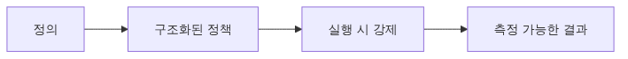
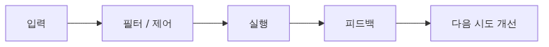

# Test Harness — 완료 조건을 테스트로 고정하기

> Harness Engineering 101 시리즈 (6/10)

Agent가 "끝났습니다"라고 말해도 정말 끝났는지는 테스트가 결정합니다. Test Harness는 완료 조건을 자동 검증 가능한 테스트로 고정합니다.

---


## "잘 동작합니다"라는 말은 증거가 아닙니다

Agent를 만들고 데모를 돌리면 잘 동작합니다. 실제 사용자에게 풀면 한 주 안에 망가집니다. 두 상황의 차이는 입력의 다양성입니다. 데모는 5개의 잘 짜인 입력으로 동작하지만, production은 수천 개의 예측 못 한 입력을 마주합니다.

이 간극을 메우는 것이 Test Harness입니다. Agent의 완료 조건을 자연어가 아니라 자동 실행 가능한 테스트로 표현하고, 모든 변경에 대해 그 테스트를 돌립니다. "잘 동작합니다"가 아니라 "이 50개의 테스트가 통과합니다"가 증거입니다.

이번 글에서는 Agent용 테스트의 종류, 평가 데이터셋 만들기, 그리고 회귀 방지 자동화를 다룹니다.

---

## Agent 테스트의 3 계층


전통적인 소프트웨어 테스트와 비슷하지만, 비결정성이 추가됩니다.

**1. Unit tests**: 각 도구가 schema대로 동작하는지. 결정적, 빠릅니다.

**2. Integration tests**: 도구 조합이 task 시나리오에서 동작하는지. 실제 LLM 또는 mock LLM 사용.

**3. Eval tests**: 평가 데이터셋에 대해 정성적 품질을 측정. 비결정적이지만 통계적으로 안정.

```python
import pytest
from dataclasses import dataclass

# 1. Unit test — 도구 schema
def test_create_user_input_validation():
    from pydantic import ValidationError
    with pytest.raises(ValidationError):
        CreateUserInput(email="invalid", name="A", role="admin")

# 2. Integration test — task 흐름
def test_report_generation_flow(mock_llm):
    """보고서 생성 task가 read_db만 호출하는지."""
    agent = build_agent(tools=["read_db"], llm=mock_llm)
    result = agent.run(task=ReportTaskSpec(date="2026-05-03"))
    assert result.status == "completed"
    assert all(call.tool == "read_db" for call in result.tool_calls)

# 3. Eval test — 정성 품질
def test_summary_quality(eval_dataset):
    agent = build_summary_agent()
    scores = []
    for example in eval_dataset:
        output = agent.run(input=example.input)
        scores.append(rubric_score(output, example.expected))
    assert sum(scores) / len(scores) >= 0.85, f"평균 점수 {sum(scores)/len(scores):.2f}, 0.85 미만"
```

세 계층 모두 필요합니다. Unit이 빠진 채 Eval만 있으면 디버깅이 불가능합니다. Eval이 빠진 채 Unit만 있으면 production 품질을 보장 못 합니다.

---

## Eval Dataset 만들기


평가 데이터셋이 없으면 품질 측정이 불가능합니다. 데이터셋은 세 가지 출처에서 만듭니다.

**1. Production logs**: 실제 사용자의 요청을 샘플링합니다. 가장 현실적이지만 PII 처리가 필요합니다.

**2. Synthetic generation**: LLM으로 다양한 변형을 생성합니다. 빠르지만 실제 분포와 다를 수 있습니다.

**3. Adversarial examples**: 일부러 어렵게 만든 입력. Edge case와 prompt injection 시도.

```python
@dataclass
class EvalExample:
    """평가용 단일 예시."""
    id: str
    input: dict
    expected: dict  # 기대 결과 (정확 매치 또는 rubric)
    category: str  # "happy_path" | "edge" | "adversarial"
    source: str  # "production" | "synthetic" | "manual"

def build_eval_dataset() -> list[EvalExample]:
    """카테고리별 균형을 맞춰 데이터셋을 구성합니다."""
    examples = []
    examples.extend(sample_from_production_logs(n=50, category="happy_path"))
    examples.extend(generate_synthetic_variations(n=30, category="happy_path"))
    examples.extend(load_manual_edge_cases(n=15, category="edge"))
    examples.extend(load_adversarial_examples(n=5, category="adversarial"))
    assert len(examples) == 100
    return examples
```

데이터셋 크기는 task의 복잡도에 따라 다릅니다. 단순 분류는 50~100개, 복잡한 multi-step task는 200~500개가 일반적입니다.

---

## Rubric 기반 채점

Eval 결과를 어떻게 점수화할 것인가. 기대 출력과의 정확 매치는 Agent 출력에는 거의 안 맞습니다. 같은 의미를 다른 단어로 표현하기 때문입니다.

세 가지 채점 방식.

**1. Exact match**: 가능한 곳에는 사용. JSON 필드, 숫자, ID.

**2. Heuristic checks**: 정규식, 길이, 필수 단어 포함. 빠르고 결정적.

**3. LLM-as-judge**: 다른 LLM에게 채점을 맡깁니다. 비용 들지만 의미적 평가 가능.

```python
from typing import Callable

@dataclass
class Rubric:
    """채점 기준의 묶음."""
    name: str
    weight: float
    check: Callable[[dict, dict], float]  # (output, expected) -> 0.0~1.0

def has_required_sections(output: dict, expected: dict) -> float:
    required = expected.get("required_sections", [])
    if not required:
        return 1.0
    present = sum(1 for s in required if s in output.get("text", ""))
    return present / len(required)

def numbers_match(output: dict, expected: dict) -> float:
    e_nums = expected.get("numbers", {})
    o_nums = output.get("numbers", {})
    if not e_nums:
        return 1.0
    correct = sum(1 for k, v in e_nums.items() if abs(o_nums.get(k, 0) - v) < 0.01)
    return correct / len(e_nums)

def llm_judge_helpfulness(output: dict, expected: dict) -> float:
    """LLM이 helpfulness를 0~1로 평가."""
    # 실제로는 judge LLM API 호출
    return 0.85

RUBRICS = [
    Rubric("structure", weight=0.3, check=has_required_sections),
    Rubric("accuracy", weight=0.5, check=numbers_match),
    Rubric("helpfulness", weight=0.2, check=llm_judge_helpfulness),
]

def rubric_score(output: dict, expected: dict, rubrics=RUBRICS) -> float:
    return sum(r.check(output, expected) * r.weight for r in rubrics)
```

LLM-as-judge는 강력하지만 위험합니다. judge 모델의 편향이 점수에 그대로 반영됩니다. 사람 평가와 정기적으로 비교해서 calibration을 맞춥니다.

---

## 회귀 방지 자동화


테스트가 있어도 안 돌리면 의미가 없습니다. CI/CD에 통합해서 모든 변경에 대해 자동 실행합니다.

세 단계로 구성합니다.

**1. Fast unit tests**: PR마다 실행. 1분 이내.
**2. Integration tests**: PR마다 실행, mock LLM 사용. 5분 이내.
**3. Full eval suite**: 매일 또는 모델/프롬프트 변경 시 실행. 30분 이상 가능.

```python
# .github/workflows/agent-tests.yml 같은 형태
"""
name: Agent Tests
on: [pull_request]
jobs:
  unit:
    runs-on: ubuntu-latest
    steps:
      - run: pytest tests/unit -x --timeout=60

  integration:
    runs-on: ubuntu-latest
    steps:
      - run: pytest tests/integration -x --timeout=300
        env:
          USE_MOCK_LLM: "true"

  eval:
    runs-on: ubuntu-latest
    if: contains(github.event.pull_request.labels.*.name, 'run-eval')
    steps:
      - run: python scripts/run_eval.py --dataset eval/v1 --threshold 0.85
"""

def run_eval_suite(dataset_path: str, threshold: float) -> bool:
    """전체 eval을 돌리고 임계값을 비교합니다."""
    examples = load_dataset(dataset_path)
    results = []
    for ex in examples:
        output = run_agent(ex.input)
        score = rubric_score(output, ex.expected)
        results.append((ex.id, score))

    avg = sum(s for _, s in results) / len(results)
    failed = [(eid, s) for eid, s in results if s < 0.7]

    print(f"Average: {avg:.3f}, Threshold: {threshold}")
    print(f"Failed (<0.7): {len(failed)}")
    return avg >= threshold
```

회귀가 발견되면 PR을 머지하지 않습니다. 이것이 Test Harness의 핵심 가치입니다 — 코드, 프롬프트, 모델 어느 것이 바뀌어도 품질이 떨어지지 않는다는 보장.

---

## Snapshot Testing

Agent 출력의 미세한 변화를 잡고 싶을 때 snapshot test가 유용합니다. 첫 실행 결과를 저장하고, 다음 실행이 그 결과와 다르면 실패합니다.

```python
import json
from pathlib import Path
import hashlib

def assert_snapshot(name: str, actual: dict, snapshot_dir: Path = Path("tests/snapshots")):
    """저장된 snapshot과 비교합니다."""
    snapshot_dir.mkdir(parents=True, exist_ok=True)
    snapshot_file = snapshot_dir / f"{name}.json"

    actual_str = json.dumps(actual, sort_keys=True, indent=2)

    if not snapshot_file.exists():
        snapshot_file.write_text(actual_str)
        print(f"snapshot created: {snapshot_file}")
        return

    expected_str = snapshot_file.read_text()
    if actual_str != expected_str:
        actual_hash = hashlib.sha256(actual_str.encode()).hexdigest()[:8]
        expected_hash = hashlib.sha256(expected_str.encode()).hexdigest()[:8]
        raise AssertionError(
            f"snapshot mismatch for {name}\n"
            f"  expected hash: {expected_hash}\n"
            f"  actual hash:   {actual_hash}\n"
            f"  diff: snapshot at {snapshot_file}"
        )

def test_classification_snapshot(deterministic_agent):
    """분류 task의 결과가 변하지 않는지 확인."""
    result = deterministic_agent.classify("This product is amazing!")
    assert_snapshot("positive_review_classification", result)
```

Snapshot test는 의도적인 변경에는 약합니다. 의도적으로 출력을 바꾸면 snapshot을 갱신해야 하는데, 그 갱신이 실수인지 의도인지 사람이 검토해야 합니다. PR 리뷰의 핵심 항목으로 만듭니다.

---

## Common Mistakes

**1. Eval dataset 없이 시작합니다.**
"개발하면서 만들겠다"는 보통 안 만듭니다. 첫 task부터 최소 20개의 예시를 준비합니다.

**2. Production logs를 그대로 dataset으로 씁니다.**
PII가 포함되어 있고, happy path에 편향되어 있습니다. 샘플링 + 마스킹 + adversarial 추가가 필요합니다.

**3. LLM-as-judge를 calibration 없이 신뢰합니다.**
judge 모델의 편향이 점수에 반영됩니다. 정기적으로 사람 평가와 비교합니다.

**4. 테스트를 CI에 연결하지 않습니다.**
수동으로 가끔 돌리는 테스트는 곧 안 돌리게 됩니다. PR마다 자동 실행이 필수입니다.

**5. Snapshot test의 모든 차이를 자동 승인합니다.**
"diff가 있네, 갱신!"으로 매번 통과시키면 snapshot의 의미가 없습니다. 차이는 사람이 검토합니다.

---

## 핵심 요약

- "잘 동작합니다"는 증거가 아닙니다. 자동 실행 가능한 테스트가 증거입니다.
- Agent 테스트는 Unit, Integration, Eval의 3계층으로 구성합니다.
- Eval dataset은 production logs, synthetic, adversarial을 균형 있게 섞습니다.
- 채점은 exact match, heuristic, LLM-as-judge를 조합하고, judge는 사람 평가로 calibration 합니다.
- 모든 테스트는 CI에 통합해서 PR마다 자동 실행합니다. 수동 테스트는 곧 안 돌리게 됩니다.

<!-- toc:begin -->
## 시리즈 목차

- [Harness Engineering이란 무엇인가?](./01-what-is-harness-engineering.md)
- [Task Harness — 모호한 일을 실행 가능한 작업으로 바꾸기](./02-task-harness.md)
- [Context Harness — Agent에게 줄 정보와 숨길 정보 설계하기](./03-context-harness.md)
- [Constraint Harness — 규칙, 경계, 금지 행동 정의하기](./04-constraint-harness.md)
- [Tool Harness — Agent가 사용할 도구를 안전하게 설계하기](./05-tool-harness.md)
- **Test Harness — 완료 조건을 테스트로 고정하기 (현재 글)**
- Feedback Loop — 실패를 고치게 만드는 반복 구조 (예정)
- Approval Gate — 사람 승인이 필요한 지점 설계하기 (예정)
- Observability — Agent 작업을 추적하고 재현하기 (예정)
- Production Harness — 운영 가능한 Agent 작업 환경 만들기 (예정)

<!-- toc:end -->

---

## 참고 자료

- [OpenAI Evals Framework](https://github.com/openai/evals)
- [Anthropic — Evaluating LLMs](https://docs.anthropic.com/en/docs/build-with-claude/develop-tests)
- [LangSmith — LLM Evaluation](https://docs.smith.langchain.com/evaluation)
- [Eugene Yan — Evaluating LLM-Based Applications](https://eugeneyan.com/writing/evals/)

Tags: AI Agent, Harness, Production, Reliability
