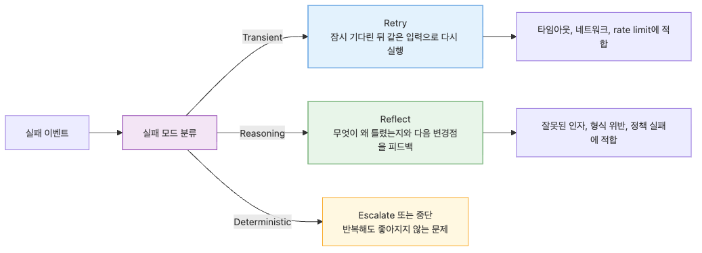
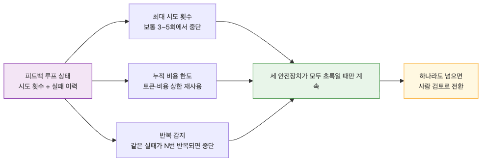

# Feedback Loop — 실패를 고치게 만드는 반복 구조
에이전트는 첫 시도에 자주 실패합니다. 잘못된 도구를 고르고, 인자를 틀리고, 형식을 어기고, 스스로도 완료했다고 착각합니다. 중요한 차이는 실패 자체가 아니라 그 실패를 어떻게 다루느냐에서 생깁니다.
가장 나쁜 패턴은 실패를 그대로 사용자에게 돌려주는 것입니다. 두 번째로 나쁜 패턴은 같은 입력을 아무 변화 없이 다시 던지는 것입니다. 이 방식은 비용만 키우고 품질은 거의 올리지 못합니다.
Feedback Loop는 실패를 다음 시도의 입력으로 바꾸는 층입니다. 어떤 실패는 retry로, 어떤 실패는 reflect로 보내고, 반복 실패는 결국 사람에게 escalate하는 구조를 설계해야 합니다.
이 글은 Harness Engineering 101 시리즈의 7번째 글입니다.
좋은 에이전트는 실패하지 않는 시스템이 아니라 실패를 개선 신호로 바꾸는 시스템입니다.
## 이 글에서 다룰 문제
- 모든 실패를 같은 방식으로 재시도하면 왜 비싸고 비효율적일까요?
- retry와 reflect는 어떤 기준으로 나눠야 할까요?
- 에이전트에게 돌려주는 피드백은 어떤 정보만 담아야 할까요?
- 반복 루프는 어떻게 무한 비용 사고로 변할 수 있을까요?
- 같은 유형의 실패를 다시 만나지 않게 하려면 무엇을 저장해야 할까요?
## 왜 이 글이 중요한가
Feedback Loop가 중요한 첫 번째 이유는 복구 능력입니다. 첫 시도 성공만 가정하면 실제 운영 입력에서는 금방 무너집니다. 실패를 다루는 구조가 있어야 비결정적 시스템을 운영할 수 있습니다.
두 번째 이유는 비용 통제입니다. reflect가 필요한 문제에 retry를 걸면 같은 실패를 계속 사고, retry가 필요한 문제에 reflect를 걸면 토큰만 두 배로 씁니다. 실패 분류가 곧 비용 설계입니다.
세 번째 이유는 학습 없는 운영을 피하기 위해서입니다. 같은 종류의 실패를 매번 처음처럼 다시 겪는 시스템은 시간이 지나도 좋아지지 않습니다. failure memory는 거의 공짜에 가까운 개선 신호입니다.
## Feedback Loop를 이해하는 가장 좋은 방법: 실패를 종료 신호가 아니라 다음 시도를 위한 구조화된 입력으로 보는 것입니다
모든 실패가 같은 것은 아닙니다. 네트워크 타임아웃과 잘못된 인자 구성, 정책 위반과 존재하지 않는 리소스 접근은 각각 다른 처리가 필요합니다. 먼저 실패를 분류해야 다음 행동을 고를 수 있습니다.
reflect 메시지는 정보가 많다고 좋은 것이 아닙니다. 무엇을 했고, 왜 실패했고, 다음에 어떻게 바꿔야 하는지만 남겨야 합니다. 그래야 에이전트가 같은 실수를 줄일 수 있습니다.
또한 feedback loop는 반드시 출구를 가져야 합니다. max attempts, cumulative cost, repetition detection, human escalation이 없으면 결국 한 태스크가 비용을 태우는 루프로 변합니다.
> 실패를 끝으로 취급하면 시스템은 멈춥니다. 실패를 구조화된 입력으로 취급하면 시스템은 다음 시도를 개선합니다.
## 핵심 개념
Agent는 한 번에 성공하지 못합니다. Feedback Loop는 실패한 결과를 다시 Agent에게 돌려주어 스스로 고치게 만드는 반복 구조입니다.


### 한 번에 성공하는 Agent는 없습니다

Agent는 첫 시도에서 자주 실패합니다. 잘못된 도구를 호출하고, 인자를 틀리고, 형식이 맞지 않는 출력을 만듭니다. 이 실패를 어떻게 처리하느냐가 production 품질을 결정합니다.

가장 나쁜 패턴은 실패를 그대로 사용자에게 돌려주는 것입니다. 두 번째로 나쁜 패턴은 같은 호출을 그대로 재시도하는 것입니다. 좋은 패턴은 실패의 원인을 Agent에게 피드백으로 돌려서 다음 시도를 개선하게 만드는 것입니다.

Feedback Loop는 실패를 Agent의 학습 신호로 변환하는 구조입니다. 이번 글에서는 retry vs reflect의 차이, 피드백의 구성, 그리고 무한 루프 방지를 다룹니다.

### Retry와 Reflect의 차이



실패에 대한 두 가지 응답.

**Retry**: 같은 입력으로 다시 시도. 일시적 오류 (네트워크, 타임아웃, rate limit)에 적합.

**Reflect**: 실패 원인을 Agent에게 알려주고 새 시도를 유도. 추론 오류 (잘못된 인자, 형식 위반)에 적합.

두 전략은 다른 도구입니다. retry로 풀어야 할 문제에 reflect를 쓰면 비용이 폭발합니다. reflect가 필요한 문제에 retry를 쓰면 영원히 실패합니다.

```python
from dataclasses import dataclass
from enum import Enum

class FailureMode(Enum):
    TRANSIENT = "transient"
    DETERMINISTIC = "deterministic"
    REASONING = "reasoning"

@dataclass
class FailureClassification:
    mode: FailureMode
    feedback: str
    retry_after: float = 0.0

def classify_failure(error: Exception) -> FailureClassification:
    if isinstance(error, TimeoutError):
        return FailureClassification(FailureMode.TRANSIENT, "", retry_after=1.0)
    if isinstance(error, ToolError) and error.code == ErrorCode.RATE_LIMITED:
        return FailureClassification(FailureMode.TRANSIENT, "", retry_after=5.0)
    if isinstance(error, ToolError) and error.code == ErrorCode.INVALID_INPUT:
        return FailureClassification(FailureMode.REASONING, error.to_agent_message())
    if isinstance(error, PolicyViolation):
        return FailureClassification(FailureMode.REASONING, f"Policy violation: {error}. Try a different approach.")
    return FailureClassification(FailureMode.DETERMINISTIC, str(error))
```

분류가 첫 단계입니다. 분류가 없으면 모든 실패에 같은 전략을 쓰게 됩니다.

### Reflect의 구성

Agent에게 주는 피드백은 정보가 많을수록 좋지 않습니다. 무엇이 틀렸는지, 왜 틀렸는지, 다음에 어떻게 시도할지의 세 가지에 집중합니다.

```python
@dataclass
class ReflectMessage:
    """The bridge from failure to a new attempt."""
    attempt_number: int
    failed_action: str
    failure_reason: str
    suggested_change: str
    constraint: str

    def to_prompt(self) -> str:
        return f"""Attempt #{self.attempt_number} failed.

What you tried: {self.failed_action}
Why it failed: {self.failure_reason}
What to try next: {self.suggested_change}
Constraint for next attempt: {self.constraint}

Now produce a new attempt that satisfies the constraint."""

msg = ReflectMessage(
    attempt_number=2,
    failed_action="Called create_user with email='alice'",
    failure_reason="email field requires a valid address (must contain @)",
    suggested_change="Provide the full email like alice@example.com",
    constraint="email must match RFC 5322 format",
)
```

피드백에 "다시 시도해 봐"만 있으면 Agent는 같은 실수를 반복합니다. 구체적인 제약이 있어야 행동이 바뀝니다.

### 무한 루프 방지



Reflect 루프는 무한히 돌 수 있습니다. Agent가 같은 실수를 반복하거나, 새 실수와 기존 실수 사이를 진동할 수 있습니다. 세 가지 안전장치가 필요합니다.

**1. Max attempts**: 최대 시도 횟수 제한. 보통 3~5회.

**2. Cumulative cost limit**: 누적 토큰/비용 상한 (Constraint Harness의 ResourceMeter 재사용).

**3. Repetition detection**: 같은 종류의 실패가 N번 반복되면 escalate.

```python
from collections import Counter
from dataclasses import dataclass, field

@dataclass
class FeedbackLoop:
    """Manages the retry/reflect loop safely."""
    max_attempts: int = 5
    max_repetitions: int = 2
    attempts: int = 0
    failure_history: list[FailureClassification] = field(default_factory=list)

    def should_continue(self, latest: FailureClassification) -> bool:
        self.attempts += 1
        self.failure_history.append(latest)

        if self.attempts >= self.max_attempts:
            return False

        recent_modes = Counter(f.mode for f in self.failure_history[-3:])
        if any(count >= self.max_repetitions + 1 for count in recent_modes.values()):
            return False

        return True

    def escalate(self) -> dict:
        return {
            "status": "escalated",
            "attempts": self.attempts,
            "failure_history": [{"mode": f.mode.value, "feedback": f.feedback[:200]} for f in self.failure_history],
            "recommended_action": "human_review",
        }

def run_with_feedback(agent, task, loop: FeedbackLoop) -> dict:
    while True:
        try:
            return agent.run(task)
        except Exception as e:
            classification = classify_failure(e)
            if not loop.should_continue(classification):
                return loop.escalate()

            if classification.mode == FailureMode.TRANSIENT:
                import time
                time.sleep(classification.retry_after)
            elif classification.mode == FailureMode.REASONING:
                task = task.with_feedback(classification.feedback)
            else:
                return loop.escalate()
```

`escalate`는 사람에게 넘기는 출구입니다. 루프가 풀지 못하는 문제는 사람이 풀어야 합니다 (다음 글의 Approval Gate 주제).

### Self-Critique 패턴

Agent가 자신의 출력을 직접 비판하게 만드는 패턴입니다. 외부 검증보다 약하지만 검증 도구가 없을 때 유용합니다.

```python
def self_critique(agent, draft: str, criteria: list[str]) -> tuple[bool, str]:
    """Have the agent review its own draft."""
    critique_prompt = f"""Review the following draft against these criteria.

Criteria:
{chr(10).join(f'- {c}' for c in criteria)}

Draft:
{draft}

Respond in JSON:
{{
  "passes_all": true/false,
  "violations": ["criterion that failed: reason"],
  "suggested_fix": "concrete change to make"
}}"""
    response = agent.complete(critique_prompt)
    parsed = parse_json(response)
    return parsed["passes_all"], parsed.get("suggested_fix", "")

def generate_with_critique(agent, prompt: str, criteria: list[str], max_rounds: int = 3) -> str:
    draft = agent.complete(prompt)
    for _ in range(max_rounds):
        passes, fix = self_critique(agent, draft, criteria)
        if passes:
            return draft
        draft = agent.complete(f"{prompt}\n\nPrevious draft:\n{draft}\n\nApply this fix: {fix}")
    return draft
```

Self-critique는 두 가지 위험이 있습니다. (1) Agent가 자신의 실수를 못 봅니다 (false positive). (2) 매 턴마다 비용이 두 배 이상 듭니다. 외부 검증이 가능한 곳은 외부 검증을 우선합니다.

### Failure Memory


같은 task가 여러 번 실행될 때, 과거의 실패를 기억하면 같은 실수를 줄일 수 있습니다. Failure memory는 task별로 어떤 접근이 실패했는지를 누적합니다.

```python
from datetime import datetime
import json
from pathlib import Path

@dataclass
class FailureRecord:
    task_type: str
    failed_approach: str
    failure_reason: str
    timestamp: str
    fixed_in_next_attempt: bool

class FailureMemory:
    """Accumulates failure records per task type."""

    def __init__(self, store_path: Path):
        self.store_path = store_path
        self.records: list[FailureRecord] = self._load()

    def _load(self) -> list[FailureRecord]:
        if not self.store_path.exists():
            return []
        data = json.loads(self.store_path.read_text())
        return [FailureRecord(**r) for r in data]

    def add(self, record: FailureRecord) -> None:
        self.records.append(record)
        self.store_path.write_text(json.dumps([r.__dict__ for r in self.records], indent=2))

    def warnings_for(self, task_type: str, recent: int = 5) -> list[str]:
        relevant = [r for r in self.records if r.task_type == task_type][-recent:]
        return [f"Previously failed: {r.failed_approach} (reason: {r.failure_reason})" for r in relevant]
```

Agent의 첫 시도 프롬프트에 failure_memory의 경고를 포함시키면, 과거 실수를 피하는 방향으로 시작합니다. 이는 학습 없이도 시간이 지날수록 품질이 올라가게 만듭니다.

### Common Mistakes

추론 오류는 retry로 안 풀립니다. 분류 후 reflect를 사용합니다.

"다시 시도해 봐"는 정보가 0입니다. What/Why/How와 구체적 제약을 포함합니다.

max attempts, cost limit, repetition detection이 모두 없으면 한 task가 비용을 폭주시킵니다.

루프가 풀지 못하는 문제는 사람에게 가야 합니다. 자동 retry만 있고 escalate가 없으면 실패가 사용자에게 그대로 갑니다.

같은 실수를 매번 새로 만나는 Agent는 시간이 지나도 좋아지지 않습니다. 실패 기록은 무료에 가까운 학습 신호입니다.
## 흔히 헷갈리는 지점
- 모든 실패를 retry로 처리하면 단순해 보이지만, reasoning error는 retry로 거의 해결되지 않습니다.
- reflect 메시지는 자세할수록 좋다고 생각하기 쉽지만, 핵심이 흐려지면 다음 행동도 흐려집니다.
- 루프는 알아서 멈출 것이라고 기대하기 쉽지만, max attempts와 비용 상한이 없으면 아주 쉽게 폭주합니다.
- escalation은 나중에 붙이면 된다고 미루기 쉽지만, 사람이 받는 출구가 없으면 실패는 결국 사용자에게 바로 전달됩니다.
- failure memory는 선택 사항처럼 보이지만, 같은 실수를 줄이는 가장 값싼 개선 장치 중 하나입니다.
## 운영 체크리스트
- [ ] 실패를 transient, reasoning, deterministic으로 분류합니다.
- [ ] retry와 reflect를 같은 로직으로 처리하지 않습니다.
- [ ] reflect 메시지에 What/Why/How와 다음 시도 제약을 넣습니다.
- [ ] max attempts, cumulative cost, repetition detection을 함께 둡니다.
- [ ] 반복 실패는 human_review로 escalate하고 failure memory에 기록합니다.
## 정리
Feedback Loop는 실패를 감추는 장치가 아니라 실패를 더 나은 다음 시도로 연결하는 장치입니다. 이 구조가 없으면 에이전트는 한 번 틀린 뒤 그대로 멈추거나, 같은 실수를 비싸게 반복합니다.
핵심은 실패 분류와 출구 설계입니다. retry가 필요한지 reflect가 필요한지 먼저 나누고, 루프가 해결하지 못하는 문제는 사람에게 넘겨야 합니다.
다음 글에서는 Approval Gate를 다룹니다. 어떤 실패는 복구할 수 있어도, 어떤 행동은 애초에 사람 승인 없이는 실행되면 안 됩니다.
<!-- toc:begin -->
## Harness Engineering 101 시리즈

- [Harness Engineering이란 무엇인가?](./01-what-is-harness-engineering.md)
- [Task Harness — 모호한 일을 실행 가능한 작업으로 바꾸기](./02-task-harness.md)
- [Context Harness — Agent에게 줄 정보와 숨길 정보 설계하기](./03-context-harness.md)
- [Constraint Harness — 규칙, 경계, 금지 행동 정의하기](./04-constraint-harness.md)
- [Tool Harness — Agent가 사용할 도구를 안전하게 설계하기](./05-tool-harness.md)
- [Test Harness — 완료 조건을 테스트로 고정하기](./06-test-harness.md)
- **Feedback Loop — 실패를 고치게 만드는 반복 구조 (현재 글)**
- [Approval Gate — 사람 승인이 필요한 지점 설계하기](./08-approval-gate.md)
- [Observability — Agent 작업을 추적하고 재현하기](./09-observability.md)
- [Production Harness — 운영 가능한 Agent 작업 환경 만들기](./10-production-harness.md)

<!-- toc:end -->
## 참고 자료
### 공식 문서

- [Shinn et al. — Reflexion: Language Agents with Verbal Reinforcement Learning](https://arxiv.org/abs/2303.11366)
- [Madaan et al. — Self-Refine: Iterative Refinement with Self-Feedback](https://arxiv.org/abs/2303.17651)
- [Anthropic — Building Effective Agents](https://www.anthropic.com/research/building-effective-agents)
- [LangGraph — Reflection Patterns](https://langchain-ai.github.io/langgraph/tutorials/reflection/reflection/)
### 관련 시리즈

- [LangGraph 101 — 멀티 에이전트 시스템](../../langgraph-101/ko/05-multi-agent.md)
- [AI Safety & Guardrails 101 — 운영 가드레일 시스템 구축](../../ai-safety-guardrails-101/ko/10-production-guardrail-system.md)
Tags: AI Agent, Harness, Feedback, Reflection