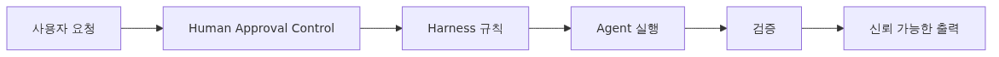
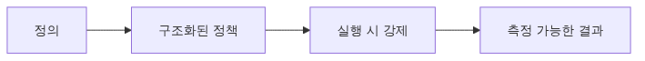

# Approval Gate — 사람 승인이 필요한 지점 설계하기

> Harness Engineering 101 시리즈 (8/10)

어떤 행동은 자동으로 실행되어서는 안 됩니다. 결제, 배포, 삭제, 발송은 사람의 승인이 필요합니다. Approval Gate는 어디서 사람이 멈춰야 하는지를 명시적으로 설계합니다.

---


## Approval Gate란 무엇인가요?


Approval Gate는 에이전트가 특정 행동을 실행하기 직전에 사람의 승인을 요구하는 지점입니다. 자동화된 흐름을 일시적으로 멈추고, 결정 권한을 사람에게 넘긴 뒤, 사람의 응답을 받아 다시 진행하거나 중단합니다.

```python
from dataclasses import dataclass
from typing import Literal

@dataclass
class ApprovalRequest:
    action_id: str
    action_type: str
    summary: str
    risk_level: Literal["low", "medium", "high"]
    payload: dict

@dataclass
class ApprovalDecision:
    action_id: str
    decision: Literal["approve", "reject"]
    approver: str
    reason: str
```

`ApprovalRequest`는 "사람이 결정을 내리기 위해 필요한 최소 정보"를 담습니다. 에이전트가 무엇을 하려 하는지, 왜 위험한지, 어떤 입력으로 실행되는지를 한눈에 보여줘야 합니다.

## 어디에 Approval Gate를 둬야 할까요?

모든 행동에 사람을 끼우면 자동화의 의미가 사라지고, 어디에도 두지 않으면 사고가 납니다. 다음 4가지 기준 중 하나라도 해당하면 Approval Gate를 두는 것을 검토합니다.

1. **되돌릴 수 없는 행동**: 결제, 배포, 삭제, 외부 발송
2. **금액·범위가 임계치를 넘는 행동**: 100만 원 이상 환불, 1000명 이상 일괄 메일
3. **법적·계약상 책임이 따르는 행동**: 계약 체결, 개인정보 외부 전송
4. **모델 신뢰도가 낮은 행동**: 자체 평가 점수가 임계치 미만, 새로운 도구 첫 호출

```python
def needs_approval(action_type: str, payload: dict, confidence: float) -> bool:
    if action_type in {"payment", "deploy", "delete", "send_email"}:
        return True
    if action_type == "refund" and payload.get("amount", 0) >= 1_000_000:
        return True
    if confidence < 0.7:
        return True
    return False
```

이 함수는 에이전트가 도구를 호출하기 직전에 항상 거쳐야 하는 관문입니다. Tool Harness(Ep5)의 ToolRegistry에서 도구를 실행하기 전 단계에 끼워 넣습니다.

## Approval Workflow 설계하기


승인 흐름은 4단계로 구성됩니다.

```python
import uuid
from datetime import datetime, timezone

class ApprovalWorkflow:
    def __init__(self, store, notifier):
        self.store = store
        self.notifier = notifier

    def request(self, action_type: str, summary: str, payload: dict, risk: str) -> str:
        action_id = str(uuid.uuid4())
        req = ApprovalRequest(
            action_id=action_id,
            action_type=action_type,
            summary=summary,
            risk_level=risk,
            payload=payload,
        )
        self.store.save_request(req, created_at=datetime.now(timezone.utc))
        self.notifier.notify(req)
        return action_id

    def wait(self, action_id: str, timeout_sec: int = 600) -> ApprovalDecision | None:
        return self.store.wait_for_decision(action_id, timeout_sec)

    def execute_if_approved(self, action_id: str, executor):
        decision = self.store.get_decision(action_id)
        if decision is None:
            return {"status": "pending"}
        if decision.decision == "reject":
            return {"status": "rejected", "reason": decision.reason}
        result = executor()
        self.store.mark_executed(action_id, result)
        return {"status": "executed", "result": result}
```

1. **request**: 에이전트가 승인 요청을 생성하고 사람에게 알립니다.
2. **wait**: 사람의 결정을 기다립니다. 일정 시간 내 응답이 없으면 timeout으로 간주합니다.
3. **execute_if_approved**: 승인된 경우에만 실제 행동을 실행합니다.
4. **log**: 모든 단계를 기록합니다 (Observability — Ep9에서 다룹니다).

## Dry-run vs Commit 분리


승인 요청 자체에 "실행될 결과의 미리보기"를 함께 보여주면 사람이 훨씬 정확하게 결정할 수 있습니다. Dry-run은 실제 부수효과 없이 결과만 계산하는 모드입니다.

```python
class RefundTool:
    def dry_run(self, payload: dict) -> dict:
        return {
            "would_refund": payload["amount"],
            "to_account": payload["account_id"],
            "remaining_balance": self._balance(payload["account_id"]) - payload["amount"],
            "affects_records": ["transactions", "ledger", "audit_log"],
        }

    def commit(self, payload: dict) -> dict:
        return self._execute_refund(payload)
```

Approval Gate는 `dry_run` 결과를 `ApprovalRequest.summary`에 포함시켜야 합니다. 그래야 사람이 "이 환불을 승인하면 잔액이 -50만 원이 된다"는 사실을 미리 보고 거절할 수 있습니다.

## Decision Logging — 누가, 언제, 왜 승인했는가

승인 자체보다 더 중요한 것은 승인의 기록입니다. 사고가 났을 때 "왜 이 결정이 내려졌는가"를 추적하지 못하면 같은 사고가 반복됩니다.

```python
@dataclass
class ApprovalLog:
    action_id: str
    action_type: str
    payload: dict
    dry_run_preview: dict
    requested_at: datetime
    decided_at: datetime
    approver: str
    decision: str
    reason: str
    executed_at: datetime | None
    result: dict | None
```

기록은 다음 5가지 질문에 답할 수 있어야 합니다.

1. **무엇을 하려 했는가**: action_type, payload
2. **결정 시점에 무엇을 알 수 있었는가**: dry_run_preview
3. **누가 결정했는가**: approver
4. **왜 그런 결정을 내렸는가**: reason (필수 입력)
5. **실제로 무엇이 실행되었는가**: result

## 흔한 실수 5가지

1. **모든 행동에 승인을 요구**: 자동화의 가치가 사라지고, 사람도 일일이 보지 않게 됩니다. 위험도 기준을 명확히 하세요.
2. **승인 요청에 정보가 부족**: "환불을 승인하시겠습니까?"만 보여주면 사람은 거절할 수밖에 없습니다. dry-run preview를 함께 보여주세요.
3. **timeout 정책이 없음**: 사람이 응답하지 않으면 에이전트가 영원히 멈춰 있습니다. timeout 시 자동 거절이 안전합니다.
4. **거절 사유를 받지 않음**: reason 없이 reject만 받으면 같은 요청이 계속 올라옵니다. 거절 사유를 학습 신호로 사용하세요.
5. **승인 권한 위임이 없음**: 한 사람만 승인할 수 있게 하면 그 사람이 휴가일 때 시스템이 멈춥니다. 권한 매트릭스를 설계하세요.

## 핵심 요약

- Approval Gate는 되돌릴 수 없거나 책임이 따르는 행동 직전에 사람의 결정을 받는 지점입니다.
- `needs_approval` 같은 명시적 규칙으로 어디에 게이트를 둘지 결정하세요.
- Workflow는 request → wait → execute → log 4단계로 구성됩니다.
- Dry-run preview를 승인 요청에 포함시켜 사람이 결과를 미리 보고 결정하게 하세요.
- ApprovalLog는 5W1H에 답할 수 있어야 사고 후 추적이 가능합니다.

다음 글에서는 Observability를 다룹니다. 에이전트 실행을 어떻게 기록하고, 추적하고, 재현하는지 살펴봅니다.

<!-- toc:begin -->
## 시리즈 목차

- [Harness Engineering이란 무엇인가?](./01-what-is-harness-engineering.md)
- [Task Harness — 모호한 일을 실행 가능한 작업으로 바꾸기](./02-task-harness.md)
- [Context Harness — Agent에게 줄 정보와 숨길 정보 설계하기](./03-context-harness.md)
- [Constraint Harness — 규칙, 경계, 금지 행동 정의하기](./04-constraint-harness.md)
- [Tool Harness — Agent가 사용할 도구를 안전하게 설계하기](./05-tool-harness.md)
- [Test Harness — 완료 조건을 테스트로 고정하기](./06-test-harness.md)
- [Feedback Loop — 실패를 고치게 만드는 반복 구조](./07-feedback-loop.md)
- **Approval Gate — 사람 승인이 필요한 지점 설계하기 (현재 글)**
- Observability — Agent 작업을 추적하고 재현하기 (예정)
- Production Harness — 운영 가능한 Agent 작업 환경 만들기 (예정)

<!-- toc:end -->

---

## 참고 자료

- [Anthropic — Building Effective Agents](https://www.anthropic.com/research/building-effective-agents)
- [OpenAI — Best practices for safety in agent systems](https://platform.openai.com/docs/guides/safety-best-practices)
- [Google SRE — Postmortem culture](https://sre.google/sre-book/postmortem-culture/)
- [LangChain — Human-in-the-loop](https://python.langchain.com/docs/concepts/human_in_the_loop/)

Tags: AI Agent, Harness, Production, Reliability
