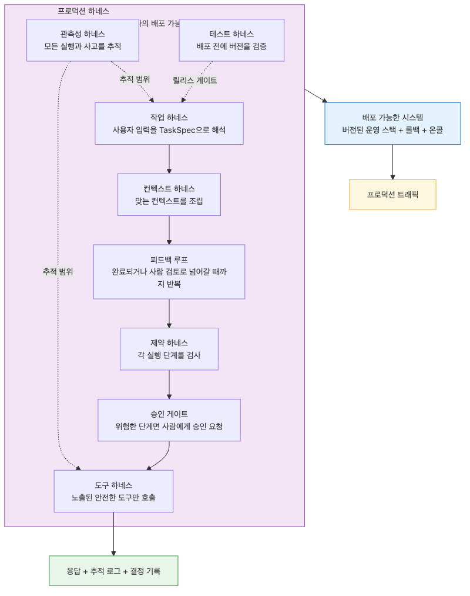
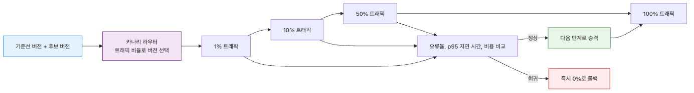
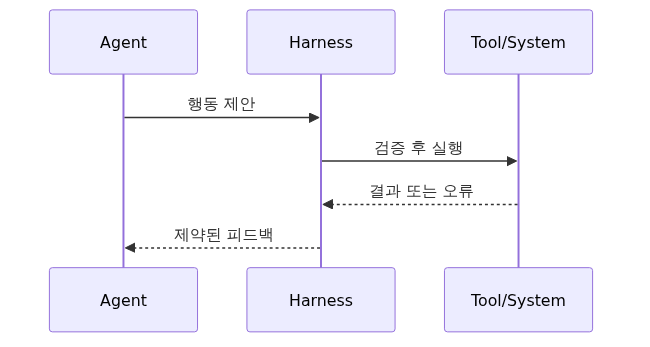

# Production Harness — 운영 가능한 Agent 작업 환경 만들기
개별 harness를 하나씩 잘 만들었다고 해서 시스템이 곧바로 운영 가능해지지는 않습니다. 태스크가 명확하고, 컨텍스트가 깨끗하고, 제약과 도구와 테스트가 잘 설계돼 있어도, 배포와 롤백과 on-call 흐름이 비어 있으면 실제 사용자에게 안전하게 전달할 수 없습니다.
프로덕션에서는 항상 조합의 문제가 더 어렵습니다. 새 프롬프트가 들어오면 eval과 approval 정책도 같이 바뀌어야 하고, 새 도구가 들어오면 observability와 rollback 경로도 함께 바뀌어야 합니다. 부품이 많아질수록 조립 규칙이 더 중요해집니다.
Production Harness는 앞선 모든 harness를 하나의 배포 가능한 단위로 묶는 층입니다. 요청이 들어와서 실행되고, 점진적으로 배포되고, 문제가 생기면 30초 안에 되돌아오고, on-call이 추적할 수 있는 운영 표면을 만드는 것이 목표입니다.
이 글은 Harness Engineering 101 시리즈의 마지막 글입니다.
좋은 에이전트의 마지막 조건은 똑똑함이 아니라 안전하게 배포하고 안전하게 되돌릴 수 있다는 점입니다.
## 이 글에서 다룰 문제
- 앞선 아홉 가지 harness는 실제 요청 흐름 안에서 어떤 순서로 맞물릴까요?
- 개별 harness를 잘 만들고도 프로덕션에서 실패하는 이유는 무엇일까요?
- 왜 새 프롬프트나 도구를 한 번에 100% 배포하면 안 될까요?
- rollback은 왜 기능이 아니라 최소 운영 요건일까요?
- on-call runbook과 eval suite는 왜 코드와 같은 버전 단위로 움직여야 할까요?
## 왜 이 글이 중요한가
Production Harness가 중요한 첫 번째 이유는 조합 복잡성입니다. 부품이 많아질수록 어느 하나의 품질보다 서로가 어떻게 연결되는지가 더 큰 장애 원인이 됩니다.
두 번째 이유는 배포 위험입니다. 에이전트 시스템은 코드뿐 아니라 프롬프트, 도구 정의, eval 데이터셋, approval rule이 함께 바뀝니다. 이들을 같은 버전 단위로 관리하지 않으면 원인 불명의 조합이 생깁니다.
세 번째 이유는 운영 대응입니다. alert가 울렸을 때 어디를 보고 무엇을 되돌릴지 명확하지 않으면, 좋은 harness들도 결국 장애 상황에서 쓸모를 잃습니다.
## Production Harness를 이해하는 가장 좋은 방법: 여러 harness를 배포 가능한 하나의 운영 스택으로 묶는 일로 보는 것입니다
Production Harness는 새로운 기술 조각 하나가 아니라 조립 규칙입니다. Task, Context, Constraint, Tool, Test, Feedback, Approval, Observability를 요청 흐름과 배포 흐름 안에서 함께 움직이게 만들어야 합니다.
이때 중요한 것은 clear interface입니다. 각 harness가 한 가지 책임만 갖고 다음 단계로 어떤 입력을 넘기는지 분명해야 어디가 깨졌는지 빨리 찾을 수 있습니다.
또한 production stack은 canary, rollback, runbook까지 포함해야 합니다. 안전하게 올리고, 안전하게 되돌리고, 새벽 세 시에 누가 무엇을 할지 써 두지 않으면 운영 가능하다고 부를 수 없습니다.
> 프로덕션 에이전트는 여러 harness의 집합이 아니라, 그 harness들을 함께 배포하고 함께 되돌릴 수 있는 운영 스택입니다.
## 핵심 개념
지금까지 다룬 모든 Harness를 통합해서 운영 가능한 Agent 환경을 만듭니다. Production Harness는 task, context, constraint, tool, test, feedback, approval, observability를 한 시스템으로 묶는 마지막 조립 단계입니다.


### Production Harness란 무엇인가요?

Production Harness는 지금까지 다룬 9가지 harness를 하나의 운영 가능한 시스템으로 묶는 마지막 layer입니다. 개별 harness가 아무리 잘 만들어져 있어도, 배포·롤백·on-call 흐름이 없으면 실제 사용자에게 안전하게 가닿을 수 없습니다.

```python
from dataclasses import dataclass

@dataclass
class HarnessStack:
    task: object          # Ep2 — TaskSpec
    context: object       # Ep3 — ContextBudget
    constraint: object    # Ep4 — ConstraintPolicy
    tools: object         # Ep5 — ToolRegistry
    tests: object         # Ep6 — eval suite
    feedback: object      # Ep7 — FeedbackLoop
    approval: object      # Ep8 — ApprovalWorkflow
    observability: object # Ep9 — Tracer
```

Production Harness는 이 stack을 받아 "배포할 수 있는 단위"로 포장합니다.

### 9가지 Harness가 어떻게 맞물리는가



요청 하나가 들어오면 다음 순서로 흐릅니다.

```python
def handle_request(stack: HarnessStack, user_input: str) -> dict:
    with stack.observability.trace("agent.run") as trace:
        spec = stack.task.parse(user_input)
        ctx = stack.context.assemble(spec)
        plan = stack.feedback.run_until_done(
            spec=spec,
            context=ctx,
            execute_step=lambda step: _execute_step(stack, step, trace),
        )
        return plan.result

def _execute_step(stack: HarnessStack, step, trace):
    stack.constraint.check(step)
    if stack.approval.needs_approval(step):
        decision = stack.approval.request_and_wait(step)
        if decision.decision == "reject":
            return {"status": "rejected"}
    with trace.child(f"tool.{step.tool}"):
        return stack.tools.invoke(step.tool, step.input)
```

각 harness는 한 가지 책임만 갖고, 다음 harness에 넘기는 인터페이스가 명확해야 합니다. 책임이 섞이면 어디를 고쳐야 할지 모르게 됩니다.

### Deployment Pattern — 점진적 롤아웃



새로운 prompt나 도구는 절대 한 번에 100% 사용자에게 배포하지 않습니다.

```python
class CanaryDeployer:
    def __init__(self, baseline, candidate):
        self.baseline = baseline
        self.candidate = candidate

    def route(self, request, traffic_percent: int) -> str:
        bucket = hash(request.user_id) % 100
        return "candidate" if bucket < traffic_percent else "baseline"

    def should_promote(self, baseline_metrics, candidate_metrics) -> bool:
        if candidate_metrics.error_rate > baseline_metrics.error_rate * 1.1:
            return False
        if candidate_metrics.p95_latency_ms > baseline_metrics.p95_latency_ms * 1.2:
            return False
        if candidate_metrics.avg_cost_usd > baseline_metrics.avg_cost_usd * 1.5:
            return False
        return True
```

표준 ramp는 1% → 10% → 50% → 100%이고, 각 단계에서 최소 1시간 동안 baseline과 비교합니다. 한 단계라도 `should_promote`가 False면 즉시 0%로 롤백합니다.

### Rollback — "되돌릴 수 있어야" 배포다



배포 후 30초 안에 이전 버전으로 되돌릴 수 없다면 그것은 배포가 아니라 사고입니다.

```python
class HarnessVersion:
    def __init__(self, version_id: str, stack: HarnessStack):
        self.version_id = version_id
        self.stack = stack

class HarnessRouter:
    def __init__(self):
        self.versions: dict[str, HarnessVersion] = {}
        self.active_id: str | None = None
        self.previous_id: str | None = None

    def deploy(self, version: HarnessVersion):
        self.versions[version.version_id] = version
        self.previous_id = self.active_id
        self.active_id = version.version_id

    def rollback(self) -> str:
        if self.previous_id is None:
            raise RuntimeError("no previous version to roll back to")
        self.active_id, self.previous_id = self.previous_id, self.active_id
        return self.active_id
```

Prompt, tool definition, eval dataset 모두 version_id로 묶여 함께 롤백되어야 합니다. Prompt만 롤백하고 도구는 그대로 두면 알 수 없는 조합이 됩니다.

### On-call Runbook — 새벽 3시에 깨었을 때

알림이 울렸을 때 on-call 엔지니어가 무엇을 봐야 하고, 무엇을 결정해야 하는지가 명문화되어 있어야 합니다.

```text
ALERT: agent.error_rate > 10% for 5 min

1. Check traces
   - Open the most recent 50 traces in the observability dashboard
   - Find what the failing spans have in common (model? tool? step?)

2. First-pass decision (within 5 min)
   - External dependency outage? → disable that tool + check status page
   - Right after a deploy? → run rollback() immediately
   - Specific user/input pattern? → quarantine that pattern

3. Second-pass action (within 30 min)
   - Open a postmortem ticket (include trace_id)
   - Add the failing case to the eval suite
   - Verify the same pattern is auto-blocked next time
```

이 runbook은 코드와 함께 버전 관리되어야 하고, 분기마다 fire drill로 검증해야 합니다.

### Capstone Example — 환불 처리 에이전트

9가지 harness가 모두 적용된 최소 예시입니다.

```python
def build_refund_agent() -> HarnessStack:
    return HarnessStack(
        task=TaskParser(allowed_intents={"refund", "status"}),
        context=ContextBudget(max_tokens=4000, retrieval=OrderHistoryRAG()),
        constraint=ConstraintPolicy(
            max_amount_usd=10000,
            max_calls_per_run=5,
            allowed_tools={"lookup_order", "calc_refund", "issue_refund"},
        ),
        tools=ToolRegistry([LookupOrderTool(), CalcRefundTool(), IssueRefundTool()]),
        tests=EvalSuite.load("evals/refund/v3.jsonl"),
        feedback=FeedbackLoop(max_retries=2, max_reflects=1),
        approval=ApprovalWorkflow(
            store=PostgresApprovalStore(),
            notifier=SlackNotifier(channel="#refunds-approval"),
            rule=lambda step: step.tool == "issue_refund" and step.input["amount"] >= 100,
        ),
        observability=Tracer(exporter=OtelExporter(endpoint="https://otel.internal")),
    )
```

이 stack을 `HarnessRouter`에 등록하고, `CanaryDeployer`로 1% → 100% 순차 배포하면 production-ready 에이전트입니다.
## 흔히 헷갈리는 지점
- 모든 harness를 한 번에 다 붙이는 것이 가장 성숙한 접근처럼 보이지만, 실제로는 운영 부담만 한꺼번에 커집니다.
- canary 없이 100% 배포해도 작은 변경이면 괜찮다고 생각하기 쉽지만, 프롬프트와 도구 변경은 작아 보여도 전체 행동을 바꿀 수 있습니다.
- rollback은 나중에 만들어도 된다고 미루기 쉽지만, 실제로 필요해지는 순간 가장 급한 기능이 됩니다.
- runbook은 위키에만 있어도 된다고 보기 쉽지만, 코드와 떨어진 문서는 가장 빨리 낡습니다.
- eval suite를 프롬프트와 따로 버전 관리해도 된다고 생각하기 쉽지만, 그러면 배포 후 무엇이 바뀌었는지 설명하기 어려워집니다.
## 운영 체크리스트
- [ ] Task부터 Observability까지 각 harness의 책임과 인터페이스를 한 요청 흐름 안에 문서화합니다.
- [ ] 프롬프트, 도구 정의, approval rule, eval 데이터셋을 같은 version_id로 묶습니다.
- [ ] 신규 변경은 1% → 10% → 50% → 100% canary로 단계 배포합니다.
- [ ] 이전 버전으로 30초 안에 돌아갈 수 있는 rollback 경로를 정기적으로 검증합니다.
- [ ] on-call runbook을 저장소에서 버전 관리하고 분기마다 fire drill로 점검합니다.
## 정리
Production Harness는 앞선 아홉 가지 harness를 예쁘게 모아 놓는 단계가 아니라, 그것들을 함께 실행하고 함께 배포하고 함께 되돌릴 수 있게 만드는 운영 단계입니다. 여기까지 와야 비로소 시스템이 사용자에게 안전하게 닿습니다.
중요한 것은 clear interface와 versioned rollout입니다. 각 harness가 어디서 시작하고 끝나는지 분명해야 하고, 프롬프트·도구·eval·policy가 같은 버전 단위로 움직여야 원인을 설명할 수 있습니다.
이 시리즈의 마지막 결론도 단순합니다. 신뢰받는 에이전트는 좋은 모델과 좋은 프롬프트만으로 만들어지지 않습니다. 잘 설계된 harness와, 그것을 운영 가능한 스택으로 묶는 Production Harness가 있어야 합니다.
<!-- toc:begin -->
## Harness Engineering 101 시리즈

- [Harness Engineering이란 무엇인가?](./01-what-is-harness-engineering.md)
- [Task Harness — 모호한 일을 실행 가능한 작업으로 바꾸기](./02-task-harness.md)
- [Context Harness — Agent에게 줄 정보와 숨길 정보 설계하기](./03-context-harness.md)
- [Constraint Harness — 규칙, 경계, 금지 행동 정의하기](./04-constraint-harness.md)
- [Tool Harness — Agent가 사용할 도구를 안전하게 설계하기](./05-tool-harness.md)
- [Test Harness — 완료 조건을 테스트로 고정하기](./06-test-harness.md)
- [Feedback Loop — 실패를 고치게 만드는 반복 구조](./07-feedback-loop.md)
- [Approval Gate — 사람 승인이 필요한 지점 설계하기](./08-approval-gate.md)
- [Observability — Agent 작업을 추적하고 재현하기](./09-observability.md)
- **Production Harness — 운영 가능한 Agent 작업 환경 만들기 (현재 글)**

<!-- toc:end -->
## 참고 자료
### 공식 문서

- [Google SRE — Release engineering](https://sre.google/sre-book/release-engineering/)
- [Martin Fowler — CanaryRelease](https://martinfowler.com/bliki/CanaryRelease.html)
- [Anthropic — Building Effective Agents](https://www.anthropic.com/research/building-effective-agents)
- [PagerDuty — Incident response documentation](https://response.pagerduty.com/)
### 관련 시리즈

- [LangGraph 101 — 멀티 에이전트 시스템](../../langgraph-101/ko/05-multi-agent.md)
- [AI Safety & Guardrails 101 — 운영 가드레일 시스템 구축](../../ai-safety-guardrails-101/ko/10-production-guardrail-system.md)
Tags: AI Agent, Harness, Production, Deployment