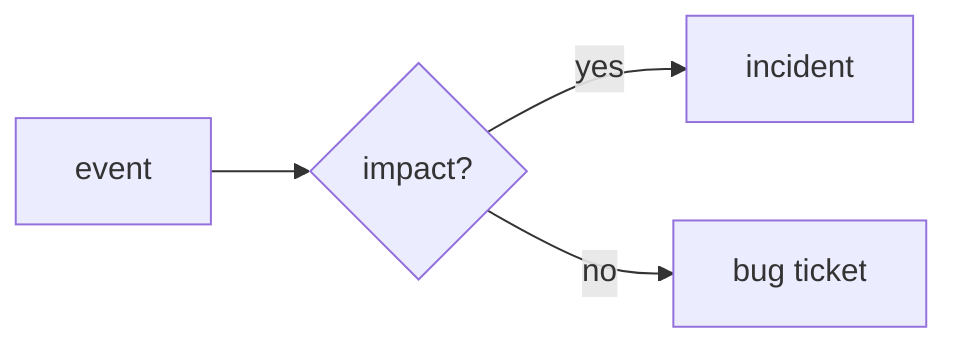

# What is an Incident?

> Incident Response 101 series (1/10)

<!-- a-grade-intro:begin -->

**Core question**: *Which* problems count as an *incident*?

> An *incident* is an *abnormal* condition with *customer impact* above a *threshold*.

<!-- a-grade-intro:end -->

This is the first post in the Incident Response 101 series.

## What You Will Learn

- The *definition* of an *incident*
- *Impact* measurement
- The difference from a *regular bug*
- A starting point for *on-call*
- The *cultural* dimension

## Why It Matters

Without a *threshold*, response is either *too slow* or *too aggressive*.

## Concept at a Glance



## Key Terms

- **incident**: an *abnormal* event with *customer impact*.
- **alert**: an *action-required* signal.
- **outage**: a *service interruption*.
- **degradation**: a *performance drop*.
- **on-call**: a *standby duty rotation*.

## Before/After

**Before**: every *alert* is treated like an *incident*.

**After**: alerts are *classified by impact* before action.

## Hands-on: Incident Decision

### Step 1 — Capture impact

```python
def impact(users, minutes):
    return {"users": users, "minutes": minutes}
```

### Step 2 — Threshold

```python
def is_incident(i, user_th=100, min_th=5):
    return i["users"] >= user_th or i["minutes"] >= min_th
```

### Step 3 — Classify

```python
def classify(i):
    return "incident" if is_incident(i) else "bug"
```

### Step 4 — Page or not

```python
def page(i):
    return classify(i) == "incident"
```

### Step 5 — Route the channel

```python
def channel(kind):
    return "#inc" if kind == "incident" else "#bugs"
```

## What to Notice in This Code

- The *threshold* is the result of an *agreement*.
- The *classification* picks the *path*.
- *Code* removes *subjectivity*.

## Five Common Mistakes

1. **Confusing *alerts* with *incidents*.**
2. **No agreed *threshold*.**
3. **Estimating *impact* *subjectively*.**
4. **Insufficient *on-call* *training* material.**
5. **Returning to work *without records*.**

## How This Shows Up in Production

*PagerDuty's severity rules* automate the *classification*.

## How a Senior Engineer Thinks

- *Customer impact* is the *yardstick*.
- *Alerts* are *raw material*; *judgment* is *human*.
- *Over-response* is also a *cost*.
- *Records* are the *fuel for learning*.
- *On-call* matures through *training*.

## Checklist

- [ ] *Threshold* agreed.
- [ ] *Classification* code.
- [ ] *Alert routing*.
- [ ] *Training* material.

## Practice Problems

1. Define *incident* in one line.
2. Define *outage* in one line.
3. Define *degradation* in one line.

## Wrap-up and Next Steps

Next, we cover *severity classification*.

<!-- toc:begin -->
- **What is an Incident? (current)**
- Severity Classification (upcoming)
- Initial Response (upcoming)
- Communication (upcoming)
- Writing the Timeline (upcoming)
- Root Cause Analysis (upcoming)
- Mitigation and Resolution (upcoming)
- Postmortem (upcoming)
- Prevention (upcoming)
- Building an Incident Runbook (upcoming)
<!-- toc:end -->

## References

- [Incident Response - PagerDuty](https://response.pagerduty.com/)
- [Managing Incidents - Google SRE Book](https://sre.google/sre-book/managing-incidents/)
- [Atlassian Incident Handbook](https://www.atlassian.com/incident-management/handbook)
- [Incident Definition - ITIL](https://wiki.en.it-processmaps.com/index.php/Incident_Management)

Tags: Incident, Response, SRE, Operations, OnCall
