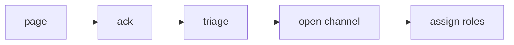

# Initial Response

> Incident Response 101 series (3/10)

<!-- a-grade-intro:begin -->

**Core question**: In the *first five minutes* after an *alert*, *what* should you do?

> *Initial response* focuses on *stabilization* and *role assignment*.

<!-- a-grade-intro:end -->

## What You Will Learn

- The *five-minute rule*
- *Stabilization first*
- *Impact estimation*
- *Role assignment*
- *Channel setup*

## Why It Matters

The actions in the *first five minutes* determine the *whole outcome*.

## Concept at a Glance



## Key Terms

- **ack**: *acknowledging* a page.
- **triage**: *sorting* and *prioritizing*.
- **stabilize**: *stop the bleeding*.
- **channel**: a *dedicated collaboration space*.
- **role**: a *defined responsibility*.

## Before/After

**Before**: start with *diagnosis*.

**After**: start with *stabilization*.

## Hands-on: Five-Minute Checklist

### Step 1 — Ack

```python
def ack(alert_id, user):
    return {"alert": alert_id, "by": user, "at": "now"}
```

### Step 2 — Estimate impact

```python
def estimate_impact(metrics):
    return metrics.get("err_ratio", 0) * 100
```

### Step 3 — Open the channel

```python
def open_channel(name):
    return f"#inc-{name}"
```

### Step 4 — Assign roles

```python
def assign(team):
    return {"IC": team[0], "ops": team[1], "comms": team[2]}
```

### Step 5 — Stabilize

```python
def stabilize(actions):
    return [a for a in actions if a in ("rollback", "scale", "throttle")]
```

## What to Notice in This Code

- *Ack* marks the start of *ownership*.
- Express *impact* with *numbers*.
- The *role* set has *three axes*.

## Five Common Mistakes

1. **Starting with *diagnosis*.**
2. **The *IC* doing the *hands-on work*.**
3. ***Scattering* across channels.**
4. **Skipping *customer comms*.**
5. **Acting *without records*.**

## How This Shows Up in Production

*PagerDuty ack* → *auto-created Slack channel* → *Statuspage draft* — all *automated*.

## How a Senior Engineer Thinks

- *Time* is the *enemy*.
- *Stabilization* is the *top priority*.
- *Roles* are *fixed*.
- *Recording* happens *in parallel*.
- *Action* beats *perfection*.

## Checklist

- [ ] *Ack policy*.
- [ ] *Channel automation*.
- [ ] *Role cards*.
- [ ] *Stabilization action list*.

## Practice Problems

1. Define *ack* in one line.
2. Define *triage* in one line.
3. Define *stabilize* in one line.

## Wrap-up and Next Steps

Next, we cover *communication*.

<!-- toc:begin -->
- [What is an Incident?](./01-what-is-incident.md)
- [Severity Classification](./02-severity.md)
- **Initial Response (current)**
- Communication (upcoming)
- Writing the Timeline (upcoming)
- Root Cause Analysis (upcoming)
- Mitigation and Resolution (upcoming)
- Postmortem (upcoming)
- Prevention (upcoming)
- Building an Incident Runbook (upcoming)
<!-- toc:end -->

## References

- [Incident Response Process - PagerDuty](https://response.pagerduty.com/during/during_an_incident/)
- [Managing Incidents - Google SRE Book](https://sre.google/sre-book/managing-incidents/)
- [Incident Triage - Atlassian](https://www.atlassian.com/incident-management/incident-response)
- [On-Call Best Practices](https://increment.com/on-call/)

Tags: Incident, Triage, Response, OnCall, Operations
