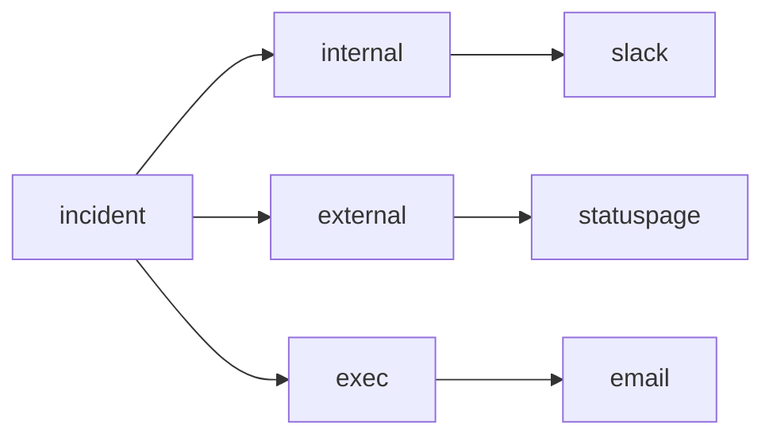

# Communication

> Incident Response 101 series (4/10)

<!-- a-grade-intro:begin -->

**Core question**: During an *incident*, *who* should hear *what*, and *when*?

> *Communication* sends *different messages* to *different audiences* on a *fixed cadence*.

<!-- a-grade-intro:end -->

This is post 4 in the Incident Response 101 series.

## What You Will Learn

- *Audience separation*
- *Update cadence*
- *Statuspages*
- *Templated messages*
- *When to notify customers*

## Why It Matters

A *failed announcement* damages *trust* more than a slow technical recovery.

## Concept at a Glance



## Key Terms

- **internal**: shared *inside the response team*.
- **external**: addressed to *customers*.
- **exec**: *executive summary*.
- **cadence**: the *update interval*.
- **statuspage**: the *official status page*.

## Before/After

**Before**: everything mixed into *one channel*.

**After**: *separate channels* and *templates* per audience.

## Hands-on: Build Per-Audience Messages

### Step 1 — Define audiences

```python
AUDIENCES = ("internal", "external", "exec")
```

### Step 2 — Template function

```python
def message(audience, sev, summary):
    return {"to": audience, "sev": sev, "text": summary}
```

### Step 3 — Cadence calculation

```python
def cadence(sev):
    return {"SEV1": 15, "SEV2": 30, "SEV3": 60}.get(sev, 120)
```

### Step 4 — Statuspage draft

```python
def statuspage(component, state):
    return f"{component} is {state}"
```

### Step 5 — Send queue

```python
def queue(messages):
    return sorted(messages, key=lambda m: m["sev"])
```

## What to Notice in This Code

- *Audience* is the *key* in the data structure.
- *Cadence* is *tied to SEV*.
- *Templates* are *functions* — reusable.

## Five Common Mistakes

1. **Sending the *same message* to everyone.**
2. **Believing the first *update* must be *perfect*.**
3. **Updating *irregularly* without a cadence.**
4. **Sending *raw technical jargon* to executives.**
5. **Forgetting the *resolution* announcement.**

## How This Shows Up in Production

*Statuspage* + *Slack* + an *email broadcaster* are wired together so *one input* fans out to *three channels*.

## How a Senior Engineer Thinks

- *Silence* is the *worst* option.
- *Short and frequent* beats long and rare.
- *Executives* hear *impact*, not internals.
- *Customers* hear *what to do*.
- Send *one more* note after *resolution*.

## Checklist

- [ ] *Audience definition*.
- [ ] *Template repository*.
- [ ] *Cadence table*.
- [ ] *Statuspage permissions*.

## Practice Problems

1. Define *cadence* in one line.
2. Define *statuspage* in one line.
3. Summarize the core of an *exec* message in one line.

## Wrap-up and Next Steps

Next, we cover *writing the timeline*.

<!-- toc:begin -->
- [What is an Incident?](./01-what-is-incident.md)
- [Severity Classification](./02-severity.md)
- [Initial Response](./03-initial-response.md)
- **Communication (current)**
- Writing the Timeline (upcoming)
- Root Cause Analysis (upcoming)
- Mitigation and Resolution (upcoming)
- Postmortem (upcoming)
- Prevention (upcoming)
- Building an Incident Runbook (upcoming)
<!-- toc:end -->

## References

- [Incident Communication - Atlassian](https://www.atlassian.com/incident-management/incident-communication)
- [Statuspage Best Practices](https://www.atlassian.com/software/statuspage/best-practices)
- [Communicating During Incidents - PagerDuty](https://response.pagerduty.com/during/external_comms/)
- [Incident Comms Playbook - Increment](https://increment.com/on-call/communication/)

Tags: Incident, Communication, Statuspage, OnCall, Operations
