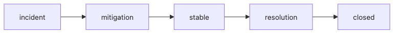

# Mitigation and Resolution

Stopping customer pain is not the same as fixing the system. That distinction sounds obvious in calm conversation, but during a live incident teams often announce “resolved” when they have only bought a temporary reduction in impact.

Mitigation and resolution have different goals, different owners, and sometimes different timelines. Confusing them creates both technical and communication risk.

This is post 7 in the Incident Response 101 series. This post explains how to choose between rollback, scale-out, throttling, and kill switches, and how to prove that the service is truly healthy before you close the incident.

## Questions this chapter answers

Teams under pressure often collapse mitigation and resolution into a single recovery concept. That makes it easy to communicate too aggressively, or to close the incident before the real risk is gone.

> Mitigation reduces impact now. Resolution removes the condition that caused the impact. Both matter, but they should not be announced or verified in the same way.

- What makes rollback such a powerful mitigation tool?
- When should you scale out, throttle, or use a kill switch instead?
- Why is “impact reduced” not enough to declare resolution?
- How do you verify recovery with numbers instead of intuition?
- Which post-mitigation events still need to be recorded?

## Why this topic matters

A service can look calmer while the underlying cause is still present. That is why incidents often reopen at night or after traffic shifts if the team stops at temporary containment.

Separating mitigation from resolution keeps the response honest. It improves communication, clarifies ownership, and prevents teams from skipping the verification step.

## Diagram at a glance



*Diagram at a glance*
The response path moves from impact containment to stability and then to root removal. If those states are not separated, both operations and communication get fuzzy.

## Key Terms

- **mitigation**: stop the damage.
- **resolution**: remove the cause.
- **rollback**: revert to the previous version.
- **kill switch**: turn a feature off immediately.
- **throttle**: limit incoming traffic.

## Before/After

**Before**: announce only after a full fix.

**After**: announce as soon as damage is contained; announce resolution separately.

## Hands-on: A Mini Mitigation Kit

### Step 1 — Rollback

```python
def rollback(version):
    return {"action": "rollback", "to": version}
```

### Step 2 — Scale out

```python
def scale_out(service, replicas):
    return {"service": service, "replicas": replicas}
```

### Step 3 — Throttle

```python
def throttle(endpoint, rps):
    return {"endpoint": endpoint, "rps": rps}
```

### Step 4 — Kill switch

```python
FLAGS = {}

def kill(feature):
    FLAGS[feature] = False
    return FLAGS[feature]
```

### Step 5 — Verify recovery

```python
def verify(metrics):
    return metrics.get("err_ratio", 1) < 0.01
```

## What to Notice in This Code

- Mitigation is a small action.
- A kill switch is one flag line.
- Verification is quantitative.

## Five Common Mistakes

1. **Only rolling forward, never back.**
2. **No prepared kill switch.**
3. **Announcing mitigation as resolution.**
4. **Closing without verification.**
5. **Forgetting to unthrottle.**

## How This Shows Up in Production

A feature flag system and an autoscaler are wired into a single runbook command, so mitigation takes under two minutes.

## How a Senior Engineer Thinks

- Mitigation first.
- Resolution during business hours.
- A kill switch on every feature.
- Verify with numbers.
- Unthrottling is also an event.

## Example mitigation order

During a live incident, the team should usually scan mitigation options in the order below.

1. Is there a clean rollback to the previous known-good state?
2. Can a feature flag or kill switch disable only the broken path?
3. If the issue is capacity-related, can you scale out immediately?
4. If the problem is traffic amplification, can throttling protect the critical path?
5. After each action, which metric proves that recovery is real?

That order keeps the team focused on the fastest credible reduction in customer impact instead of the most elegant long-term repair.

## Checklist

- [ ] Rollback procedure.
- [ ] Kill switch inventory.
- [ ] Throttling policy.
- [ ] Recovery verification metric.

## Practice Problems

1. Define mitigation in one line.
2. Define resolution in one line.
3. Define kill switch in one line.

## Wrap-up and Next Steps

Next, we cover the postmortem.

<!-- toc:begin -->
- [What is an Incident?](./01-what-is-incident.md)
- [Severity Classification](./02-severity.md)
- [Initial Response](./03-initial-response.md)
- [Communication](./04-communication.md)
- [Writing the Timeline](./05-timeline.md)
- [Root Cause Analysis](./06-root-cause-analysis.md)
- **Mitigation and Resolution (current)**
- Postmortem (upcoming)
- Prevention (upcoming)
- Building an Incident Runbook (upcoming)
<!-- toc:end -->

## References

### Official Docs
- [Mitigation during incidents - PagerDuty](https://response.pagerduty.com/during/mitigation/)
- [Release Engineering - Google SRE Book](https://sre.google/sre-book/release-engineering/)
- [Feature Toggles - Martin Fowler](https://martinfowler.com/articles/feature-toggles.html)
- [Incident management guide - Atlassian](https://www.atlassian.com/incident-management)

Tags: Incident, Mitigation, Resolution, Rollback, Operations
