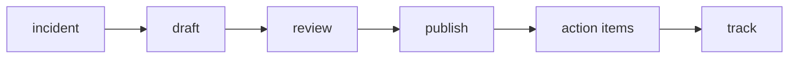

# Postmortem

> Incident Response 101 series (8/10)

<!-- a-grade-intro:begin -->

**Core question**: After an *incident* ends, *how* do you turn the *learning* into an *organizational asset*?

> A *postmortem* is a *blameless* document recording *facts*, *impact*, *cause*, and *actions*.

<!-- a-grade-intro:end -->

This is post 8 in the Incident Response 101 series.

## What You Will Learn

- The *blameless* principle
- *Template* structure
- *Action items*
- *Tracking* methods
- *Sharing* scope

## Why It Matters

When the *same incident* keeps *repeating*, learning stops at the *document* and never reaches *behavior*.

## Concept at a Glance



## Key Terms

- **blameless**: no *personal* blame.
- **summary**: a *three-sentence* recap.
- **impact**: what the *customer* experienced.
- **action item**: a *verifiable* follow-up.
- **owner**: the *action's* responsible person.

## Before/After

**Before**: an *internal* document of *blame*.

**After**: an *organization-wide*, *blameless* document.

## Hands-on: A Mini Postmortem Builder

### Step 1 — Template

```python
TEMPLATE = ("summary", "impact", "timeline", "rca", "actions")

def new_doc():
    return {k: "" for k in TEMPLATE}
```

### Step 2 — Summary check

```python
def is_short(text):
    return text.count(".") <= 3
```

### Step 3 — Quantify impact

```python
def impact(users, minutes):
    return {"users": users, "minutes": minutes}
```

### Step 4 — Register an action

```python
def action(text, owner, due):
    return {"text": text, "owner": owner, "due": due}
```

### Step 5 — Track

```python
def overdue(actions, today):
    return [a for a in actions if a["due"] < today]
```

## What to Notice in This Code

- The *template* is *fixed* as a *tuple*.
- *Impact* is *numeric*.
- *Tracking* is one *deadline comparison*.

## Five Common Mistakes

1. **Naming an *individual* as the *cause*.**
2. **Actions with *no owner*.**
3. **Actions with *no deadline*.**
4. **Sharing only *internally*.**
5. **Reinventing the *template* every time.**

## How This Shows Up in Production

Teams keep a *Notion/Confluence* postmortem template and *link* action items to *Jira*. A *quarterly review* tracks them.

## How a Senior Engineer Thinks

- *Blameless* is *culture*.
- No *actions*, no *document*.
- *Impact* is in *numbers*.
- *Sharing* is *company-wide*.
- The *quarterly review* closes the *loop*.

## Checklist

- [ ] *Template*.
- [ ] *Action register*.
- [ ] *Tracking tool*.
- [ ] *Quarterly review* on the calendar.

## Practice Problems

1. Define *blameless* in one line.
2. Define *action item* in one line.
3. Define *owner* in one line.

## Wrap-up and Next Steps

Next, we cover *prevention*.

<!-- toc:begin -->
- [What is an Incident?](./01-what-is-incident.md)
- [Severity Classification](./02-severity.md)
- [Initial Response](./03-initial-response.md)
- [Communication](./04-communication.md)
- [Writing the Timeline](./05-timeline.md)
- [Root Cause Analysis](./06-root-cause-analysis.md)
- [Mitigation and Resolution](./07-mitigation-and-resolution.md)
- **Postmortem (current)**
- Prevention (upcoming)
- Building an Incident Runbook (upcoming)
<!-- toc:end -->

## References

- [Postmortem Culture - Google SRE Book](https://sre.google/sre-book/postmortem-culture/)
- [Blameless Postmortems - PagerDuty](https://response.pagerduty.com/after/post_mortem_process/)
- [Postmortem Templates - Atlassian](https://www.atlassian.com/incident-management/postmortem/templates)
- [Etsy Code as Craft Postmortems](https://www.etsy.com/codeascraft/blameless-postmortems/)

Tags: Incident, Postmortem, Blameless, Learning, Operations
