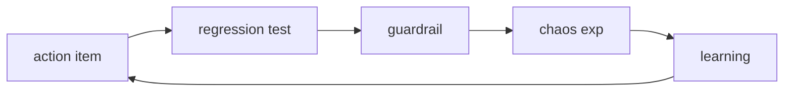

# Prevention

> Incident Response 101 series (9/10)

<!-- a-grade-intro:begin -->

**Core question**: How do you make sure an *incident* does *not* happen *again*?

> *Prevention* rests on *three pillars*: *action tracking*, *regression tests*, and *guardrails*.

<!-- a-grade-intro:end -->

## What You Will Learn

- *Action tracking*
- *Regression tests*
- *Guardrail* code
- *Chaos engineering*
- The *learning loop*

## Why It Matters

If you stop at the *postmortem*, *organizational learning* never *converts* into *behavior*.

## Concept at a Glance



## Key Terms

- **action item**: a *postmortem* follow-up.
- **regression test**: confirms the *same bug* does not return.
- **guardrail**: code that *blocks* dangerous actions.
- **chaos exp**: *intentional* failure injection.
- **learning loop**: the *cycle* of learning.

## Before/After

**Before**: only a *document* remains after the postmortem.

**After**: *code* and *tests* remain after the postmortem.

## Hands-on: A Prevention Kit

### Step 1 — Register an action

```python
def register(action):
    return {**action, "status": "open"}
```

### Step 2 — Regression test

```python
def test_regression(scenario, run):
    return run(scenario) == "ok"
```

### Step 3 — Guardrail

```python
def guard(payload, limit=1000):
    if payload > limit:
        raise ValueError("blocked")
```

### Step 4 — Chaos experiment

```python
def inject(failure):
    return {"injected": failure, "expected": "graceful"}
```

### Step 5 — Learning loop

```python
def closed(action):
    return action["status"] == "done"
```

## What to Notice in This Code

- *Status* has *two values*: open/done.
- A *guardrail* is *one raise*.
- *Chaos* always pairs with an *expected result*.

## Five Common Mistakes

1. **Registering *actions* and then *abandoning* them.**
2. **Skipping the *regression test*.**
3. **Leaving the *guardrail* as a *warning* only.**
4. **Stating *hypotheses* without *chaos*.**
5. **The *loop* never crosses a *quarter*.**

## How This Shows Up in Production

Every *postmortem* action is *linked* into *Jira*, *converted* into *regression tests* and *chaos scenarios*, and run *weekly in CI*.

## How a Senior Engineer Thinks

- *Prevention* is *code*.
- The *document* is the *starting point*.
- *Chaos* is your *friend*.
- The *loop* is the *quarterly review*.
- *Repetition* equals *failed learning*.

## Checklist

- [ ] *Action tracking*.
- [ ] *Regression tests*.
- [ ] *Guardrail policy*.
- [ ] *Chaos schedule*.

## Practice Problems

1. Define *guardrail* in one line.
2. Define *regression test* in one line.
3. Define *learning loop* in one line.

## Wrap-up and Next Steps

Next is the capstone: *Building an Incident Runbook*.

<!-- toc:begin -->
- [What is an Incident?](./01-what-is-incident.md)
- [Severity Classification](./02-severity.md)
- [Initial Response](./03-initial-response.md)
- [Communication](./04-communication.md)
- [Writing the Timeline](./05-timeline.md)
- [Root Cause Analysis](./06-root-cause-analysis.md)
- [Mitigation and Resolution](./07-mitigation-and-resolution.md)
- [Postmortem](./08-postmortem.md)
- **Prevention (current)**
- Building an Incident Runbook (upcoming)
<!-- toc:end -->

## References

- [Action Items - Google SRE Workbook](https://sre.google/workbook/postmortem-culture/)
- [Chaos Engineering Principles](https://principlesofchaos.org/)
- [Guardrails vs Gates - Thoughtworks](https://www.thoughtworks.com/insights/blog/guardrails-not-gates)
- [Preventing Recurrence - PagerDuty](https://response.pagerduty.com/after/preventing/)

Tags: Incident, Prevention, Reliability, Testing, Operations
