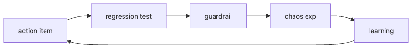

# Prevention

An incident is not truly closed when the postmortem is published. It is closed when the learning is pushed back into code, tests, automation, and operating constraints that make the same failure harder to repeat.

Teams that stop at documentation keep relearning the same lesson. Teams that attach regression tests, guardrails, and review loops turn each incident into a measurable reliability improvement.

This is post 9 in the Incident Response 101 series. This post explains how to prioritize prevention work and how to make follow-up items survive beyond the week after the outage.

## Questions this chapter answers

Many organizations stop prevention work at the moment they can say the postmortem is done. But prevention does not live in a document; it lives in tests, controls, and operating constraints that keep the same failure from re-entering production easily.

> Prevention means turning lessons into code, tests, and guardrails that still work months later when the people and context have changed.

- Why do incidents repeat even after strong postmortems?
- Which follow-up items deserve regression tests first?
- How do guardrails differ from warnings or documentation?
- What role do chaos experiments play in prevention work?
- How do you keep the learning loop alive across quarters?

## Why this topic matters

Teams get weaker over time when they depend on memory. They get stronger over time when each incident leaves behind a test, a blocking control, or a better operating default.

That is why prevention is best treated as an engineering output. Good intentions do not survive turnover or fatigue; tests and safeguards do.

## Diagram at a glance



*Diagram at a glance*
The loop matters as much as the individual controls. Action items become tests, tests become guardrails, and experiments verify that the protection still works under failure.

## Key Terms

- **action item**: a postmortem follow-up.
- **regression test**: confirms the same bug does not return.
- **guardrail**: code that blocks dangerous actions.
- **chaos exp**: intentional failure injection.
- **learning loop**: the cycle of learning.

## Before/After

**Before**: only a document remains after the postmortem.

**After**: code and tests remain after the postmortem.

## Hands-on: A Prevention Kit

### Step 1 — Register an action

```python
def register(action):
    return {**action, "status": "open"}
```

### Step 2 — Regression test

```python
def test_regression(scenario, run):
    return run(scenario) == "ok"
```

### Step 3 — Guardrail

```python
def guard(payload, limit=1000):
    if payload > limit:
        raise ValueError("blocked")
```

### Step 4 — Chaos experiment

```python
def inject(failure):
    return {"injected": failure, "expected": "graceful"}
```

### Step 5 — Learning loop

```python
def closed(action):
    return action["status"] == "done"
```

## What to Notice in This Code

- Status has two values: open/done.
- A guardrail is one raise.
- Chaos always pairs with an expected result.

## Five Common Mistakes

1. **Registering actions and then abandoning them.**
2. **Skipping the regression test.**
3. **Leaving the guardrail as a warning only.**
4. **Stating hypotheses without chaos.**
5. **The loop never crosses a quarter.**

## How This Shows Up in Production

Every postmortem action is linked into Jira, converted into regression tests and chaos scenarios, and run weekly in CI.

## How a Senior Engineer Thinks

- Prevention is code.
- The document is the starting point.
- Chaos is your friend.
- The loop is the quarterly review.
- Repetition equals failed learning.

## Prioritizing prevention work

Not every prevention item belongs in the same bucket. A simple priority table helps the team focus on work that most directly reduces repeat risk.

| Item | Repeat-risk reduction | Delivery cost | Priority |
| --- | --- | --- | --- |
| Add a regression test | High | Low | Immediate |
| Add a feature flag or kill switch | High | Medium | High |
| Rework architecture for long-term resilience | High | High | Quarterly planning |
| Expand wiki documentation | Low | Low | Supporting work |

Documentation still matters, but tests and guardrails usually deserve priority because they block the failure path directly.

## Checklist

- [ ] Action tracking.
- [ ] Regression tests.
- [ ] Guardrail policy.
- [ ] Chaos schedule.

## Practice Problems

1. Define guardrail in one line.
2. Define regression test in one line.
3. Define learning loop in one line.

## Wrap-up and Next Steps

Next is the capstone: Building an Incident Runbook.

<!-- toc:begin -->
- [What is an Incident?](./01-what-is-incident.md)
- [Severity Classification](./02-severity.md)
- [Initial Response](./03-initial-response.md)
- [Communication](./04-communication.md)
- [Writing the Timeline](./05-timeline.md)
- [Root Cause Analysis](./06-root-cause-analysis.md)
- [Mitigation and Resolution](./07-mitigation-and-resolution.md)
- [Postmortem](./08-postmortem.md)
- **Prevention (current)**
- Building an Incident Runbook (upcoming)
<!-- toc:end -->

## References

### Official Docs
- [Postmortem Action Items - Google SRE Workbook](https://sre.google/workbook/postmortem-culture/)
- [Preventing recurrence - PagerDuty](https://response.pagerduty.com/after/preventing/)
- [Principles of Chaos Engineering](https://principlesofchaos.org/)
- [Guardrails, not gates - Thoughtworks](https://www.thoughtworks.com/insights/blog/guardrails-not-gates)

### Example source
- [incident-response-101 canonical source in book-content](https://github.com/yeongseon-books/book-content/tree/main/content/incident-response-101)

Tags: Incident, Prevention, Reliability, Testing, Operations
