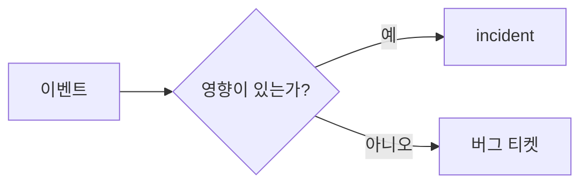

# Incident란 무엇인가?

이 글은 Incident Response 101 시리즈의 첫 번째 글입니다.

온콜에 처음 들어가면 가장 먼저 흔들리는 질문이 있습니다. 알림이 울렸을 때 이것을 정말 incident로 봐야 하는지, 아니면 일반 버그나 경고로 남겨도 되는지 빠르게 판단하기 어렵기 때문입니다. 기준이 없으면 어떤 팀은 과하게 반응하고, 어떤 팀은 너무 늦게 움직입니다.

## 이 글에서 다룰 문제

문제는 기술이 아니라 판단 기준에서 시작됩니다. 고객 영향이 거의 없는 경고까지 모두 incident처럼 다루면 온콜 피로도가 빠르게 쌓이고, 반대로 고객이 이미 영향을 받고 있는데도 단순 버그처럼 넘기면 대응이 늦어집니다. 그래서 팀은 먼저 “어떤 상태를 incident라고 부를 것인가”부터 합의해야 합니다.

> incident는 단순한 이상 징후가 아니라, 합의한 임계값을 넘는 고객 영향이 발생한 비정상 상태입니다.

- 어떤 문제를 incident라고 불러야 할까요?
- alert와 incident는 무엇이 다를까요?
- 고객 영향은 어떤 식으로 수치화해야 할까요?
- 일반 버그와 운영 incident는 어디서 갈릴까요?
- 온콜 초보자가 처음부터 가져가야 할 판단 기준은 무엇일까요?

## 왜 이 주제가 중요한가

incident 정의가 없으면 대응은 두 방향으로 무너집니다. 하나는 과잉 대응입니다. 작은 경고에도 사람을 모두 깨우고, 결국 팀은 알림 자체를 덜 믿게 됩니다. 다른 하나는 과소 대응입니다. 실제로는 고객 영향이 커지고 있는데도 “조금 더 보자”는 말만 반복하다가 대응 타이밍을 놓칩니다.

실무에서 incident 정의는 단어 선택이 아니라 비용 통제 장치입니다. 누가 호출되는지, 어떤 채널을 여는지, 얼마나 자주 업데이트하는지, 언제 경영진에게 올리는지가 모두 여기서 갈립니다. 첫 기준이 흔들리면 뒤에 붙는 severity, 초기 대응, 커뮤니케이션도 함께 흔들립니다.

## 한눈에 보는 구조



이 그림의 핵심은 모든 이벤트가 incident는 아니라는 점입니다. 먼저 고객 영향이 있는지 묻고, 그 영향이 팀이 정한 기준을 넘는지 본 뒤에야 incident라는 이름을 붙입니다. 이름이 바뀌면 대응 경로도 함께 바뀝니다.

## 핵심 용어

- **incident**: 고객 영향이 발생한 비정상 이벤트입니다.
- **alert**: 사람이 조치해야 할 가능성을 알리는 신호입니다.
- **outage**: 서비스 중단 상태입니다.
- **degradation**: 성능이나 품질이 눈에 띄게 떨어진 상태입니다.
- **on-call**: 장애 대응 대기 순번 체계입니다.

이 다섯 용어를 분리해 두면 대화가 훨씬 정확해집니다. alert는 입력 신호이고, incident는 분류 결과입니다. outage와 degradation은 영향의 형태를 설명하는 말이고, on-call은 그 사건을 누가 먼저 받을지를 정하는 운영 체계입니다.

## 전후 비교

이전: 모든 alert를 incident처럼 취급합니다.

이후: 고객 영향을 먼저 보고 incident인지 bug인지 분류한 뒤 대응합니다.

이 차이는 생각보다 큽니다. 이전 상태에서는 사람의 경험과 긴장감이 판단을 좌우합니다. 이후 상태에서는 합의한 기준이 먼저 말합니다. 좋은 온콜 운영은 감각보다 기준이 앞서는 상태를 만드는 일입니다.

## 단계별 실습: incident 판정 로직 만들기

### 1단계 — 영향 정보 모으기

먼저 사건을 판단하는 데 필요한 최소 정보를 한 구조로 묶습니다. 여기서는 영향을 받은 사용자 수와 지속 시간을 넣습니다.

```python
def impact(users, minutes):
    return {"users": users, "minutes": minutes}
```

### 2단계 — 임계값 정하기

다음은 어디까지를 incident로 볼지 코드에 고정하는 단계입니다. 이 숫자는 기술 법칙이 아니라 팀의 운영 합의입니다.

```python
def is_incident(i, user_th=100, min_th=5):
    return i["users"] >= user_th or i["minutes"] >= min_th
```

### 3단계 — 사건 분류하기

이제 앞에서 정한 기준으로 사건 이름을 붙입니다. 분류가 있어야 이후 채널과 우선순위도 분리할 수 있습니다.

```python
def classify(i):
    return "incident" if is_incident(i) else "bug"
```

### 4단계 — 호출 여부 정하기

incident라면 사람을 깨우고, 아니면 일반 이슈 흐름으로 보낼 수 있습니다. 온콜 피로도는 이런 분기에서 크게 갈립니다.

```python
def page(i):
    return classify(i) == "incident"
```

### 5단계 — 채널 연결하기

마지막으로 분류 결과를 대응 채널과 연결합니다. 사건 이름이 곧 협업 경로를 정합니다.

```python
def channel(kind):
    return "#inc" if kind == "incident" else "#bugs"
```

## 이 코드에서 먼저 볼 점

- 임계값은 취향이 아니라 합의입니다.
- 분류는 기술 구현이면서 동시에 운영 정책입니다.
- 코드로 기준을 남기면 주관적 판단을 줄일 수 있습니다.

특히 중요한 점은 incident 판정이 사람 감각에만 머물지 않는다는 사실입니다. 코드는 모든 예외를 없애 주지는 못하지만, 최소한 팀이 같은 출발선에서 판단하게 해 줍니다. 온콜이 성숙한 팀일수록 이런 기준이 문서와 코드 양쪽에 남아 있습니다.

## 자주 하는 실수 5가지

1. alert와 incident를 같은 말처럼 씁니다.
2. 합의된 임계값이 없어 사람마다 다르게 판단합니다.
3. 고객 영향 대신 내부 불편만 보고 incident를 선언합니다.
4. 신규 온콜 담당자를 위한 예시와 교육 자료가 없습니다.
5. 사건이 끝난 뒤 기록을 남기지 않아 다음 대응이 다시 처음부터 시작됩니다.

이 실수들은 대부분 기술 부족보다 기준 부재에서 나옵니다. 정의를 세우고, 예시를 붙이고, 기록을 남기면 대응 품질이 빠르게 안정됩니다.

## 실무에서는 이렇게 봅니다

실서비스에서는 PagerDuty 같은 도구가 severity 규칙과 함께 incident 분류를 자동화하기도 합니다. 다만 도구가 incident를 대신 이해해 주지는 않습니다. 팀이 먼저 무엇을 incident로 볼지 합의해야 도구도 제대로 동작합니다.

시니어 엔지니어는 대개 고객 영향을 가장 먼저 봅니다. 로그의 화려함보다 실제로 몇 명이 얼마나 오래 영향을 받았는지가 기준이기 때문입니다. 과잉 대응도 비용이고, 늦은 대응도 비용입니다. 그래서 좋은 팀은 기록을 남기고, 그 기록으로 다음 임계값을 다듬습니다.

## 체크리스트

- [ ] incident 판정 임계값이 팀 문서에 정리되어 있다.
- [ ] 분류 기준이 코드나 자동화 규칙에 반영되어 있다.
- [ ] incident와 bug의 라우팅 채널이 분리되어 있다.
- [ ] 신규 온콜 담당자를 위한 예시와 교육 자료가 있다.

## 연습 문제

1. incident를 한 문장으로 정의해 보세요.
2. outage와 degradation의 차이를 한 문장씩 적어 보세요.
3. 여러분 팀에서는 사용자 수와 지속 시간 중 어느 축을 더 중요하게 볼지 정해 보세요.

## 정리와 다음 글

incident는 “이상한 일”이 아니라, 고객 영향이 합의한 선을 넘은 사건입니다. 이 기준이 있어야 alert, bug, outage, degradation을 구분할 수 있고, 누구를 호출할지와 어느 채널로 모을지도 일관되게 정할 수 있습니다. 온콜 운영은 결국 판단 기준을 공유하는 일에서 시작합니다.

다음 글에서는 incident의 심각도를 공통 언어로 표현하는 방법, 즉 severity 분류를 다루겠습니다.

<!-- toc:begin -->
- **Incident란 무엇인가? (현재 글)**
- Severity 분류 (예정)
- 초기 대응 (예정)
- Communication (예정)
- Timeline 작성 (예정)
- Root Cause Analysis (예정)
- Mitigation과 Resolution (예정)
- Postmortem (예정)
- 재발 방지 (예정)
- Incident Runbook 만들기 (예정)
<!-- toc:end -->

## 참고 자료

- [Incident Response - PagerDuty](https://response.pagerduty.com/)
- [Managing Incidents - Google SRE Book](https://sre.google/sre-book/managing-incidents/)
- [Atlassian Incident Handbook](https://www.atlassian.com/incident-management/handbook)
- [Incident Definition - ITIL](https://wiki.en.it-processmaps.com/index.php/Incident_Management)

Tags: Incident, Response, SRE, Operations, OnCall
