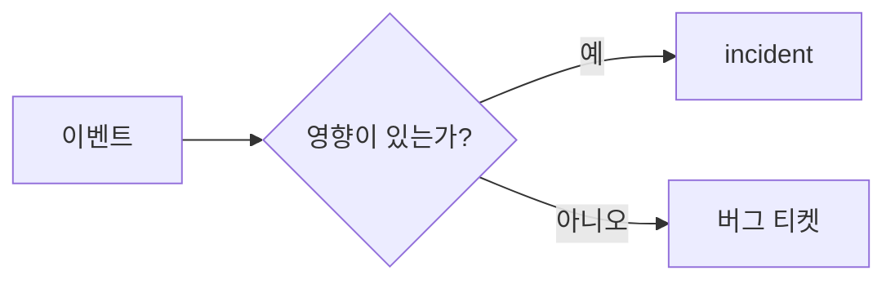

# Incident란 무엇인가?

처음 온콜에 들어가면 가장 먼저 흔들리는 지점이 있습니다. 알림은 계속 오는데, 무엇을 사고로 보고 무엇을 일반 버그나 운영 이슈로 남겨야 하는지 기준이 없다는 점입니다. 어떤 팀은 경고 한 번에도 사람을 모두 깨우고, 어떤 팀은 고객 영향이 커질 때까지 기다리다가 대응이 늦어집니다. 둘 다 비용이 큽니다.

사고 대응은 기술만의 문제가 아닙니다. 같은 현상을 보고도 “이건 그냥 버그입니다”, “아닙니다, 사고입니다”라고 다르게 말하면 대응 속도와 의사결정이 흔들립니다. 그래서 첫 단추는 도구보다 정의입니다. 어떤 조건을 넘으면 사고라고 부를지, 그 판단에 무엇을 넣을지 팀 안에서 합의해야 합니다.

이 글은 Incident Response 101 시리즈의 첫 글입니다. 여기서는 incident의 기본 정의를 먼저 짚고, 이후에는 고객 영향과의 관계, 일반 버그와의 차이, 온콜 관점에서 왜 이 기준이 필요한지 차근차근 정리하겠습니다.

> incident는 “이상한 이벤트”가 아니라, 합의한 임계값을 넘는 고객 영향이 발생한 비정상 상태입니다.

## 이 글에서 다룰 문제

- 어떤 문제를 incident라고 불러야 할까요?
- 단순한 알림과 사고는 무엇이 다를까요?
- 고객 영향은 어떤 식으로 숫자로 잡아야 할까요?
- 일반 버그와 운영 incident를 어떻게 구분해야 할까요?
- 온콜 초보자가 처음부터 가져가야 할 판단 기준은 무엇일까요?

## 이 글에서 배울 것

- incident의 기본 정의
- 영향 기준과 임계값의 의미
- bug, alert, outage, degradation의 차이
- 코드로 분류 기준을 고정하는 이유
- 온콜 문화와 기록의 출발점

## 왜 중요한가

기준이 없으면 대응은 두 방향으로 무너집니다. 하나는 너무 늦는 경우입니다. 실제로는 고객 영향이 이미 커졌는데도 “조금 더 지켜보자”는 말만 반복됩니다. 다른 하나는 너무 과하게 반응하는 경우입니다. 작은 경고에도 팀 전체가 끌려 들어오고, 사람들은 곧 알림을 믿지 않게 됩니다.

현업에서 사고 정의는 단어 선택이 아니라 비용 통제 장치입니다. 새벽에 누구를 깨울지, 어떤 채널을 열지, 얼마 간격으로 상황을 공유할지, 언제 경영진까지 올릴지를 모두 이 정의가 결정합니다. 그래서 사고를 제대로 정의하는 일은 온콜 운영의 출발점입니다.

## 한눈에 보는 흐름



이 그림의 핵심은 단순합니다. 모든 이벤트가 사고는 아닙니다. 먼저 영향이 있는지 묻고, 그 영향이 팀이 합의한 선을 넘는지 본 뒤에야 사고라는 이름을 붙입니다. 이름이 바뀌면 대응 경로도 함께 바뀝니다.

## 핵심 용어

- **incident**: 고객 영향이 발생했고, 그 크기나 지속 시간이 팀 기준을 넘는 비정상 상태입니다.
- **alert**: 사람이 확인하거나 조치해야 할 가능성을 알리는 신호입니다.
- **outage**: 서비스가 멈추거나 사용할 수 없는 상태입니다.
- **degradation**: 서비스는 살아 있지만 성능이나 품질이 눈에 띄게 떨어진 상태입니다.
- **on-call**: 정해진 시간 동안 장애 대응 책임을 맡는 순번 체계입니다.

이 다섯 용어를 분리해 두면 대화가 훨씬 정확해집니다. 알림은 입력 신호이고, 사고는 분류 결과입니다. 서비스 중단과 성능 저하는 사고의 형태를 설명하는 말입니다. 온콜은 그 사건을 누가 받을지를 정하는 운영 체계입니다.

## Before / After

**Before**: 모든 알림을 사고처럼 받아들이고 즉흥적으로 반응합니다.

**After**: 고객 영향과 임계값을 기준으로 먼저 분류한 뒤, 사고인지 버그인지 구분해서 대응합니다.

이 차이는 생각보다 큽니다. before 상태에서는 사람의 기분과 경험이 판단을 좌우합니다. after 상태에서는 합의한 기준이 먼저 말합니다. 대응 품질을 올리려면 감각보다 기준이 먼저여야 합니다.

## 단계별 실습: incident 판정 로직 만들기

### 1단계 — 영향 정보 모으기

먼저 판단에 필요한 최소 정보를 묶습니다. 여기서는 영향을 받은 사용자 수와 지속 시간을 넣습니다. 실제 팀에서는 지역, 결제 손실, 핵심 기능 여부 같은 축을 더할 수 있습니다.

```python
def impact(users, minutes):
    return {"users": users, "minutes": minutes}
```

### 2단계 — 임계값 정하기

다음은 “어디까지를 사고로 볼 것인가”를 코드에 고정합니다. 이 숫자는 기술적 진실이 아니라 팀 합의입니다. 다만 합의가 코드나 문서에 남지 않으면 결국 사람마다 다르게 판단하게 됩니다.

```python
def is_incident(i, user_th=100, min_th=5):
    return i["users"] >= user_th or i["minutes"] >= min_th
```

### 3단계 — 사건 분류하기

이제 앞의 기준으로 사건 이름을 붙입니다. 사고인지 버그인지 갈라 놓으면, 이후 알림 경로와 기록 방식도 분리하기 쉬워집니다.

```python
def classify(i):
    return "incident" if is_incident(i) else "bug"
```

### 4단계 — 사람을 깨울지 결정하기

사고로 분류됐다면 호출을 보내고, 아니면 다음 근무 시간에 처리할 수 있습니다. 온콜 피로도를 낮추려면 이 분기가 분명해야 합니다.

```python
def page(i):
    return classify(i) == "incident"
```

### 5단계 — 채널로 연결하기

사건 이름은 곧 채널 선택으로 이어집니다. 사고는 대응 채널로, 버그는 일반 이슈 채널로 보내면 흐름이 섞이지 않습니다.

```python
def channel(kind):
    return "#inc" if kind == "incident" else "#bugs"
```

## 이 코드에서 볼 점

- 임계값은 취향이 아니라 합의입니다.
- 분류는 기술 구현이면서 동시에 운영 정책입니다.
- 코드로 기준을 남기면 사람마다 판단이 달라지는 일을 줄일 수 있습니다.

특히 중요한 점은 사고 판정이 사람 감각에만 머물지 않는다는 사실입니다. 코드는 주관을 완전히 없애 주지는 못해도, 최소한 팀이 같은 기준으로 출발하게 해 줍니다. 온콜 운영이 성숙한 팀일수록 이런 기준이 문서와 코드 양쪽에 남아 있습니다.

## 자주 하는 실수 5가지

1. 알림과 사고를 같은 말처럼 씁니다.
2. 고객 영향 기준 없이 내부 불편만 보고 사고를 선언합니다.
3. 임계값이 문서나 코드에 없어 사람마다 다르게 판단합니다.
4. 온콜 교육 자료가 없어 신규 담당자가 매번 감으로 대응합니다.
5. 사건이 끝난 뒤 기록을 남기지 않아 다음 대응이 다시 처음부터 시작됩니다.

이 실수들은 대부분 기술 부족보다 기준 부재에서 나옵니다. 정의를 세우고, 예시를 붙이고, 기록을 남기면 상당수가 줄어듭니다.

## 실무에서는 이렇게 봅니다

실서비스에서는 PagerDuty 같은 도구가 심각도 규칙과 함께 사고 분류를 자동화하기도 합니다. 다만 도구가 사고를 대신 이해해 주지는 않습니다. 팀이 먼저 “무엇을 사고로 볼지” 합의해야 도구도 제대로 동작합니다.

시니어 엔지니어는 대개 고객 영향을 가장 먼저 봅니다. 로그의 화려함이나 내부 긴장감보다, 실제로 몇 명이 얼마나 오래 영향을 받았는지가 기준이 됩니다. 과잉 대응도 비용이고, 늦은 대응도 비용이기 때문입니다. 그래서 좋은 팀은 기록을 남기고, 그 기록으로 다음 임계값을 다듬습니다.

## 체크리스트

- [ ] 사고 판정 임계값이 팀 문서에 정리되어 있다.
- [ ] 분류 기준이 코드나 자동화 규칙에 반영되어 있다.
- [ ] incident와 bug의 라우팅 채널이 분리되어 있다.
- [ ] 신규 온콜 담당자를 위한 예시와 교육 자료가 있다.

## 연습 문제

1. incident를 한 문장으로 정의해 보세요.
2. outage와 degradation의 차이를 한 문장씩 적어 보세요.
3. 여러분 팀에서는 사용자 수와 지속 시간 중 어느 축을 더 중요하게 볼지 정해 보세요.

## 정리 및 다음 단계

incident는 “뭔가 이상한 일”이 아니라, 고객 영향이 합의한 선을 넘은 사건입니다. 이 기준이 있어야 알림, 버그, 서비스 중단, 성능 저하를 구분할 수 있고, 누구를 호출할지와 어느 채널로 모을지도 일관되게 정할 수 있습니다. 온콜 운영은 결국 판단 기준을 공유하는 일에서 시작합니다.

다음 글에서는 incident의 심각도를 공통 언어로 표현하는 방법, 즉 Severity 분류를 다루겠습니다.

<!-- toc:begin -->
- **Incident란 무엇인가? (현재 글)**
- Severity 분류 (예정)
- 초기 대응 (예정)
- Communication (예정)
- Timeline 작성 (예정)
- Root Cause Analysis (예정)
- Mitigation과 Resolution (예정)
- Postmortem (예정)
- 재발 방지 (예정)
- Incident Runbook 만들기 (예정)
<!-- toc:end -->

## 참고 자료

- [Incident Response - PagerDuty](https://response.pagerduty.com/)
- [Managing Incidents - Google SRE Book](https://sre.google/sre-book/managing-incidents/)
- [Atlassian Incident Handbook](https://www.atlassian.com/incident-management/handbook)
- [Incident Definition - ITIL](https://wiki.en.it-processmaps.com/index.php/Incident_Management)

Tags: Incident, Response, SRE, Operations, OnCall
