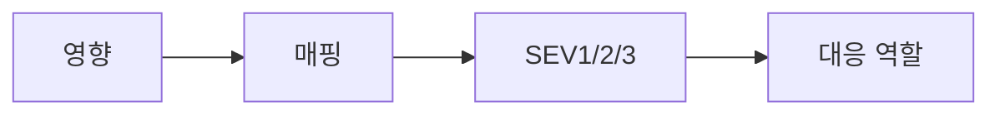

# Severity 분류

이 글은 Incident Response 101 시리즈의 2번째 글입니다.

incident를 incident라고 부르는 기준이 생겨도 아직 한 단계가 더 남습니다. 같은 incident라도 모두 같은 방식으로 대응하면 안 됩니다. 전사 장애와 일부 사용자 불편은 호출 범위도, 보고 주기도, 의사결정 속도도 달라야 합니다. 그래서 팀은 severity라는 공통 언어를 만듭니다.

## 이 글에서 다룰 문제

문제는 모두가 같은 단어를 써도 머릿속 그림이 다를 수 있다는 점입니다. 누군가는 “심각하다”는 말을 전사 대응으로 이해하고, 다른 누군가는 조금 큰 버그 정도로 받아들일 수 있습니다. severity는 이런 해석 차이를 줄이고, 영향의 크기를 행동 규칙으로 바꾸는 장치입니다.

> severity는 영향의 크기를 등급으로 번역한 공통 언어이며, 각 등급은 곧 대응 행동의 약속입니다.

- severity는 무엇을 위한 언어일까요?
- SEV1, SEV2, SEV3는 어떤 기준으로 갈라야 할까요?
- 사용자 수, 범위, 금전 손실 같은 영향 축은 왜 필요할까요?
- 등급이 바뀌면 호출 정책과 보고 주기도 함께 바뀌어야 할까요?
- 팀마다 등급 정의가 조금씩 다른 이유는 무엇일까요?

## 왜 이 주제가 중요한가

severity 체계가 없으면 incident 대응은 매번 즉석 토론으로 시작합니다. 어떤 사건은 실제로는 작지 않은데도 낮게 평가되고, 어떤 사건은 내부 긴장감 때문에 과하게 올라갑니다. 같은 단어를 다른 의미로 쓰면 대응은 엇나갈 수밖에 없습니다.

잘 만든 severity 체계는 설명을 줄이고 행동을 맞춥니다. SEV2라는 말이 나오면 누가 호출되고, 몇 분마다 상황을 공유하며, 어느 정도까지 escalation하는지가 함께 떠올라야 합니다. 이때 severity는 단순한 라벨이 아니라 행동의 축약어가 됩니다.

## 한눈에 보는 구조



여기서 핵심은 매핑입니다. 영향이 먼저 있고, severity는 그 영향을 운영 언어로 번역한 결과입니다. 그리고 각 등급은 누가 움직이고 얼마나 자주 공유할지를 결정합니다.

## 핵심 용어

- **SEV1**: 전사 차원의 영향이 있는 수준입니다.
- **SEV2**: 주요 기능이 크게 흔들리는 수준입니다.
- **SEV3**: 부분적인 영향이 있는 수준입니다.
- **scope**: 영향 범위입니다.
- **duration**: 영향 지속 시간입니다.

이 용어를 정할 때는 추상 표현보다 예시가 더 중요합니다. “심각하다” 같은 말만 두면 해석이 갈립니다. 결제 실패는 SEV1, 검색 정렬 오류는 SEV3처럼 사례를 함께 두면 경계가 훨씬 선명해집니다.

## 전후 비교

이전: “꽤 심각하다” 같은 모호한 표현으로 상황을 설명합니다.

이후: “SEV2입니다”처럼 합의된 등급과 그에 따른 행동을 함께 공유합니다.

이 차이는 단순한 말투 차이가 아닙니다. 이전 상태에서는 호출 범위와 우선순위가 사람마다 달라집니다. 이후 상태에서는 등급 한 단어만 들어도 다음 행동이 자연스럽게 이어집니다.

## 단계별 실습: severity 매핑 만들기

### 1단계 — 영향 축 정의하기

영향을 한 숫자로만 보면 놓치는 부분이 많습니다. 사용자 수, 지역 범위, 금전 손실처럼 사건을 여러 축으로 나눠 봐야 경계가 분명해집니다.

```python
def axes(users, region, money_loss):
    return {"users": users, "region": region, "money": money_loss}
```

### 2단계 — 등급으로 변환하기

축을 정했으면 이제 기준선을 둡니다. 여기서는 단순하게 사용자 수와 금전 손실로 SEV1을 판정하고, 그보다 작은 사건을 SEV2와 SEV3로 나눕니다.

```python
def severity(a):
    if a["users"] > 100000 or a["money"] > 100000:
        return "SEV1"
    if a["users"] > 1000:
        return "SEV2"
    return "SEV3"
```

### 3단계 — 호출 정책 연결하기

severity는 이름표로 끝나면 안 됩니다. 각 등급이 누구를 언제 깨울지로 이어져야 실제 운영 체계가 됩니다.

```python
def page_policy(sev):
    return {"SEV1": "all", "SEV2": "primary", "SEV3": "next-day"}[sev]
```

### 4단계 — 보고 주기 정하기

상황 공유 간격도 severity와 함께 바뀌어야 합니다. 높은 severity는 더 자주, 낮은 severity는 더 길게 가져가는 식입니다.

```python
def report_every_min(sev):
    return {"SEV1": 15, "SEV2": 30, "SEV3": 60}[sev]
```

### 5단계 — 자동 분기 완성하기

마지막으로 severity, 호출 정책, 보고 주기를 한 번에 묶으면 운영 판단을 자동화할 수 있습니다.

```python
def route(a):
    sev = severity(a)
    return {"sev": sev, "page": page_policy(sev), "every": report_every_min(sev)}
```

## 이 코드에서 먼저 볼 점

- 영향은 축으로 나눠야 경계가 선명해집니다.
- 등급은 반드시 행동과 연결돼야 의미가 있습니다.
- 자동 분기는 사람마다 다른 판단을 줄여 줍니다.

여기서 중요한 사실은 severity가 기술 규칙이면서 동시에 조직 규칙이라는 점입니다. 숫자는 코드에 있지만, 그 숫자를 정하는 기준은 서비스 특성과 비즈니스 맥락에서 나옵니다. 결제 서비스의 SEV1과 내부 도구의 SEV1이 같을 필요는 없습니다.

## 자주 하는 실수 5가지

1. 등급 정의를 너무 추상적으로 써서 누구나 다르게 해석합니다.
2. 금전 손실이나 법적 영향을 빼먹고 사용자 수만 봅니다.
3. SEV2와 SEV3 경계를 예시 없이 남겨 둡니다.
4. 판정을 매번 수동으로 하면서 자동화 규칙을 만들지 않습니다.
5. 고객 영향보다 내부 불편을 더 크게 보고 등급을 올립니다.

실무에서 가장 자주 부딪히는 문제는 경계 사례입니다. 그래서 경계선에 걸리는 대표 사례를 문서에 함께 두는 편이 좋습니다. 추상 정의보다 사례가 훨씬 오래 남습니다.

## 실무에서는 이렇게 봅니다

실서비스에서는 결제 실패가 기본적으로 SEV1로 올라가고, 검색 결과 정렬 오류는 기본적으로 SEV3로 내려가는 식의 기본 규칙을 둡니다. 중요한 점은 사건이 발생한 뒤 감으로 토론하는 것이 아니라, 발생하기 전에 이미 표와 예시를 만들어 둔다는 점입니다.

시니어 엔지니어는 severity를 “중요도 설명”이 아니라 “행동의 축약어”로 봅니다. SEV2라고 말하는 순간 누가 호출되고, 몇 분마다 업데이트가 나가며, 어떤 채널이 열리는지가 함께 떠올라야 합니다.

## 체크리스트

- [ ] SEV1/2/3 정의가 문서로 정리되어 있다.
- [ ] 사용자 수, 범위, 금전 손실 같은 영향 축이 합의되어 있다.
- [ ] 등급별 호출 정책과 보고 주기가 정리되어 있다.
- [ ] 경계 사례 예시가 문서에 포함되어 있다.

## 연습 문제

1. 여러분 팀에서 SEV1을 한 문장으로 정의해 보세요.
2. scope와 duration을 각각 어떤 수치로 표현할지 적어 보세요.
3. 내부 도구와 고객 서비스의 severity 기준이 왜 달라질 수 있는지 설명해 보세요.

## 정리와 다음 글

severity는 단순한 라벨이 아니라 영향과 행동을 연결하는 공통 언어입니다. 같은 단어를 같은 뜻으로 써야 온콜, 보고, 우선순위가 함께 맞춰집니다. 좋은 severity 체계는 영향 축이 분명하고, 경계 사례가 있으며, 각 등급이 실제 행동으로 이어집니다.

다음 글에서는 incident가 발생했을 때 처음 몇 분 안에 무엇을 해야 하는지, 즉 초기 대응을 다루겠습니다.

<!-- toc:begin -->
- [Incident란 무엇인가?](./01-what-is-incident.md)
- **Severity 분류 (현재 글)**
- 초기 대응 (예정)
- Communication (예정)
- Timeline 작성 (예정)
- Root Cause Analysis (예정)
- Mitigation과 Resolution (예정)
- Postmortem (예정)
- 재발 방지 (예정)
- Incident Runbook 만들기 (예정)
<!-- toc:end -->

## 참고 자료

- [Severity Levels - PagerDuty](https://response.pagerduty.com/before/severity_levels/)
- [Severity Levels - Atlassian](https://www.atlassian.com/incident-management/kpis/severity-levels)
- [Incident Severity - Datadog](https://www.datadoghq.com/blog/incident-management/)
- [Severity Classification - Google SRE Workbook](https://sre.google/workbook/incident-response/)

Tags: Incident, Severity, Triage, Response, Operations
