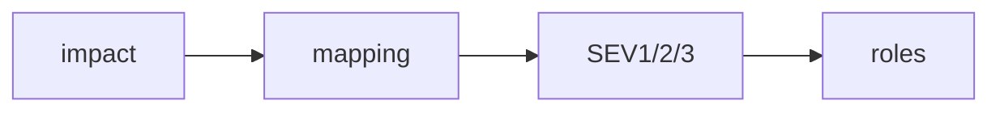

# Severity 분류

> Incident Response 101 시리즈 (2/10)


## 이 글에서 다룰 문제

*같은 단어* 를 *다른 뜻* 으로 쓰면 *대응* 이 *어긋납니다*.

## 개념 한눈에 보기



## Before/After

**Before**: "*심각* 하다" 는 *주관* 표현.

**After**: "*SEV2*" 같은 *합의된 등급*.

## 실습: 등급 매핑

### 1단계 — 영향 차원

```python
def axes(users, region, money_loss):
    return {"users": users, "region": region, "money": money_loss}
```

### 2단계 — 매핑

```python
def severity(a):
    if a["users"] > 100000 or a["money"] > 100000:
        return "SEV1"
    if a["users"] > 1000:
        return "SEV2"
    return "SEV3"
```

### 3단계 — 호출 정책

```python
def page_policy(sev):
    return {"SEV1": "all", "SEV2": "primary", "SEV3": "next-day"}[sev]
```

### 4단계 — 보고 빈도

```python
def report_every_min(sev):
    return {"SEV1": 15, "SEV2": 30, "SEV3": 60}[sev]
```

### 5단계 — 자동 분기

```python
def route(a):
    sev = severity(a)
    return {"sev": sev, "page": page_policy(sev), "every": report_every_min(sev)}
```

## 이 코드에서 주목할 점

- *축* 으로 *영향* 을 *분해*.
- *등급* 별 *행동* 매핑.
- *자동* 분기로 *오류* 감소.

## 자주 하는 실수 5가지

1. ***등급 정의* 가 *모호*.**
2. ***금전 영향* 누락.**
3. ***SEV2* 와 *SEV3* 경계 *애매*.**
4. ***자동화* 없이 *수동* 판정.**
5. ***고객 영향* 보다 *내부 영향* 위주.**

## 실무에서는 이렇게 쓰입니다

*결제 실패* 는 *SEV1*, *검색 결과 정렬 오류* 는 *SEV3* 가 *기본* 입니다.

## 체크리스트

- [ ] *등급 정의서*.
- [ ] *매핑 코드*.
- [ ] *행동 매트릭스*.
- [ ] *예제 사례*.

## 정리 및 다음 단계

다음 글은 *초기 대응* 입니다.

<!-- toc:begin -->
- [Incident란 무엇인가?](./01-what-is-incident.md)
- **Severity 분류 (현재 글)**
- 초기 대응 (예정)
- Communication (예정)
- Timeline 작성 (예정)
- Root Cause Analysis (예정)
- Mitigation과 Resolution (예정)
- Postmortem (예정)
- 재발 방지 (예정)
- Incident Runbook 만들기 (예정)
<!-- toc:end -->

## 참고 자료

- [Severity Levels - PagerDuty](https://response.pagerduty.com/before/severity_levels/)
- [Severity Levels - Atlassian](https://www.atlassian.com/incident-management/kpis/severity-levels)
- [Incident Severity - Datadog](https://www.datadoghq.com/blog/incident-management/)
- [Severity Classification - Google SRE Workbook](https://sre.google/workbook/incident-response/)

Tags: Incident, Severity, Triage, Response, Operations
