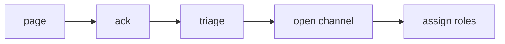

# 초기 대응

> Incident Response 101 시리즈 (3/10)

<!-- a-grade-intro:begin -->

**핵심 질문**: *알림* 을 *받은* *처음 5분* 에 *무엇* 을 해야 할까요?

> *초기 대응* 은 *안정화* 와 *역할 배정* 에 *집중* 합니다.

<!-- a-grade-intro:end -->

## 이 글에서 배울 것

- *5분 룰*
- *안정화 우선*
- *영향 파악*
- *역할 배정*
- *채널 개설*

## 왜 중요한가

*초반 5분* 의 *행동* 이 *전체 결과* 를 *결정* 합니다.

## 개념 한눈에 보기



## 핵심 용어 정리

- **ack**: *알림 수신* 확인.
- **triage**: *분류* 와 *우선순위*.
- **stabilize**: *피해 차단*.
- **channel**: *전용 협업 공간*.
- **role**: *책임 분담*.

## Before/After

**Before**: *진단* 부터 시작.

**After**: *안정화* 부터 시작.

## 실습: 5분 체크리스트

### 1단계 — Ack

```python
def ack(alert_id, user):
    return {"alert": alert_id, "by": user, "at": "now"}
```

### 2단계 — 영향 추정

```python
def estimate_impact(metrics):
    return metrics.get("err_ratio", 0) * 100
```

### 3단계 — 채널 개설

```python
def open_channel(name):
    return f"#inc-{name}"
```

### 4단계 — 역할 배정

```python
def assign(team):
    return {"IC": team[0], "ops": team[1], "comms": team[2]}
```

### 5단계 — 안정화

```python
def stabilize(actions):
    return [a for a in actions if a in ("rollback", "scale", "throttle")]
```

## 이 코드에서 주목할 점

- *Ack* 가 *책임* 의 시작.
- *영향* 은 *수치* 로.
- *역할* 은 *3축*.

## 자주 하는 실수 5가지

1. ***진단* 부터 시작.**
2. ***IC* 가 *직접 손* 잡기.**
3. ***채널* 분산.**
4. ***고객 공지* 누락.**
5. ***기록* 없이 행동.**

## 실무에서는 이렇게 쓰입니다

*PagerDuty Ack* → *Slack 채널 자동 생성* → *Statuspage* 초안까지 *자동* 화 합니다.

## 시니어 엔지니어는 이렇게 생각합니다

- *시간* 은 *적*.
- *안정화* 가 *최우선*.
- *역할* 은 *고정*.
- *기록* 은 *동시* 에.
- *완벽* 보다 *행동*.

## 체크리스트

- [ ] *Ack 정책*.
- [ ] *채널 자동화*.
- [ ] *역할 카드*.
- [ ] *안정화 액션 목록*.

## 연습 문제

1. *ack* 의 의미 한 줄로.
2. *triage* 의 의미 한 줄로.
3. *stabilize* 의 의미 한 줄로.

## 정리 및 다음 단계

다음 글은 *Communication* 입니다.

<!-- toc:begin -->
- [Incident란 무엇인가?](./01-what-is-incident.md)
- [Severity 분류](./02-severity.md)
- **초기 대응 (현재 글)**
- Communication (예정)
- Timeline 작성 (예정)
- Root Cause Analysis (예정)
- Mitigation과 Resolution (예정)
- Postmortem (예정)
- 재발 방지 (예정)
- Incident Runbook 만들기 (예정)
<!-- toc:end -->

## 참고 자료

- [Incident Response Process - PagerDuty](https://response.pagerduty.com/during/during_an_incident/)
- [Managing Incidents - Google SRE Book](https://sre.google/sre-book/managing-incidents/)
- [Incident Triage - Atlassian](https://www.atlassian.com/incident-management/incident-response)
- [On-Call Best Practices](https://increment.com/on-call/)

Tags: Incident, Triage, Response, OnCall, Operations
