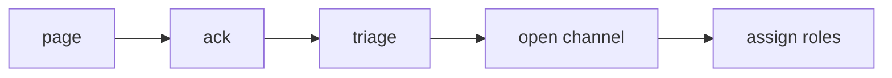

# 초기 대응

> Incident Response 101 시리즈 (3/10)


## 이 글에서 다룰 문제

초반 5분에 무엇을 하느냐가 사건의 전체 흐름을 크게 좌우합니다.

## 전체 흐름


## Before/After

**Before**: 진단부터 시작합니다.

**After**: 안정화부터 시작합니다.

## 5분 체크리스트

### 1단계 — Ack

```python
def ack(alert_id, user):
    return {"alert": alert_id, "by": user, "at": "now"}
```

### 2단계 — 영향 추정

```python
def estimate_impact(metrics):
    return metrics.get("err_ratio", 0) * 100
```

### 3단계 — 채널 개설

```python
def open_channel(name):
    return f"#inc-{name}"
```

### 4단계 — 역할 배정

```python
def assign(team):
    return {"IC": team[0], "ops": team[1], "comms": team[2]}
```

### 5단계 — 안정화

```python
def stabilize(actions):
    return [a for a in actions if a in ("rollback", "scale", "throttle")]
```

## 이 코드에서 주목할 점

- Ack는 책임을 명확히 여는 첫 동작입니다.
- 영향은 감이 아니라 수치로 표현해야 합니다.
- 역할은 IC, ops, comms의 세 축으로 나누는 편이 좋습니다.

## 자주 하는 실수 5가지

1. 진단부터 시작해 안정화를 늦춥니다.
2. IC가 직접 모든 작업을 붙잡고 놓지 않습니다.
3. 채널이 여러 곳으로 흩어집니다.
4. 고객 공지를 빠뜨립니다.
5. 기록 없이 먼저 움직입니다.

## 실무에서는 이렇게 쓰입니다

PagerDuty에서 Ack를 누르면 Slack 채널을 자동으로 만들고, Statuspage 초안까지 이어서 준비하도록 자동화합니다.

## 체크리스트

- [ ] Ack 정책을 문서로 정리했는지 확인합니다.
- [ ] 채널 자동화 흐름을 준비했는지 확인합니다.
- [ ] 역할 카드를 미리 만들어 두었는지 확인합니다.
- [ ] 안정화 액션 목록을 정리했는지 확인합니다.

## 정리 및 다음 단계

다음 글은 Communication입니다.

<!-- toc:begin -->
- [Incident란 무엇인가?](./01-what-is-incident.md)
- [Severity 분류](./02-severity.md)
- **초기 대응 (현재 글)**
- Communication (예정)
- Timeline 작성 (예정)
- Root Cause Analysis (예정)
- Mitigation과 Resolution (예정)
- Postmortem (예정)
- 재발 방지 (예정)
- Incident Runbook 만들기 (예정)
<!-- toc:end -->

## 참고 자료

- [Incident Response Process - PagerDuty](https://response.pagerduty.com/during/during_an_incident/)
- [Managing Incidents - Google SRE Book](https://sre.google/sre-book/managing-incidents/)
- [Incident Triage - Atlassian](https://www.atlassian.com/incident-management/incident-response)
- [On-Call Best Practices](https://increment.com/on-call/)

Tags: Incident, Triage, Response, OnCall, Operations
