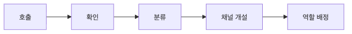

# 초기 대응

incident가 발생했을 때 처음 몇 분은 유난히 짧고도 길게 느껴집니다. 알림은 이미 울렸고, 아직 정보는 부족하고, 누군가는 원인을 찾자고 하고 누군가는 고객 공지를 걱정합니다.

이때 무엇부터 할지 정해 두지 않으면 팀은 빠르게 분산됩니다. 초기 대응의 품질은 완벽한 진단보다 먼저, 안정화와 역할 분리를 얼마나 빨리 실행했는지에서 갈립니다.

이 글은 Incident Response 101 시리즈의 3번째 글입니다. 여기서는 첫 5분 안에 해야 할 확인, 채널 개설, 역할 배정, 안정화 우선순위를 운영 관점에서 정리합니다.

## 이 글에서 다룰 문제

초반 5분은 완벽한 진단보다 안정화와 역할 정리가 더 중요합니다. 그런데 많은 팀이 바로 원인 분석으로 들어가거나, 총괄 대응자가 직접 손을 움직이다가 전체 상황을 놓칩니다. 초기 대응은 기술보다 순서가 중요합니다.

> 초기 대응의 목표는 원인 규명이 아니라 출혈을 멈추고, 채널을 열고, 역할을 배정해 대응 구조를 세우는 것입니다.

- 알림이 온 뒤 첫 5분에 무엇부터 해야 할까요?
- 왜 진단보다 안정화가 먼저일까요?
- 영향은 어떤 숫자로 표현해야 할까요?
- 역할 배정은 왜 초반에 끝내야 할까요?
- 대응 채널은 어떤 기준으로 열어야 할까요?

## 왜 이 주제가 중요한가

incident 대응에서 가장 비싼 시간은 초반 몇 분입니다. 그때 안정화 대신 진단에만 매달리면 고객 영향은 계속 커지고, 담당자는 각자 다른 채널에서 다른 이야기를 하게 됩니다. 첫 5분의 선택이 이후 한 시간의 흐름을 결정한다고 봐도 과장이 아닙니다.

좋은 초기 대응은 완벽한 답을 빨리 찾는 것이 아닙니다. 최소한의 구조를 빠르게 세우는 일입니다. 누가 총괄하는지, 어디서 이야기하는지, 고객 영향이 얼마나 되는지, 지금 할 수 있는 완화 조치가 무엇인지가 먼저 정리돼야 이후 진단도 제대로 굴러갑니다.

## 한눈에 보는 구조



*한눈에 보는 구조*
핵심 흐름은 단순합니다. 호출을 확인하고, 상황을 대략 분류하고, 대응 채널을 만들고, 역할을 나눕니다. 이 순서가 잡혀 있어야 이후 안정화와 조사도 같은 방향으로 움직입니다.

## 핵심 용어

- **ack**: 호출을 확인했다는 신호입니다.
- **triage**: 사건을 빠르게 분류하고 우선순위를 정하는 과정입니다.
- **stabilize**: 출혈을 멈추는 완화 조치입니다.
- **channel**: incident 전용 협업 공간입니다.
- **role**: 대응 중 맡는 책임입니다.

이 용어를 분리해 두면 대화가 정리됩니다. ack는 소유권의 시작이고, triage는 우선순위 판단이며, stabilize는 지금 당장 피해를 줄이는 행동입니다. channel과 role은 협업 구조를 고정하는 장치입니다.

## 전후 비교

이전: 진단부터 시작합니다.

이후: 안정화부터 시작합니다.

이 차이가 중요한 이유는 incident 초반에는 정보가 불완전하기 때문입니다. 완전한 원인 분석을 기다리다 보면 손실은 계속 커집니다. 반대로 안정화부터 하면 서비스 피해를 줄인 상태에서 더 차분하게 조사할 수 있습니다.

## 단계별 실습: 5분 체크리스트 만들기

### 1단계 — 호출 확인하기

누가 incident를 받았는지 먼저 분명히 남겨야 합니다. ack는 단순 버튼이 아니라 소유권 선언입니다.

```python
def ack(alert_id, user):
    return {"alert": alert_id, "by": user, "at": "now"}
```

### 2단계 — 영향 추정하기

초기에는 정확한 수치가 아니어도 괜찮습니다. 다만 영향은 감각이 아니라 숫자 형태로 표현해야 합니다.

```python
def estimate_impact(metrics):
    return metrics.get("err_ratio", 0) * 100
```

### 3단계 — 대응 채널 열기

대화가 흩어지기 전에 incident 전용 채널을 확보합니다. 채널은 협업 구조를 붙잡는 가장 싼 장치입니다.

```python
def open_channel(name):
    return f"#inc-{name}"
```

### 4단계 — 역할 배정하기

총괄 대응자, 실무 대응자, 커뮤니케이션 담당자를 나누면 대응이 훨씬 안정됩니다.

```python
def assign(team):
    return {"IC": team[0], "ops": team[1], "comms": team[2]}
```

### 5단계 — 안정화 후보 고르기

초반에는 완전한 해결보다 빠른 완화가 중요합니다. 롤백, 스케일 아웃, 스로틀 같은 수단이 대표적입니다.

```python
def stabilize(actions):
    return [a for a in actions if a in ("rollback", "scale", "throttle")]
```

## 이 코드에서 먼저 볼 점

- ack는 책임 시작 시점을 남깁니다.
- 영향은 감이 아니라 숫자로 표현해야 합니다.
- 역할은 총괄, 실무, 커뮤니케이션의 세 축으로 나누는 편이 좋습니다.

특히 총괄 대응자가 직접 모든 손작업을 잡기 시작하면 구조가 빠르게 무너집니다. 누군가는 전체 상황을 보고 의사결정해야 하고, 누군가는 실제 조치를 실행해야 하며, 누군가는 상황 공유를 맡아야 합니다.

## 자주 하는 실수 5가지

1. 안정화보다 진단부터 시작합니다.
2. 총괄 대응자가 직접 모든 작업을 붙잡습니다.
3. 채널이 여러 곳으로 흩어집니다.
4. 고객 공지를 초반부터 빠뜨립니다.
5. 기록 없이 먼저 움직입니다.

이 실수는 모두 속도와 구조를 동시에 잃게 만듭니다. 초반에는 완벽함보다 분리가 중요합니다. 누가 보고, 누가 움직이고, 누가 알리는지 빠르게 나눠야 incident가 길어져도 버틸 수 있습니다.

## 실무에서는 이렇게 봅니다

실무에서는 PagerDuty에서 ack를 누르면 Slack 채널을 자동으로 만들고, Statuspage 초안까지 이어서 준비하도록 자동화하기도 합니다. 핵심은 사람이 매번 처음부터 구조를 짜지 않아도 되게 만드는 것입니다.

시니어 엔지니어는 초기 대응에서 시간을 가장 큰 적으로 봅니다. 그래서 진단보다 안정화를, 완벽한 문장보다 빠른 구조를, 즉흥 대응보다 고정된 역할을 먼저 챙깁니다.

## 첫 10분 운영 로그 예시

초기 대응에서는 무엇을 했는지보다 언제 어떤 구조를 세웠는지가 중요합니다. 아래처럼 짧은 운영 로그를 남기면 이후 timeline과 postmortem이 훨씬 쉬워집니다.

```text
09:01 alert ack by primary on-call
09:03 error rate 18% 확인, 결제 API 영향 추정
09:04 #inc-payments 채널 개설
09:05 IC / ops / comms 역할 배정
09:07 rollback 시작
09:10 status page 조사 중 공지 게시
```

이 정도 길이만 있어도 incident 초반에 진단보다 구조를 먼저 세웠는지 나중에 쉽게 검토할 수 있습니다.

## 체크리스트

- [ ] ack 정책이 문서로 정리되어 있다.
- [ ] 채널 자동화 흐름이 준비되어 있다.
- [ ] 역할 카드가 미리 정리되어 있다.
- [ ] 안정화 액션 목록이 정리되어 있다.

## 연습 문제

1. ack를 한 문장으로 정의해 보세요.
2. triage를 한 문장으로 정의해 보세요.
3. 왜 초기 대응에서 진단보다 안정화가 먼저인지 설명해 보세요.

## 정리와 다음 글

초기 대응의 목적은 모든 원인을 알아내는 것이 아니라 대응 구조를 세우고 피해를 줄이는 것입니다. 호출 확인, 영향 추정, 채널 개설, 역할 배정, 안정화라는 순서를 지키면 incident 초반의 혼선을 크게 줄일 수 있습니다.

다음 글에서는 incident 중 누가 어떤 메시지를 언제 받아야 하는지, 즉 커뮤니케이션 원칙을 다루겠습니다.

<!-- toc:begin -->
- [Incident란 무엇인가?](./01-what-is-incident.md)
- [Severity 분류](./02-severity.md)
- **초기 대응 (현재 글)**
- Communication (예정)
- Timeline 작성 (예정)
- Root Cause Analysis (예정)
- Mitigation과 Resolution (예정)
- Postmortem (예정)
- 재발 방지 (예정)
- Incident Runbook 만들기 (예정)
<!-- toc:end -->

## 참고 자료

### 공식 문서
- [Responding During an Incident - PagerDuty](https://response.pagerduty.com/during/during_an_incident/)
- [Managing Incidents - Google SRE Book](https://sre.google/sre-book/managing-incidents/)
- [Incident response process - Atlassian](https://www.atlassian.com/incident-management/incident-response)
- [Statuspage incident communication guide](https://www.atlassian.com/software/statuspage/incident-communication)

### 예제 소스
- [incident-response-101 canonical source in book-content](https://github.com/yeongseon-books/book-content/tree/main/content/incident-response-101)

Tags: Incident, Triage, Response, OnCall, Operations
