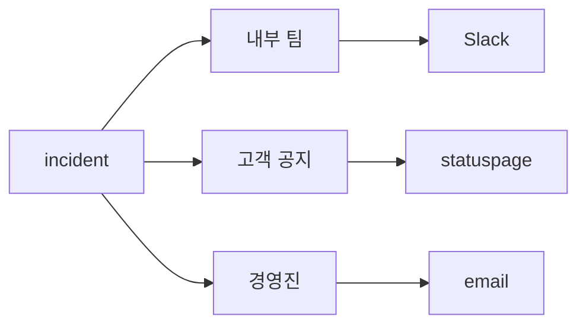

# Communication

incident 대응에서 기술 복구만 잘하면 끝이라고 생각하기 쉽습니다. 하지만 실제 현장에서는 반대 상황을 자주 봅니다. 복구는 조금 늦어도 납득할 수 있지만, 공지가 없거나 엉뚱한 사람에게 엉뚱한 메시지가 가면 신뢰는 훨씬 빠르게 무너집니다. 그래서 communication은 부가 작업이 아니라 대응 자체의 일부입니다.

특히 초보 온콜이 가장 어려워하는 지점이 바로 이 부분입니다. 지금 누구에게 먼저 알려야 하는지, 내부 채널과 고객 공지를 어떻게 나눌지, 경영진에게는 어느 수준까지 기술 세부사항을 전달해야 하는지 감이 없습니다. 그 결과 모든 메시지가 한 채널에 섞이거나, 첫 공지를 완벽하게 쓰려고 하다가 타이밍을 놓칩니다.

이 글에서는 incident 중 communication을 어떻게 설계해야 하는지, 청중을 왜 분리해야 하는지, update cadence와 statuspage를 어떻게 운영에 붙일지, 그리고 템플릿이 왜 중요한지 정리하겠습니다.

> incident communication의 핵심은 “모든 사람에게 같은 말”이 아니라 “각 청중에게 필요한 말을 정해진 간격으로 보내는 것”입니다.

## 이 글에서 다룰 문제

- incident 중 누가 어떤 메시지를 언제 받아야 할까요?
- 내부 팀, 고객, 경영진 메시지를 왜 분리해야 할까요?
- 첫 공지는 얼마나 완벽해야 할까요?
- statuspage와 채팅 채널은 어떤 역할 차이가 있을까요?
- 업데이트 주기를 정해 두는 것이 왜 중요할까요?

## 이 글에서 배울 것

- 청중 분리의 원칙
- 업데이트 주기 설계 방법
- statuspage 운영 기본
- 템플릿 메시지의 장점
- 복구 후 공지까지 포함한 전체 흐름

## 왜 중요한가

기술적 복구가 늦는 것보다 공지가 실패하는 편이 더 오래 기억될 때가 많습니다. 고객은 완벽한 내부 원인을 지금 당장 알고 싶은 것이 아니라, 문제가 있는지, 어떤 영향을 받는지, 무엇을 해야 하는지 알고 싶어 합니다. 경영진도 마찬가지입니다. 로그 한 줄보다 사업 영향과 예상 업데이트 시점이 더 중요합니다.

communication이 흔들리면 복구 작업도 흔들립니다. 대응자들은 채널에서 같은 질문을 반복해서 받고, 누군가는 statuspage를 고치고, 누군가는 메일을 보내고, 누군가는 내부 요약을 다시 쓰느라 집중을 잃습니다. 그래서 좋은 팀은 메시지를 즉흥적으로 만들지 않고 미리 역할과 형식을 정해 둡니다.

## 한눈에 보는 흐름



한 incident에서도 청중은 셋 이상으로 나뉩니다. 내부 대응팀은 기술 세부사항이 필요하고, 고객은 현재 영향과 권장 행동이 필요하며, 경영진은 요약과 사업 영향을 빠르게 알아야 합니다. 채널이 달라지면 메시지의 길이와 어휘도 함께 달라져야 합니다.

## 핵심 용어

- **internal**: 대응팀 내부에서 공유하는 기술 중심 메시지입니다.
- **external**: 고객이나 외부 이해관계자를 위한 공지입니다.
- **exec**: 경영진을 위한 짧은 요약 보고입니다.
- **cadence**: 업데이트를 반복해서 보내는 간격입니다.
- **statuspage**: 공식 서비스 상태를 알리는 공개 페이지입니다.

이 다섯 용어를 구분하지 않으면 문제가 생깁니다. internal 메시지를 그대로 고객에게 보내면 지나치게 기술적이 되고, exec 메시지를 대응 채널에 붙이면 정보 밀도가 부족합니다. 같은 사건이라도 청중마다 필요한 정보가 다르다는 사실을 전제로 해야 합니다.

## Before / After

**Before**: 모든 내용을 하나의 채널에 몰아넣고 같은 문장을 모두에게 보냅니다.

**After**: 청중별 채널과 템플릿을 분리해 같은 사실을 다른 언어로 전달합니다.

after 상태의 장점은 분명합니다. 대응팀은 기술 논의를 이어 갈 수 있고, 고객은 행동 가능한 정보만 빠르게 받으며, 경영진은 필요한 수준의 요약만 받습니다. 한 문장으로 모든 요구를 만족시키려는 시도보다 훨씬 안정적입니다.

## 단계별 실습: 청중별 메시지 만들기

### 1단계 — 청중 정의하기

먼저 누구에게 말할지부터 고정합니다. incident마다 새로 생각하지 않도록 청중 목록을 미리 정해 두는 편이 좋습니다.

```python
AUDIENCES = ("internal", "external", "exec")
```

### 2단계 — 템플릿 함수 만들기

메시지는 텍스트 몇 줄처럼 보여도 구조가 있으면 훨씬 다루기 쉽습니다. 청중, severity, 요약을 필드로 분리하면 템플릿 재사용이 쉬워집니다.

```python
def message(audience, sev, summary):
    return {"to": audience, "sev": sev, "text": summary}
```

### 3단계 — 업데이트 주기 계산하기

SEV1이면 자주 알리고, SEV3이면 상대적으로 길게 가져가도 됩니다. 이 기준을 미리 정해 두면 공지가 들쭉날쭉해지는 일을 줄일 수 있습니다.

```python
def cadence(sev):
    return {"SEV1": 15, "SEV2": 30, "SEV3": 60}.get(sev, 120)
```

### 4단계 — statuspage 문안 초안 만들기

고객 공지는 길게 설명하기보다 상태와 영향을 분명하게 적는 편이 좋습니다. 간결한 초안이 있으면 첫 공지를 빠르게 낼 수 있습니다.

```python
def statuspage(component, state):
    return f"{component} is {state}"
```

### 5단계 — 발송 큐 만들기

메시지가 여러 개일 때는 순서를 다뤄야 합니다. 누가 먼저 받아야 하는지, 어느 수준의 incident인지 기준이 있으면 혼선이 줄어듭니다.

```python
def queue(messages):
    return sorted(messages, key=lambda m: m["sev"])
```

## 이 코드에서 볼 점

- 청중이 메시지 구조의 핵심 키입니다.
- 업데이트 주기는 SEV와 연결돼야 일관성이 생깁니다.
- 템플릿은 한 번 만들면 반복해서 재사용할 수 있습니다.

첫 공지가 완벽할 필요는 없습니다. 오히려 짧고 정확한 첫 공지가 늦고 장황한 공지보다 낫습니다. “문제를 인지했고 조사 중이며, 다음 업데이트는 15분 뒤에 주겠다”는 한 문장만으로도 신뢰를 지킬 수 있습니다.

## 자주 하는 실수 5가지

1. 모든 사람에게 같은 메시지를 그대로 보냅니다.
2. 첫 공지가 완벽해야 한다고 생각해 너무 늦게 보냅니다.
3. 정해진 cadence 없이 생각날 때만 업데이트합니다.
4. 경영진에게 원시 기술 용어를 그대로 전달합니다.
5. 복구 후 종료 공지를 빼먹고 조용히 끝냅니다.

특히 마지막 실수는 자주 반복됩니다. 복구가 끝났다면 “문제가 끝났다”는 사실도 명시적으로 알려야 합니다. 그래야 고객과 내부 팀 모두 상황을 닫을 수 있습니다.

## 실무에서는 이렇게 봅니다

실무에서는 statuspage, Slack, 이메일 브로드캐스트를 서로 연결해 한 번 입력한 사실이 세 채널로 퍼지도록 구성하기도 합니다. 그래도 메시지 본문은 같지 않습니다. 내부 채널은 상세하고, 고객 공지는 간결하며, 경영진 메시지는 영향과 일정 중심으로 압축됩니다.

시니어 엔지니어는 communication에서 침묵을 최악의 선택으로 봅니다. 길고 드문 공지보다 짧고 자주 오는 공지가 낫고, 기술 설명보다 다음 행동이 더 중요하다는 점을 잘 압니다. 고객에게는 무엇을 해야 하는지를, 경영진에게는 얼마나 영향을 받는지를, 내부 대응팀에는 무엇을 검증 중인지 알려 주는 식으로 레이어를 나눕니다.

## 체크리스트

- [ ] internal, external, exec 청중 정의가 있다.
- [ ] 청중별 메시지 템플릿이 준비되어 있다.
- [ ] SEV별 업데이트 cadence 표가 있다.
- [ ] statuspage 권한과 게시 절차가 정리되어 있다.

## 연습 문제

1. cadence를 한 문장으로 정의해 보세요.
2. statuspage와 내부 채팅 채널의 역할 차이를 적어 보세요.
3. 경영진 메시지에 꼭 들어가야 할 항목 세 가지를 적어 보세요.

## 정리 및 다음 단계

incident communication의 핵심은 사실을 빨리, 적절한 청중에게, 정해진 간격으로 전달하는 것입니다. 내부 팀·고객·경영진은 같은 incident를 보더라도 필요한 정보가 다르기 때문에 채널과 템플릿을 분리해야 합니다. 첫 공지는 완벽함보다 속도가 중요하고, 복구 후 종료 공지까지 포함해야 communication이 완성됩니다.

다음 글에서는 사건이 어떻게 전개됐는지 기록하는 Timeline 작성 방법을 다루겠습니다.

<!-- toc:begin -->
- [Incident란 무엇인가?](./01-what-is-incident.md)
- [Severity 분류](./02-severity.md)
- [초기 대응](./03-initial-response.md)
- **Communication (현재 글)**
- Timeline 작성 (예정)
- Root Cause Analysis (예정)
- Mitigation과 Resolution (예정)
- Postmortem (예정)
- 재발 방지 (예정)
- Incident Runbook 만들기 (예정)
<!-- toc:end -->

## 참고 자료

- [Incident Communication - Atlassian](https://www.atlassian.com/incident-management/incident-communication)
- [Statuspage Best Practices](https://www.atlassian.com/software/statuspage/best-practices)
- [Communicating During Incidents - PagerDuty](https://response.pagerduty.com/during/external_comms/)
- [Incident Comms Playbook - Increment](https://increment.com/on-call/communication/)

Tags: Incident, Communication, Statuspage, OnCall, Operations
