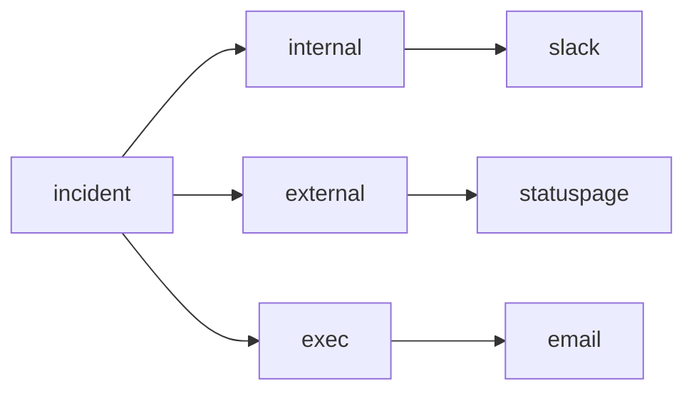

# Communication

> Incident Response 101 시리즈 (4/10)

<!-- a-grade-intro:begin -->

**핵심 질문**: *Incident* 중 *누구* 에게 *무엇* 을 *언제* 알려야 할까요?

> *Communication* 은 *청중* 별로 *다른 메시지* 를 *정해진 주기* 로 보냅니다.

<!-- a-grade-intro:end -->

## 이 글에서 배울 것

- *청중 분리*
- *업데이트 주기*
- *상태 페이지*
- *템플릿화*
- *고객 공지* 시점

## 왜 중요한가

*기술적 복구* 보다 *공지 실패* 가 *신뢰* 를 더 많이 깎습니다.

## 개념 한눈에 보기



## 핵심 용어 정리

- **internal**: *대응 팀* 내부 공유.
- **external**: *고객* 대상 공지.
- **exec**: *경영진* 요약.
- **cadence**: *업데이트 주기*.
- **statuspage**: *공식 상태 페이지*.

## Before/After

**Before**: *한 채널* 에 모두 섞어 보냅니다.

**After**: *청중 별 채널* 과 *템플릿* 으로 나눠 보냅니다.

## 실습: 청중별 메시지 만들기

### 1단계 — 청중 정의

```python
AUDIENCES = ("internal", "external", "exec")
```

### 2단계 — 템플릿 함수

```python
def message(audience, sev, summary):
    return {"to": audience, "sev": sev, "text": summary}
```

### 3단계 — 주기 계산

```python
def cadence(sev):
    return {"SEV1": 15, "SEV2": 30, "SEV3": 60}.get(sev, 120)
```

### 4단계 — 상태 페이지 초안

```python
def statuspage(component, state):
    return f"{component} is {state}"
```

### 5단계 — 발송 큐

```python
def queue(messages):
    return sorted(messages, key=lambda m: m["sev"])
```

## 이 코드에서 주목할 점

- *청중* 이 *데이터 구조* 의 *키*.
- *주기* 는 *SEV* 에 *연동*.
- *템플릿* 은 *함수* 로 *재사용*.

## 자주 하는 실수 5가지

1. **모든 사람에게 *같은 메시지*.**
2. **첫 *공지* 가 *완벽* 해야 한다는 환상.**
3. ***주기* 없이 *불규칙* 하게.**
4. ***경영진* 에게 *기술 용어* 그대로.**
5. ***복구 후* 종료 공지 누락.**

## 실무에서는 이렇게 쓰입니다

*Statuspage* + *Slack* + *이메일 broadcaster* 를 묶어 *한 번 입력* 으로 *세 채널* 에 동시에 발송합니다.

## 시니어 엔지니어는 이렇게 생각합니다

- *침묵* 은 *최악*.
- *짧고 자주* 가 원칙.
- *경영진* 에게는 *영향* 만.
- *고객* 에게는 *행동* 을 안내.
- *복구 후* 에도 한 번 더 공지.

## 체크리스트

- [ ] *청중 정의*.
- [ ] *템플릿 보관소*.
- [ ] *주기 표*.
- [ ] *Statuspage 권한*.

## 연습 문제

1. *cadence* 의 의미 한 줄로.
2. *statuspage* 의 의미 한 줄로.
3. *exec* 메시지의 핵심 한 줄로.

## 정리 및 다음 단계

다음 글은 *Timeline 작성* 입니다.

<!-- toc:begin -->
- [Incident란 무엇인가?](./01-what-is-incident.md)
- [Severity 분류](./02-severity.md)
- [초기 대응](./03-initial-response.md)
- **Communication (현재 글)**
- Timeline 작성 (예정)
- Root Cause Analysis (예정)
- Mitigation과 Resolution (예정)
- Postmortem (예정)
- 재발 방지 (예정)
- Incident Runbook 만들기 (예정)
<!-- toc:end -->

## 참고 자료

- [Incident Communication - Atlassian](https://www.atlassian.com/incident-management/incident-communication)
- [Statuspage Best Practices](https://www.atlassian.com/software/statuspage/best-practices)
- [Communicating During Incidents - PagerDuty](https://response.pagerduty.com/during/external_comms/)
- [Incident Comms Playbook - Increment](https://increment.com/on-call/communication/)

Tags: Incident, Communication, Statuspage, OnCall, Operations
