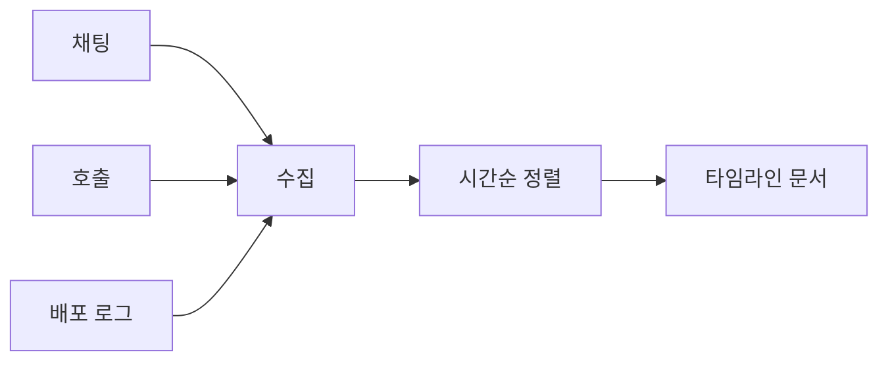

# Timeline 작성

이 글은 Incident Response 101 시리즈의 5번째 글입니다.

incident가 끝난 뒤 가장 자주 벌어지는 일 중 하나는 기억이 서로 다르게 남는 일입니다. 모두가 같은 채널에 있었고 같은 로그를 봤다고 생각하지만, 며칠만 지나도 순서와 판단 근거가 흐려집니다. 그래서 timeline은 사건이 끝난 뒤 쓰는 장식이 아니라, 대응 중에 함께 만들어 두는 기록 장치여야 합니다.

## 이 글에서 다룰 문제

사건이 끝난 뒤 기억만으로 timeline을 재구성하면 사실과 해석이 섞이기 쉽습니다. 어느 시점에 무엇을 알았는지, 어떤 조치가 실제로 언제 일어났는지 흐려지면 RCA와 postmortem 품질도 함께 떨어집니다. timeline의 목적은 멋진 문장을 쓰는 것이 아니라 시간을 기준으로 사실을 고정하는 데 있습니다.

> 좋은 timeline은 사건이 끝난 뒤 기억으로 복원한 이야기가 아니라, 대응 중 남긴 사실을 시간순으로 정리한 기록입니다.

- incident가 끝난 뒤 무엇이 언제 일어났는지 어떻게 복원할까요?
- 왜 사건 중간에 바로 기록해야 할까요?
- 한 채널이 아니라 여러 채널을 함께 스크랩해야 하는 이유는 무엇일까요?
- 사실과 해석은 왜 분리해야 할까요?
- detected, mitigated 같은 기준 시점은 왜 중요할까요?

## 왜 이 주제가 중요한가

기억은 생각보다 빨리 왜곡됩니다. incident 직후에는 모두가 선명하게 기억한다고 믿지만, 며칠만 지나도 순서가 바뀌고, 나중에 알게 된 사실을 마치 당시에도 알고 있었던 것처럼 덧붙이기 쉽습니다. 이렇게 되면 사후 분석은 점점 이야기 중심이 되고, 근거 중심에서 멀어집니다.

timeline은 RCA와 postmortem의 기초 재료입니다. 감정이나 해석보다 “언제, 어디서, 무엇을 관찰했고, 어떤 조치를 실행했는가”를 남겨야 다음 분석이 튼튼해집니다. 그래서 좋은 팀은 timeline 작성을 별도 업무로 보지 않고 incident 대응의 일부로 포함합니다.

## 한눈에 보는 구조



기록원은 하나가 아니어야 합니다. 채팅 채널, 호출 시스템, 배포 로그를 함께 모아 시간순으로 정리해야 사건의 실제 흐름이 드러납니다.

## 핵심 용어

- **timestamp**: UTC 기준 시각입니다.
- **scrape**: 여러 채널에서 이벤트를 모으는 일입니다.
- **fact**: 기록된 관찰 사실입니다.
- **interpretation**: 추정과 의견입니다.
- **anchor**: detected, mitigated 같은 기준 시점입니다.

이 용어를 분리해야 timeline이 흔들리지 않습니다. fact는 그때 실제로 관찰한 내용이고, interpretation은 그 사실에 대한 가설입니다. anchor는 incident 전체 흐름을 정렬하는 기준점 역할을 합니다.

## 전후 비교

이전: 사건이 끝난 뒤 기억에만 의존해 재구성합니다.

이후: 대응 중 남긴 기록과 채널 스크랩을 바탕으로 재구성합니다.

이후 상태의 장점은 분명합니다. 나중에 더 많은 정보를 알게 되더라도 당시 판단과 나중 판단을 구분할 수 있습니다. 기록이 남아 있으면 “그때 왜 그렇게 판단했는가”를 훨씬 공정하게 볼 수 있습니다.

## 단계별 실습: 작은 timeline 빌더 만들기

### 1단계 — 이벤트 모델 정의하기

모든 이벤트를 같은 형태로 모으려면 공통 필드가 필요합니다. 여기서는 시각, 출처, 텍스트 세 가지를 둡니다.

```python
def event(ts, source, text):
    return {"ts": ts, "src": source, "text": text}
```

### 2단계 — 채널 스크랩하기

한 채널만 보면 사건이 반쪽만 보입니다. incident 채널의 메시지를 같은 이벤트 구조로 바꿔 모읍니다.

```python
def scrape(channel):
    return [event(m["ts"], channel, m["text"]) for m in channel.get("messages", [])]
```

### 3단계 — 시간순 정렬하기

모은 이벤트는 반드시 시간순으로 다시 정렬해야 합니다. 순서가 맞아야 원인과 결과를 섞지 않습니다.

```python
def order(events):
    return sorted(events, key=lambda e: e["ts"])
```

### 4단계 — 사실과 해석 분리하기

timeline에는 사실이 먼저 와야 합니다. 추정 메모는 별도 표시로 분리해 두는 편이 좋습니다.

```python
def split(events):
    facts = [e for e in events if not e["text"].startswith("?")]
    notes = [e for e in events if e["text"].startswith("?")]
    return facts, notes
```

### 5단계 — 기준 시점 표시하기

detected, acknowledged, mitigated, resolved 같은 시점을 표시하면 incident 대시보드와 문서를 함께 맞추기 쉬워집니다.

```python
ANCHORS = ("detected", "acknowledged", "mitigated", "resolved")

def mark(event):
    return event["text"].lower() in ANCHORS
```

## 이 코드에서 먼저 볼 점

- 모든 이벤트는 세 필드만으로도 충분히 정리할 수 있습니다.
- 해석은 접두사로 구분해 사실과 섞이지 않게 해야 합니다.
- 기준 시점은 문서와 대시보드를 맞추는 기준점입니다.

timeline에서 가장 중요한 감각은 짧고 자주 기록하는 습관입니다. 길고 잘 쓴 문장보다, 그 순간 남긴 짧은 한 줄이 나중 분석에 더 큰 가치를 줍니다.

## 자주 하는 실수 5가지

1. 사건이 끝난 뒤 한꺼번에 쓰려고 합니다.
2. 해석을 사실처럼 적어 둡니다.
3. 시간대를 KST와 UTC로 섞어 씁니다.
4. 단일 채널만 스크랩합니다.
5. 민감 정보를 그대로 붙여 넣습니다.

특히 첫 번째 실수는 timeline의 가치를 거의 없애 버립니다. 대응 중에 남기지 않은 사실은 나중에 정확히 복원하기 어렵습니다. 그래서 기록 담당자를 따로 두는 편이 도움이 됩니다.

## 실무에서는 이렇게 봅니다

실무에서는 Slack bot이 `!ts <text>` 명령으로 이벤트를 수집하고 postmortem 문서로 내보내도록 구성하기도 합니다. 핵심은 기록을 사람의 기억이 아니라 흐름 안에 끼워 넣는 것입니다.

시니어 엔지니어는 timeline에서 문장력보다 기준 시점의 정확성을 먼저 봅니다. detected, acknowledged, mitigated, resolved가 맞게 잡혀 있으면 나머지 세부 사건도 더 쉽게 복원할 수 있기 때문입니다.

## 체크리스트

- [ ] 기록 책임자가 정해져 있다.
- [ ] bot 명령이나 기록 형식이 팀에 공유되어 있다.
- [ ] UTC 사용 규칙이 정리되어 있다.
- [ ] 기준 시점 정의가 문서에 적혀 있다.

## 연습 문제

1. anchor를 한 문장으로 정의해 보세요.
2. 사실과 해석의 차이를 한 문장으로 적어 보세요.
3. 왜 UTC를 기준으로 써야 하는지 설명해 보세요.

## 정리와 다음 글

timeline은 incident가 끝난 뒤 기억으로 쓰는 이야기가 아니라, 대응 중 남긴 사실을 시간순으로 정리한 기록입니다. 여러 채널을 함께 모으고, 사실과 해석을 분리하고, 기준 시점을 정확히 남겨야 이후 RCA와 postmortem이 단단해집니다.

다음 글에서는 trigger와 root cause를 구분해 근본 원인을 찾는 방법을 다루겠습니다.

<!-- toc:begin -->
- [Incident란 무엇인가?](./01-what-is-incident.md)
- [Severity 분류](./02-severity.md)
- [초기 대응](./03-initial-response.md)
- [Communication](./04-communication.md)
- **Timeline 작성 (현재 글)**
- Root Cause Analysis (예정)
- Mitigation과 Resolution (예정)
- Postmortem (예정)
- 재발 방지 (예정)
- Incident Runbook 만들기 (예정)
<!-- toc:end -->

## 참고 자료

- [Postmortem Timeline - Google SRE Workbook](https://sre.google/workbook/postmortem-culture/)
- [Building an Incident Timeline - PagerDuty](https://response.pagerduty.com/after/post_mortem_process/)
- [Incident Documentation - Atlassian](https://www.atlassian.com/incident-management/postmortem)
- [Time and Postmortems - Increment](https://increment.com/postmortems/)

Tags: Incident, Timeline, Postmortem, Logging, Operations
