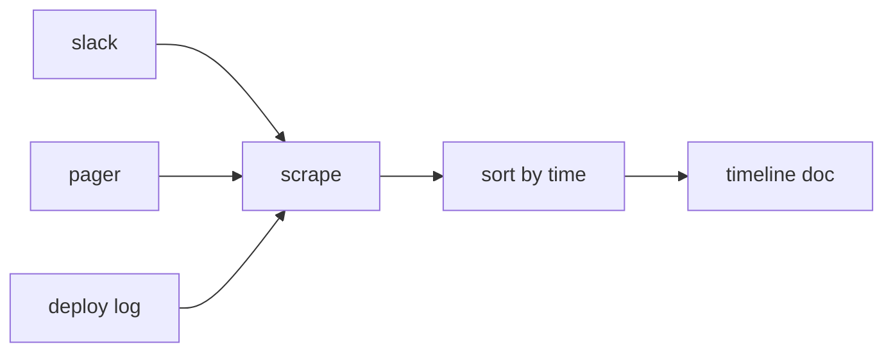

# Timeline 작성

> Incident Response 101 시리즈 (5/10)


## 이 글에서 다룰 문제

기억은 쉽게 왜곡됩니다. 지금 남긴 한 줄이 내일의 RCA 품질을 살립니다.

## 전체 흐름


## Before/After

**Before**: 기억에만 의존해 재구성합니다.

**After**: 동시 기록과 채널 스크랩을 바탕으로 재구성합니다.

## 간단한 Timeline 빌더

### 1단계 — 이벤트 모델

```python
def event(ts, source, text):
    return {"ts": ts, "src": source, "text": text}
```

### 2단계 — 채널 스크랩

```python
def scrape(channel):
    return [event(m["ts"], channel, m["text"]) for m in channel.get("messages", [])]
```

### 3단계 — 정렬

```python
def order(events):
    return sorted(events, key=lambda e: e["ts"])
```

### 4단계 — 사실/해석 분리

```python
def split(events):
    facts = [e for e in events if not e["text"].startswith("?")]
    notes = [e for e in events if e["text"].startswith("?")]
    return facts, notes
```

### 5단계 — anchor 표시

```python
ANCHORS = ("detected", "acknowledged", "mitigated", "resolved")

def mark(event):
    return event["text"].lower() in ANCHORS
```

## 이 코드에서 주목할 점

- 모든 이벤트는 세 필드만으로도 충분히 정리할 수 있습니다.
- 해석은 접두사로 구분해 사실과 섞이지 않게 해야 합니다.
- anchor는 대시보드와 문서를 맞추는 기준점 역할을 합니다.

## 자주 하는 실수 5가지

1. 일이 끝난 뒤 한꺼번에 쓰려 합니다.
2. 해석을 사실처럼 적어 둡니다.
3. 시간대를 KST와 UTC로 섞어 씁니다.
4. 단일 채널만 스크랩합니다.
5. 민감 정보를 그대로 붙여 넣습니다.

## 실무에서는 이렇게 쓰입니다

Slack bot이 `!ts <text>` 명령으로 이벤트를 수집하고 Postmortem 문서로 내보내도록 구성합니다.

## 체크리스트

- [ ] 기록 책임자를 정했는지 확인합니다.
- [ ] Bot 명령을 팀에 공유했는지 확인합니다.
- [ ] UTC 사용을 강제했는지 확인합니다.
- [ ] anchor 정의를 문서에 적어 두었는지 확인합니다.

## 정리 및 다음 단계

다음 글은 Root Cause Analysis입니다.

<!-- toc:begin -->
- [Incident란 무엇인가?](./01-what-is-incident.md)
- [Severity 분류](./02-severity.md)
- [초기 대응](./03-initial-response.md)
- [Communication](./04-communication.md)
- **Timeline 작성 (현재 글)**
- Root Cause Analysis (예정)
- Mitigation과 Resolution (예정)
- Postmortem (예정)
- 재발 방지 (예정)
- Incident Runbook 만들기 (예정)
<!-- toc:end -->

## 참고 자료

- [Postmortem Timeline - Google SRE Workbook](https://sre.google/workbook/postmortem-culture/)
- [Building an Incident Timeline - PagerDuty](https://response.pagerduty.com/after/post_mortem_process/)
- [Incident Documentation - Atlassian](https://www.atlassian.com/incident-management/postmortem)
- [Time and Postmortems - Increment](https://increment.com/postmortems/)

Tags: Incident, Timeline, Postmortem, Logging, Operations
