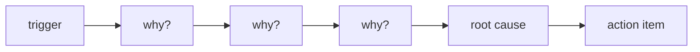

# Root Cause Analysis

> Incident Response 101 시리즈 (6/10)


## 이 글에서 다룰 문제

트리거만 고치면 다음 사건에서도 같은 원인이 다시 터질 수 있습니다.

## 전체 흐름


## Before/After

**Before**: 트리거를 근본 원인으로 오인합니다.

**After**: 5 Whys로 조건이 쌓인 지점까지 추적합니다.

## 미니 RCA 워크북

### 1단계 — 5 Whys

```python
def five_whys(start):
    chain = [start]
    for _ in range(5):
        chain.append(input(f"why? {chain[-1]} -> "))
    return chain
```

### 2단계 — 기여 요인 수집

```python
def factors():
    return {"people": [], "process": [], "tooling": [], "system": []}
```

### 3단계 — 트리거 vs 근본 원인

```python
def classify(item, evidence):
    return "root" if evidence >= 3 else "trigger"
```

### 4단계 — 액션 매핑

```python
def actions(root):
    return [{"root": root, "action": f"fix {root}"}]
```

### 5단계 — 검증 가능 여부

```python
def is_actionable(action):
    return action["action"].startswith(("add ", "fix ", "remove ", "test "))
```

## 이 코드에서 주목할 점

- 체인 형태로 남겨야 사고의 깊이를 잃지 않습니다.
- 기여 요인은 네 축으로 나눠 보는 편이 좋습니다.
- 액션 항목은 동사로 시작해야 실행 가능성이 높아집니다.

## 자주 하는 실수 5가지

1. 첫 답에서 바로 멈춥니다.
2. 사람을 근본 원인으로 단정합니다.
3. 트리거만 고치고 끝냅니다.
4. 액션이 지나치게 추상적입니다.
5. 검증할 수 없는 액션을 남깁니다.

## 실무에서는 이렇게 쓰입니다

Postmortem 문서에 5 Whys 섹션과 Contributing Factors 표를 템플릿으로 넣어 둡니다.

## 체크리스트

- [ ] 템플릿 섹션을 미리 만들어 두었는지 확인합니다.
- [ ] 기여 요인 4축을 빠짐없이 보았는지 확인합니다.
- [ ] 액션을 동사로 시작하는 규칙을 적용했는지 확인합니다.
- [ ] 검증 기준을 함께 적었는지 확인합니다.

## 정리 및 다음 단계

다음 글은 Mitigation과 Resolution입니다.

<!-- toc:begin -->
- [Incident란 무엇인가?](./01-what-is-incident.md)
- [Severity 분류](./02-severity.md)
- [초기 대응](./03-initial-response.md)
- [Communication](./04-communication.md)
- [Timeline 작성](./05-timeline.md)
- **Root Cause Analysis (현재 글)**
- Mitigation과 Resolution (예정)
- Postmortem (예정)
- 재발 방지 (예정)
- Incident Runbook 만들기 (예정)
<!-- toc:end -->

## 참고 자료

- [Five Whys - Google SRE Workbook](https://sre.google/workbook/postmortem-culture/)
- [Root Cause Analysis - PagerDuty](https://response.pagerduty.com/after/root_cause_analysis/)
- [Incident RCA - Atlassian](https://www.atlassian.com/incident-management/postmortem/templates)
- [Beyond Root Cause - Increment](https://increment.com/postmortems/beyond-root-cause/)

Tags: Incident, RCA, Postmortem, Analysis, Operations
